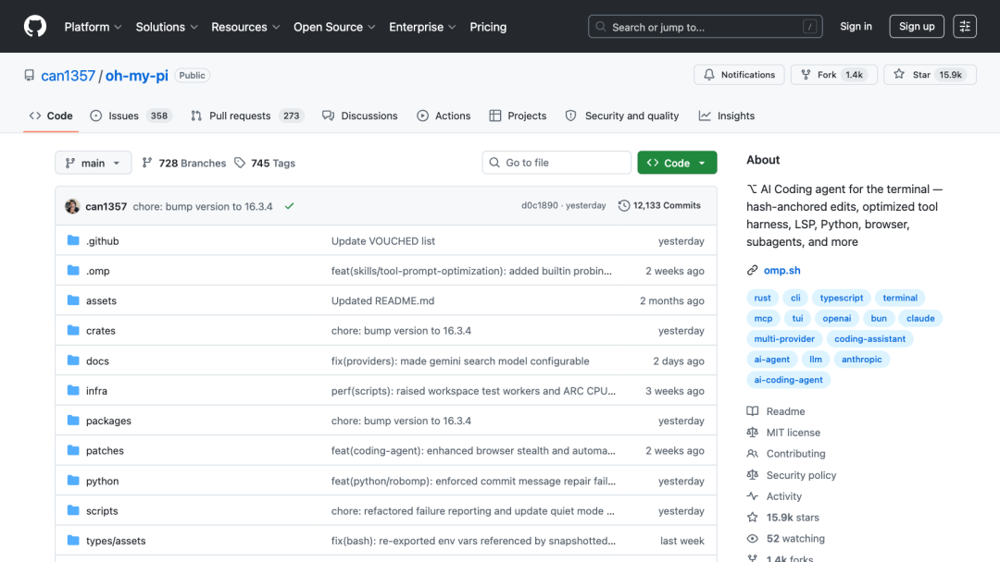
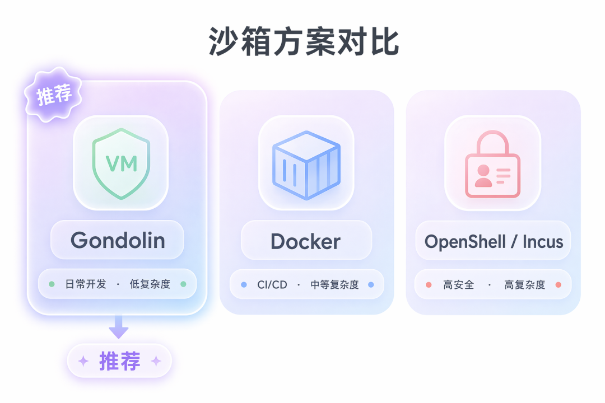
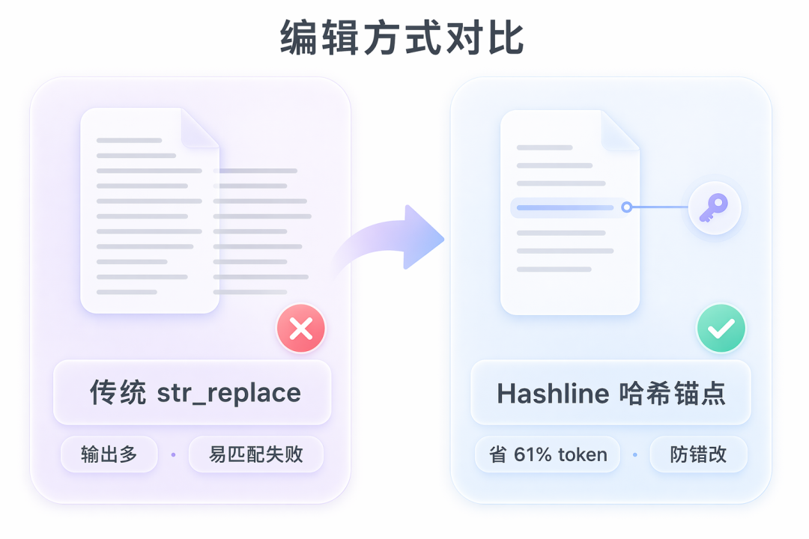

# 📰 oh-my-pi 装完就不管了？这几步配完才真叫好用

>
>
> 默认配置远远没到 oh-my-pi 的上限。模型、Advisor、扩展、沙箱配到位了，它才真正好用。
>
>

oh-my-pi 装完敲 `omp` 就能跑。但默认配置远远没到它的上限。模型没调、Advisor 没开、沙箱没挂、扩展没装，等于买了辆跑车挂一挡开。

下面把从"能用"调到"好用"的关键步骤一次讲清楚。

## oh-my-pi 是什么，跟 Pi 什么关系

简单说：oh-my-pi（简称 omp）是 Pi 的"开箱即用"版。

Pi 由 Mario Zechner 开发，定位是极简终端编程工具，核心小到只保留最基础的功能，其余靠扩展按需加载。can1357 在 Pi 基础上 fork 出 oh-my-pi，把 Pi 没内置但实际开发中天天要用的东西全塞了进去：LSP、DAP 调试器、Advisor 审稿人、代码审查、Hashline 编辑、时序流规则、协作共享……官方原话："The Pi you love, with batteries included."

截至 2026 年 7 月，oh-my-pi 在 GitHub 上已有近 1.6 万星，内置 32 个工具、14 个 LSP 操作、28 个 DAP 操作，Rust 核心约 5.5 万行。

下方表格列的是跟最佳实践最相关的几项能力，不是完整功能清单：

|   能力   |   做什么    |    为什么跟最佳实践相关    |
|--------|----------|------------------|
|Hashline|内容哈希锚点定位编辑|   省 token、防错改    |
|  LSP   | 写操作走语言服务 |rename/refactor 不漏|
|  DAP   |   接调试器   |   比加 print 靠谱    |
|Advisor |  第二模型旁听  |       实时纠偏       |
|  TTSR  | 规则偏离时才触发 |       省上下文       |
|/review | 专属审查子代理  |   带优先级，不漏关键问题    |

## 开启 Advisor：给主 agent 配一个审稿人

这是 oh-my-pi 容易被忽略但性价比很高的功能。

Advisor 的机制：配一个"审稿人"模型，它读主 agent 每一轮的输出，然后在同一条流里注入意见。可以是"你漏了边界检查"的提醒，也可以是硬性拦截。主 agent 看到意见后修正，或者告诉你为什么它不改。

配置方法：在项目根目录放一个 `WATCHDOG.yml`，定义 advisor 的名称、供应商和模型（格式为 `provider/model`）。用 `/advisor configure` 可以打开 TUI 界面编辑，它会自动校验配置格式。

\# WATCHDOG.yml 示例

advisors:

\- name: reviewer

model: openai/gpt-4o

enabled: true

两个关键原则：

API Key 不要硬编码在配置文件里，存 `.env` 用 `${VAR}` 引用。1 个 coder + 1 个 reviewer 就够，别贪多。同时挂太多 advisor 会抢上下文，反而拖慢主 agent。

## 三个必装扩展

oh-my-pi 的扩展系统跟 Pi 一脉相承：TypeScript 扩展装完即生效，不用改配置。

下面三个是最佳实践的标配：

|         扩展         |               做什么               |                安装                |
|--------------------|---------------------------------|----------------------------------|
|      pi-crew       |子代理编排 + workflow 拓扑 + worktree 隔离|      `npm install pi-crew`       |
|  pi-hermes-memory  |   持久记忆 + 全文搜索 + 密钥扫描 + 自动知识整合   |  `npm install pi-hermes-memory`  |
|@aliou/pi-guardrails|     权限门控 + 文件路径策略 + 危险命令拦截      |`npm install @aliou/pi-guardrails`|

**pi-crew** 用于多代理并行。每个代理在独立的 worktree 里工作，不会互相踩文件。pi-crew 官方声明它不是 hardened product，代码大多由 AI 生成，对安全性有要求的场景需要自己评估风险。

**pi-hermes-memory** 给 oh-my-pi 加了持久记忆。默认情况下，oh-my-pi 的对话上下文只在当前会话有效，关掉就没了。装了 pi-hermes-memory 之后，agent 按项目名打标签存记忆，下次打开同一个项目能自动召回相关上下文。它用 SQLite FTS5 做全文搜索，还能扫描代码里泄露的密钥。记得开防洪水保留队列（debounce retain queue），防止每次交互都往记忆里写东西导致 API 过载。

**@aliou/pi-guardrails** 补的是安全短板。装上之后，危险命令会被拦截，文件路径访问会受策略管控。

## 沙箱：默认裸跑 = 走路不穿鞋

上一节说了，oh-my-pi 默认没有开沙箱。配合 @aliou/pi-guardrails 能做基本的命令拦截，但如果需要更强的隔离，还得挂沙箱。

三种沙箱方案：

|      方案       |             隔离方式             |   适合场景   |复杂度|
|---------------|------------------------------|----------|---|
|   Gondolin    |Pi/认证留宿主机，工具路由到微型虚拟机（micro-VM）|   日常开发   | 低 |
|    Docker     |       整个进程跑容器里，只挂工作目录        |CI/CD、团队共享| 中 |
|OpenShell/Incus|         策略控制沙箱，权限粒度细         |  高安全要求   | 高 |

推荐 Gondolin。它把认证和 Pi 自身留在宿主机上，只有底层工具和 shell 命令路由到微型虚拟机里执行。你的 API Key 不会进容器，文件系统也只暴露工作目录。装起来不复杂，安全性比裸跑好一大截。

Docker 方案适合 CI/CD 或给团队成员统一环境。整个 Pi 进程跑在容器中，只挂载指定工作目录，CPU/内存受限，宿主网络断开，agent 做不了超出容器范围的事。

## Hashline 编辑：省 61% 输出 token 的写法

这是 oh-my-pi 区别于大多数编码工具的底层能力。

传统编码工具让模型用字符串替换（str\_replace）来改文件：先输出要找的旧文本，再输出替换后的新文本。问题是，模型经常把缩进、空格搞错，导致"找不到匹配的字符串"，然后重试，又搞错，循环几轮光是输出旧文本就烧了大量 token。

oh-my-pi 的 Hashline 机制换了个思路：模型不重新输入要改的行，而是用内容哈希锚点定位。打个比方，传统方式是"把第 3 段话全文抄一遍然后改几处"，Hashline 是"第 3 段话算了个指纹，改第 2 句就行"。

省 token：Grok 4 Fast 实测，输出 token 减少 61%。防错改：文件被别人改过之后，哈希锚点会偏移，patch 直接被拒绝而不是静默写到错误的位置。

小模型的受益尤其明显。很多小模型输出格式不稳定，用传统 str\_replace 经常匹配不上，Hashline 降低了格式要求，通过率大幅提升。

## TTSR（时序流规则）：规则平时不占上下文，偏了才出手

TTSR 全称 Time-Traveling Stream Rules，是 oh-my-pi 的另一个独特机制。

一般给 AI 编码工具写规则，会把规则塞进 system prompt，每轮对话都带着，占 context window。规则越多，留给实际工作的上下文越少。

TTSR 换了个思路：规则平时是休眠的，不占上下文。当模型输出的内容匹配到你设的正则时，oh-my-pi 中止当前输出流，把规则作为系统提醒注入，然后从同一个位置重试。像巡视员一样，平时不在场，发现偏离才出手。

注入的规则在上下文压缩（compaction）后依然保留。哪怕对话已经压缩过，规则还在生效，不会被压没。

适合用 TTSR 的场景：禁止在正式代码里用 `Box::leak`、禁止 `rm -rf`、强制所有 catch 不能吞错误。这些规则不需要每轮都看到，但一旦模型想犯这个错，必须拦住。

## /review：带优先级的代码审查

oh-my-pi 的 /review 命令会启动专属的 reviewer 子代理，对代码做结构化审查。

输出格式是按优先级分类的：P0 到 P3，每个问题带置信度评分和一句话描述，最后给出一个整体 verdict，判断这个变更能不能上线。

|优先级|   含义   |处理策略|
|---|--------|----|
|P0 |阻塞发布，必须修|立刻修 |
|P1 |重要问题，建议修|尽快修 |
|P2 |  改进建议  |有空再修|
|P3 |   微调   |可以不管|

审查范围灵活：可以审一个 branch、一个 commit、或者还没 commit 的本地修改。多个审查子代理并行跑，不卡主流程。

跟 Advisor 的区别：Advisor 是实时旁听，写代码的时候就在；/review 是事后审查，写完再查。两个互补，不替代。

## Skills 兼容：换个工具不用换规则

oh-my-pi 兼容 Agent Skills 规范（agentskills.io）——Claude Code 的 `~/.claude/skills/`、Codex 的 `~/.codex/skills/`、Pi 的 `~/.pi/agent/skills/` 和 `.pi/skills/` 都能直接用，oh-my-pi 还有自己的 `.omp/skills/` 目录。

已有 Claude Code Skills 的用户装 oh-my-pi 不用重写，直接迁移过来就行。

