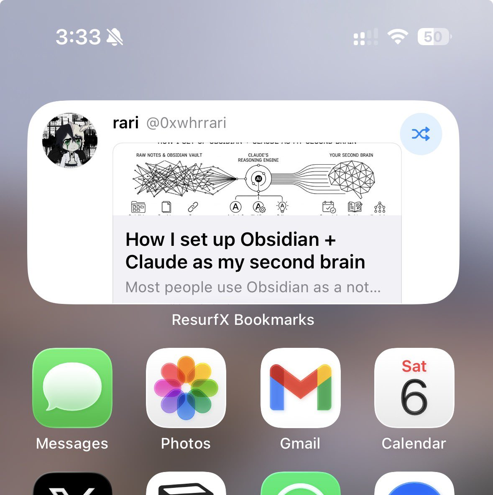

Google's former CEO just said what everyone in AI already knows

Building wealth is getting easier if you actually learn the tools

Not by scrolling AI threads

By understanding agents, Claude Code, prompts, memory, skills, MCP, and routines

Save this before it disappears from your feed

Everything below is free:

Agent architecture
[langchain.com/blog?category\_…](http://langchain.com/blog?category_equal=%5B%22Agent+Architecture%22%5D)

Claude Code 101
[anthropic.skilljar.com/claude-code-101](http://anthropic.skilljar.com/claude-code-101)

Claude Code in action
[anthropic.skilljar.com/claude-code-in…](http://anthropic.skilljar.com/claude-code-in-action)

Prompt engineering
[platform.claude.com/docs/en/build-…](http://platform.claude.com/docs/en/build-with-claude/prompt-engineering/overview)

Interactive prompt course
[github.com/anthropics/cou…](http://github.com/anthropics/courses/tree/master/prompt_engineering_interactive_tutorial)

Claude.md + memory
[code.claude.com/docs/en/claude…](http://code.claude.com/docs/en/claude-md)

Skills
[code.claude.com/docs/en/skills](http://code.claude.com/docs/en/skills)

MCP
[code.claude.com/docs/en/mcp](http://code.claude.com/docs/en/mcp)

Routines
[code.claude.com/docs/en/routin…](http://code.claude.com/docs/en/routines)

Claude Code ultimate guide
[github.com/FlorianBruniau…](http://github.com/FlorianBruniaux/claude-code-ultimate-guide)

Awesome Claude Code
[github.com/hesreallyhim/a…](http://github.com/hesreallyhim/awesome-claude-code)

Anthropic academy
[anthropic.skilljar.com](http://anthropic.skilljar.com)

Official Claude Code docs
[code.claude.com/docs/en/overvi…](http://code.claude.com/docs/en/overview)

All of this costs $0

Most people will keep asking AI one question at a time

Save this and start learning the stack

### 🖼️ Attached Media

## 💬 Replies

### 1 @vesmallu (Ve)

*Tue Jun 09 03:39:26 +0000 2026*

@0xwhrrari Learning is free. The real cost is the 200 hours you spend before you build anything useful.

### 2 @beamnxw (beamnxw ./)

*Sat Jun 06 14:26:56 +0000 2026*

@0xwhrrari just stop scrolling threads and start building the stack

### 3 @0xwhrrari (rari) (Author)

*Sat Jun 06 14:30:56 +0000 2026*

@beamnxw yeaaa

### 4 @PolycoolApp (Polycool)

*Sat Jun 06 17:52:05 +0000 2026*

@0xwhrrari very wise

### 5 @0xwhrrari (rari) (Author)

*Sun Jun 07 05:29:20 +0000 2026*

@PolycoolApp very

### 6 @0xCristal (cristal💎)

*Sat Jun 06 21:31:07 +0000 2026*

@0xwhrrari mcp and claude code go crazy hard

### 7 @0xwhrrari (rari) (Author)

*Sun Jun 07 05:29:08 +0000 2026*

@0xCristal claude rn more than chatbox

### 8 @hanakoxbt (Hanako)

*Sat Jun 06 17:01:16 +0000 2026*

@0xwhrrari tools reward builders more than spectators

### 9 @0xwhrrari (rari) (Author)

*Sun Jun 07 05:28:35 +0000 2026*

@hanakoxbt 😼

### 10 @LunarResearcher (Lunar)

*Sat Jun 06 13:01:54 +0000 2026*

@0xwhrrari free resources like this can save people months of guessing

### 11 @0xwhrrari (rari) (Author)

*Sat Jun 06 13:05:28 +0000 2026*

@LunarResearcher ofc 
this materials are pure alpha

### 12 @insomnia_vip (Insomnia)

*Sat Jun 06 13:01:02 +0000 2026*

@0xwhrrari man who make our world now

### 13 @0xwhrrari (rari) (Author)

*Sat Jun 06 13:05:34 +0000 2026*

@insomnia\_vip 🫡

### 14 @undefinedKi (Yarchi)

*Sat Jun 06 13:29:44 +0000 2026*

@0xwhrrari real alpha

### 15 @0xwhrrari (rari) (Author)

*Sat Jun 06 14:30:41 +0000 2026*

@undefinedKi faacts

### 16 @L1vsun (Livsun)

*Sat Jun 06 13:06:18 +0000 2026*

@0xwhrrari This guy knows what he saying

### 17 @0xwhrrari (rari) (Author)

*Sat Jun 06 13:08:01 +0000 2026*

@L1vsun hehe

### 18 @slash1sol (slash1s)

*Sat Jun 06 13:13:18 +0000 2026*

@0xwhrrari it’s worth it😉

### 19 @0xwhrrari (rari) (Author)

*Sat Jun 06 13:18:07 +0000 2026*

@slash1sol 🫡

### 20 @YotamBlu (Yotam Blumenkranz)

*Sat Jun 06 14:21:05 +0000 2026*

@0xwhrrari the gap between knowing about the tools and actually shipping something with them is where most people tap out.

i've been vibe-coding with claude for months and it's only now that the muscle memory is kicking in.

### 21 @0xwhrrari (rari) (Author)

*Sat Jun 06 14:31:09 +0000 2026*

@YotamBlu wow 👀

### 22 @__vandos__ (Vandos ❓)

*Sat Jun 06 18:32:08 +0000 2026*

@0xwhrrari Every link on this list is free. The people who go through all of them will have a skill set companies are paying $200K+ for. Most people will save this and never open a single link.

### 23 @0xwhrrari (rari) (Author)

*Sun Jun 07 05:32:06 +0000 2026*

@\_\_vandos\_\_ well tbh just studying it on its own probably wont get you very far

but there really is lot of knowledge here and if you know exactly where and how to apply it
think you can accomplish a lot

### 24 @elune0x (elune)

*Sat Jun 06 13:03:51 +0000 2026*

@0xwhrrari agents memory skills and mcp are where ai becomes a real system

### 25 @0xwhrrari (rari) (Author)

*Sat Jun 06 13:05:44 +0000 2026*

@asakura0x real system
real knowledges

### 26 @0xTrackmind (Trackmind)

*Sat Jun 06 13:08:53 +0000 2026*

@0xwhrrari claude code and mcp are where the workflow starts getting serious

### 27 @0xwhrrari (rari) (Author)

*Sat Jun 06 13:18:03 +0000 2026*

@0xTrackmind yeap yeap

### 28 @heyyyjoo (Joo Tat)

*Sat Jun 06 22:34:08 +0000 2026*

@0xwhrrari Bookmarked and saved to my home scren 

### 29 @0xwhrrari (rari) (Author)

*Sun Jun 07 05:29:35 +0000 2026*

@heyyyjoo hehe &lt;3

### 30 @MPxbt (pearson)

*Sat Jun 06 21:26:55 +0000 2026*

@0xwhrrari memory and skills folder is pure gold

### 31 @0xwhrrari (rari) (Author)

*Sun Jun 07 05:28:27 +0000 2026*

@MPxbt u right ser

### 32 @marfinxx (marfin)

*Sat Jun 06 13:02:30 +0000 2026*

@0xwhrrari I bookmarked these super helpful resources thx

### 33 @0xwhrrari (rari) (Author)

*Sat Jun 06 13:05:53 +0000 2026*

@marfinxx &lt;33

### 34 @thedelost (delost)

*Sat Jun 06 17:40:51 +0000 2026*

@0xwhrrari the leverage comes after the first prompt ends

### 35 @0xwhrrari (rari) (Author)

*Sun Jun 07 05:29:13 +0000 2026*

@thedelost 👀

### 36 @thegreatest_sv (kiosa)

*Sat Jun 06 13:07:18 +0000 2026*

@0xwhrrari Learning is key

### 37 @0xwhrrari (rari) (Author)

*Sat Jun 06 13:07:55 +0000 2026*

@thegreatest\_sv agree with u
knowledges are alpha

