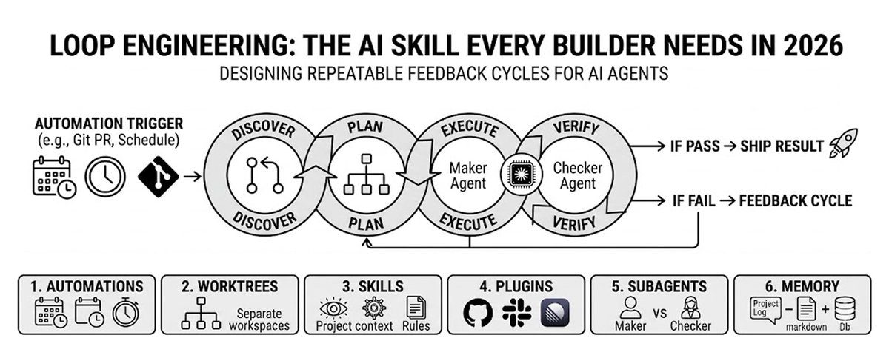

# 📰 Loop Engineering: The AI skill every builder needs in 2026

Most people are still prompting agents manually.

They type one task.

Wait for one answer.

Review it themselves.

Fix the mistakes themselves.

Then prompt again.

That means the human is still the loop.

The next step is different.

You do not just prompt the agent.

You design the loop that prompts the agent, checks the result, decides the next move, and keeps running until the work passes.

That is loop engineering.

> "You should not be prompting coding agents anymore. You should be designing loops that prompt your agents."

Then Boris Cherny, head of Claude Code at Anthropic, said the same thing differently:

> "I do not prompt Claude anymore. I have loops running that prompt Claude and figure out what to do. My job is to write loops."

---

## Why Most People Never Build Real Loops

Loops sound amazing until you look at the token bill.

A normal agent loop can burn a lot of context fast:

- One medium coding loop can use 50K-200K tokens

- A fleet loop with one orchestrator and several specialist agents can use 500K-2M tokens

- A scheduled daily loop can reach millions of tokens per week

Every retry costs tokens.

Every self-correction costs tokens.

Every verification step costs tokens.

Every subagent costs tokens.

That is the hidden problem nobody talks about enough.

Loop engineering is not hard because the idea is complicated.

It is hard because most people cannot afford to let agents run freely for long.

> "Easy for you to say, you have unlimited OpenAI access."

That reaction is fair.

This is why cheaper long-context models matter.

If you want loops to run every day, you need:

- Cheap input tokens

- Cheap output tokens

- Large context windows

- Tool calling

- JSON output

- High concurrency

- Enough context to remember what happened earlier in the loop

Without that, loops become expensive experiments.

With that, loops become practical workflows.

---

## The Old Way vs The New Way

For the last two years, most people used agents like this:

You prompt.

The agent answers.

You review.

You find the mistake.

You prompt again.

That works, but it does not scale.

The old way:

- You give a prompt

- The agent gives an output

- You review the output

- You fix the weak parts

- You repeat manually

The new way:

- You define the goal

- The loop discovers what is needed

- The loop plans the work

- The agent executes

- A checker verifies the result

- The loop fixes failures

- The system stops when the goal is reached

Prompting gives an agent an instruction.

Loop engineering gives an agent a job.

---

## What Loop Engineering Actually Is

Loop engineering is the practice of designing repeatable feedback cycles for AI agents.

The goal is simple:

Get from attempt to verified result without needing a human to manually drive every step.

The basic cycle has five stages:

1. Discover

1. Plan

1. Execute

1. Verify

1. Iterate

If the output passes, ship it.

If it fails, send it back into the loop.

That is the whole idea.

Not one perfect prompt.

A system that keeps improving the output until it meets the standard.

---

## Single Agent vs Fleet

There are two basic sizes of loops.

# Single-Agent Loop

One agent runs the whole cycle.

It discovers what is needed, plans the work, executes the task, checks the result, and improves it if something fails.

This is like one person rewriting their own draft.

Good for:

- Focused tasks

- Small scopes

- Simple goals

- Content drafts

- Bug fixes

- Research summaries

One brain.

One loop.

Self-improvement.

---

# Fleet Loop

A fleet loop is bigger.

You give one orchestrator agent the main goal.

It breaks the work into pieces.

Then it sends those pieces to specialist agents.

Each specialist can also use smaller subagents for narrow tasks.

Example:

\`\`\`plaintext
Example: "Build a productivity app"

Orchestrator owns the mission
    ↓              ↓              ↓
Research      Engineering        QA
Specialist    Specialist         Specialist
    ↓              ↓              ↓
Web           Code Writer        Test Writer
Researcher    + Debugger         + Bug Tracker
\`\`\`

This is not one agent working alone.

It is closer to a small team running a project end to end.

---

## Open Loops vs Closed Loops

This is the most important practical distinction.

Not all loops are equal.

## Open Loops

Open loops are exploratory.

You give the agent a broad goal and let it search for the path.

This is powerful because the agent can discover things you did not specify.

But it is also expensive and messy.

Open loops can:

- Try too many paths

- Burn too many tokens

- Create low-quality output fast

- Drift away from the real goal

- Become hard to control

Open loops are exciting.

But for most people, they are not the best place to start.

---

## Closed Loops

Closed loops are bounded.

The human designs the path first.

The loop still runs on its own, but inside clear rules.

A closed loop has:

- Clear goal

- Defined steps

- Evaluation after each step

- Stop condition

- Hand-off point if it gets stuck

This is the version that actually pays off today.

It is cheaper.

It is more reliable.

It produces cleaner output.

Start with closed loops.

Open them up later when your checks are strong.

---

## The 6 Building Blocks Of A Good Loop

Conceptually, every loop has five stages.

But practically, you need six building blocks to make the loop work.

## 1\. Automations

This is the heartbeat.

The automation starts the loop without you manually remembering to run it.

Examples:

- Run every morning

- Run when a PR opens

- Run when a file changes

- Run when a new ticket appears

- Run until all tests pass

If you still need to start everything manually, the loop is not really doing enough work.

## 2\. Worktrees

Worktrees matter when multiple agents are editing code.

Without separation, agents collide.

Two agents can edit the same file.

One can overwrite the other.

A worktree gives each agent its own clean workspace and branch.

That lets multiple agents work in parallel without turning the repo into a mess.

## 3\. Skills

Skills are reusable project knowledge.

Instead of explaining your project every time, you write the important context once.

Good skill files include:

- Vision

- Architecture

- Rules

- Build steps

- Testing steps

- Things the agent must never do

Without skills, every loop starts cold.

With skills, every loop starts with accumulated context.

## 4\. Plugins And Connectors

A loop that only sees files is limited.

Connectors let the loop touch your real tools.

Examples:

- GitHub

- Slack

- Linear

- Jira

- Gmail

- Google Drive

- Database

- Staging API

This is the difference between "here is a suggested fix" and "I opened the PR, linked the ticket, watched CI, and posted the update."

## 5\. Subagents

The maker and checker should not always be the same model.

The agent that wrote the code will often be too generous when reviewing it.

The agent that wrote the article will miss its own weak sections.

Use separate agents for:

- Exploration

- Implementation

- Review

- Testing

- Fact-checking

- Final summary

Quality improves when the reviewer is not the same agent that made the work.

## 6\. Memory

Memory is what lets a loop continue across runs.

The model forgets.

The repo does not.

The notes do not.

The project log does not.

Memory can live in:

- Markdown files

- Project logs

- Linear tickets

- GitHub issues

- Obsidian vaults

- Databases

- Claude Projects

A long-running loop needs to know what was tried, what passed, what failed, and what still needs to happen.

Without memory, it starts from zero every time.

---

## Real Loop Examples

Here are the loops that make the idea concrete.

## Coding Loop

The loop:

\`\`\`plaintext
Read VISION.md + ARCHITECTURE.md
↓
Plan next change
↓
Edit code
↓
Run tests
↓
If tests fail → read error → fix → test again
↓
If tests pass → summarize changes
↓
Stop
\`\`\`

No human needs to push every step.

The agent writes, tests, fixes, and verifies.

## Research Loop

The loop:

\`\`\`plaintext
Define research question
↓
Search for sources
↓
Summarize findings
↓
Verify claims against sources
↓
Compare conflicting information
↓
Synthesize final answer
↓
Stop when confidence threshold met
\`\`\`

This is much better than asking for one quick summary.

## Content Loop

The loop:

\`\`\`plaintext
Topic + audience + goal defined
↓
Draft created
↓
Critique agent reviews draft
↓
Rewrite based on critique
↓
Score against success criteria
↓
If score passes → publish
↓
If score fails → rewrite again
\`\`\`

The loop turns one idea into a content system.

## Sales Outreach Loop

The loop:

\`\`\`plaintext
ICP (Ideal Customer Profile) defined
↓
Find leads matching profile
↓
Enrich with company data
↓
Qualify against criteria
↓
Personalize message
↓
Quality review
↓
Send or escalate to human
\`\`\`

Same skeleton:

Goal.

Action.

Check.

Fix.

Repeat until done.

---

## Prompt Engineer vs Loop Engineer

This is the skill gap opening in 2026

## Prompt Engineer

A prompt engineer focuses on better instructions.

They improve the wording.

They get a better single output.

But the human still reviews everything after the run.

The human is still the feedback loop.

## Loop Engineer

A loop engineer designs the feedback system.

They decide:

- What starts the loop

- What context the agent needs

- What tools it can use

- What counts as success

- Who checks the work

- When the loop should stop

- Where the result should be saved

A prompt engineer says:

"Write me a function."

A loop engineer says:

"Write it, test it, fix it until it passes, then summarize the change."

Same tools.

Different mindset.

The highest-leverage AI builders are not just writing better English prompts.

They are designing systems that discover, plan, execute, verify, and stop correctly.

---

## The Short Version

Loop engineering is the shift from manual prompting to automated feedback cycles.

The shift:

- Old way: Prompt agents one task at a time

- New way: Design loops that run the full cycle

The 6 things you actually build:

- Automations: The heartbeat that starts the loop

- Worktrees: Parallel agents without file conflicts

- Skills: Project knowledge reused every run

- Plugins and connectors: Access to real tools

- Subagents: Makers and checkers separated

- Memory: The loop remembers across runs

The 2 sizes:

- Single-agent loop: One agent improves its own work

- Fleet loop: Orchestrator plus specialists plus subagents

The 2 types:

- Open loop: Powerful, exploratory, expensive

- Closed loop: Bounded, reliable, affordable

The 5 stages:

1. Discover

1. Plan

1. Execute

1. Verify

1. Iterate

The real cost problem:

- Loops burn tokens fast

- Cheap long-context models make loops practical

- Without affordable tokens, most people never get past experiments

The mindset shift:

- Prompt engineers ask AI for outputs

- Loop engineers design systems that produce verified outcomes

That is the real unlock.

Stop trying to write one perfect prompt.

Start building the loop that makes imperfect outputs better.

A reliable loop beats a perfect prompt.

---

If you read this far:

- BOOKMARK THIS.

- Follow [@0xwhrrari](https://x.com/@0xwhrrari)

- Follow my [Private Telegram Channel](https://t.me/+qqS3Qn-x1305ZmUy)

---

Also you can read other articles:

- [How I set up Obsidian + Claude as my second brain](https://x.com/0xwhrrari/status/2063231716974584157)

- [How I set up Claude to actually get work done](https://x.com/0xwhrrari/status/2060017822172864745)

- [How I set up Claude projects so they actually work](https://x.com/0xwhrrari/status/2064288737442365925)

- [30 Claude system prompts I actually use](https://x.com/0xwhrrari/status/2065012527864430730)

### 🖼️ Attached Media

## 💬 Replies

### 1 @undefinedKi (Yarchi)

*Sat Jun 13 12:58:32 +0000 2026*

@0xwhrrari Brilliant reading bro

### 2 @0xwhrrari (rari) (Author)

*Sun Jun 14 13:42:40 +0000 2026*

@undefinedKi thx broo

### 3 @Blum_OG (Blum)

*Sat Jun 13 14:16:27 +0000 2026*

@0xwhrrari loop engineering is exactly what’s worth spending time on rn. in the future, it will damn well pay off

### 4 @0xwhrrari (rari) (Author)

*Sun Jun 14 13:42:23 +0000 2026*

@Blum\_OG yeah loops feel like one of those skills that compounds quietly then suddenly looks obvious

### 5 @LunarResearcher (Lunar)

*Fri Jun 12 21:00:55 +0000 2026*

@0xwhrrari ty for alpha

### 6 @0xwhrrari (rari) (Author)

*Fri Jun 12 21:11:19 +0000 2026*

@LunarResearcher loops are alpha

### 7 @suziebuilds (Sooyoon｜FailSafeの人)

*Fri Jun 12 21:12:28 +0000 2026*

@0xwhrrari definitely seeing this shift. once the human isn't the loop, the security model completely breaks. you can't rely on human-in-the-loop approvals for thousands of micro-decisions. really points to why we need continuous agentic validation under the hood.

### 8 @0xwhrrari (rari) (Author)

*Fri Jun 12 21:18:13 +0000 2026*

@sooyoon\_eth yeah exactly the old trust model was built for one human clicking yes now it is agents making tiny calls nonstop

### 9 @0x_fokki (Fokki)

*Fri Jun 12 21:06:42 +0000 2026*

@0xwhrrari Banger is coming

### 10 @0xwhrrari (rari) (Author)

*Fri Jun 12 21:11:29 +0000 2026*

@0x\_fokki banger heh thanks

### 11 @rewind02 (rewind)

*Fri Jun 12 23:01:58 +0000 2026*

@0xwhrrari reliable loops beat perfect prompts

### 12 @0xwhrrari (rari) (Author)

*Sun Jun 14 13:42:28 +0000 2026*

@rewind02 facts

### 13 @slash1sol (slash1s)

*Fri Jun 12 22:21:57 +0000 2026*

@0xwhrrari interesting theme ngl

### 14 @0xwhrrari (rari) (Author)

*Sun Jun 14 13:42:35 +0000 2026*

@slash1sol interesting yea

### 15 @0xTrackmind (Trackmind)

*Fri Jun 12 21:05:32 +0000 2026*

@0xwhrrari closed loops sound like the practical place for most people to start

### 16 @0xwhrrari (rari) (Author)

*Fri Jun 12 21:11:33 +0000 2026*

@0xTrackmind yeap yeap

### 17 @elune0x (elune)

*Fri Jun 12 21:11:45 +0000 2026*

@0xwhrrari reliable loop beats a perfect prompt

### 18 @0xwhrrari (rari) (Author)

*Fri Jun 12 21:14:59 +0000 2026*

@asakura0x but high quality promts also matters

### 19 @beamnxw (beamnxw ./)

*Sat Jun 13 07:42:01 +0000 2026*

@0xwhrrari very well written

u gave me food for thought

### 20 @0xSlyth (0xSlyth)

*Tue Jun 30 14:27:30 +0000 2026*

@0xwhrrari solid take keep grinding

### 21 @ReezyResells (Reezy)

*Thu Jul 16 06:47:07 +0000 2026*

So a loop is just a prompt? Not some special skill or anything! You just ask it to accomplish something in loop format?

Just trying to clarify, I read the whole thing and I didn’t see any special things you have to do to make a loop, is that right ?

Example: every time I load a new live stream to YouTube pull the transcript and create a full content summary for potential shorts and stand alone content that could be created from that referring my voice and content goals from my notion files and format it into a spreadsheet in drive and docs summary and review everything to ensure it’s accurate and meets x quality goals, repeat the review until it’s met and then email me to let me know it’s done

### 22 @kimura_0314 (kimura)

*Thu Jul 16 12:38:08 +0000 2026*

@0xwhrrari @LilysAI\_ 要約して

### 23 @Purson77 (Purson)

*Sat Jun 13 12:06:01 +0000 2026*

@0xwhrrari yes, alpfafa and sick read

### 24 @ben_botes (Ben Botes)

*Mon Jul 20 08:24:18 +0000 2026*

@0xwhrrari You need a 5th loop to assess how well the process worked and how it can be improved otherwise the process remains withon the constraints of the initial setup guidelines.

### 25 @TheOnlyHero11 (𝐓𝐡𝐞𝐎𝐧𝐥𝐲𝟏𝐇𝐞𝐫𝐨👑)

*Thu Jun 25 23:06:48 +0000 2026*

@0xwhrrari Here again!

### 26 @refschool (Webdeveloper⭐⭐)

*Sun Jul 19 17:13:20 +0000 2026*

@0xwhrrari seems very interesting, but  how many are actually doing it?

### 27 @Nidg31 (Neil Payne)

*Tue Jun 23 09:21:44 +0000 2026*

@0xwhrrari @threadreaderapp unroll

### 28 @Nidg31 (Neil Payne)

*Mon Jun 22 14:16:51 +0000 2026*

@0xwhrrari @threadreaderapp unroll

### 29 @liviusa (Stefanescu Liviu)

*Thu Jun 25 08:36:10 +0000 2026*

I actually built an open-source project called LoopTroop based on this exact philosophy. It moves away from manual prompting and focuses entirely on setting up automated agent loops that handle tasks end-to-end. If you want to see how this loop concept looks in code, check out the repo: LoopTroop on GitHub - [github.com/looptroop-ai/L…](https://github.com/looptroop-ai/LoopTroop)

[x.com/liviusa/status…](https://x.com/liviusa/status/2066766481585487894?s=20)

### 30 @dvdncl (dav)

*Sat Jun 20 08:07:53 +0000 2026*

@0xwhrrari A must. If you don’t get it yourself while trying, you have not even started.

### 31 @Slonski_rt (Slonski)

*Tue Jun 30 17:48:12 +0000 2026*

@0xwhrrari as always, a banger!

### 32 @StuyBoyNY (StuyBoy From NYC)

*Mon Jul 06 13:45:46 +0000 2026*

@0xwhrrari @readwise save

### 33 @0xDragostilDG (Mastermind Ape)

*Tue Jul 28 13:18:12 +0000 2026*

@0xwhrrari Extremely helpful stuff. Appreciate it!

### 34 @gsemetfr (Gaetan Semet)

*Sat Jul 18 17:07:32 +0000 2026*

@0xwhrrari This is research plan implement everybody basically does

### 35 @ArashiB7 (Arashi @FreshmanCTO)

*Tue Jun 23 11:53:47 +0000 2026*

@0xwhrrari can any one tell me if this is really viable. we are talking about business here we are not building for buildings sake how much does this even costs ?! 
this will only make sense if it does the job faster and cheaper than a human else its just fancy tech for tech people

### 36 @NexlowX (Nexlow)

*Sun Jun 28 09:50:32 +0000 2026*

@0xwhrrari self correcting loops are the real skill jump

