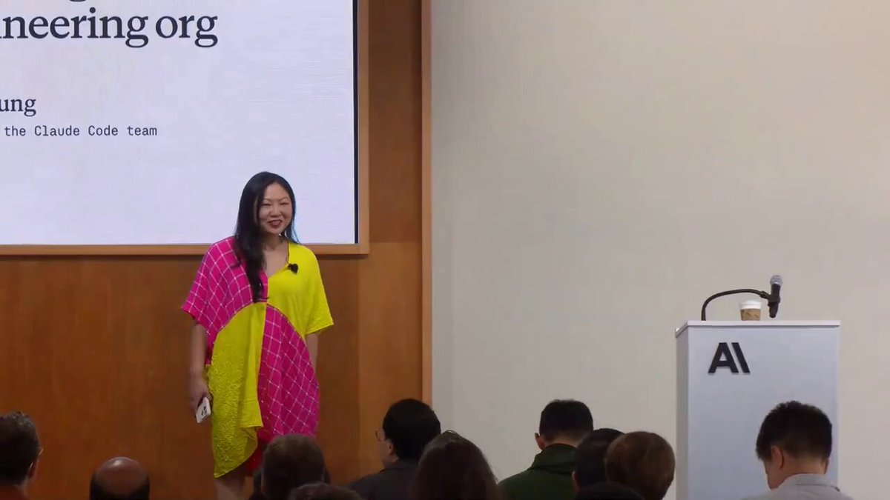

Anthropic's main manager:

 "Nobody types prompts from scratch. The commands should be live in the project."

In 26 minutes, she walks through how Anthropic runs Claude Code, including the command library every new dev inherits on day one.

Watch the full talk, then save the config below👇

### 🖼️ Attached Media

## 💬 Replies

### 1 @FUCORY (fucory)

*Sun Jun 07 23:24:00 +0000 2026*

@0x\_rody [smithers.sh](http://smithers.sh) are slash commands with superpowers. Orchestrate not only subagents but also regular code and humans with full observability and workflows that run durably for days and weeks

### 2 @Blum_OG (Blum)

*Mon Jun 08 11:12:18 +0000 2026*

@0x\_rody 26 mins of solid info, Anthropic delights again

### 3 @ajs6888 (安叫兽|Bird🕊️ 🔶 BNB)

*Mon Jun 08 01:50:15 +0000 2026*

@0x\_rody 这更像把团队习惯直接塞进工具里了

### 4 @gerardsans (Gerard Sans | Axiom 🇬🇧)

*Mon Jun 08 13:30:39 +0000 2026*

@0x\_rody Escape token velocity:

### 5 @AIwithJames (James AI)

*Mon Jun 08 06:27:37 +0000 2026*

@0x\_rody That's great

### 6 @nickventuri (Nick Venturi)

*Tue Jun 09 01:25:52 +0000 2026*

@0x\_rody copy pasting prompts from a messy google doc is the actual industry standard

### 7 @techfabk (Fabian K)

*Sun Jun 07 22:14:02 +0000 2026*

@0x\_rody Genau richtig. Standardisierte Commands reduzieren Komplexität. Minimalismus in der Praxis: Weniger Repetition, mehr Raum für Innovation.

### 8 @nahid_pro09 (Nahid)

*Mon Jun 08 02:38:17 +0000 2026*

@0x\_rody 26 minutes is a solid deep dive cant wait to watch

### 9 @rufus1eth (Rufus.eth)

*Mon Jun 08 09:13:38 +0000 2026*

@0x\_rody Now main skill is prompt writing to be successful, right?

### 10 @LocaleNet (Locale Network 🏡)

*Sun Jun 07 21:35:39 +0000 2026*

@0x\_rody Anthropic treating prompts like code just makes sense.

### 11 @kanukagi (sandybrige)

*Mon Jun 08 01:53:39 +0000 2026*

@0x\_rody プロジェクト内で命令が生きるべきです。楽しみにしています。

### 12 @LewisWeldtech (That AI Guy)

*Tue Jun 09 14:20:15 +0000 2026*

@0x\_rody [x.com/i/status/20643…](https://x.com/i/status/2064344559677739149)

### 13 @mmoyshaa (Moysha)

*Mon Jun 08 09:25:31 +0000 2026*

@0x\_rody future is not prompts, it’s command systems

### 14 @kekkodamato_ (Kekko D’Amato)

*Sun Jun 07 23:52:52 +0000 2026*

@0x\_rody "Nobody types prompts from scratch" should be a poster on every dev team's wall. The command library idea is basically productizing your own workflow — the people who do this once save hundreds of hours over time.

### 15 @codeledgerECF (demo.CodeLedger.dev)

*Tue Jun 09 07:54:28 +0000 2026*

@0x\_rody We go a step or two further and wrap the prompt in lessons learned in repo Intelligence before it goes to the coding agent for processing. We referred to this as prompt coaching.

### 16 @hussainanjar (Hussain Fakhruddin)

*Mon Jun 08 08:16:49 +0000 2026*

@0x\_rody The project command library idea completely changes how you think about prompting.

### 17 @brawndothebrave (Brawndo ™)

*Tue Jun 09 06:45:11 +0000 2026*

@0x\_rody Main manager? Is that a role?

