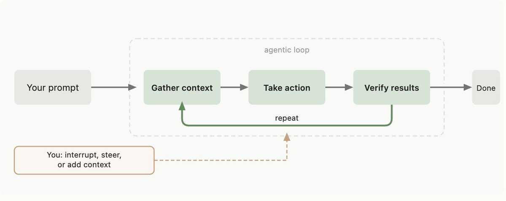
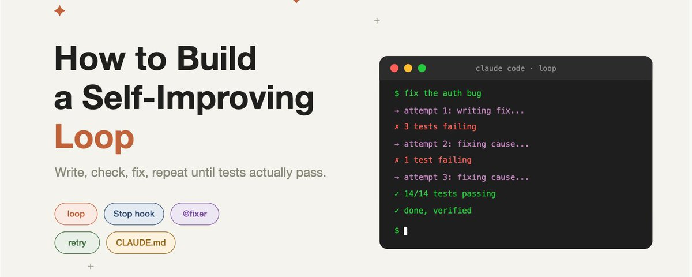

# 📰 How to Build a Self-Improving Loop in Claude Code (Exact Setup Inside) 

Claude writes your code, hands it over, and 3 tests are failing.

You paste the errors back, it fixes one thing, breaks another, and you spend the evening as a messenger between Claude and your terminal.

Most devs accept this as the workflow.

 The fix is a loop where Claude checks its own work and retries until everything passes, without you in the middle.

Here's the full setup you need 👇

## How the loop works

The default Claude Code flow is a straight line: you ask, Claude writes, Claude stops. Whether it works is your problem.

The loop closes the line into a circle. Claude writes, runs the checks, sees what failed, fixes it, runs the checks again. It only stops in two cases: everything passes, or it hits the retry limit and reports exactly what's still broken.

You go from messenger to reviewer. The setup is 3 files.

## File 1: the loop protocol in CLAUDE.md

This tells Claude that "done" means "verified", not "written". Drop it in your project root:

\`\`\`markdown
\## Loop protocol

Every task runs as a loop, not a line:

1\. Write the change.
2\. Run the checks: tests, linter, type checker.
3\. If anything fails, read the error, fix the cause, go back to step 2.
4\. Repeat up to 5 times.

Stop conditions:
\- All checks pass: report "done" with the passing output as proof.
\- 5 attempts used: stop and report what still fails and what you tried.
\- Same error appears twice in a row: stop. You're guessing, not fixing.

Never report "done" without check output from this session.
Never fix a test by weakening it. Fix the code, not the test.
\`\`\`

The last line matters most. Without it, Claude eventually "passes" tests by deleting assertions. The loop should improve the code, not the scoreboard.

## File 2: the Stop hook that closes the loop

The protocol asks Claude to check itself. This hook makes it physical. Drop into .claude/settings.json:

\`\`\`json
{
  "hooks": {
    "Stop": \[
      {
        "hooks": \[
          { "type": "command", "command": "npm test --silent 2&gt;&1 \| tail -20" }
        \]
      }
    \],
    "PostToolUse": \[
      {
        "matcher": "Write\|Edit",
        "hooks": \[
          { "type": "command", "command": "npx tsc --noEmit --pretty false 2&gt;&1 \| head -10" }
        \]
      }
    \]
  }
}
\`\`\`

The PostToolUse hook feeds type errors back after every edit, so Claude self-corrects mid-task. 

The Stop hook runs the test suite when Claude tries to finish. Failing output goes straight back into the session, and the loop protocol forces another iteration instead of a fake "done".

For Python, swap the commands for pytest -q and pyright. For Rust, cargo test --quiet and cargo check.

## File 3: the fixer subagent

For stubborn failures, a separate agent with fresh eyes beats the 5th retry of a tired session. Drop into .claude/agents/fixer.md:

\`\`\`yaml
\---
name: fixer
description: Invoke when the same test keeps failing after 2 fix attempts. Diagnoses the root cause before touching code.
tools: Read, Edit, Grep, Glob, Bash
model: opus
\---

You fix failing checks. You are not allowed to guess.

1\. Run the failing check yourself. Read the full error.
2\. Read every file in the failure path, end to end.
3\. Write one sentence: what is the actual cause.
4\. Fix that cause only. No drive-by refactoring.
5\. Run the check again. Report before/after output.

Forbidden: deleting tests, loosening assertions, adding try/catch
to silence errors, marking tests as skipped.

\`\`\`

The main session calls it with @fixer when the loop stalls. A fresh context window without the baggage of failed attempts solves what retry #4 can't.

## Common mistakes

No retry limit. Without "5 attempts max" Claude can burn an hour circling one error. The limit turns an infinite loop into a report.

Tests too slow for the loop. If the suite takes 90 seconds, each iteration crawls. Point the Stop hook at unit tests, leave integration for CI.

Letting Claude edit tests during the loop. The single biggest cheat path. The protocol forbids it, but check diffs for touched test files anyway.

No "same error twice" rule. Two identical failures in a row means Claude is guessing. That's the moment for @fixer or for you, not for retry #3.

## The 5-minute setup

1 minute: copy the loop protocol into CLAUDE.md.

2 minutes: add the hooks to .claude/settings.json.

1 minute: create .claude/agents/fixer.md.

1 minute: give Claude a real task and watch the loop run: write, fail, fix, pass.

You stop being the messenger between Claude and your terminal. The model didn't get smarter. It just stopped being allowed to quit early.

Thanks for reading!

### 🖼️ Attached Media

## 💬 Replies

### 1 @xatacrypt (Xatacrypt)

*Wed Jun 10 15:23:42 +0000 2026*

@0x\_rody thanks for the info bro, save it

### 2 @0x_rody (rody) (Author)

*Wed Jun 10 15:41:52 +0000 2026*

@xatacrypt thank u for commenting!

### 3 @Nikitont (Nikiton)

*Wed Jun 10 17:04:51 +0000 2026*

@0x\_rody loop is the main topic of the day today

### 4 @beamnxw (beamnxw ./)

*Wed Jun 10 15:32:50 +0000 2026*

@0x\_rody thx for guide ser

ill use it

### 5 @Blum_OG (Blum)

*Wed Jun 10 17:04:28 +0000 2026*

@0x\_rody self-improving loops unlock a whole different tier of output quality

### 6 @raarts (Ron Arts)

*Thu Jun 11 09:45:07 +0000 2026*

@0x\_rody What's wrong with telling Claude that the task is only done when all tests succeed? It will loop by itself.

### 7 @whydeso (whydeso)

*Wed Jun 10 15:37:15 +0000 2026*

@0x\_rody tired of being the messenger between Claude and the terminal

the loop setup looks clean as fuck, gonna try it today. Respect

### 8 @jasmin0828 (Jasmin• Alpha Hunter)

*Wed Jun 10 22:59:58 +0000 2026*

@0x\_rody Done means verified, not written👍

### 9 @ivolivares (Iván Olivares Rojas)

*Thu Jun 11 09:43:24 +0000 2026*

@0x\_rody This is interesting, thank you for the post, is clarifying lots of concepts. Now is time to try it and adapt it.

### 10 @haiweiyue (菲远物流)

*Wed Jun 10 19:43:03 +0000 2026*

@0x\_rody @grok 中文摘要尽量全部提取

### 11 @nilesh__121 (Nilesh Teji)

*Thu Jun 11 07:58:40 +0000 2026*

@0x\_rody check out this 

[github.com/nileshteji/pi-…](http://github.com/nileshteji/pi-ralph-lingum-loop)

### 12 @DrunkenM0nky_ (DrunkenMonkey)

*Thu Jun 11 13:13:05 +0000 2026*

@0x\_rody thats not a loop

### 13 @hinsonan (Andrew Hinson)

*Wed Jun 10 20:08:43 +0000 2026*

@0x\_rody This has a large potential to fail and ignore the markdown in many cases. It's nice to see how it can work it's just these agents are dumb a lot of the time

### 14 @fornews687857 (fornews)

*Thu Jun 11 01:15:10 +0000 2026*

@0x\_rody How to archive a good loop about memory , this is a perfect solution :[github.com/yucai0302/memo…](https://github.com/yucai0302/memory-loop). only need a plugin cc

### 15 @VictorJing001 (Wallace Jing)

*Thu Jun 11 01:00:10 +0000 2026*

@0x\_rody What’s the difference than a QA harness? A standalone fixer is a good idea for stubborn bugs

