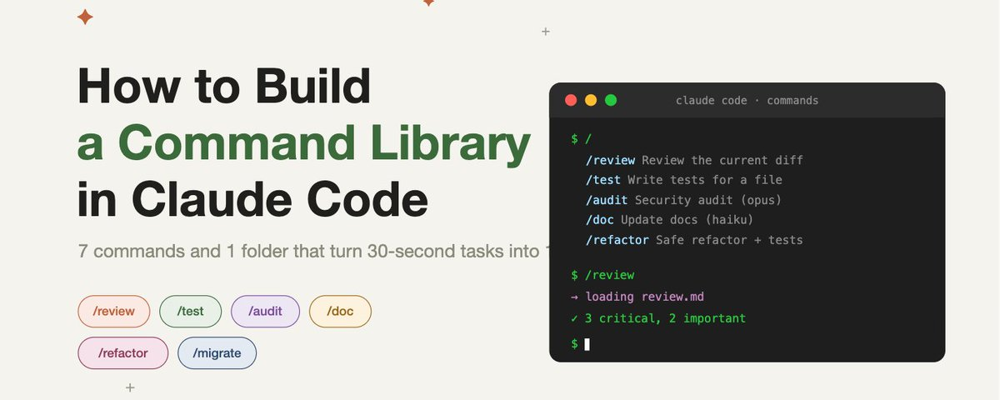

# 📰 How to Build a Claude Code Slash Command Library (Exact Template Inside) 

You type the same 30-second instruction to Claude Code 20 times a week.

That's roughly 10 hours a month spent re-typing context that should be a single command.

Most devs never set up the shortcut system because they think it's complicated. It's not.

Here's the full template to fix this👇

## What slash commands actually are

A slash command is a saved prompt living in a single file. When you type /review, Claude loads that file as the prompt and runs it with whatever arguments you passed.

That's the whole concept. No plugins. No build step. No registry. Just Markdown files in a folder.

Two locations matter:

\`\`\`
\~/.claude/commands/       ← global, available in every project
.claude/commands/         ← per-project, commit to git for the team

\`\`\`

Filename becomes the command name. review.md becomes /review. Subfolders become namespaces: .claude/commands/team/review.md becomes /team:review.

## The basic template

Every slash command follows the same structure: YAML frontmatter on top, prompt body below.

\`\`\`yaml
\---
description: One-line summary that shows up in /help
argument-hint: &lt;what-arguments-look-like&gt;
allowed-tools: Read, Grep, Glob, Bash
model: sonnet
\---

The prompt body goes here. Use $ARGUMENTS to insert whatever the user
typed after the command name. Use $1, $2, $3 for positional args.

\`\`\`

Each frontmatter field is optional, but the description matters most. It's what Claude reads to pick the right command, and it's what shows in the menu when you type /.

allowed-tools scopes what the command can do. Tighter scope means faster, safer commands. A doc updater doesn't need Bash. A reviewer doesn't need Write.

model is optional. Use haiku for routine work, sonnet for most things, opus for security and complex reasoning.

## The 7 ready-to-ship commands

Drop any of these into .claude/commands/{name}.md and you have it.

## 1\. /review

\`\`\`yaml
\---
description: Review the current diff for bugs, security, and style issues
argument-hint: \[optional file or commit range\]
allowed-tools: Read, Grep, Glob, Bash(git diff:\*, git log:\*)
model: sonnet
\---

You are a senior code reviewer with 15 years of experience shipping production systems.

Review the following changes:
\- If $ARGUMENTS is provided, review \`git diff $ARGUMENTS\`
\- Otherwise, review \`git diff HEAD\`

Focus on:
1\. Bugs and edge cases the author missed
2\. Security issues (injection, auth bypass, exposed secrets)
3\. Performance regressions
4\. Breaking changes to public APIs

Output:
\- Critical (must fix): file:line and a one-sentence fix
\- Important (should fix): same format
\- Nitpicks (optional): same format

Never approve code with critical issues. Be direct. No vague "consider refactoring."
\`\`\`

## 2\. /test

\`\`\`yaml
\---
description: Write tests for the file or function that follows
argument-hint: &lt;file-or-function-name&gt;
allowed-tools: Read, Write, Edit, Bash
model: sonnet
\---

Write tests for: $ARGUMENTS

Steps:
1\. Read the target file and identify all branches, edge cases, and error paths
2\. Read existing test files for conventions, match them
3\. Write tests that fail when the implementation is wrong, not tests that mirror it

Priorities: edge cases &gt; error paths &gt; happy path. Skip trivial getter/setter tests.
Run the test suite after writing to confirm everything passes.

\`\`\`

## 3\. /migrate

\`\`\`yaml
\---
description: Migrate code from one pattern, library, or version to another
argument-hint: &lt;from&gt; to &lt;to&gt; (e.g., "axios to fetch")
allowed-tools: Read, Edit, Grep, Glob, Bash
model: sonnet
\---

Migration: $ARGUMENTS

Steps:
1\. Use Grep to find every file using the old pattern
2\. List the files first. Show me the plan before changing anything.
3\. After approval, edit one file at a time. Run the test suite after each.
4\. If a test breaks, stop and explain what happened.

Never do a bulk find-and-replace. Each file needs its own context.
\`\`\`

## 4\. /audit

\`\`\`yaml
\---
description: Security audit of the file or path that follows
argument-hint: &lt;file-or-path&gt;
allowed-tools: Read, Grep, Glob, Bash
model: opus
\---

Audit target: $ARGUMENTS

Check for:
\- Hardcoded secrets, API keys, credentials
\- SQL injection, command injection, path traversal
\- Auth bypass, missing permission checks, IDOR
\- Unvalidated user input flowing into dangerous sinks
\- Secrets being logged, returned in errors, or sent to third parties

Output every finding with:
\- file:line
\- Severity (critical/high/medium)
\- The attack scenario in one sentence
\- The fix in one sentence

Be paranoid. Assume the input is hostile.

\`\`\`

## 5\. /doc

\`\`\`yaml
\---
description: Update docs to match the current code
argument-hint: \[optional path\]
allowed-tools: Read, Edit, Grep, Glob, Bash(git diff:\*)
model: haiku
\---

Update docs to match code changes in: $ARGUMENTS (defaults to current diff)

Steps:
1\. Run \`git diff\` to see what changed
2\. Search the docs folder and README for references to changed symbols
3\. Update only the sections that are now wrong
4\. Do not rewrite, restructure, or "improve" anything else

If a feature has no docs at all, flag it. Don't invent new doc files unless told to.

\`\`\`

## 6\. /triage

\`\`\`yaml
\---
description: Triage a bug report or issue
argument-hint: &lt;issue-description-or-link&gt;
allowed-tools: Read, Grep, Glob, Bash
model: sonnet
\---

Bug to triage: $ARGUMENTS

Steps:
1\. Read the issue. Extract: expected behavior, actual behavior, repro steps.
2\. Try to reproduce locally if possible.
3\. Identify the file and probable line of the bug.
4\. Rate severity: critical / high / medium / low
5\. Suggest a fix approach. Do not write the fix yet.

Output:
\- Root cause in one sentence
\- Affected file:line
\- Severity and reasoning
\- Proposed fix in 1-3 bullet points
\`\`\`

## 7\. /refactor

\`\`\`yaml
\---
description: Refactor the target with a safety-first approach
argument-hint: &lt;file-or-function&gt; \[goal\]
allowed-tools: Read, Edit, Bash
model: sonnet
\---

Refactor target: $ARGUMENTS

Rules:
1\. Enter plan mode first. Show me the plan before any edit.
2\. Never touch more than the explicit target without asking.
3\. Run the tests before refactoring to capture the baseline.
4\. Run the tests after every change.
5\. If a test breaks, stop and explain. Do not proceed until I approve.

Goal: maintain behavior, improve readability and maintainability.
If you can't do that without changing behavior, stop and ask.
\`\`\`

## How to invoke them

Three ways:

Type / and Claude shows the full menu with descriptions. Pick one, autocomplete fills the rest.

Type the full command directly: /review or /audit src/api/auth.ts. Arguments come after a space.

For namespaced commands in subfolders: /team:review runs .claude/commands/team/review.md.

Arguments come in as $ARGUMENTS for the whole string, or $1, $2, $3 for positional. So /migrate axios to fetch gives you $1=axios, $2=to, $3=fetch, and $ARGUMENTS="axios to fetch".

## Common mistakes that kill your slash commands

Description too vague. "Review code" tells Claude nothing about when to use it. "Review the current diff for bugs, security, and style issues" is what you want.

allowed-tools too loose. If you leave tools off the list, the command inherits everything. That's fine for trusted commands. For ones that touch sensitive paths or run shell commands, scope it tight.

Using $1 when you meant $ARGUMENTS. $1 is only the first space-separated token. If you want the whole argument string, use $ARGUMENTS.

Wrong location. Project commands in .claude/commands/, global commands in \~/.claude/commands/. Put it in the wrong place and it doesn't show up.

Not committing project commands to git. .claude/commands/ should be in your repo. Your teammates get the same shortcuts the moment they clone.

## The 15-minute breakdown

3 minutes: pick the one task you do 5+ times a week. Copy the matching template above.

3 minutes: tweak the prompt for your stack. Your test framework, your linter, your conventions.

2 minutes: save to .claude/commands/{name}.md.

2 minutes: run it on a real task to confirm it works.

5 minutes: build the next one.

Done. One specialist command instead of one re-typed prompt. Build one a day for a week and you'll have 7 commands handling 80% of your routine work, and the long instructions you used to retype every session become a single keystroke.

Thanks for reading!

I share daily notes on AI, finance, and vibe coding in my Telegram channel: https://t.me/zodchixquant

### 🖼️ Attached Media

## 💬 Replies

### 1 @rewind02 (rewind)

*Sun Jun 07 14:25:50 +0000 2026*

@0x\_rody tiny setup huge payoff

### 2 @StuyBoyNY (StuyBoy From NYC)

*Mon Jun 08 04:01:07 +0000 2026*

@0x\_rody @readwise save

### 3 @FranklinSolum (Franklin Solum)

*Sun Jun 07 11:03:28 +0000 2026*

@0x\_rody Thanks for this,  One of the most practical Claude guides.

