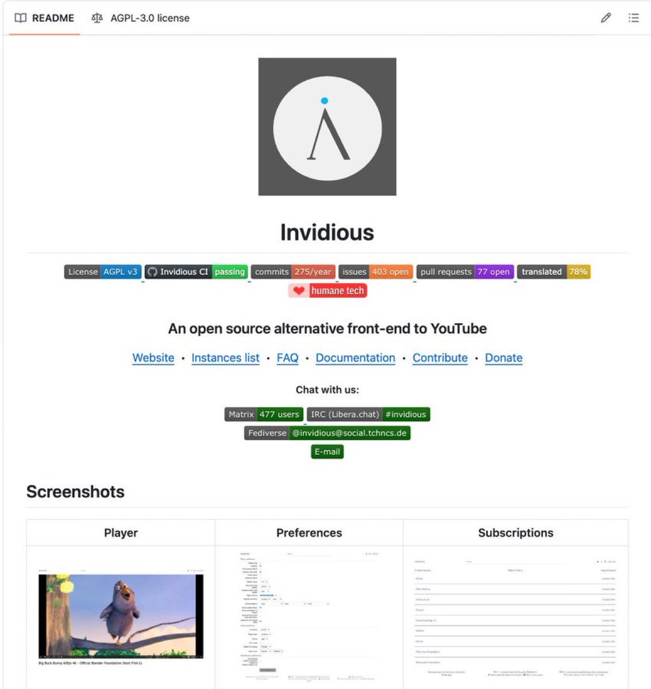

Acabo de cancelar YouTube Premium.

He encontrado una alternativa gratis, de código abierto y, después de probarla, no pienso volver atrás.

La han construido 361 voluntarios en GitHub y funciona en cualquier navegador.

Se llama Invidious.

Hace exactamente lo que la mayoría paga por tener en YouTube Premium:

→ Sin anuncios
→ Audio en segundo plano en el móvil
→ Ver vídeos sin iniciar sesión
→ Sin el rastreo constante de Google

Pero lo mejor no son las funciones.

Es la experiencia.

Las páginas cargan en milisegundos porque funcionan sin JavaScript.

No hay píxeles de seguimiento.

No hay reproducción automática.

No hay un algoritmo intentando engancharte durante horas.

Además puedes:

→ Suscribirte a canales sin una cuenta de Google
→ Recibir notificaciones de nuevos vídeos
→ Importar todas tus suscripciones de YouTube con un clic
→ Cambiar entre decenas de instancias públicas si una falla
→ Alojarlo en tu propio VPS por unos 5 $ al mes si quieres control total
→ Redirigir automáticamente cualquier enlace de YouTube con la extensión Privacy Redirect

El proyecto lleva años en desarrollo activo y su última versión se publicó en febrero de 2026.

100 % open source.
0 € al mes.

Enlace abajo 👇

### 🖼️ Attached Media

## 💬 Replies

### 1 @Nozelcode (roman) (Author)

*Fri Jul 24 19:44:10 +0000 2026*

[github.com/iv-org/invidio…](https://github.com/iv-org/invidious)

### 2 @romanftp (ryu.)

*Fri Jul 24 19:52:09 +0000 2026*

@Nozelcode esto demuestra lo potente que es el software libre

### 3 @S0N_IA (SONIA)

*Fri Jul 24 22:57:04 +0000 2026*

@Nozelcode no conocía esta joya gracias por compartirla

### 4 @Ryorugg (Ryoru 𒌐)

*Fri Jul 24 19:50:10 +0000 2026*

@Nozelcode llevo usando invidious desde hace meses y no echo de menos premium

### 5 @igus_ai (gus)

*Fri Jul 24 19:52:38 +0000 2026*

@Nozelcode el ecosistema open source está en otro nivel

### 6 @S0N_IA_ (SONIA)

*Fri Jul 24 22:57:19 +0000 2026*

@Nozelcode justo lo que estaba buscando

### 7 @rewind02 (rewind)

*Fri Jul 24 19:51:45 +0000 2026*

@Nozelcode less tracking changes the experience

### 8 @garlotic (GARLOTIC)

*Fri Jul 24 22:58:05 +0000 2026*

@Nozelcode github nunca deja de sorprenderme

### 9 @angeldot_ (angel)

*Fri Jul 24 19:54:12 +0000 2026*

@Nozelcode esto debería venir instalado por defecto en todos los navegadores

### 10 @paulai_ (paula)

*Fri Jul 24 22:58:18 +0000 2026*

@Nozelcode la velocidad de carga es una locura

### 11 @nicos_ai (Nico)

*Fri Jul 24 19:53:15 +0000 2026*

@Nozelcode me encanta descubrir proyectos como este

### 12 @robrtcode (robert.)

*Fri Jul 24 21:03:54 +0000 2026*

@Nozelcode cada vez hay mejores alternativas a los servicios de google

### 13 @yuliaisc (yuulia ✟)

*Fri Jul 24 19:50:42 +0000 2026*

@Nozelcode de los mejores proyectos open source que existen

### 14 @angeliuss (M. Angeliuss )

*Fri Jul 24 23:52:01 +0000 2026*

@Nozelcode Pipepipe, Newpipe, SmartTube ..

### 15 @kasebtc (Kase)

*Sat Jul 25 06:26:28 +0000 2026*

@Nozelcode Que diferencia hay de usar brave

### 16 @Sin_Pension (El Pensionista)

*Sat Jul 25 09:25:59 +0000 2026*

@Nozelcode Y komo se pone en marcha ?

### 17 @evangidzian (MegaAi)

*Sat Jul 25 09:08:59 +0000 2026*

@Nozelcode Arayüz otomobil dünyasının Lada Samara'sı ise gerek yok. Şu an mobilde ReVanced, Televizyonda SmartTube iyi. Geri kalan çözümler heyecan vermiyor..

### 18 @KLZot (Ghost)

*Sat Jul 25 15:28:58 +0000 2026*

@Nozelcode Instálate @brave y te ahorras todo eso.

### 19 @kimiatehrani (Kimia)

*Sat Jul 25 15:56:14 +0000 2026*

@Nozelcode Glad you put this on my radar

### 20 @spcxap (Zhou)

*Sat Jul 25 00:17:30 +0000 2026*

@Nozelcode Genial, gracias por compartir

### 21 @aiseomastery (AI Mastery Guide)

*Fri Jul 24 23:42:33 +0000 2026*

@Nozelcode 361 volunteers built what YouTube charges for, that's the real open source win 🙌

### 22 @K0lateral (K0lateral - IA ?)

*Sat Jul 25 00:00:04 +0000 2026*

@Nozelcode @nicos\_ai @nicos\_ai Me encanta este tipo de conversaciones.

### 23 @jp_europe (jp_europe)

*Sun Jul 26 04:20:06 +0000 2026*

@Nozelcode Brave

### 24 @ArcticKraft (Hello World)

*Sat Jul 25 14:41:53 +0000 2026*

@Nozelcode Usa @brave

### 25 @AlexRumours (Álex 𒌐)

*Sun Jul 26 05:35:10 +0000 2026*

@Nozelcode Para eso uso Brave, es más fácil 😂

### 26 @miyoko_segovia (gatuna shayeragal)

*Sun Jul 26 00:31:41 +0000 2026*

@Nozelcode Disculpa mi ignorancia , pero ,como se usa, instala o se opera esto?

### 27 @animals_random_ (marronald)

*Fri Jul 24 19:54:41 +0000 2026*

@Nozelcode es impresionante lo que puede construir una comunidad de voluntarios

### 28 @fltraciones (filtraciones gaming)

*Fri Jul 24 19:53:39 +0000 2026*

@Nozelcode youtube premium cada vez tiene menos sentido

### 29 @Son_Ratas (Son ratas!)

*Sat Jul 25 12:52:23 +0000 2026*

@Nozelcode En móvil tenéis revanced

### 30 @Jimster4801 (Jimsta)

*Sat Jul 25 03:21:58 +0000 2026*

@Nozelcode Except you just don't get high bitrate video, since that is gatekept behind a login.

### 31 @SteveOnBase_ (Steve)

*Fri Jul 24 22:17:32 +0000 2026*

@Nozelcode Brave browser ?

