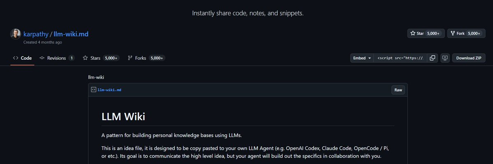
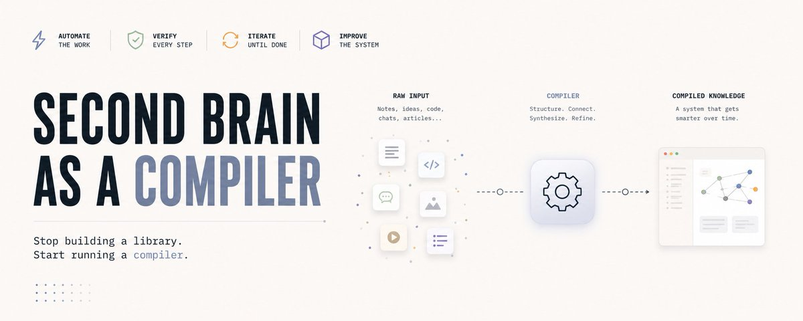

# 📰 The Second Brain Is Not a Storage System. It's a Compiler.

Most people who build a second brain make the same mistake. They treat it like a filing cabinet. Drop notes in. Search when needed. Hope the right thing surfaces.

That is retrieval. And retrieval has a ceiling.

Andrej Karpathy described something different in April 2026. He called it LLM Wiki. The idea spread across GitHub within days. 5,000 stars. 16 million views on a single post about a folder structure. Thousands of engineers reading the same sentence and feeling something shift.

"RAG re-derives knowledge on every query. A compiled wiki derives it once and keeps it current."

That distinction changes everything about how you build.

# The difference between storing and compiling

When you store knowledge, you are building a library. Information goes in. You search when you need it. The library does not grow on its own. It does not make connections. It does not flag when two notes contradict each other.

When you compile knowledge, something different happens. A source comes in. The system reads it, extracts what matters, connects it to everything already there, updates related pages, flags contradictions with older entries, and files the synthesis permanently. The next time you add a source, it builds on what was already compiled. Not on the raw inputs. On the processed understanding.

The library gets bigger over time. The compiler gets smarter.

RAG systems pay the cost of understanding on every single query. A compiled wiki pays it once, at ingest, and every query after that draws on structured, linked, cross-referenced knowledge the model built and maintains. That is not a productivity trick. It is a fundamentally different architecture.

# The architecture

Three folders. One file. One loop. Here is what changes when you treat it as a compiler instead of a library.

> raw/ is the input buffer, not the brain. Nothing that enters raw is ever the answer. It is the raw material waiting to be compiled. wiki/ is where compilation happens. One source touches ten to fifteen pages. Connections form automatically. Contradictions get flagged. The human reads it. The model writes it. output/ is built from compiled knowledge, not from memory and not from raw.

At the center: CLAUDE.md. A compiled profile of who you are, how you think, what you have tried. Not a prompt you write once and forget. A living document the model maintains and reads before every session.

The loop does not just file things. It compiles them. Every new source gets ingested, linked, and integrated into the existing structure. Then it writes you a brief on what it changed and why, so you stay inside the system instead of wondering what it did while you were gone. You open your laptop and the compilation already happened. You start where the thinking left off.

# Why most second brains stop working after three months

The filing cabinet model fails for one reason: maintenance burden. You capture a note. You organize it. You cross-reference it. You update it when something changes. Every one of those steps requires a human decision. Human time. Human energy.

Most personal wikis quietly rot. Not because the person stopped caring. Because the maintenance cost compounds faster than the value compounds.

Karpathy named this directly: "The act of collecting information is effortless. The act of keeping fifty interlinked notes current, consistent, and cross-referenced is the work that no human sustains."

The compiled wiki shifts that burden to the model. Claude does not get tired of filing. It does not forget to link the new note to the three older ones it contradicts. The human contribution becomes irreducible: source selection, research direction, synthesis oversight. Everything else runs.

# What happens over time

One month in: context stops disappearing between sessions. Three months in: the wiki surfaces connections you never consciously made. The system found the link between an idea from January and a note from last week. You did not have to. Six months in: the gap between you and someone starting from zero is structural. Not because you are smarter. Because your compiled knowledge base draws on six months of processed understanding. Theirs resets every session. One year in: open the graph view. Hundreds of nodes. All connected. All maintained. The system knows things you had forgotten you knew.

# The honest part

The compiler approach has real limitations worth naming.

Quality depends entirely on source quality. Garbage in means garbage compiled, not garbage retrieved. The difference matters because retrieval surfaces one bad document. Compilation integrates it into everything. A bad source in a library is easy to remove. A bad source in a compiler has touched fifteen pages before you notice.

The first few weeks feel slow. The graph is small. The connections are obvious. The value of compilation only becomes clear when the wiki has enough density that the model starts finding non-obvious links. That threshold is around 50 to 100 well-compiled sources. Before that, a good search engine does most of the same job.

And this requires Claude Desktop and a paid plan. The scheduled tasks and file system access that make the loop run do not work on the free tier.

Build with those constraints in mind and the system earns its cost quickly. Ignore them and you will rebuild the filing cabinet you started with.

# The prompts that run the system

For those who want to build this today.

To ingest a new source:

> I just added a new file to my raw folder called \[filename\]. Read it, extract the key concepts and claims, write a wiki article for each major concept, link them to related pages already in my wiki, and flag any contradictions with what I already have. Then summarize what changed in three sentences.

To build your CLAUDE.md:

> You are setting up my second brain. Interview me one question at a time. Ask about: who I am and what I do, my goals for this year, how I want you to communicate with me, my strengths and weaknesses, and my current projects. Wait for each answer before moving to the next. When finished, write everything into a file called CLAUDE.md at the vault root, organized with clear headers, so you load it automatically every session.

To build a project folder:

> Create a project folder called \[project name\]. Inside it, create four folders: Inputs, Process, Outputs, Feedback. Then write a CLAUDE.md inside that project folder describing what it is, its single goal, what done looks like, and your specific role in helping me reach it.

To set up the daily compilation loop:

> Set up a daily compilation task. Check my vault. File anything new in Inputs folders into the right place and link it to related notes. Flag anything that has gone stale or has not been updated in more than two weeks. Check for contradictions between recent additions and existing wiki pages. Write me a brief: what you changed, what you linked, what you flagged, and what I should look at today.

# The reversal

Most people are using Claude as a search engine with better manners. You ask. It answers. You close the tab. Tomorrow it remembers nothing. You are still the one holding all the context. Every session you pay the same understanding cost again.

The compiled second brain changes that direction. You stop being the memory layer. The system becomes it.

Retrieval answers questions. Compilation builds understanding.

Build the compiler. Let it run. The compounding starts immediately and it never stops.

### 🖼️ Attached Media

