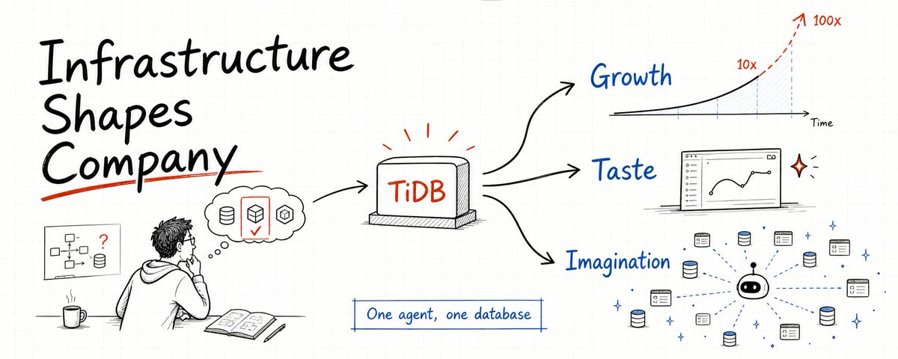

# 📰 你选择什么样的基础架构，最终就会成长为什么样的公司 

## 故事一：相信增长

几年前，我跟北美一家非常著名的、某个 A 字母开头公司的首席架构师聊天。

他一上来就问了我一个非常 tough 的问题：

「Siddon，我做了几十年的分布式系统，比如 Google BigTable。我在这块吃过的盐，可能比你吃过的米还多。那你告诉我，为什么我要选择 TiDB？」

那一下我确实愣住了。

直觉告诉我，跟这种全球顶级分布式系统专家对话，如果只是说 TiDB 架构多先进、性能多好、扩展性多强，其实很难真正打动他。因为这些东西他都懂，而且可能比我还懂。

于是我想了想，说了一个当时自己都觉得有点中二的观点：

「你选择 TiDB，其实是在选择你未来十年的数据库基础架构。更准确地说，你是在选择你希望这家公司未来能成长到什么高度。」

他可能也没想到我会这么回答，笑了笑，然后突然兴奋起来，开始跟我聊他们当年怎么研发 BigTable，怎么支撑 Google 业务的高速增长，也开始认真讨论 TiDB 的架构和取舍。

最后，这家公司选择了 TiDB。

我们也非常自豪地看到，TiDB 帮他们解决了 HBase、Aurora 等一系列系统问题，支撑了他们业务的快速发展，尤其是疫情之后那段爆发式增长。更有意思的是，后面他们在设计新业务系统的时候，已经会主动思考：怎么把 TiDB 的能力释放到最大。

当然，我要严肃声明一下：客户绝对不是因为这一次聊天就选择了 TiDB。基础架构选型这种事情，跟买房、结婚差不多，都是非常慎重的决定，不能靠一句鸡汤拍板。

但这次对话确实让我心里有了一个越来越清晰的想法：

你选择什么样的基础架构，最终就会成长为什么样的公司。

对应到 TiDB，这个表达非常直接：

选择 TiDB，就是笃定公司未来会有 10 倍，甚至 100 倍的快速增长。

上面的 A 公司只是一个例子。类似的故事，其实已经发生过很多次了：

- 日本某支付公司，从一开始做活动就挂，成长为日本顶级支付平台。

- 印度某电商公司，从扛不住印度版「黑色星期五」流量，到每年活动越做越大，成为印度最大的电商平台。

- 美国某图片社交平台，从接不住广告流量，到帮助入驻商户一年赚到 6 亿美金营收。

所以我后来越来越相信一句话：

Choosing TiDB = Believing in Growth.

选择 TiDB，本质上是在相信增长。

## 故事二：拥有好的品味

第一次跟国内某 LLM 大厂 CTO 吃饭时，我们 CTO 东旭还特意按照他们公司的调性，单独做了几个手链。

这个动作一下子把客户震住了，也感动到了。

手链本身不值多少钱，但它透露出来的是一种品味，一种对美和细节的追求。

有一次，我跟他们公司一位 00 后员工聊天。这里不得不承认，江山代有才人出。这个年轻人年纪很小，但已经在公司负责非常重要的工作。

他跟我说了一句话：

「如果你们做的东西，现在不能让 25 岁以下的年轻人觉得酷，那你们其实已经被淘汰了。」

听完之后，我感受到了深深的年龄忧伤。

但同时我也有点自豪。因为 TiDB 这个产品，确实正在被一批年轻工程师认可和使用。他们不是因为情怀来用，而是因为觉得它真的酷，真的符合他们对未来系统的想象。

当然，也不是因为一顿饭、一条手链就达成了交易。还是那句话，选数据库不是点奶茶，不可能「三分糖少冰」就下单。

这家 LLM 公司选择 TiDB，一个很重要的原因，是他们认同我们在 AI 时代对数据库的判断：

TiDB 已经不只是给人用的数据库，它正在变成给 AI agent 使用的数据库。

他们自己构建产品的逻辑也非常直接：让 AI agent 自行决定是否使用数据库，以及如何使用数据库。

也就是说，AI agent 作为一等公民，是我们和这家 LLM 公司共同的认知。

我还拜访过另一家潜在客户的业务负责人。他在饭局上非常直接地跟我说：

「Siddon，虽然我们现在还不是你们的客户，但我会尽全力帮你们引进去。我的很多分布式系统知识，都是通过学习你们网上发布的文章提升的。尤其是你们最新的 TiDB X 架构，基于对象存储做 TP 系统，真的太厉害了。所以我相信你们的技术品味，也相信你们的品味能支持我们走到下一个阶段。」

说完，他顿了顿，又补了一句：

「另外，能不能给我几件你们公司的 T 恤？真的做得挺好的，质量也好。」

这一下我们全都笑了。

我们甚至自嘲过，如果哪天 TiDB 数据库卖不动了，也许可以去开一家 TiDB 周边店，卖 T 恤、帽子、杯子、书包、钢笔、鼠标垫。搞不好毛利率比数据库还高。

但玩笑归玩笑，这背后其实是一个很严肃的事情：

数据库发展到今天，各家的能力差距在很多场景下已经没那么大了。我甚至认为，当前很多数据库系统的性能其实是过剩的。

所以客户在选择一款数据库时，除了产品能力本身，也会越来越关注一些更底层、更长期的东西：

你的审美是什么？

你的技术品味是什么？

你对未来系统的判断是什么？

你是不是一个能持续做出好东西的团队？

所以第二句话是：

Choosing TiDB = Having Great Taste.

选择 TiDB，也是在选择一种技术品味。

## 故事三：构建无限可能

现在我们已经进入了 AI 时代。

在 AI 时代，所有人都焦虑。尤其是做软件开发的人，因为：

AI is eating the software.

现在借助 AI，任何人都可以非常快速地构建并发布一款软件。AI 极大降低了软件开发的门槛。

但真正能脱颖而出、被大家广泛使用的软件，依然屈指可数。

因为在这样一个「全民都能写软件」的时代，如果没有一点疯狂的 idea，没有一点变革的勇气和魄力，其实很难做出世界级产品。

所以，当我们某个 M 字母开头的客户找到我们，并提出一个需求时，我们是非常震惊的。

这个需求很简单：

「你们能不能非常便宜地卖给我 100 万个数据库？」

说实话，第一次听到这个需求时，脑子里第一反应是：这是需求，还是压测脚本？

但原因也很简单。

这个客户正在做一件非常疯狂的事情。

在互联网上，建站是一个非常普遍的需求。无论你是想构建个人 blog、产品主页，还是一个对外提供服务的 SaaS 系统，都需要一个站点。所以自然也有很多建站公司。

在 AI 时代，AI agent 构建静态页面已经非常容易了。于是很多公司开始提供静态站点托管。

但问题在于，站点里最核心的数据库这一层，很多时候还是需要用户自己去买、自己配置、自己托管。

这套方式当然能 work，但对大量用户来说，门槛仍然太高。

所以 M 公司，也就是我们的客户，希望构建一个完全托管的建站平台。不只是托管页面，也包括托管和运维用户的数据库。

这个想法非常疯狂。

但作为 TiDB 的开发者，我们恰恰喜欢这种疯狂。

因为任何疯狂的尝试，都代表着无限可能。也许今天看起来像一个离谱需求，明天就可能变成某个重要方向的突破口。

所以我们答应了这个请求。

也正是从这里，我们开始形成一个新的理念：

One agent, one database.

这个理念让我们真正开始把 AI agent 当成 TiDB 的一等公民。

我们最近又去拜访了这家 M 客户。

他们提到，之前在他们认知里，这些站点大多是个人用户或者中小企业用户，业务重要性可能没那么高。

但现在他们发现，已经开始有一些大客户，直接用这些生成出来的站点对外提供非常严肃的企业级服务。

也就是说，这些 AI 生成的站点，已经开始直接 for enterprise 了。

这也远远超出了他们最开始的认知。

更有意思的是，TiDB 帮他们解决了接近百万级数据库的问题之后，他们又发现了下一个需求：

Agent 不光要访问数据库，还需要一个云盘来存放各种各样的非结构化数据。

于是新的问题来了：

「你们能不能非常便宜地卖给我 100 万个云盘？」

嗯。

足够疯狂，足够有挑战。

当然，答案也很简单：

Yes。

干就得了。

所以第三句话是：

Choosing TiDB = Building Beyond Imagination.

选择 TiDB，也是在选择构建无限可能。

## 写在最后

这篇文章，算是我最近十几年做基础架构软件，尤其是做 TiDB 的一次阶段性思考。

它不是一篇典型的技术文章，更像是一些偏形而上、偏哲学层面的碎碎念。

但我越来越觉得，基础架构软件从来不只是技术参数的集合。

它背后其实有一套非常深的信念系统。

你相信什么，就会设计出什么样的系统。

你相信业务会增长，就不会只为今天的规模做设计。

你相信工程师应该拥有品味，就不会只满足于功能能跑。

你相信未来充满不确定性，就不会把系统做成只能服务一种场景的工具。

TiDB 这些年的很多设计，本质上也都来自这些信念：

相信增长，所以我们坚持水平扩展、弹性伸缩、云原生架构。

相信品味，所以我们持续打磨开发者体验、AI agent 体验，以及产品本身的表达方式。

相信无限可能，所以我们愿意跟客户一起去做那些一开始听起来有点疯狂、甚至有点离谱的事情。

因为很多伟大的系统，最开始都不是从一个规规矩矩的需求文档里长出来的。

它们往往来自一个很简单的问题：

如果未来真的会变得比今天大 100 倍，我们今天应该怎么设计？

这也是我现在越来越相信的一件事：

你选择什么样的基础架构，最终就会成长为什么样的公司。

而选择 TiDB，某种意义上，就是在选择三件事：

Believing in Growth.

Having Great Taste.

Building Beyond Imagination.

相信增长，拥有品味，构建无限可能。

### 🖼️ Attached Media

## 💬 Replies

### 1 @Meta360DAO (HAI Labs（人本智能实验室）)

*Mon Jun 29 08:54:43 +0000 2026*

@siddontang TiDB过去成功在于用更高的ROI接住了大型客户的巨量数据库处理需求，TiDB未来的成功很可能在于用极致简便体验接住巨量用户的少量数据存储和处理需求，周期变了，守着大客户的极致大需求可能越来越难，反着道之动，弱 者道之用。从大的极致到小的极致，开启新的增长空间，这或许是年轻人说的cool吧？

### 2 @siddontang (siddontang) (Author)

*Mon Jun 29 09:23:07 +0000 2026*

@Meta360DAO 总结的很精辟。

在 AI 时代，我们把 TiDB 的用户定位成 AI agent，agent 的需求跟传统大客户完全不一样。当然，这个并不是说我们不关注大客户了，实际上因为 TiDB 的可扩展架构，现在大的，小的技术上都能 cover，不过因为业务逻辑不一样，在商业上面还会有区分，和不同策略的投入。

### 3 @gerrycheung75 (Paul)

*Tue Jun 30 05:55:28 +0000 2026*

@siddontang @readwise save

