# 📰 我打造的个人AI系统：哲学基础

过去这段时间，我陆续写过三篇文章，分别讲我在AI时代怎么学、怎么读、怎么写：[Vibe Learning：AI 时代，学习这件事被重新组织了](https://x.com/snowboat84/status/2052908751435477046)、[Vibe Reading：AI 时代读书的系统化方法](https://x.com/snowboat84/status/2050008577511973253)，以及[兄弟们，真·Vibe Writing 时代到来了](https://x.com/snowboat84/status/2047828585537548574)。这三篇讲的都是单个模块各自怎么运转。

而最近，我在做一件更大的事：把这些零散的部件，拼成一套更全面的个人系统，我给它起了个名字，叫Vibe OS。它不是一个App，也不是一个产品，更像是一套架构，一套我用来在AI时代为自己搭建的个人系统。

起因很简单。我发现自己每天面对的处境，和五年前完全不一样了。每天涌进来的信息量，远超人类历史上任何一个时期。AI的能力正在以肉眼可见的速度，渗进我思考和创造的每一个环节，从查资料、写初稿到写代码。与此同时，专注成了奢侈品，能沉下来做一小时深度思考的人越来越少。

在这种环境里，一个认真对待自己的人，迟早要回答一个根本问题：我怎么才能既用上AI的全部力量，又不在这股洪流里把"我"这个人弄丢。说得再直白点，怎么让AI当我的手脚和感官，而不是反过来替我做那个决定我是谁的大脑。

真正逼我动手搭这套东西的，是一种很具体的失控感。有一段时间，每天忙得脚不沾地，刷不完的信息、用不完的AI工具、做不完的事，可到了年底一回头，竟说不清自己这一年到底想清楚了什么、沉淀下了什么。忙碌把空心掩盖得严严实实。那时才意识到，光靠意志力在这股洪流里硬扛是扛不住的，掉进去只是迟早的事，真正需要的是一套架构，一套能在结构上替我稳住自己的东西。

传统的答案：多读书、勤思考，已经不太够用了，因为游戏规则变了。新的答案必须是系统化的，我需要一个有意识搭起来的架构，而不是靠零散的自律硬扛。这篇文章，就是我这套架构的哲学底座，我把它当成自己这套系统的一部宪法，后面所有的功能、工具、取舍，都要回来跟它对一遍方向。

得先把这篇的边界说清楚。既然叫"哲学基础"，它谈的是底层原则，AI具体用哪个模型、怎么调、系统怎么搭，这类技术实现会很少出现，那是另一篇的事。但这绝不是说这套系统是用土法炼钢、靠老办法硬做出来的。恰恰相反，下面讲到的大量事情，从替我筛信息、陪我深读一本书、审我的初稿，到把我随手记下的碎片串成线索，本来就是要靠AI才跑得动的。AI是让这套系统转起来的发动机，这篇先把开车的人该守的规矩讲清楚，发动机怎么造、怎么调，留到后面再说。

下面是这部宪法的几条核心。它们不一定对所有人都适用，这是我自己摸出来、也还在用着的版本。

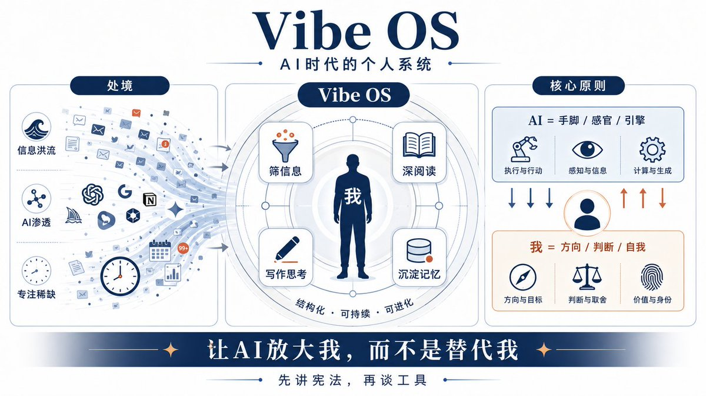

# 一、第一原则：我永远站在系统之外

整套系统里，如果只能留一条原则，那就是这句话：我永远站在系统之外。

系统是手脚和感官的延伸，帮我感知更多、执行更快，但它到不了大脑的位置，做不了那个最终拍板的主体。这个区分在哲学上有个对应，主体和工具的区分。工具可以无限强大，可它一旦僭越成主体，整件事的性质就变了。我用这套系统，和这套系统用我，是两回事。

## 1.1 哪些任务能外包，哪些不能：价值理性和工具理性

把这条原则落到日常，关键是分清一件事可不可以交给AI。我自己用一张很糙的表来切：

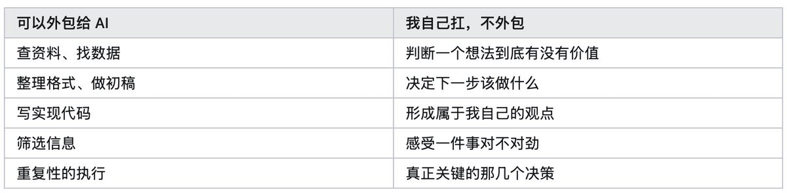

把它再压成一句话：AI负责回答"是什么"，也就是信息、事实、执行。我负责回答"为什么"和"怎么样"，也就是判断、意义和方向。

这个切分背后，其实是社会学家马克斯·韦伯（Max Weber）一百年前就讲过的一对概念，工具理性和价值理性。工具理性回答"怎么做才最有效率"，价值理性回答"这件事到底值不值得做"。韦伯在《经济与社会》里有个著名的判断，现代化的过程，就是工具理性不断压倒其它一切，世界变得越来越有序、越来越可预测，却也越来越"祛魅"、越来越不知道意义在哪。

AI把工具理性这件事推到了人类从未见过的高度，它算得比你快、写得比你顺、查得比你全。可价值理性这一头，只能由人来扛。一台机器能告诉你怎么把一篇文章写得更流畅，它没法替你决定这篇文章到底想说什么、为什么值得说。

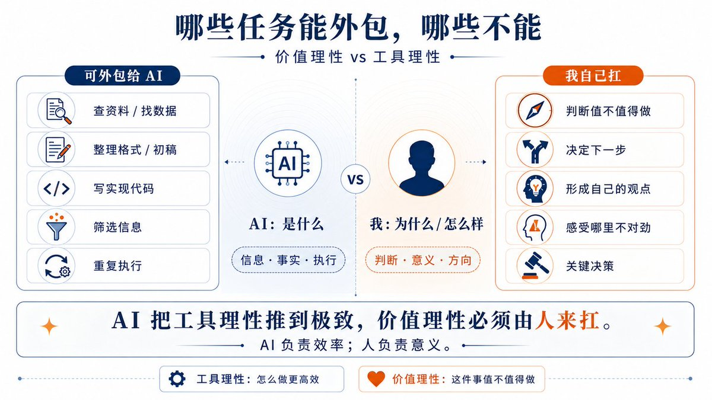

## 1.2 守不住这条线，人会变空心

为什么要这么死守这条边界？因为我见过守不住的样子。

一个把判断、把"我到底要什么"也一并外包给AI的人，最后不会变得更高效，他会变得更空心。他每件事都能让AI给个答案，却慢慢说不清自己究竟想要什么了。效率上去了，主体性塌掉了。久而久之，他成了自己那套系统的一个执行终端，系统让他干嘛他干嘛，看起来很忙，其实已经没有"他"了。

我自己就差点滑进去过。有阵子写文章，习惯先让AI出个观点框架，再往里填。用着用着就发现一个危险的苗头，开始下意识地认同它给的那个框架，懒得再去想"这件事我到底怎么看"。那一刻后背有点发凉，因为外包出去的，已经从体力活悄悄滑成了判断本身。从那以后规矩就改了：观点必须自己先成形，AI只能在你有了立场之后帮你打磨、帮你挑反例，绝不让它替你先开那个头。

所以这条边界对我来说，与其说是个技术选择，不如说是个哲学立场。守住它，这套系统才是"我的"系统。守不住，我就成了系统的一个零件。我宁可慢一点、笨一点，也要把判断和方向这两件事，牢牢攥在自己手里。

## 1.3 一个容易被忽略的修正：思考常常发生在执行里

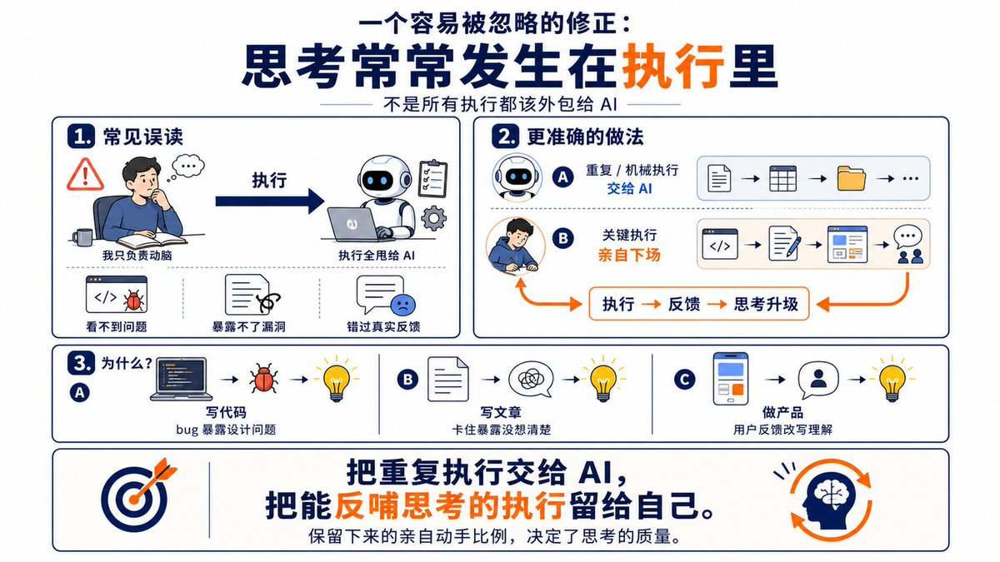

不过这条原则有个常见的误读，得专门拎出来纠一下，因为我自己一开始就读偏过。误读是这样的：既然执行可以外包，那就把所有执行都甩给AI，我只负责动脑。

这样做会出事，因为很多思考根本就是在执行的过程中才发生的。写代码时撞上一个bug，恰恰是这个bug让你发现设计本身有问题。写文章写不下去，往往是因为还没真正想清楚，是写这个动作把思维里的漏洞暴露了出来。做产品时用户的一句反馈，可能会彻底改变你对需求的理解。

所以更准确的说法是：AI帮我扛那些重复的、机械的执行，而那些关键的、能反过来喂养思考的执行，得亲自下场。保留下来的"亲自动手"的比例，直接决定了思考的质量。把执行全甩出去，等于把自己思考的原材料也一起甩掉了。

# 二、输入端：把 Learning 拆成两件不同的事

主体和工具的界限划清楚之后，接下来是这套系统的两个端口，输入和输出。先说输入端，我管它叫Vibe Learning，也就是我怎么从世界里学东西。

我踩的第一个坑，是把Learning当成一件事来做。后来才想明白，它其实是两件性质完全相反的事，硬塞进一套流程里，两头都会烂。

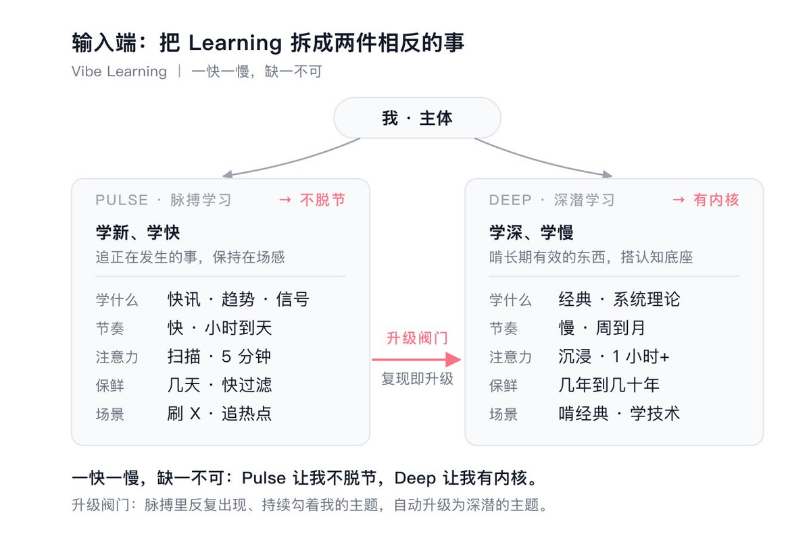

## 2.1 脉搏与深潜，两种完全相反的学习

第一种我叫它Pulse Learning，脉搏学习。学的是行业动态、趋势、社交信号、正在发生的事。节奏极快，以小时和天为单位。目的是保持在场感、不脱节、抓住时机。典型场景就是刷X、逛Hacker News、追热点、看市场在聊什么。它的功能定位只有一个，让我不脱节。

第二种我叫它Deep Learning，深潜学习。学的是经典知识、系统性的理论、那些放十年还有效的东西。节奏很慢，以周和月为单位。目的是给自己搭一个认知底座。典型场景是啃一本经典、系统学一门技术、把一个领域吃透。它的功能定位也只有一个，让我有内核。

这两件事的内在属性几乎处处相反。注意力模式上，一个是扫描，一个是沉浸。单次时长上，一个五分钟，一个起步一小时。信息保鲜期上，一个几天就过期，一个能管几年甚至几十年。处理方式上，一个要快速过滤，一个要慢慢咀嚼。

你要是用同一套界面、同一种心态去处理它们，必然顾此失彼。我自己试过，用刷推特那种碎片扫描的状态去读经典，读完什么都没留下。用啃书那种沉浸劲头去刷动态，又被无穷无尽的信息流拖垮。两种状态会互相污染，所以索性把它们彻底分开，连工具和时间段都隔开。Pulse让人不脱节，Deep让人有内核，缺一不可，但绝不能混着做。

## 2.2 让两条线连起来的那个阀门

光分开还不够，分开之后它们容易变成两座孤岛。我后来加了一个机制，把它俩接成一个活的整体，这是整个输入端我觉得最关键的一处设计。

机制很简单：Pulse里那些反复出现、持续勾着我的主题，自动升级成Deep的主题。

举个我自己的例子。如果我连着一两周，在信息流里反复刷到某个技术被人讨论，那它大概率值得我专门花一个月，系统地学一遍。脉搏里那个反复跳动的信号，就是深潜该往哪儿扎的指针。

这个升级阀门一装上，两条线就活了。Pulse不再是单纯的消遣和焦虑来源，它变成了Deep的选题雷达。Deep也不再是凭空挑个主题硬啃，它扎下去的方向，是被真实世界的热度反复验证过的。快的那条线负责发现，慢的那条线负责吃透，一个有生命力的循环就转起来了。

## 2.3 两条线各自的几条死规矩

分开了、也接通了，最后是各自怎么做对。这两件事性质相反，做法也得反着来，我各自给自己定了几条死规矩。

先说Pulse。第一条是信源少而精，我把自己关注的高质量信源压到十几二十个，宁可漏掉一些信息，也绝不让噪音灌进来。信息流真正能害人的，是被太多平庸的东西淹没，多到连真正重要的那几条都被一起冲走。看得少从来不是问题，看得杂才是。第二条是分层处理，进来的东西，大概八成扫一眼就过，一成值得存下来，剩下半成才真正值得深挖，绝不平均用力。第三条容易被忽略，关注人，而非只关注内容，因为社交网络本质是一张人的网，盯住几个真正有判断力的人，比盯住一堆热点话题有用得多。最后一条是用输出倒逼输入，我给自己定了个最小输出习惯，比如每天逼自己写一条像样的思考，没有输出的输入，十有八九是左耳进右耳出。

再说Deep，几条规矩刚好都是慢功夫。第一是主题驱动，每个阶段只聚焦一两个主题，贪多必烂，今天学这个明天学那个，最后哪个都没扎进去。第二是给每一种深读都配一套标准流程，一本书怎么读、一篇论文怎么拆，有章法才不会读一半就散了。第三是资料前置，我习惯前一天晚上就把第二天要啃的材料备好，第二天一坐下就能进入状态，不在"今天读点啥"上消耗意志力。第四条也是我吃过亏才记住的，笔记必须沉淀，读过的东西一定要留下痕迹，否则就等于没读，我有过读完一本好书三个月后脑子里一片空白的经历，从那以后再不敢省这一步。

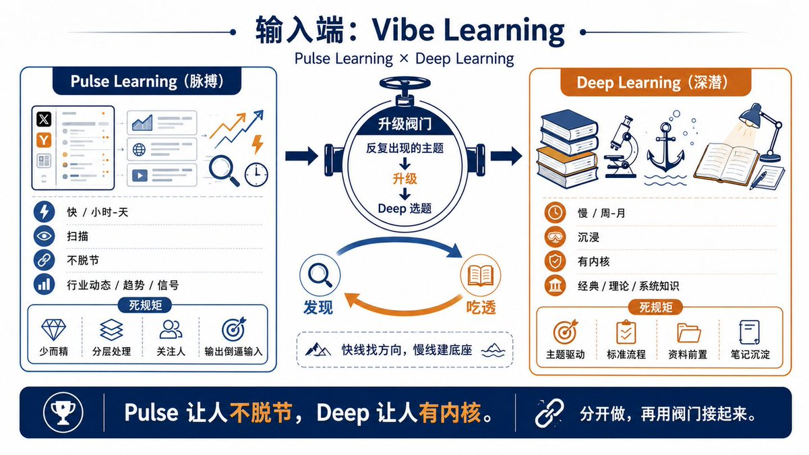

# 

# 三、输出端：写作是思考的验证器，做产品是需求的试金石

输入之后是输出，我管它叫Vibe Creating，我怎么影响世界。输出也分两种形态，一种是文字，Vibe Writing。一种是做出真东西，产品和代码，我叫它Vibe Coding。这两样不只是表达手段，它们各自还藏着一个更狠的功能。

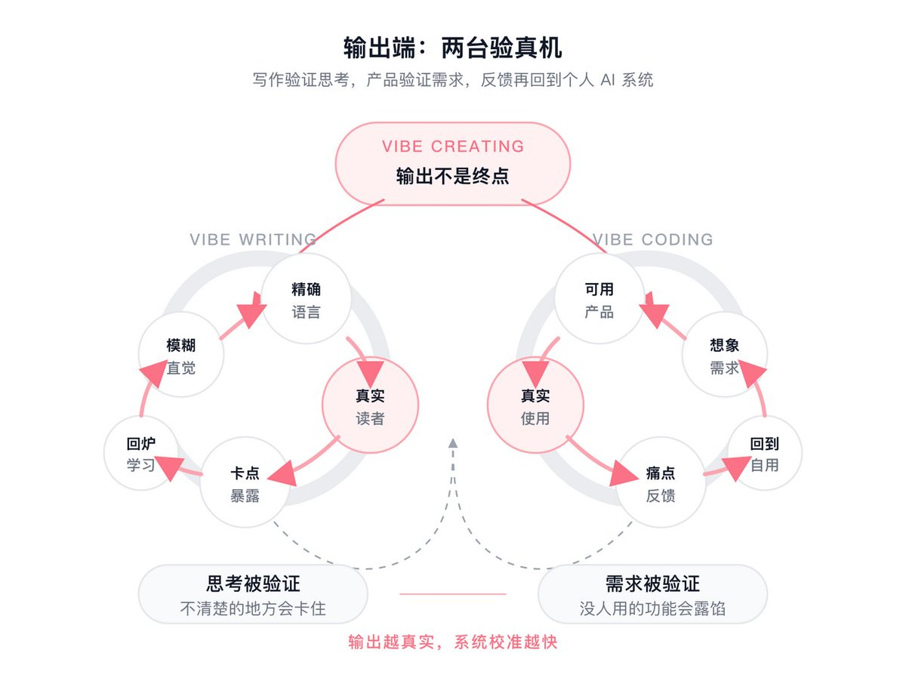

## 3.1 写作即思考，而且需要真实读者

先说写作。这里我得搬出Paul Graham那个观点，他在2022年那篇《Putting Ideas Into Words》里讲得很透：写作本身就是思考，而非思考之后的记录。

他有句话印象极深，大意是，一个从没就某个主题写过东西的人，对它就没有真正成型的想法。一个从不写作的人，对任何稍微复杂点的事，都没有完整成型的想法。这话听着狠，但我自己一写就服气。不写下来的时候，总以为自己懂了，一落到笔头，才发现有多少地方是糊的。写作逼着人把脑子里那团模糊的直觉，翻译成一句句精确的语言，这个翻译的过程，就是最硬的深度学习。

所以Vibe Writing里有一个很美的循环：学一阵，写出来，写的时候发现自己根本没懂，再回去学，再写，这次是真懂了。写作成了学习的验证器，这个循环一转起来，学习效率直接翻倍。

这套循环我天天在用。写的文章动辄两万字，每写一篇，过程几乎都是同一套：动笔前总以为这个话题已经懂了，写到某处就一定会卡住，那个卡点恰恰就是没真正想通的地方，逼着人回头重新查、重新想，想通了再往下写。写到最后，文章是给读者的，可收获最大的其实是作者本人，那些原先一知半解、似是而非的地方，被写作这把刀一处处剖开了。这篇讲个人系统的文章本身，就是这么逼出来的。

但这里还有一层，写作必须有真实的读者。自己写给自己看，太容易自欺，写得含糊也能骗过自己。一旦是写给别人看，你会被逼着把每句话都说清楚，因为含糊会被人一眼看穿。这也是为什么"公开写作"，也就是这两年很火的build in public，对我来说远不止是做营销，它本身就是认知质量的一道保证机制。我后面会讲到，这道机制还顺手解决了一个更大的问题。

## 3.2 有需求地做，而非埋头乱做

再说做产品。我把它叫Vibe Coding，但这个名字容易让人误会，得先纠正一下，做产品远不止写代码。一个产品，是从想清楚到底要替谁解决什么问题开始的，然后才轮到怎么设计它的样子、怎么把它实现出来、怎么让它真正落到用得上的人手里。写代码只是中间"实现"那一环，很多时候既不是最难的，也不是最关键的。

所以真正分出"做产品的人"和"只会写代码的人"的，是前面那个问题，你到底是在为一个真实的需求做事，还是在埋头堆功能。这一节的关键就压成一句话，有需求地做，埋头乱做是大忌。

需求有三个层次，可靠程度天差地别。最可靠的是自己的需求，自己天天用、天天骂的那种痛点。次一等是观察到的需求，是别人在抱怨、在挣扎的东西。最不可靠、也最容易翻车的，是想象出来的需求，你觉得"这世界上应该有这么个东西"，结果做出来没人真要。

最后这一类，我栽过结结实实的跟头。早些年自以为看准了一个方向，憋着一股劲做了个工具，做的时候还脑补了一大堆"用户肯定会喜欢"的功能，越做越兴奋。结果上线之后冷冷清清，没几个人用，连自己过一阵也不打开了。复盘时才想明白，那个需求从头到尾只活在想象里，没为任何一个真实的痛点做过事，包括自己的。这个坑亏掉的时间和心气，换来一条认死的规矩：先确认这东西自己每天都离不开，再谈别人要不要。自己都不肯天天用的东西，就别指望陌生人会用。

从自己的需求出发，在软件界有个很老的说法，叫"挠自己的痒处"（scratch your own itch）。Eric Raymond在1997年那篇《大教堂与集市》里，把它列为第一条经验法则，原话是，每一个好的软件作品，都始于挠开发者自己的痒处。他自己的fetchmail就是这么来的。与之配套的还有一个词，dogfooding，吃自己的狗粮，意思是先拿自己当用户，每天真用真骂。这个词在科技圈流行，主要是微软1988年内部推起来的，一个经理发邮件要求团队多用自家产品，标题就叫"吃我们自己的狗粮"。

Vibe OS本身就属于最可靠的那一类，它是我自己真正需要的东西，是为了解决我自己的痛点搭起来的。我的做法是，先做给自己用，把它用顺、用到每天离不开。如果发现对别人也有用，再开源。如果开源之后证明这是个普遍需求，再考虑能不能商业化。每往前走一步，脚下都踩着真实的反馈，不至于自嗨。

这套"先自用"的顺序，把我引到了整篇文章里我最想讲清楚的那条线。

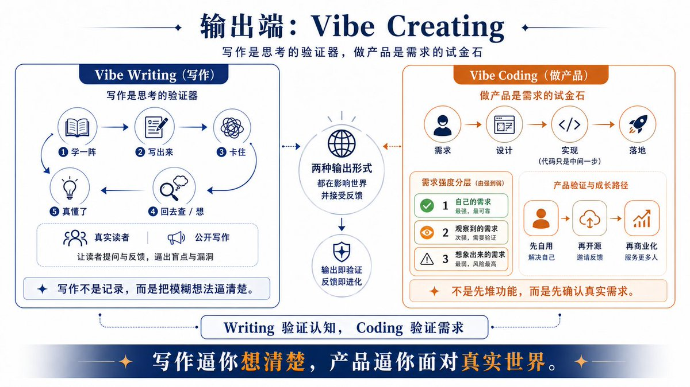

# 

# 四、由己及人：从个人系统到个人市场

前面讲的输入、输出、自用，攒到一起，会自然长出一条演化的路。这条路我把它叫做"由己及人"，它也是我这套系统区别于一般"生产力方法"的地方。

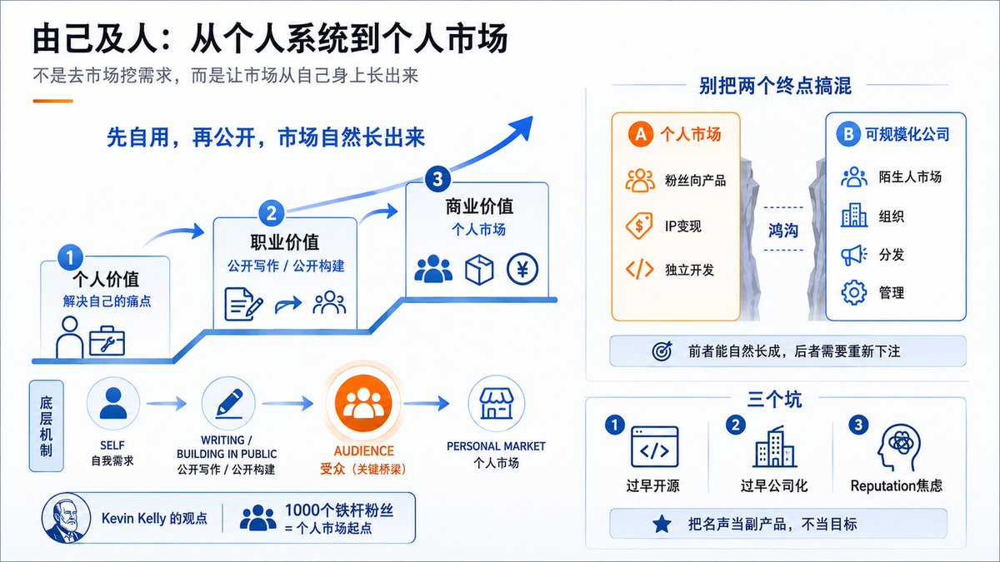

## 4.1 不去市场上挖需求，而是由己及人

传统做产品的思路，是先去市场上找需求，做一堆调研、问卷、用户访谈，挖空心思猜一群陌生人到底想要什么。这条路很多人走，但它的失败率高得吓人，因为你在猜，而猜是世界上最不靠谱的事。

由己及人是另一条路。先为自己解决一个真实的痛点，把东西做出来、用起来。再通过公开写作、公开构建，把一批跟你同类、痛点相通的人，慢慢聚到身边。等这批人也开始想要你做的这个东西时，市场就从你的受众里自然长出来了。你没有去市场上挖，是市场顺着你这个人长了出来。

我把整条路画成三层阶梯。最底下一层是个人价值，解决我自己的问题。中间一层是职业价值，通过公开过程，建立起声誉和一批受众。最上面一层是商业价值，由己及人，把它做成一个个人市场。大多数人停在第一层，少数人能爬到第二层，能打通三层的，凤毛麟角。

## 4.2 受众，就是那座别人没有的桥

这条路成立的关键，藏在中间那层，受众。它正好补上了传统路线最缺的一块。

传统路线里，你做完一个东西，要捧着它走进一个面目模糊的大市场，赌"会不会有陌生人也要"。而由己及人这条路不一样，你先养出了一批因为认同你、跟你是同一类人，才主动聚过来的受众。这批人是被你自己筛选过的，他们的痛点天然和你重叠。所以"我要的东西"等于"他们要的东西"，这个等式在你的受众圈子里，成立的概率高得多。这就是它和盲目找市场最根本的区别。

这件事凯文·凯利（Kevin Kelly）在2008年那篇《一千个铁杆粉丝》里算过一笔很经典的账。他说一个创作者根本不需要上百万的受众，只要大约一千个铁杆粉丝，也就是愿意买你做的任何东西的人。假如每个铁杆粉一年愿意为你花大约一百美元，一千个人就是一年十万美元，足够养活一个创作者了。

那这一千个人是怎么聚起来的？靠的还是公开写作。你把自己怎么想一个问题、怎么踩一个坑、怎么一点点把东西做出来，老老实实地写出来、发出去。大多数人划走了，但总有一小撮人，看着看着觉得"这人想问题的方式跟我对路"，于是留了下来，开始追你。日积月累，这一小撮人就攒成了你的受众。这个过程慢，急不来，但它筛出来的人质量极高，因为他们是冲着你这个人、你这套思考方式来的，而非被一条爆款标题骗来的流量。所以公开写作这件事，表面上在产出内容，底下其实在做两件更重要的事，一是逼自己把思考想清楚，二是不动声色地，把那一千个跟你同频的人，一个一个地筛出来。

我前面埋的那个钩子，在这里收。公开写作不只是认知的验证器，它还是养这一千个铁杆粉丝的唯一办法。你持续地把自己的思考、自己的踩坑、自己的过程公开出来，认同你的人会一点点聚过来。等你要做点东西的时候，对面坐着的是一群已经信你的人，市场那张冷脸你压根不用去面对。写作这一个动作，同时喂养了你的认知和你的市场，这是它最划算的地方。

## 4.3 三个有名有姓有数据的样本

这条路不是我拍脑袋想的，已经有人把它走通了，而且走得很漂亮。给你三个有名有姓有数字的样本。

最硬的一个是Pieter Levels，X上那个 @levelsio。他是个荷兰的独立开发者，自学成才，一个人干活，不融资，不招人，前后做过四十多个项目。他的标签全是真的，连他自己都说，"我基本不融资，不用VC的钱，所有事我自己做"。

他做东西的方式就是典型的挠自己痒处。他自己是数字游民，到处飞，就做了一个帮数字游民找城市的Nomad List。他要找远程工作，就做了RemoteOK。值得说的是，这些命中的产品，是从一长串失败里熬出来的，他公开讲过自己折腾过的项目里七十来个都没成。他早年还给自己立过一个出名的flag，叫"十二个月做十二个创业项目"，逼着自己一个月上线一个，用数量去换那个真正能跑通的。这种打法的底气，正是不融资、不招人，所以试错成本极低，死掉一个不心疼，接着做下一个。

到2025年，他这一堆产品加起来的年收入大约三百万美元，其中最大的单品是一个叫PhotoAI的AI修图工具，2023年2月上线，到2025年中月收入超过十三万美元，占了他收入的七成左右。他还上过Lex Fridman的播客，是独立开发者这个群体如今的标杆人物。这些数字是他自己常年公开晒出来的，会随时点波动，但量级是实打实的。一个人，靠自己用得上的工具，做到这个体量。

第二个是Arvid Kahl。他和搭档两个人，没有一个雇员，做了一个帮在线英语老师写课后反馈的小工具FeedbackPanda，这个痛点来自他当老师的女友。他们把它做到了月收入五万五千美元，然后在2019年，上线两年内就把它卖掉了，价格是个没披露的七位数。卖掉之后，他没停，而是把整个创业过程build in public地写出来、教出来，出了《Zero to Sold》《The Embedded Entrepreneur》两本书，把写作和教学又做成了一个新的个人市场。这是一个"个人项目，卖出，个人IP，再到个人市场"的完整闭环。

第三个对照最戏剧。Daniel Vassallo，2019年从亚马逊离职，放弃了大约五十一万美元的年薪，转头去做他所谓的"小赌注"组合。所谓小赌注，是他的一整套哲学，与其押上身家性命去赌一个大的、要么暴富要么归零的项目，不如同时下很多个互不相关的小赌注，单个失败了无所谓，但只要有一两个跑出来，整体期望就是正的。这套思路本身，就和前面那种"先自用、低成本试错"的打法一脉相承。

他自己就是这么做的。一门讲怎么用X的视频课，累计赚了大约四十万美元。他2021年底发起的Small Bets社群，到2024年初已经超过四千五百名成员、年收入过百万美元，最后在2025年4月，以三百六十万美元的价格卖给了Gumroad，自己继续运营。从一份让人羡慕的高薪打工，到亲手长出一个属于自己的个人市场，这个对照足够清楚。

这三个人路径各异，但底层是同一套逻辑：从自己的真实需求出发，公开地做、公开地写，让认同自己的人聚过来，再把市场从这群人里长出来。

## 4.4 别把两个终点搞混

这里我必须踩一下刹车，讲一个我自己一开始没分清、后来才想明白的边界，因为它关系到这条路到底能带你到哪。

由己及人这条路，能稳稳地把你带到一个终点，叫个人市场。也就是粉丝向的产品、IP变现、独立开发者那种规模。这个终点很真实、很可观，很多人这辈子做到这一步，已经活得相当自由、相当爽了。上面那三个样本，落点基本都在这里。

但它和另一个东西，常被混为一谈，那就是一家需要超越你本人去scale的公司。这两者之间隔着一道真正的鸿沟。个人市场的天花板，是你受众的规模加上你个人的带宽。而一家真正的公司，迟早要服务的人，会远远超出"跟你同类的那批粉丝"。到那时候，你会重新撞上分发、撞上和陌生人达成产品市场匹配、撞上组织和管理这些全新的难题。这些难题，没有一个是"给个人系统加个权限模块"能解决的，它们是另一个游戏。

所以我现在很清楚，由己及人能自然把我带到个人市场，这是这条路的顺势而为。至于要不要再往上，跨过那道鸿沟去做一家公司，那是一个独立的、需要重新下注的决定，不是同一条路的自然延伸。

把这两个终点分清楚，不只是个概念游戏，它能实实在在帮你避开两种痛苦。一种是，明明在个人市场这一层活得很滋润，却因为听多了"做大做强"的叙事，硬要把一个本质上靠你个人魅力运转的东西，往一家需要标准化、需要团队、需要规模化分发的公司上掰，结果把原本最舒服的状态搞拧巴了，甚至赔进去。另一种是反过来，做到了个人市场这一步，本该是值得骄傲的成绩，却因为没成为"一家真正的公司"，就觉得自己失败了。这两种痛苦，都源于把两个不同的终点当成了同一条直线上的高低。绝大多数个人系统，最好的归宿就是一直当个好用的个人系统，或者长成一个滋润的个人市场，这一点都不丢人。

## 4.5 这条路上我替你踩过的三个坑

由己及人听起来很顺，但走起来有三个坑特别深，我自己一个个都掉过，专门拎出来给你。

第一个坑，为了开源而开源。很多人一上手就想着"这要给别人用"，于是早早花大把时间去做漂亮的落地页、写详尽的文档、抠各种边缘情况。这是本末倒置，那个阶段根本没有别人，你是在给一个不存在的用户打工。正确的姿势是先自用，前三到六个月就当作只有自己一个用户，等你每天都离不开它了，再去想开源的事。

第二个坑，过早惦记"公司系统"。一个东西刚有点雏形，人就开始为想象中那个有几百万用户的公司版本做架构设计，加各种现在根本用不上的扩展性。结果是把简单的事做复杂，自己先把自己拖垮。正确的姿势是前两年完全为自己做，做到顺手、做到成熟，再回头看哪些模块碰巧有普适性，那时候再谈扩展不迟。

第三个坑，reputation焦虑。做事的时候脑子里总有个声音在问"这个好不好发出去""别人会怎么看我"，于是动作开始变形，做的不再是自己真正需要的东西，而是看起来体面、好晒的东西。这个坑最隐蔽，因为它伪装成上进。正确的姿势是把reputation当成副产品，而非目标，你认认真真把自己的问题解决好、把过程老实地公开出来，名声会自己长出来，你越是盯着它、追着它，它反而越躲着你。

## 4.6 黄金公式，和那条动机的分水岭

把前面这些攒到一起，能压成一个我反复回去对照的公式：真实的痛点，加上持续的使用，加上公开的过程，等于一种会复利滚雪球的声誉。

三个因子缺一不可。真实痛点保证你做的是真有人要解决的事，而非凭空想象的需求。持续使用，也就是前面说的dogfooding，是最硬的信誉，一个连作者自己都不天天用的东西，凭什么让别人信。公开过程，也就是build in public，是这个时代最划算的个人品牌方式，你把做的过程坦诚地摊开，本身就在持续地积累信任。三者一旦同时成立，时间会站在你这边，越往后越省力。

但这一切的底下，还压着一条更根本的分水岭，动机。一个人做这件事，到底是因为"我想做出一个让自己都觉得骄傲的东西"，还是因为"我想让别人觉得我很厉害"，这两种动机走的距离天差地别。前一种人，在没有任何人看的时候，照样会埋头写代码、改细节，因为他取悦的是自己。后一种人，一旦反馈来得不够快、点赞不够多，动力立刻就垮了。我自己的体会是，这条动机的分水岭，几乎决定了一个个人项目能不能活过第一年。能熬过最初那段无人问津的冷板凳的，都是为自己做的人。

# 五、怎么落地：日拱一卒，先喂数据再长智能

哲学讲完了，得落到地上。一套再漂亮的系统，做不出来也是零。我在执行上的整个心法，可以浓缩成四个字，日拱一卒。

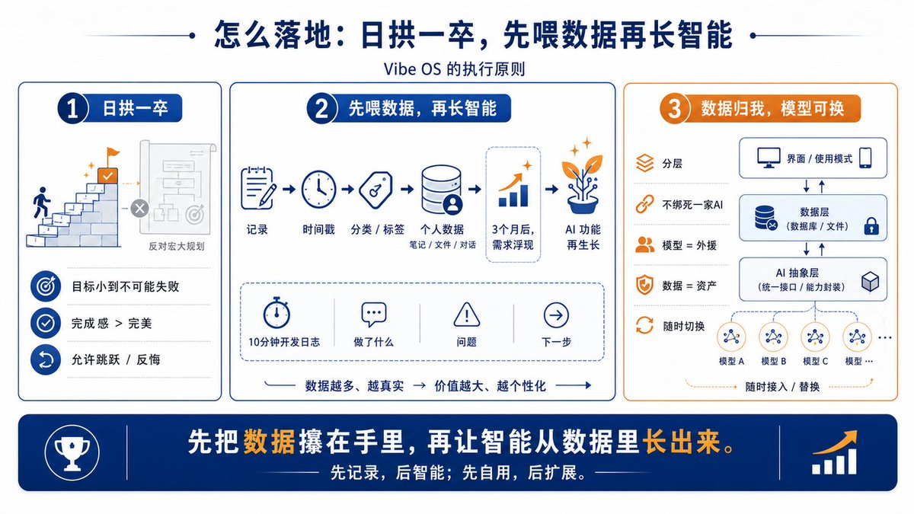

## 5.1 反对宏大规划

我见过太多人被宏大蓝图拖垮，包括早期的我自己。花两周写一份详尽的规划文档，把架构、路线图、里程碑画得漂漂亮亮，结果第三周，动力就泄光了，文档躺在那里再没打开过。我自己最惨的一次，给一个个人项目写过一份几十页的规划，架构图、数据库设计、三期路线图，做得像模像样，最后那份文档成了整个项目唯一完成的东西，产品一行真正的代码都没写出来就黄了。规划带来的那种"我已经在做事了"的幻觉，是最骗人的。

真正能把事做成的人，我观察下来，几乎都是从"今天就做一点点"开始的。所以日拱一卒对我来说有三条很具体的纪律。

第一条，每天那"一卒"要小到不可能失败。错误的目标是"今天把登录系统搭完"，正确的目标是"今天把代码里那个写死的token改成环境变量"。小到你没有任何理由完不成。第二条，完成感比完美更重要。每天结束时能对自己说一句"我今天推进了一点点"，比憋一个礼拜想做出个完美模块要强得多，因为动力是靠完成感一口一口喂大的。第三条，允许跳跃和反悔。今天想写代码就写代码，明天想学东西就学东西，个人项目最大的奢侈，就是没有老板，不用对一份僵硬的计划负责。

## 5.2 先喂养数据，再生长智能

那么这套系统的第一个版本，到底该做什么？答案可能有点反常识：第一版不要做任何"智能"功能，只做一件最笨的事，记录。

就是一个最简单的输入框，随时随地往里扔东西，想法、任务、读到的、学到的，系统只干一件事，给它打上时间戳存下来，顺手分个类、打个标签。就这么简单。

为什么从这么笨的地方起步？三个原因。第一，数据是所有AI功能的地基，没有数据，AI模型再强也使不上劲，你得先有自己的东西喂给它。第二，这个功能最容易做，一个周末就能搞定，完成感立马就来，符合日拱一卒。第三，也是最关键的，攒上三个月的数据，真正的需求会自己从这堆数据里浮出来，你会清清楚楚看到自己到底高频在记什么、缺什么工具，那时候再做智能功能，就不是凭空想象了。先喂养数据，再生长智能，这个顺序不能反。

配合这个，每天还留十分钟，写一条最简单的开发日志，记下今天做了什么、遇到什么问题、怎么解决的、下一步想干嘛。这条日志的价值是多重的。对系统，它是将来重构时的开发档案。对自己，它是未来博客、推文乃至一本书的原材料，又接回了前面"公开写作"那条线。将来如果真要讲创业故事，它就是最真实的"创业前史"。甚至对系统里的AI本身，它都是一份未来可以喂进去的训练数据。一举数得。

## 5.3 把数据攥在自己手里，让模型随时可换

落地时还有一条工程上的纪律，我把它单列出来，因为它直接关系到这套系统是不是真正属于我。原则是，整套系统要分层，而且绝不把自己绑死在某一家AI上。

道理很硬。模型一定会变，今天Claude最强，过几个月可能就是别家了，不能让自己的系统跟着某一家的兴衰沉浮。所以调用AI这件事，要单独抽成一层，通过抽象层来统一调，哪天想从一个模型换到另一个，只动这一层，上面的东西纹丝不动。而所有的对话、想法、笔记，全部沉淀在自己的数据库和文件系统里。模型是可以随时替换的外援，数据才是真正属于你、谁也拿不走的资产。系统的其它部分，界面、模式、存储，也都照这个思路分层，换任何一层都不影响别的层。这样这套系统才经得起时间，而不是绑在某一个一年后可能就过时的工具上。

# 六、Vibe 到底是什么：让我保持"人"的那套设计

写到这里，得回答一个我一直绕着没正面讲的问题，为什么这套系统里所有东西都叫Vibe，Vibe Learning、Vibe Writing、Vibe Coding。这个命名不只是为了整齐。

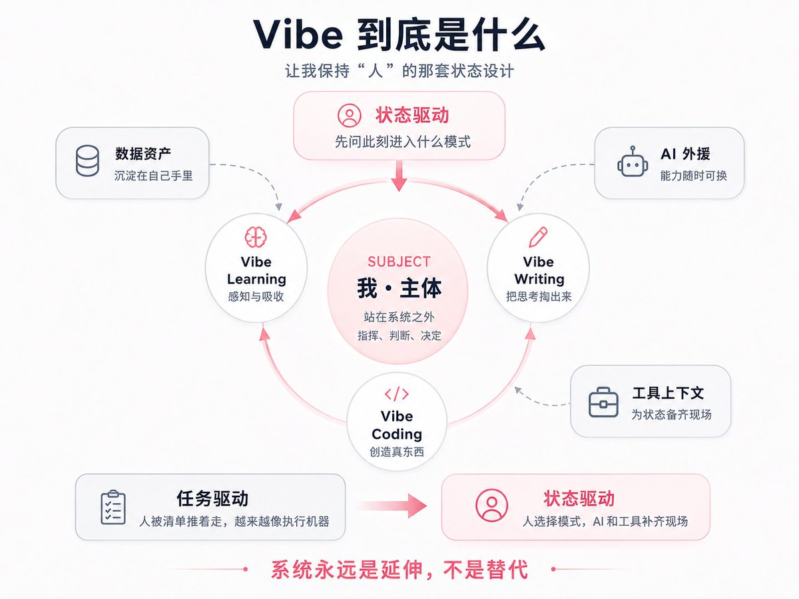

## 6.1 状态驱动，而非任务驱动

Vibe这个词，看重的是它背后那层意思，状态。这套系统关心的核心，是此刻处在什么状态、什么模式里，而一张任务清单只是末节。

传统的生产力工具，全是任务驱动的，列清单、打勾、看进度条，把人变成一台对着待办列表执行的机器。Vibe OS想做的是另一件事，状态驱动。人进入某一个状态，比如"现在想创造点东西"，系统就为这个状态把一切准备好，然后人和AI配合着，流动地、不拧巴地把事做了。

所以Vibe Coding，对我来说是进入"创造产品"的那个状态，而非逼自己完成写代码这个任务。Vibe Writing，是进入"把思考往外掏"的状态。Vibe Learning，是进入"感知和吸收"的状态。

这个差别看着微妙，实则是两种截然不同的工作哲学。我自己对着待办清单硬干过很多年，那种感觉是被一条条任务推着走，做完一条划掉一条，进度条在涨，人却越来越像一台执行机器，越用越累、越用越空。后来把入口从"任务"换成"状态"，做事的体感完全变了。不再问"今天清单上还剩几项没打勾"，而是问"现在适合进入哪个模式"，是想创造、想吸收、还是想表达。进了那个模式，系统就把对应的材料、工具、上下文都备齐，人和AI配合着，事情是流出来的，不是逼出来的。

任务驱动把人压成执行机器，状态驱动让我始终是那个流动着、做主的人。绕了一大圈，又回到了第一条原则，这套系统所有的设计，最终都是为了让我在AI的洪流里，还能稳稳地保持"人"的状态。

## 6.2 这套系统到底是什么

最后，回到最根本的那个问题：我费这么大劲搭的这套东西，说到底是什么？

它是一个认真思考的人，在AI时代为自己搭的一台"思维操作系统"。它让人在信息过载、能力随时可外包的洪流里，还能守住"我是谁"。它的整个设计，是既要榨干AI的力量，又始终不让AI替代掉我这个主体。

如果要把这部宪法压成几句以后能回来对照的话，就是这么三条。第一，我永远站在系统之外，它是工具，我才是主体。第二，日拱一卒，先自用、后开源，做这件事的动机是想做一个让自己骄傲的东西，而非让别人觉得我厉害。第三，这套系统可以无限演化、随时重构，但它的身份永远是工具，我的身份永远是人。

说句诚实话，这套系统现在还很糙，远没成型。它就像一座永远在长的花园，不是一栋一次盖好的房子。需求会变，工具生态每年都在翻新，自己对"什么是好系统"的理解也在加深。所以索性允许它一直演化、一直重构、允许它有自己的历史。但无论它怎么变，那条最底下的线不会动：它永远是我的延伸，当不了我的替代。

回到开头那个失控感。这套系统两年下来，并没有让人变得多高效、多高产，它真正给的，是另一样东西，年底再回头时，能清清楚楚说出自己这一年想通了什么、攒下了什么、往哪个方向走了几步。那种空心的忙碌，被一点点换成了有方向、有积累的踏实。在一个越来越容易把判断、把方向、把"我到底要什么"都顺手交出去的时代，能守住"我还是我"这条线，本身就是一件值得日拱一卒、慢慢去做的事。

# 七、结尾：一张图，和怎么用AI把它搭起来

前面把原则一条条拆开了。如果这些你只想带走一张图，和一条能上手的路径，那就是这最后一节。

## 7.1 整套系统，浓缩成一张图

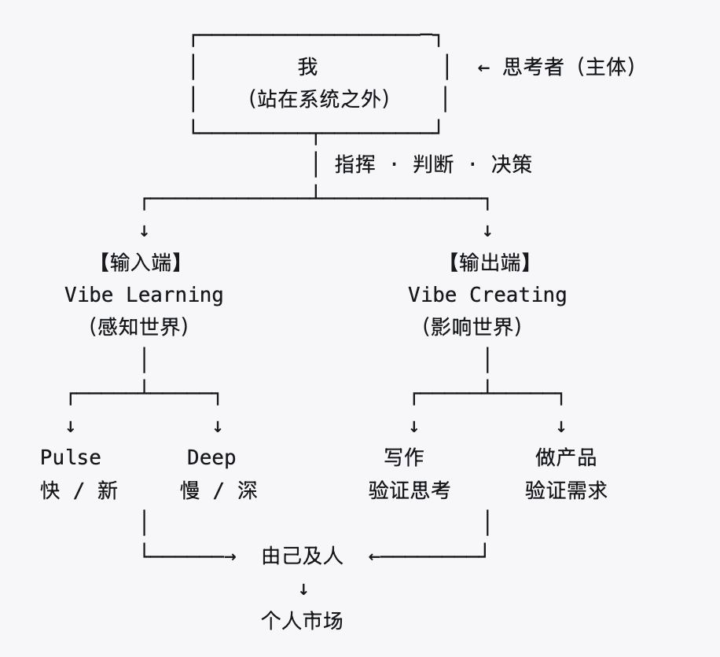

这张图最该记住的，是最上面那个"我"，它在所有框的外面，站在系统之外。往下分两端，左边输入端用Pulse和Deep两条线感知世界，右边输出端用写作和做产品两件事影响世界。输出长期积累，由己及人，慢慢长成一个属于自己的个人市场。整张图从头到尾只有一个主语，就是站在最顶上、谁也替代不了的那个"我"。

## 7.2 怎么用AI一步步把它搭起来

光有哲学不顶用，真要落地，得说清楚AI在每个环节具体干什么。把系统横着切成五层，从下往上看最顺：

┌─────────────────────────────────┐
│  界面层（网页 / 手机 / 命令行）      │  ← 可以有多个
├──────────────────────────────────┤
│  模式层（Vibe Learning / Creating）│  ← 各种 Vibe 状态
├──────────────────────────────────┤
│  核心层（任务、记忆、上下文）        │  ← 系统的大脑
├──────────────────────────────────┤
│  工具层（调 AI、调外部服务）         │  ← 抽象层，模型可换
├──────────────────────────────────┤
│  数据层（笔记、日志、知识库）        │  ← 你的个人资产
└─────────────────────────────────┘

最底下的数据层，是你自己的笔记、日志、知识库，这是真正属于你、谁也拿不走的资产。往上的工具层，通过一个抽象层去调各家AI，今天用Claude、明天换别家，只动这一层。再往上的核心层是系统的大脑，管任务、记忆和上下文。最上面两层，是各种Vibe模式和你实际在用的界面。

搭的顺序，照前面那条"先喂数据，再长智能"来，分三步走。

第一步，先把数据层立起来。做一个最笨的记录入口，让AI顺手给你随手扔进去的碎片自动打标签、归类。这一步一个周末就能搞定，却是后面一切的地基。

第二步，数据攒厚了，给每个端口接上AI的具体活。输入端，让AI把十几个信源的更新压成一份摘要、按你的兴趣排好序，这是Pulse。让AI当陪练，你读一本书，它不停追问你核心论点在哪、哪里前后矛盾，逼你想透，这是Deep。输出端，让AI当最毒的审稿人，专挑你的逻辑漏洞、帮你找反例，但观点得你自己先成形，这是写作。让AI写实现代码，你只管需求和判断，这是做产品。

第三步，等数据够厚，用语义检索（也就是常说的RAG）让AI在你自己的笔记库里帮你串线索。定期回顾时，它能翻出连你自己都忘了的东西，告诉你这几个月其实一直在反复琢磨同一个问题。走到这一步，系统才真正开始"长智能"。

这套搭法，技术上没什么难的，难的是守住那条贯穿全文的边界：每一层都让AI去干它最擅长的脏活累活，可"为什么做、往哪走"那个方向盘，从头到尾攥在自己手里。AI是发动机，方向盘是你，这是这套系统从第一行代码到最后一个功能，唯一不变的那条规矩。

## 作者其它文章（选）

- [NFT的叙事是如何崩塌的](https://x.com/snowboat84/status/2067756975069516170)

- [什么是耗散结构理论？它和AI有关系吗？](https://x.com/snowboat84/status/2067399314843000842)

- [什么是具身智能？它跟 AI 的关系是什么？](https://x.com/snowboat84/status/2067032626821747178)

- [长篇分析：SpaceX未来的展望](https://x.com/snowboat84/status/2066674353648046515)

- [Vibe Coding把我系统搞崩了，我对此的总结和心得](https://x.com/snowboat84/status/2065586279010742687)

- [人工智能的工程全景（中）：推理，后训练，对齐和安全](https://x.com/snowboat84/status/2065215177029787705)

- [大语言模型的商业痛点](https://x.com/snowboat84/status/2064858487675670625)

- [什么是控制论？控制论是AI的上辈子吗？](https://x.com/snowboat84/status/2064496706042069340)

- [什么是世界模型？一个正在被争夺的概念](https://x.com/snowboat84/status/2064135804092645410)

- [美国的犹太人和华人分别抢到了什么资源？详细分析](https://x.com/snowboat84/status/2063049247805837815)

- [一篇文章讲清楚美国的移民系统](https://x.com/snowboat84/status/2057980486501433383)

- [一文讲清楚美国医疗系统](https://x.com/snowboat84/status/2055081426744422697)

- [细说美国的华人老钱家族](https://x.com/snowboat84/status/2062326581776011623)

- [一篇文章看懂美国教育全生态](https://x.com/snowboat84/status/2054359249917210633)

- [教宗良十四世论人工智能（精华版）](https://x.com/snowboat84/status/2059434342745866391)

- [祖父积分学概论](https://x.com/snowboat84/status/2056533111983493136)

- [Vibe Reading：AI 时代读书的系统化方法](https://x.com/snowboat84/status/2050008577511973253)

- [美国税收制度完全指南](https://x.com/snowboat84/status/2060511915617779821)

- [一文看懂美国的法律系统](https://x.com/snowboat84/status/2059795010330251568)

### 🖼️ Attached Media

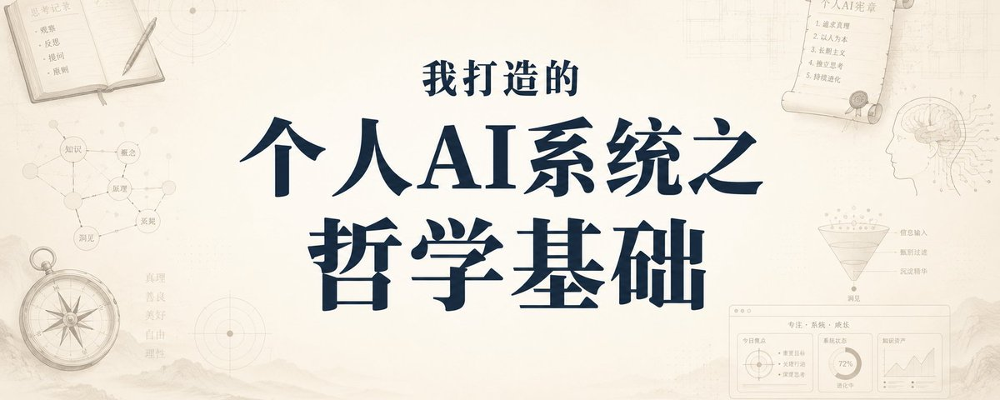

## 💬 Replies

### 1 @vivilinsv (Vivi)

*Sat Jun 20 00:45:58 +0000 2026*

@snowboat84 博士的思维就是缜密而周到！我要让我的AI看看，然后帮我搭建系统。谢谢分享！

### 2 @snowboat84 (snowboat) (Author)

*Sat Jun 20 00:47:42 +0000 2026*

@vivilinsv 谢谢捧场 😊 让我们一起搭建个人AI系统！

### 3 @cha747888 (黑澀會觀察)

*Sat Jun 20 01:59:27 +0000 2026*

@snowboat84 我有个小感悟，好比画画，总体结构不成比例，里面的线条再美和颜色再好，框架和主题都丢失了。主体必须是人来构建，包括文学创作中的细节和情感，机器无法更细致的展开，是漂浮而空洞的！

### 4 @snowboat84 (snowboat) (Author)

*Sat Jun 20 03:34:13 +0000 2026*

@cha747888 很好的比喻 👍🏻👍🏻👍🏻

### 5 @robotbird01 (robotbird)

*Sat Jun 20 06:44:47 +0000 2026*

@snowboat84 A 社的首席产品官就是哲学研究人员

哲学在 AI 时代感觉要复兴了

### 6 @snowboat84 (snowboat) (Author)

*Sat Jun 20 18:05:11 +0000 2026*

@PMAndDog Mike Krieger?

### 7 @pluslee (CHLee)

*Sat Jun 20 02:08:46 +0000 2026*

@snowboat84 四篇文章看的出來寫得很用心 價值很高,必追蹤
點出了人如何在AI時代,是利用他,而不是被他帶走, 人還是要保持獨立思考 無論在學習,閱讀,或是寫作
對我這個AI開發人員, 能夠靜下來思考一下是不是過度使用AI了

### 8 @snowboat84 (snowboat) (Author)

*Sat Jun 20 03:32:31 +0000 2026*

@pluslee 谢谢支持！是的，我觉得人最重要的是独立思考，最重要的判断和原创力，都应该由人牢牢把控。

### 9 @0x_adong (adong)

*Sat Jun 20 01:29:49 +0000 2026*

@snowboat84 自己搭AI，比跟项目方玩实在。

### 10 @0x_adong (adong)

*Sat Jun 20 01:28:59 +0000 2026*

@snowboat84 博士的思维系统不一定适合你的资金体量。

### 11 @tanzhengmc97 (TZ)

*Sat Jun 20 00:28:34 +0000 2026*

@snowboat84 哲学很多人认为没用，我认为其实很有用

