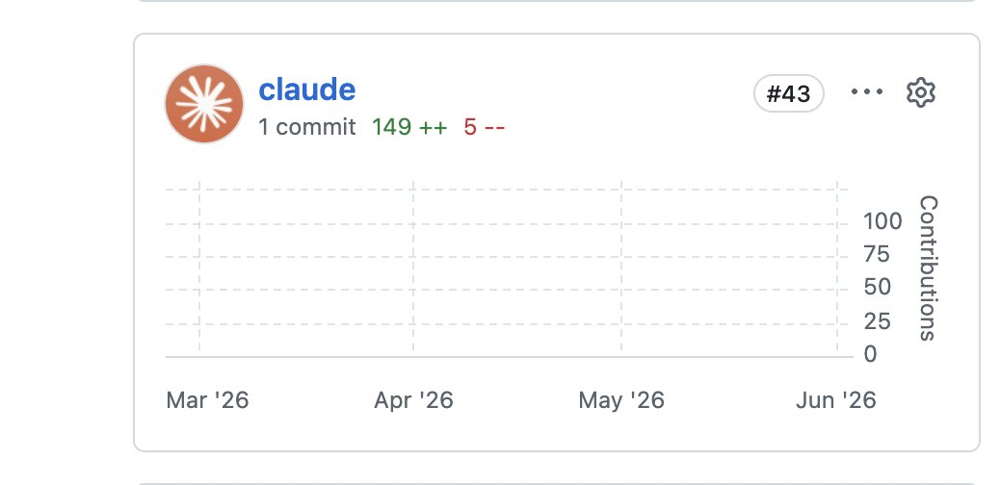

很难想象 pi 这个项目 4429 次 commit，claude 只 commit 了一次

在当今这个 AI 时代，他们还在坚持古法编程

不得不说信赖度更增加 10 分 

## 💬 Replies

### 1 @aiandcloud (Jintao Zhang 张晋涛)

*Sat Jun 06 12:04:25 +0000 2026*

@buaaxhm 🤣 能自举了，就用 pi 自身了啊

### 2 @supezen (ZEN)

*Sun Jun 07 04:10:16 +0000 2026*

@buaaxhm 可以关闭署名的，我新项目全部关闭了

### 3 @adelbucetta (Adel Bucetta)

*Sun Jun 07 01:40:34 +0000 2026*

@buaaxhm that says nothing about why those numbers matter in the grand scheme of ai development

### 4 @IIInoki (AI𝕚𝕟𝕠𝕜𝕚)

*Sat Jun 06 11:22:12 +0000 2026*

@buaaxhm prompt 加一条：DO NOT ADD co-authored-by Claude

### 5 @eternityspring (烁皓)

*Sat Jun 06 12:51:18 +0000 2026*

@buaaxhm 也可能是AI写，自己手动push呢

### 6 @rover_tang (Rover路华)

*Sat Jun 06 16:13:16 +0000 2026*

@buaaxhm 那一次提交应该是第一次，知道 CC 会自动加上 co-author。

后面立马把配置关闭而已。

### 7 @QS6868 (Sunny)

*Sat Jun 06 22:35:55 +0000 2026*

@buaaxhm 可能是全程人工盯着，不完全是古法编程，只是每次提交都是手动让他们人工发起的

### 8 @pollux_tw (Paul)

*Sat Jun 06 13:40:13 +0000 2026*

@buaaxhm 亲，claude可以使用用户的身份commit

### 9 @ninthbit_ai (Kieran Zhang)

*Sat Jun 06 13:21:04 +0000 2026*

@buaaxhm 第一次忘记关 co-author 了

### 10 @icepeak486 (ice)

*Sat Jun 06 14:18:37 +0000 2026*

@buaaxhm squash merge啊，只显示一次 commit

### 11 @mike_chong_zh (迈克 Mike Chong)

*Sat Jun 06 13:08:53 +0000 2026*

@buaaxhm codex 写的啊

### 12 @noobnooc (Nooc)

*Sat Jun 06 14:40:15 +0000 2026*

@buaaxhm 其实只是换 codex 了

### 13 @ddlady342982 (大赌翔平)

*Sat Jun 06 14:28:59 +0000 2026*

@buaaxhm 很严格的，我试过。作者还是比较有品味的，一直坚持简约的这个风格。宁缺毋滥

### 14 @shirumesu (希露梅斯)

*Sat Jun 06 16:20:47 +0000 2026*

@buaaxhm cc纯恶心人，不去改settings默认进coauthor，然后又可以宣传自己在git占使用率前列了全部都是用claude写的

### 15 @Hsn289744493 (HSn)

*Sat Jun 06 12:40:51 +0000 2026*

@buaaxhm 其实第一次忘关了

### 16 @lpdink (lpdink)

*Sat Jun 06 15:00:34 +0000 2026*

@buaaxhm pi肯定是自己写自己啊，作者的初心就是觉得claude魔法太多了，很不满意

### 17 @DeepGrey449866 (Fishowo)

*Sat Jun 06 14:32:34 +0000 2026*

@buaaxhm 骗你的...几天朋友给我聊pi 的 acp 不少是他修的，你猜他用没用claude 和 codex

### 18 @terryaidev (鸽鸽鸽鸽德🐧)

*Sat Jun 06 23:34:12 +0000 2026*

@buaaxhm 那个 commit message feat():一看就是 codex 之类的写的...

### 19 @CuriousCat1sj (curiouscat1sj)

*Sat Jun 06 16:08:25 +0000 2026*

@buaaxhm claude显眼包罢了，就算不用pi开发，codex总跑不掉，搞agent开发的，那来的古法…

### 20 @lizliz404 (LizLiz)

*Sun Jun 07 07:48:10 +0000 2026*

@buaaxhm 这是什么“古法编程更香”的老辈子情节？手洗比机洗更干净？

### 21 @hotpotjupyter (火锅底料)

*Sat Jun 06 14:20:28 +0000 2026*

@buaaxhm ???

### 22 @An_yhl (晚晚)

*Sat Jun 06 15:49:21 +0000 2026*

@buaaxhm 这年头全手搓反而像稀有品质

### 23 @Lihua919 (Lihua)

*Sat Jun 06 14:17:16 +0000 2026*

@buaaxhm 我经常Codex写，自己push

### 24 @Zerenjie (0xSolaren)

*Sat Jun 06 14:17:19 +0000 2026*

@buaaxhm pi可以自己写嘛

### 25 @Rotainnala (Mason)

*Sat Jun 06 18:17:50 +0000 2026*

@buaaxhm 也可以自己手动commit啊。这么大的项目完全不用ai我肯定是不相信。至少可以保证的是AI生成的代码都是人类审查过的。

### 26 @1997yrrr (Yitong chen)

*Sat Jun 06 14:44:46 +0000 2026*

@buaaxhm Codex

### 27 @Alexoooh2026 (Alexanderontheway)

*Sun Jun 07 02:22:23 +0000 2026*

@buaaxhm 哈哈哈哈哈哈

### 28 @geminixiang (GeminiXiang)

*Sat Jun 06 23:21:08 +0000 2026*

@buaaxhm 前期 Claude code，現在是 Pi + Gpt5.5 是主要開發工具

### 29 @3ndmare (Endmare)

*Sat Jun 06 18:00:49 +0000 2026*

@buaaxhm 不可能古法编程的吧 但看作者的各种 blog 和 post 对大模型和 agent 使用还是非常审慎的

### 30 @hankyu678 (Hank Lucky)

*Sun Jun 07 03:39:51 +0000 2026*

@buaaxhm 和 claude 说：“记住，commit 时禁止添加 co-author”

### 31 @kood520 (东逆)

*Sun Jun 07 05:37:47 +0000 2026*

@buaaxhm 也可能只是把 co-author 关了，仓库记录现在也得带点侦探思维

### 32 @Novahyphenz (Gyro Sandwich)

*Sat Jun 06 15:30:51 +0000 2026*

@buaaxhm 非的要让claude来push？

### 33 @Benjaminliang_1 (Benjamin liang)

*Sun Jun 07 05:57:01 +0000 2026*

@buaaxhm 因为用 pi commit 不会署名

### 34 @caspian_ji (Caspian and 2,684 others)

*Sat Jun 06 18:25:48 +0000 2026*

@buaaxhm 你是真傻 还是假的

### 35 @limbo023 (Hillusion(蓝v互关))

*Sat Jun 06 15:05:52 +0000 2026*

@buaaxhm 很难想象在当今这个AI时代，还有人没用过claude和codex做git管理，才能看到这种发言😅

### 36 @fankexNova (af hotflow)

*Sun Jun 07 02:19:04 +0000 2026*

@buaaxhm 这家的作者提倡手动管理上下文，基本上肯定是有review的

