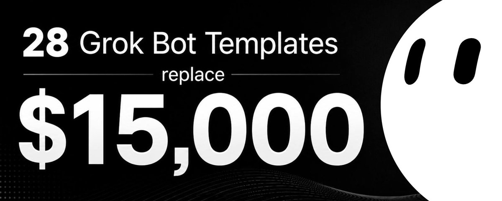

# 📰 I tested every Grok Bot template that exists. 28 of them saved me $15k/year.

I tested every Grok Bot template that exists. 28 of them saved me $15k/year.

Subscription tracking, code review, content clipping, competitor research, inbox management and personal assistants.

One $20 subscription does not look expensive. But when your stack grows to 10–15 tools, the total becomes ridiculous. More than $15,000 a year for tools you barely remember signing up for? That is crazy.

> Most readers of this article will forget to save it and end up losing this gem.

Here is the list. Be sure to save it so you don't lose money!

---

# SAVES YOU MONEY

- Reaper Audits your subscriptions, meetings and recurring workflows, then makes the case for killing each one. Replaces: Rocket Money and Trim [https://x.ai/bot/Gd-cqXG8xG\_RPmKGixa73](https://x.ai/bot/Gd-cqXG8xG_RPmKGixa73)

- Bounty Hunter Digs through your email and bills for refunds and credits you never claimed. Replaces: paid refund-hunting services [https://x.ai/bot/gCWYD009F66A3XDEYdZgf](https://x.ai/bot/gCWYD009F66A3XDEYdZgf)

- Credit Card Max Tells you which card to use for every purchase to max your rewards. Replaces: Max Rewards [https://x.ai/bot/D831qeIZ5QrobdVh-X79U](https://x.ai/bot/D831qeIZ5QrobdVh-X79U)

- point peddler Does the math on your points and miles so you don't overpay for flights. Replaces: AwardWallet Plus [https://x.ai/bot/PFD95widaEeqjkYLLUZmD](https://x.ai/bot/PFD95widaEeqjkYLLUZmD)

- Deal Hunting Compares real landed cost, shipping and tax included, not the fake sticker price. Replaces: Honey and Capital One Shopping [https://x.ai/bot/MGiEdMz0TNxBkvMgUZAbf](https://x.ai/bot/MGiEdMz0TNxBkvMgUZAbf)

- Lease Finder Scans nationwide listings for car lease deals. Replaces: lease-broker fee services [https://x.ai/bot/\_A\_AZayMmSNuN\_-sdq\_M1](https://x.ai/bot/_A_AZayMmSNuN_-sdq_M1)

- AI Usage Meter Tracks what you're actually spending across every AI subscription in one place. Replaces: manual spreadsheet tracking [https://x.ai/bot/2atUDeldi9vF1R\_ySRgCo](https://x.ai/bot/2atUDeldi9vF1R_ySRgCo)

---

# AI CODING & DEV

- PR Reviewer Starts the review at what can actually break, not the easy part of the diff. Replaces: CodeRabbit and Greptile [https://x.ai/bot/rt629UEZFtE4Wz0A\_0c37](https://x.ai/bot/rt629UEZFtE4Wz0A_0c37)

- Gardener Finds dead code and opens the pull request to remove it itself. Replaces: manual code-cleanup sprints [https://x.ai/bot/oH3eR4YWtsljcz0W4HUBp](https://x.ai/bot/oH3eR4YWtsljcz0W4HUBp)

- Examiner Shows you what changed before it breaks something. Replaces: parts of paid monitoring tools [https://x.ai/bot/rBnJhXhks-\_7n1zhZCN3E](https://x.ai/bot/rBnJhXhks-_7n1zhZCN3E)

- Site Audit SEO, speed, accessibility, CRO and schema in one pass. Replaces: parts of Semrush and Ahrefs [https://x.ai/bot/s6JVFYDIDMsCQMBeTcznW](https://x.ai/bot/s6JVFYDIDMsCQMBeTcznW)

- loops An orchestration layer that sits above your coding agents. Replaces: custom agent-orchestration scripts [https://x.ai/bot/Ub3T7usX-c6yRQibQq83P](https://x.ai/bot/Ub3T7usX-c6yRQibQq83P)

- AI Harness Assistant Keeps your coding tools updated so you don't have to babysit them. Replaces: manual devops upkeep [https://x.ai/bot/oq-mYZXM23ShlY7UbJWeB](https://x.ai/bot/oq-mYZXM23ShlY7UbJWeB)

- Cursor Agent (Local) Keeps local experiments separate from the branches your cloud agents touch. Replaces: extra cloud-agent minutes [https://x.ai/bot/z4r7D8iILsTQDf7r7DwKR](https://x.ai/bot/z4r7D8iILsTQDf7r7DwKR)

- Forge (Template Foundry) Turns one keyword into a production-ready bot recipe. Replaces: hours of manual bot setup [https://x.ai/bot/uF\_uodOFUz9mdv6XDWE70](https://x.ai/bot/uF_uodOFUz9mdv6XDWE70)

---

# CONTENT & SOCIAL

- Clipper Cuts videos into captioned clips and picks the funny moments itself. Replaces: Opus Clip and Submagic [https://x.ai/bot/Vk0cnF2c364QxNv-Xip1M](https://x.ai/bot/Vk0cnF2c364QxNv-Xip1M)

- Clip Bot Pulls captioned 16:9 highlights from YouTube podcasts. Replaces: manual podcast clipping [https://x.ai/bot/32fHIBw9Yz-s\_o35KycGX](https://x.ai/bot/32fHIBw9Yz-s_o35KycGX)

- Shorty Cuts Shorts out of your long-form videos. Replaces: manual short-form editing [https://x.ai/bot/JZAccYtlRFvDSU2CnMnkZ](https://x.ai/bot/JZAccYtlRFvDSU2CnMnkZ)

- Human Copywriter Rewrites AI drafts so they stop sounding like AI drafts. Replaces: paid AI-humanizer tools [https://x.ai/bot/9y2GcFkKMAUhYlMxRUS0X](https://x.ai/bot/9y2GcFkKMAUhYlMxRUS0X)

- Imogen (Alt Text) Replies with clean, ready-to-paste alt text on your image posts. Replaces: manual accessibility work [https://x.ai/bot/5PKSzU0ruN\_DQbNXc7m0N](https://x.ai/bot/5PKSzU0ruN_DQbNXc7m0N)

---

# RESEARCH & MONITORING

- Competitor Watching Weekly snapshots vs. competitors, only alerts on material changes. Replaces: Crayon and Klue [https://x.ai/bot/ozEfaAFJMDGoB-ysym8\_V](https://x.ai/bot/ozEfaAFJMDGoB-ysym8_V)

- Scout Tracks competitor sites, rankings and visibility in AI answers. Replaces: paid competitive-intelligence tools [https://x.ai/bot/rthl9MdskO2f-JCzmyINP](https://x.ai/bot/rthl9MdskO2f-JCzmyINP)

- Frontier Model Watch Daily digest of new releases from every major AI lab. Replaces: manual news scrolling [https://x.ai/bot/YHqn0iTQuvI-8LC01IP6S](https://x.ai/bot/YHqn0iTQuvI-8LC01IP6S)

- last30days Surfaces what's actually being discussed about a topic over the last 30 days. Replaces: paid social-listening tools [https://x.ai/bot/ANv3NrqPfRcS9PdXku7h8](https://x.ai/bot/ANv3NrqPfRcS9PdXku7h8)

- X Top 500 Fans (Monthly) Ranks your top 500 engaged followers every month. Replaces: paid audience-analytics tools [https://x.ai/bot/XzEATGwJNRvgsCLlcD9ox](https://x.ai/bot/XzEATGwJNRvgsCLlcD9ox)

---

# PERSONAL ASSISTANTS

- Jess Recaps your email, calendar, Notion and Slack before you open any of them. Replaces: a part-time virtual assistant [https://x.ai/bot/Nmv2fCQEcQc3EHzVXJZKN](https://x.ai/bot/Nmv2fCQEcQc3EHzVXJZKN)

- Inbot Inbox zero across multiple inboxes at once. Replaces: SaneBox [https://x.ai/bot/yH2UttxbMugweZrigHT](https://x.ai/bot/yH2UttxbMugweZrigHT)

- Newsletter Cleanup Audits your newsletters and unsubscribes you from the ones you don't read. Replaces: Unroll.me Pro [https://x.ai/bot/dHd69sBvMG2o3lJa\_\_T7K](https://x.ai/bot/dHd69sBvMG2o3lJa__T7K)

---

# WHAT ALL OF THIS REPLACES

Together, these bots can replace large parts of:

- Rocket Money

- Trim

- Max Rewards

- AwardWallet Plus

- CodeRabbit

- Greptile

- Semrush

- Ahrefs

- Opus Clip

- Submagic

- Crayon

- Klue

- SaneBox

- Unroll.me

- a part-time virtual assistant

This is just 28 free Grok Bots. You can save more than $15,000 a year on subscriptions you're already paying for.

Some bots still require:

- a Grok account with bot access;

- a few connected apps (Gmail, X, calendar);

- a bit of setup time.

But the bots are free. Your setup takes minutes. You are no longer forced to pay for every small feature.

You do not have to add all 28 bots. Even replacing two or three subscriptions can save hundreds or thousands of dollars every year.

Send this to the one friend who's still paying full price for everything.

> Even more free tools and AI/tech breakdowns in my Telegram channel: https://t.me/unicodef1wn

### 🖼️ Attached Media

## 💬 Replies

### 1 @whemohere (whemo)

*Sat Aug 29 14:35:14 +0000 2026*

@unicodef1wn you did a great job

### 2 @unicodef1wn (unicode) (Author)

*Sat Aug 29 14:45:32 +0000 2026*

@whemohere thank you! i'm glad you liked it

### 3 @ieatded (ieatded)

*Sat Aug 29 14:31:27 +0000 2026*

@unicodef1wn ommmmg thank you for useful post 

saved it

### 4 @unicodef1wn (unicode) (Author)

*Sat Aug 29 14:32:20 +0000 2026*

@ieatded you're welcome. this isn't a post, it's an article lmao

### 5 @gippp69 (Gipp 🦅)

*Sat Aug 29 14:40:07 +0000 2026*

@unicodef1wn 28 tested templates is real dedication here

### 6 @beamnxw (beamnxw ./)

*Sat Aug 29 15:49:50 +0000 2026*

@unicodef1wn great finds uni !!

### 7 @spectnfa (spect)

*Sat Aug 29 14:30:15 +0000 2026*

@unicodef1wn finally, some useful content related to Grok Bot

### 8 @rmwagers (rmw)

*Fri Sep 04 08:12:29 +0000 2026*

@unicodef1wn I believe the "Competitor Watching Weekly snapshots vs. competitors" has a bad URL. It takes you to "Clipper" for videos.

### 9 @GetTORTA (Torta)

*Tue Sep 01 15:51:06 +0000 2026*

@unicodef1wn the clip bot link doesn't work

### 10 @Alexvx_nft (ALEXYZ)

*Sat Aug 29 15:18:20 +0000 2026*

@unicodef1wn A handy map of hidden keystrokes.

Worth adding to your muscle memory.

### 11 @monokern (monokern)

*Sat Aug 29 21:45:27 +0000 2026*

@unicodef1wn smart article

### 12 @0xfuckpoverty (broke boy)

*Sat Aug 29 14:27:52 +0000 2026*

@unicodef1wn perfect summary of bots to make using grok available for everyone

### 13 @mywcard (World Card)

*Sat Aug 29 21:18:50 +0000 2026*

@unicodef1wn It's really interesting and cool that you include evidence with the article

### 14 @SEOMastery2026 (SEO Mastery)

*Wed Sep 02 23:48:26 +0000 2026*

@unicodef1wn 28 templates tested is dedication

### 15 @biektive (biektropic)

*Sat Aug 29 19:07:59 +0000 2026*

@unicodef1wn the subscription stack became the thing getting automated

### 16 @from_glasses (Glasses)

*Tue Sep 01 16:23:24 +0000 2026*

@unicodef1wn 🤙

### 17 @basilreyno (EXOcoachBASIL)

*Fri Sep 04 11:44:15 +0000 2026*

@unicodef1wn Ty

