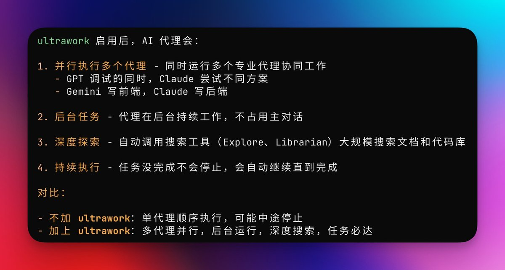

已经安装好了 opencode的  Oh My OpenCode ，直接一气化三清，可以召唤 codex / cc / gemini ，关键是支持这三家的订阅用户，具体使用体验等我开坑测评！ 

## 💬 Replies

### 1 @miantiao_me (面条)

*Sat Jan 03 12:37:07 +0000 2026*

@victor\_wu OPENCODE 是上报感觉不太准，SubAgent 似乎没上传

### 2 @disksing (象牙山刘能)

*Sat Jan 03 12:45:46 +0000 2026*

@victor\_wu 这家伙烧token特别的快。

### 3 @victor_wu (victor-wu.eth) (Author)

*Sat Jan 03 12:48:16 +0000 2026*

@disksing chatgpt pro 让它烧烧烧

### 4 @codingzys (⚛️夙夙.sei)

*Sat Jan 03 14:29:01 +0000 2026*

@victor\_wu 我装上用了一天，现在已卸。不太好用，也和我自己的开发习惯不一样。不过这个项目里面的一些提示词，还是挺有用参考价值的。你可以看这个项目的ralph-loop.ts和oracle.ts、init-deep.ts等文件，提示词都在里面

### 5 @victor_wu (victor-wu.eth) (Author)

*Sat Jan 03 18:32:48 +0000 2026*

@zhngyngshng11 🫡，感谢分享

### 6 @holdeeer (𝕙𝕠𝕝𝕕𝕖𝕖🐳)

*Sat Jan 03 12:16:38 +0000 2026*

@victor\_wu 我都没订阅，是不是就不用装了？😂

### 7 @victor_wu (victor-wu.eth) (Author)

*Sun Jan 04 13:47:24 +0000 2026*

@holdeeer 用api也行….

### 8 @codingzys (⚛️夙夙.sei)

*Sat Jan 03 14:25:22 +0000 2026*

@victor\_wu 1.能在opencode中调用codex和gemini，是因为安装了opencode-antigravity-auth和opencode-openai-codex-auth这两个插件，和Oh My OpenCode没关系。2.这个Oh My OpenCode我特意去github上看了下实习，其实是有问题的，opencode里面没有task啊，所以你会发现它这个默认的角色一直都不会去调用前端工程师

### 9 @RookieRicardoR (耳朵)

*Sat Jan 03 14:08:33 +0000 2026*

@victor\_wu 我用了用比较不错 [x.com/rookiericardor…](https://x.com/rookiericardor/status/2007450352350834837?s=46)

### 10 @codingzys (⚛️夙夙.sei)

*Sat Jan 03 14:30:57 +0000 2026*

@victor\_wu 另外一个问题是，opencode的子代理，是不能调用todo功能的。所以一些复杂的任务，用子代理去做，我觉得并不是最佳实践。

### 11 @LotusDecoder (LotusDecoder)

*Sat Jan 03 11:11:32 +0000 2026*

@victor\_wu 👍

### 12 @Xia5ai (mianxie)

*Sat Jan 03 14:03:21 +0000 2026*

@victor\_wu 支持newApi第三方中转站配置吗

### 13 @jacklondon778 (jacklondon)

*Sat Jan 03 11:41:27 +0000 2026*

@victor\_wu 感觉这玩意挺好玩的

### 14 @oooo0ooooo10 (Oooooo)

*Sat Jan 03 13:10:10 +0000 2026*

@victor\_wu 怕token爆炸没敢体验 ，效果咋样呢 ？感觉还是代码质量为先吧

### 15 @mikeng_io (ᎷᎥᏦᏋ ᏁᎶ)

*Sat Jan 03 12:34:08 +0000 2026*

@victor\_wu OpenCode在執行層還是可以，但在定義意圖就不及Claude Code

