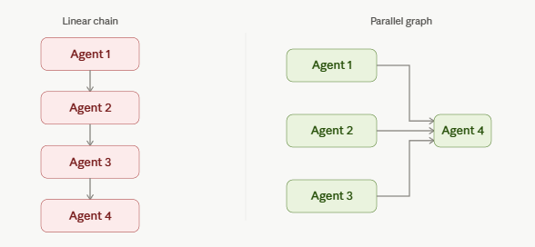
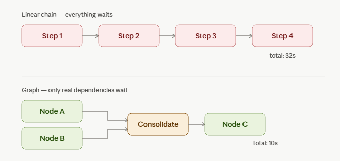
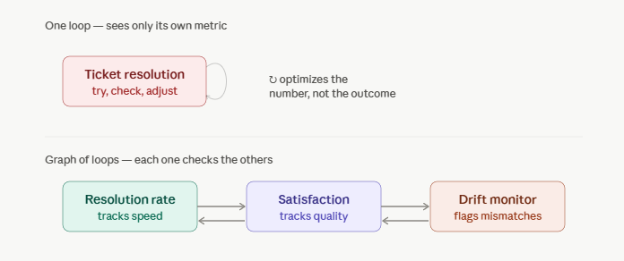
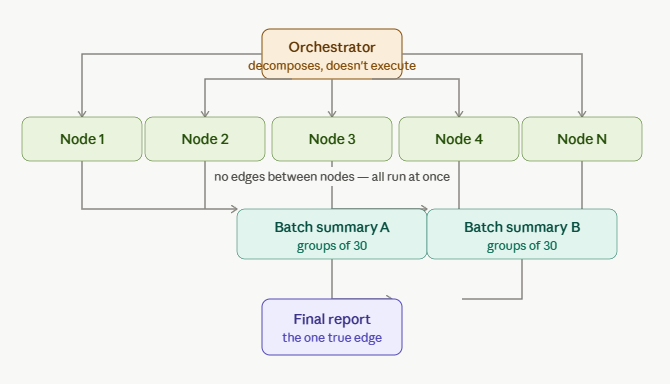
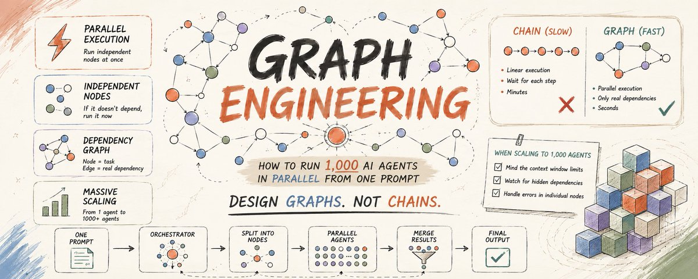

# 📰 Graph Engineering: How to Run 1,000 AI Agents in Parallel From One Prompt

Everyone building multi-agent systems in 2026 is still writing straight lines. Step one, then step two, then step three - each one waiting on the last. Here's why that's slow, and how to fix it.

---

# The problem nobody checks

You built a multi-step agent. It works. It's also slow.

You assume the model is the bottleneck. It isn't.

The bottleneck is the shape you drew. A chain - step 1 waits for step 2, step 2 waits for step 3 - forces sequential execution even when half those steps have nothing to do with each other.

"Summarize this document, then check the weather" is two independent jobs wearing a trench coat as one workflow. The weather task doesn't need the summary. It never did. But if you wrote it as a chain, it waits anyway.

That wasted wait, multiplied across dozens of steps, is where most of your runtime disappears.

# Chapter 1 - Loops vs graphs

A loop is one unit of self-improvement:

\`\`\`plaintext
try something → check the result → adjust → try again
\`\`\`

That's the atom. One agent, one metric, cycling until it converges.

Loops have a known failure mode: they optimize exactly what you measure and nothing else. A support bot tuned to close tickets fast will close tickets fast - while satisfaction quietly craters. The loop can't see outside its own metric. That's Goodhart's Law showing up in your agent architecture.

A graph fixes this by design. Instead of one loop chasing one number, you build a network of loops that watch and correct each other. Node A's output feeds Node B. Node C runs independently and checks both. No single metric drives the whole system - the structure does.

For agent systems this means one concrete shift: stop writing one agent that does everything top to bottom. Design the shape of the work first - what has to happen before what, what can run at the same time, what actually needs to wait.

# Chapter 2 - Nodes, edges, and the test that separates them

A graph has exactly two components:

Node - one unit of work. One agent, one job, one input, one output.

Edge - a real dependency. Node B's input requires Node A's output.

The mistake almost everyone makes: treating "and then" as an edge by default.

\`\`\`plaintext
"Read this codebase and then write the changelog"
"Fetch the pricing page and then summarize competitor features"
\`\`\`

Ask one question for every "and then" in your workflow:

> Does the next step actually read the previous step's output?

If yes → real edge. Keep the sequential order.                                                                      If no → no edge. The wait is wasted. Run them in parallel.

If no data crosses the boundary between two tasks, they're independent — and every independent pair you're running sequentially is runtime you're throwing away for free.

Here's the test applied in code:

\`\`\`python
from dataclasses import dataclass

@dataclass
class TaskNode:
    id: str
    prompt: str
    depends\_on: list\[str\]  # IDs of nodes this one actually needs

def has\_real\_edge(node\_a: TaskNode, node\_b: TaskNode) -&gt; bool:
    """
    The core graph engineering test:
    does node\_b's prompt actually require node\_a's output?
    """
    return node\_a.id in node\_b.depends\_on

\# Example: most "chains" collapse into 2-3 real dependency groups
nodes = \[
    TaskNode("audit\_routes", "List all API route files", \[\]),
    TaskNode("check\_auth", "Check auth middleware coverage", \[\]),
    TaskNode("fetch\_weather", "Get today's weather", \[\]),
    TaskNode("summarize", "Summarize route + auth findings",
              depends\_on=\["audit\_routes", "check\_auth"\]),
\]

\# audit\_routes, check\_auth, fetch\_weather have NO edges between them
\# They run in parallel. Only "summarize" has real edges -- it waits.
\`\`\`

Your current "do A, then B, then C" agent is technically already a graph. It's just the worst possible one - a single chain where if C stalls, nothing downstream ever runs.

# Chapter 3 - Building your first graph

Requirements:

- Claude Code (recent version with Dynamic Workflows support).                             

- Max, Team, or Enterprise plan - workflows on by default. On Pro, enable manually.

Open a real repository. Not a toy example - the payoff only shows up at real scale.

The prompt that kicks off your first graph:

\`\`\`plaintext
Create a workflow to audit every route file in this codebase.

For each route file, check independently:
\- authentication middleware present
\- input validation on all params
\- rate limiting configured
\- error handling doesn't leak stack traces

Run these checks in parallel across all route files —
they don't depend on each other.

After all files are checked, produce one consolidated
report grouped by severity: critical, warning, info.

The consolidation step should wait for all checks to complete.
Everything before it should not.
\`\`\`

Notice the structure embedded in the prompt itself: parallel work explicitly called out, the one real dependency (consolidation waiting on all checks) explicitly named. You're not hoping the agent infers the graph - you're describing it.

What happens under the hood - a simplified version of the orchestration:

\`\`\`python
import asyncio
from anthropic import Anthropic

client = Anthropic()

async def audit\_route\_file(filepath: str) -&gt; dict:
    """One node. Runs independently of every other route file."""
    response = await client.messages.create(
        model="claude-sonnet-5",
        max\_tokens=1000,
        messages=\[{
            "role": "user",
            "content": f"""Audit this route file for:
            - auth middleware, input validation,
              rate limiting, error handling
            
            File: {filepath}
            
            Return JSON: {{"file": "", "issues": \[\], "severity": ""}}"""
        }\]
    )
    return {"file": filepath, "result": response.content\[0\].text}

async def consolidate(results: list\[dict\]) -&gt; str:
    """The one real edge -- waits for every audit node to finish."""
    response = await client.messages.create(
        model="claude-opus-4-8",
        max\_tokens=2000,
        messages=\[{
            "role": "user",
            "content": f"""Consolidate these {len(results)} route audits
            into one report grouped by severity:
            
            {results}"""
        }\]
    )
    return response.content\[0\].text

async def run\_graph(route\_files: list\[str\]):
    # Fan out -- all independent nodes run concurrently
    audit\_tasks = \[audit\_route\_file(f) for f in route\_files\]
    results = await asyncio.gather(\*audit\_tasks)
    
    # Fan in -- the one node with a real dependency
    report = await consolidate(results)
    return report

\# 40 route files, one prompt, one parallel pass
results = asyncio.run(run\_graph(\[
    f"routes/{f}.py" for f in \["auth", "users", "billing", "orders"\]
    # ...36 more
\`\`\`

40 sequential API calls at \~8 seconds each is over 5 minutes. The same 40 calls fanned out in parallel: under 15 seconds, bounded by your slowest single file, not the sum of all of them.

# Chapter 4 - Where graphs actually break

Graph engineering fails in three predictable places. Know them before you hit them.

Context collapse. Fan out 1,000 nodes and try to feed all 1,000 outputs into one consolidation step, and you'll blow past any context window before synthesis even starts.                                                                                                                Fix: layer your fan-in. Group nodes into batches of 20-50, summarize each batch, then consolidate the summaries - not the raw outputs.

\`\`\`python
async def layered\_consolidate(results: list\[dict\], batch\_size: int = 30):
    """Fan-in in layers -- never synthesize raw output at scale."""
    batches = \[results\[i:i+batch\_size\] 
               for i in range(0, len(results), batch\_size)\]
    
    batch\_summaries = await asyncio.gather(\*\[
        summarize\_batch(batch) for batch in batches
    \])
    
    # Final consolidation works on summaries, not 1,000 raw results
    return await consolidate(batch\_summaries)
\`\`\`

False independence. You'll assume two nodes are independent because their prompts don't reference each other - but they both write to the same file, or hit the same rate-limited API. That's a hidden edge. Fix: audit for shared resources, not just shared data. Two nodes with a write conflict need an edge even with zero data dependency.

Silent node failure. In a chain, one failure stops everything - annoying but obvious. In a graph, one failed node among 200 can vanish into a report that looks complete. Fix: every fan-in step checks node count against expected count before synthesizing, and flags gaps explicitly instead of quietly working with partial data.

\`\`\`python
async def safe\_consolidate(results: list\[dict\], expected\_count: int):
    if len(results) &lt; expected\_count:
        missing = expected\_count - len(results)
        print(f"WARNING: {missing} nodes failed silently. "
              f"Report will be incomplete.")
    return await consolidate(results)
\`\`\`

# Chapter 5 - Scaling to a real fleet

Once the pattern works at 40 nodes, scaling to hundreds is a config change, not a redesign - provided you built the graph correctly from Chapter 2 onward.

The full production shape:

\`\`\`plaintext
                    Orchestrator
                         \|
        +--------+-------+-------+--------+
        v        v       v       v        v
     Node 1   Node 2  Node 3  ...      Node N
   (parallel, no edges between any of them)
        \|        \|       \|               \|
        +--------+-------+-------+-------+
                         v
                 Batch Summary  &lt;- layered fan-in
                 (groups of 30)
                         v
                 Final Report   &lt;- the one true edge
\`\`\`

The orchestrator's only job: decompose the task into nodes, identify real edges, and dispatch. It does no work itself - it draws the graph.

\`\`\`python
async def orchestrate(task: str, resources: list\[str\]):
    """
    The orchestrator node -- decomposes, doesn't execute.
    """
    plan = await client.messages.create(
        model="claude-opus-4-8",
        max\_tokens=2000,
        messages=\[{
            "role": "user",
            "content": f"""Task: {task}
            Resources available: {resources}
            
            Decompose into a graph:
            - List each independent node (no shared edges)
            - List any real dependencies between nodes
            - Group nodes into fan-in batches if count &gt; 50
            
            Return JSON with: nodes, edges, batch\_groups"""
        }\]
    )
    
    graph = parse\_plan(plan.content\[0\].text)
    
    # Execute independent nodes in parallel
    node\_results = await asyncio.gather(\*\[
        execute\_node(n) for n in graph\["nodes"\] if not n\["depends\_on"\]
    \])
    
    # Then execute dependent nodes, respecting real edges only
    final = await execute\_dependent\_chain(graph\["edges"\], node\_results)
    
    return final

\`\`\`

This is the actual shift graph engineering represents: you stop being the person who writes every step, and become the person who designs the dependency structure. The agents fill in the nodes. You own the edges.

---

# What changes when you think in graphs instead of lines

A linear agent with 40 steps has 40 points of sequential failure and 40x the latency of its slowest single step.

A graph with the same 40 units of work has as many points of parallel failure as you have real dependencies - usually 3 to 5 in most workflows - and latency bounded by your slowest layer, not your total step count.

That's not a marginal speedup. It's the difference between a workflow that takes 5 minutes and one that takes 15 seconds, running the exact same underlying work.

The model was never the bottleneck. The line you drew was.

---

This is a technical breakdown of multi-agent orchestration patterns as of July 2026. Code examples are illustrative - adapt error handling, rate limiting, and retry logic to your production environment before deploying at scale.

Thank you for reading.

### 🖼️ Attached Media

