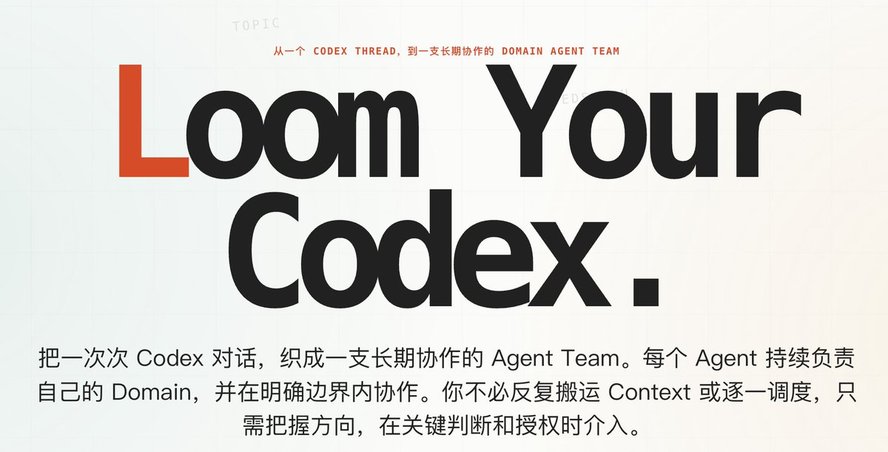
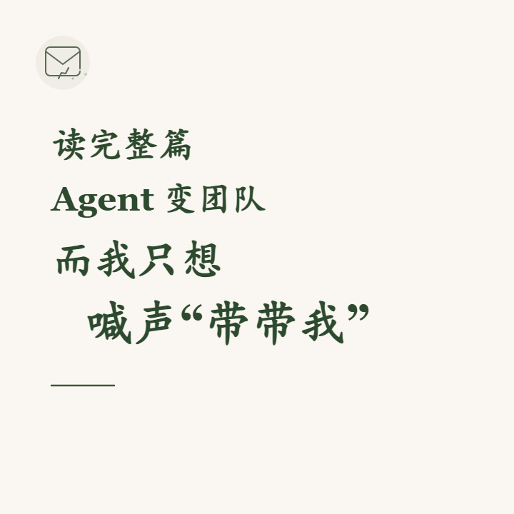

给关注了半年的agent team 交份作业。
这是一篇2w字长文，也是一份 Agent Team 的最佳实践。

01 一个 Agent，是怎么变成多个 Agent 的为什么真实工作会把 Task Agent 推向 Long-running Agent；为什么一个越来越好用的 Agent 最后又必须分化；多个 Agent 出现以后，瓶颈为什么会转移到 Human。

02 先让“谁负责什么”离开 Human 的脑子Agent 怎样获得稳定身份、Domain 和 Scope；Human 与 Agent 怎样查询当前 Team 的责任结构；真实协作又怎样逐渐沉淀为 Organization 与 Collaboration。

03 让 Agent 自己开始协作Agent Message 带来了什么变化；一个 Agent 怎样把工作直接交给另一个 Agent；为什么 Agent 沟通不是一次把一切说完。

04 Message 负责沟通，Topic 负责收口当工作跨越多个 Agent、多个 Turn 和多天以后，怎样保留唯一的当前版本；Responsible、Participant、Artifact 和 Needs You 分别解决什么问题。

05 Overview：让一支持续变化的 Agent Team 变得可治理当 Human 不再阅读每个 Agent 的全部过程，怎样从更高层观察 Team；怎样发现等待、积压和瓶颈候选；为什么治理关注的是工作流动，而不是让每个 Agent 看起来都很忙。

06 Agent Team 怎样进入真实的外部关系为什么把 Agent 接入 Slack、飞书还远远不够；Agent 对外以后，身份、角色、信任、权限和现实后果为什么必须被分别治理。

07 CodexLoom 在织什么Multiple Agents 与 Agent Team 的真正分水岭是什么；Human 在 Team 中的新位置是什么；为什么需要稳定的 Agent 和动态的 Team。

### 🖼️ Attached Media

## 💬 Replies

### 1 @yan5xu (yan5xu) (Author)

*Fri Jul 31 01:40:14 +0000 2026*

原文
[mp.weixin.qq.com/s/ZloR4kbXacxp…](https://mp.weixin.qq.com/s/ZloR4kbXacxpcEkIEv3oUQ)

### 2 @yan5xu (yan5xu) (Author)

*Fri Jul 31 01:40:57 +0000 2026*

[codexloom.ai/zh-cn/](https://codexloom.ai/zh-cn/)

### 3 @yan5xu (yan5xu) (Author)

*Fri Jul 31 01:41:53 +0000 2026*

飞书交流群 

### 4 @hao_ye__ (hao)

*Fri Jul 31 01:59:45 +0000 2026*

@yan5xu 佩服可以把事情想得这么细，还能写下来的能力

### 5 @yan5xu (yan5xu) (Author)

*Fri Jul 31 02:06:18 +0000 2026*

@hao\_ye\_\_ hh 因为每个部分都是我碰到的问题，最后自己上手解决。而且用的频率很高，所以可以大言不惭地说覆盖很全。
写下来，搭配 AI 干了一天，筋疲力尽

### 6 @davidsouza676 (来用兵-纸上用兵)

*Wed Aug 26 23:26:35 +0000 2026*

@yan5xu 这哪是交作业啊

这是把 Agent Team 的族谱、工位和绩效表全画出来了

Human 看完：原来瓶颈竟是我自己哈 

### 7 @AgiRay1015 (AI磊叔)

*Fri Jul 31 03:32:07 +0000 2026*

@yan5xu 我自己越做越明显的感受也是这个：Agent 一多，最先崩的就是“谁该接、谁该收、现在到底算哪个版本”，把 Topic、Responsible、Needs You 这些拎清楚，整个协作顺畅许多～

我也把用 Codex 的一些避坑经验总结了下，写到了《关于 Codex 的 100 个问题》：
[my.feishu.cn/wiki/FC6ZwnwWW…](https://my.feishu.cn/wiki/FC6ZwnwWWi0dWpke56act61gnUd)

### 8 @hi__vince (HiVince)

*Fri Jul 31 09:13:25 +0000 2026*

@yan5xu 文章仔细拜读了，但是感觉少一些对照来证明 Agent Team 是可以产生更高的净收益，比如对比Main Agent + 临时 Worker，或者什么时候才有必要启用 domain agent

### 9 @edward40e (Edward)

*Sat Aug 01 00:43:14 +0000 2026*

@yan5xu @sam\_commonly Agent Team 的设计本质上是种 Trade-off。
为什么 Agent 必须保留 Reset？
开新的： 上下文断裂，无法延续
一直用： 记忆污染，逐渐退化
好的架构，核心就在于何时 Reset

### 10 @EYkii (EYkii)

*Fri Jul 31 15:18:09 +0000 2026*

@yan5xu 一直没搞懂agent teams 存在的必要性；一个 conductor 驱动一堆 roles+ woker不是更简洁吗，模型能力这么强穿上马甲（role）干活，干完就扔，不维护状态，事了拂身去多好

### 11 @arknights60 (Lewis)

*Sat Aug 01 14:24:00 +0000 2026*

@yan5xu 正在收集并持续更新类似产品：[github.com/CiferaTeam/awe…](https://github.com/CiferaTeam/awesome-agents-team)  已经收录您的项目，感谢

### 12 @shuizhuyu (Crio Songo)

*Tue Aug 04 07:22:55 +0000 2026*

@yan5xu 两万字的最佳实践总结得很干货啊，从单Agent拆分到多Agent协作，再到团队治理和外部接入把实际落地的问题都覆盖到了，正好解决我现在做多智能体协作架构的很多疑惑，拜读学习一下。

### 13 @sam_commonly (Sam Xu)

*Fri Jul 31 17:24:43 +0000 2026*

@yan5xu 这类产品很多人低估的needs you的重要性

### 14 @davidsouza676 (来用兵-纸上用兵)

*Thu Aug 13 03:31:48 +0000 2026*

@yan5xu 这哪是交作业啊，像是把 Agent Team 的期末卷子顺手出完了。

Human 瓶颈这句太真实了哈，最后发现最该被优化的是老板本人。 

### 15 @davidsouza676 (来用兵-纸上用兵)

*Fri Aug 07 13:18:36 +0000 2026*

@yan5xu 这作业我直接全文背诵了
感觉读一次都算我赚到💪
等于是把带娃秘籍写在agent脸上的水平啊S

### 16 @davidsouza676 (来用兵-纸上用兵)

*Sat Aug 15 03:21:14 +0000 2026*

@yan5xu 2w字看完，人已经从Human进化成Overview了

Agent忙不忙不知道，我的脑子先进入Needs You状态了 

### 17 @invzhi (Tianzhi Jin)

*Sun Aug 02 16:01:55 +0000 2026*

@yan5xu 学习了，感觉Agent Team是一个很重要的课题，也是提升生产力的关键

### 18 @aiseomastery (AI Mastery Guide)

*Fri Jul 31 06:42:50 +0000 2026*

@yan5xu 20,000 words on agent teams, that's a serious deep dive.

### 19 @jalr4ever (Warren Zhan)

*Fri Jul 31 14:50:16 +0000 2026*

@yan5xu 这是我距离 langchain 年初在油管分享 harness engineering 后看到的最好的一篇分享

### 20 @XShude (随机比特)

*Fri Jul 31 02:18:54 +0000 2026*

@yan5xu Agent 从 1 变成 N 后，Human 的治理负担会上升：责任边界要可查询，交接物始终只有一个当前版本，Needs You 也要有明确超时。每次跨 Agent 交接还应带上输入假设、可验收证据和失败回退；不然 Topic 很容易只是把群聊换了个名字。

### 21 @star_flow_ai (星川 ✨ StarFlow)

*Sat Aug 01 09:22:31 +0000 2026*

@yan5xu 两万字！大佬这篇干货太足了，马上去拜读一下

### 22 @10k10q10x (借东风Larry)

*Fri Jul 31 12:40:59 +0000 2026*

@yan5xu @grok summarise all content and include those link

### 23 @ShomLinEd (Shom)

*Fri Jul 31 03:53:38 +0000 2026*

@yan5xu 严肃学习，最近也在测试类似的方法

### 24 @nicolebuilderqc (Nicole｜Builder)

*Sun Aug 02 03:54:54 +0000 2026*

@yan5xu 多个 Agent 出现后，Human 变成瓶颈这个判断很真实。任务边界、失败证据和责任归属如果没被结构化，人只能重新读一遍全过程。下一层产品机会可能是更好的交接，而不是更多 Agent。

### 25 @afei_AI (AFei Liang)

*Sat Aug 01 07:30:11 +0000 2026*

@yan5xu 多 Agent 最容易被低估的成本，不是 Token，而是“谁对最终结果负责”

我跑并行任务时，子 Agent 越多，合并冲突和验收越重。
稳定身份之外，还需要唯一负责人和完成判据，否则 
Overview 只是把混乱可视化

### 26 @hixonchan (hixonchan)

*Fri Jul 31 12:40:38 +0000 2026*

@yan5xu 居然是开源的 牛逼

### 27 @MiroCloudw (万万不可与人知道...)

*Fri Jul 31 04:29:09 +0000 2026*

@yan5xu 认真阅读，感谢分享

