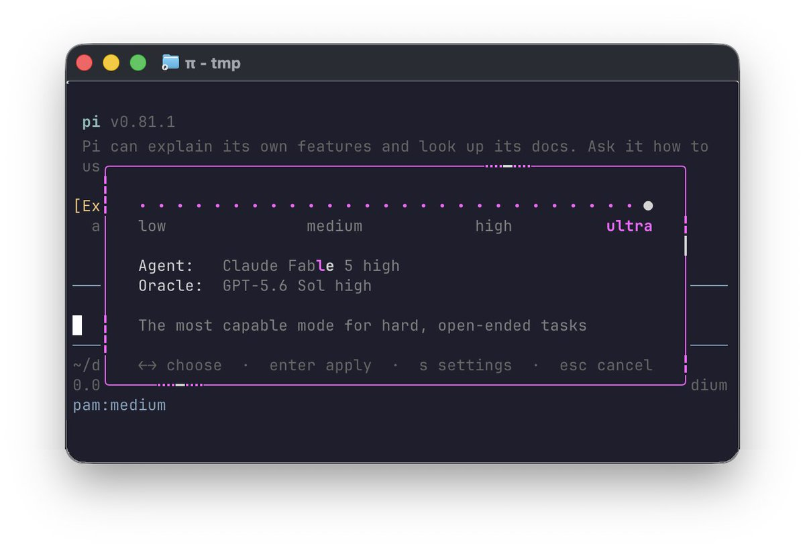

推荐这期 Pi 插件合集。Pi 作为最小 agent harness，真正的扩展能力来自社区插件——从一键装 17 个扩展的 pi-agent-extensions 到让你在 Pi 里无缝跑 Claude Code 全部 plugins 的 pi-cc-plugins。

Pi 插件精选：让 Pi 从最小 Harness 变成 Multi-Agent 部队的 6 个扩展

🎯 必装神器

1\. pi-agent-extensions v0.5.2[pi.dev/packages/pi-ag…](https://pi.dev/packages/pi-agent-extensions)2 — 17 个扩展 + 4 个主题，636 下载/月。核心集：
   \- /sessions — 快速会话切换
   \- /handoff — 目标驱动的上下文转移
   \- loop — 迭代执行循环
   \- review — 交互式代码审查
   \- ask\_user — LLM 可以向你提问（beta）
   \- workflow — 模型路由的动态工作流（beta）
   \- control — 跨会话通信 & 控制（beta）
   \- files — 统一文件浏览器 + git 集成
   \- /context-simple — 上下文消耗看板
   安装：pi install npm:pi-agent-extensions

🤖 Multi-Agent

2\. pi-agents-team 2026.7.1[npmjs.com/package/pi-age…](https://www.npmjs.com/package/pi-agents-team)mx — 把一次 Pi 会话变成 multi-agent team。主会话当协调器，后台 RPC worker 执行任务。7 个内置角色（explorer、fixer、reviewer、librarian、observer、oracle、designer），每个可以指定不同的 model。Worker 输出只给协调器返回简洁摘要 + &lt;final\_answer&gt; 块，不灌完整对话日志。支持 worker 加载 Pi skills。
   安装：pi install npm:pi-agents-team

🧠 跨会话记忆

3\. @remnic/plugin-pi v9.6[npmjs.com/package/@remni…](https://www.npmjs.com/package/@remnic/plugin-pi)0gZ — 第一梯队的 Pi memory 扩展，15.7K 周下载。Recall 相关上下文（model call 前）、观察会话事件（turn 后）、协调 Pi compaction 与 Remnic 长上下文记忆归档、注册 Remnic MCP 工具为 Pi 工具。272 个版本，迭代速度惊人。

4\. @cortexkit/pi-magic-context v0.32[npmjs.com/package/@corte…](https://www.npmjs.com/package/@cortexkit/pi-magic-context)eya — 跨会话记忆，910 周下载。与 OpenCode 共享同一 SQLite 数据库——在 Pi 和 OpenCode 之间切换时不丢记忆。自带 historian/dreamer/sidekick/embedding 模型选择向导。

🔧 上下文工程

5\. pi-agenticoding v0.[github.com/agenticoding/p…](https://github.com/agenticoding/pi-agenticoding)CnvH — spawn/notebook/handoff 三板斧，让 agent 自己管理上下文而不是在长对话里腐烂。核心思路：隔离噪音工作到子进程（spawn）、任务级命名笔记跨 handoff 存活（notebook）、需要时主动重启干净的上下文（handoff）。状态栏显示上下文压力和 notebook 数。

🔗 跨生态桥梁

6\. pi-cc-plu[github.com/ariesike/pi-cc…](https://github.com/ariesike/pi-cc-plugins)kgpKL — 把 Claude Code 的整个 plugins 生态带进 Pi。从 GitHub 克隆 plugin repo → 自动扫描 skills/agents/MCP configs → 转换为 Pi 原生格式。Skills 贡献给 Pi 的 resources\_discover 事件，agents 转换给 pi-subagents，MCP 配置通过 pi-mcp-adapter 暴露。支持 --plugin-dir 本地测试模式。

安装方式统一：pi install npm:&lt;package&gt; 或 pi install git:&lt;repo&gt;

#Pi #CodingAgent #插件

## 💬 Replies

### 1 @ajs6888 (安叫兽|Bird🕊️ 🔶 BNB)

*Fri Jul 24 22:05:44 +0000 2026*

@yibie Pi 这插件生态长得有点快啊

### 2 @0xease_eth (Ease)

*Fri Jul 24 02:33:17 +0000 2026*

@yibie 推荐 pi-resume-claude 给从 claude code 转到 pi 的用户，可以从 pi 里面继续  claude 会话。

[pi.dev/packages/pi-re…](https://pi.dev/packages/pi-resume-claude)

### 3 @fitchmultz (Mitch Fultz)

*Fri Jul 24 20:23:38 +0000 2026*

@yibie pi-cursor-sdk

### 4 @kRonos13v (Leun Ho)

*Fri Jul 24 08:05:01 +0000 2026*

@yibie 我发现大家都不搞回溯的插件，pi 的session tree 只能导航和 fork，不能实际回溯，所以我让 pi 自己写了一个。可以回溯更改的代码和对话，也可以取消回溯
[github.com/jeanchristophe…](https://github.com/jeanchristophe13v/pi-rewind)

### 5 @madhavajay (Madhava Jay)

*Fri Jul 24 06:03:06 +0000 2026*

@yibie If you wish you had the @AmpCode dial in pi, wish no longer

[github.com/madhavajay/pam](https://github.com/madhavajay/pam) 

### 6 @just_shiang (shiang.lens | 0x🆂🅷🅸🅰🅽🅶)

*Fri Jul 24 10:55:33 +0000 2026*

@yibie 推荐一个提供advisor功能的插件

[pi.dev/packages/@ribb…](https://pi.dev/packages/@ribbons-digital/pi-advisor)

### 7 @AbzRollins (最强一号员)

*Fri Jul 24 06:15:05 +0000 2026*

@yibie 这套插件一上，Pi 真的不是 harness 了啊

直接变成可组装的 agent 操作系统了哈

