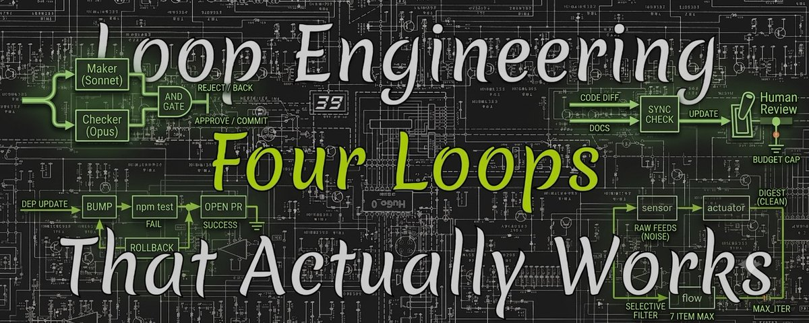

# 📰 Loop Engineering: Four Loops That Actually Works

Everyone is writing about autonomous loops right now, and almost everyone sells the same thing: build a loop, launch a fleet of agents, wake up to finished work. The problem is that most loops people try to build from these articles do not pay off. They burn tokens, produce junk you then redo by hand, and end up costing more than doing it yourself.

But there is a minority of loops that work reliably. They share one trait: the task repeats, the result can be checked by a machine, the agent carries it end to end, and the word "done" is defined objectively, not by taste. These are the loops worth your time. This article has four of them, written out to a working state. Not ideas, but configs that run.

All four are verifiable, so verification, the heart of any loop, is built into them honestly. And each has brakes, because a loop without brakes is not an asset but a bill that arrives at night. If the mechanics of verification and brakes are not yet obvious, I broke them down in detail in the previous article on the anatomy of an autonomous loop - here we go straight to practice.

## What must be true for a loop to pay off

Before the code, one filter that screens out 90 percent of bad ideas. Build a loop only when all four conditions hold at once.

> The task repeats at least weekly. Less often, and the setup never pays itself back. A one-off is better served by one good prompt. Something can automatically reject the result. A test, a type check, a build, a linter, a hard rule. If nothing can fail the work for you, the loop just spins idle. The agent carries the task whole, instead of handing half of it back to you. "Done" is objective, not a matter of taste. If quality is taste, a human still wins.

All four loops below pass this filter. If your task fails even one point, leave it as a manual prompt, that is more honest and cheaper.

An important technical foundation: what used to require your own server and a pile of scripts is now done through Routines in Claude Code, cloud tasks on a schedule or an event that run even with the laptop closed. The minimum interval is one hour, the default daily cap is fifteen runs, and by default the agent writes only to a branch prefixed claude/, never touching main. That is already half the brakes out of the box.

## Under the hood: a loop without wrappers

Before breaking down the four loops through high-level commands, it helps to see what is inside. Routines and /schedule are convenient wrappers, but underneath them sits simple mechanics worth understanding, because that is what gives you control and debuggability. Any loop is a while-loop, a headless agent call, and a check through an exit code.

\`\`\`bash
#!/usr/bin/env bash
set -euo pipefail
MAX\_ITER=10
i=0

while \[ $i -lt $MAX\_ITER \]; do
  i=$((i + 1))

  \# CHECK first, via exit code. 0 = success, loop is done
  if npm test --silent; then
    echo "Green in $i iterations."
    exit 0
  fi

  \# one headless agent pass; -p is print mode, no interactive
  claude -p "Tests are failing. Run npm test, read the first failure,
  make the smallest fix that resolves it. Do not touch unrelated code.
  Do not weaken tests." \\
    --permission-mode acceptEdits \\
    --max-budget-usd 5
done

echo "Cap of $MAX\_ITER reached, tests red."
exit 1
\`\`\`

 The whole essence is in three places. The check goes through the exit code of npm test: zero means success, and the loop exits without spending an extra model call. This is the machine check that cannot be fooled with words, because the verdict is delivered by the test, not the agent. The -p flag is headless mode: the agent does not hold a dialogue, it makes one pass and finishes, which is what automation needs. And --max-budget-usd is a money ceiling per pass, a built-in brake.

Memory between turns here is not in the model but on disk and in git: the next iteration sees the changed files and the fresh test result, it does not remember the prior conversation. This is an important property, because a model degrades as context fills, and here each pass starts clean. When you write a Routine via /schedule, Claude Code wraps exactly this logic into a cloud task, but the layer worth understanding is the lower one: everything else is sugar over while, exit code, and budget.

When you need not a local run but a reaction to an external event, the same loop is fired through the API. Each Routine has its own endpoint and token, and an external system hits it with a POST request:

\`\`\`bash
\# an external system (monitoring, pipeline) fires the loop on an event
curl -X POST https://api.anthropic.com/v1/claude\_code/routines/trig\_01ABC.../fire \\
  -H "Authorization: Bearer sk-ant-oat01-xxxxx" \\
  -H "anthropic-beta: experimental-cc-routine-2026-04-01" \\
  -H "Content-Type: application/json" \\
  -d '{"text": "Prod alert SEN-4521. Stack trace attached."}'
\`\`\`

The text from the request is appended to the Routine's prompt as a one-shot input. This turns the loop from "on a schedule" into "on an event": your alerting wakes the agent itself, passes it the failure context, and it starts the triage while you sleep.

## Loop 1: morning triage of failed tests

The pain it removes: you come in the morning and CI is red after overnight merges, and the first hour goes to figuring out what broke.

The loop reads the overnight failures, fixes the small ones itself, and puts what needs a decision into your queue as one short report. You wake up not to a pile but to a sorted stack.

First the skill that describes exactly how to handle failures. It lives in a file and is read every run.

\`\`\`markdown
\# .claude/skills/triage/SKILL.md
\---
name: triage
description: Triage overnight CI failures, fix the trivial ones,
  collect the rest into a short report with causes.
\---
1\. Get the list of failing tests and cluster by root cause.
2\. Fix only the safe ones: broken import, stale snapshot,
   a typo in an assertion. Do not touch logic if the cause is unclear.
3\. After each fix, re-run the test. Green - move on.
4\. Whatever cannot be safely fixed, describe in one line: file, cause, hypothesis.
5\. Never weaken or delete a test to make it pass.
\`\`\`

Then the scheduled task itself. In Claude Code this is a Routine that wakes the loop every morning in the cloud.

\`\`\`bash
\# create a scheduled cloud task (minimum once per hour)
/schedule daily test triage at 8am, use the triage skill
\`\`\`

Verification here is built into the task itself: a test is either green or not, there is nothing to argue with, and the agent fixes only until the check confirms. The brakes are also in place: edits go to a claude/ branch, the daily run cap is on by default, and the "do not weaken a test" rule closes the main loophole through which the agent could turn red green by lying.

What you see in the morning is not a wall of logs but a short summary: what fixed itself and what awaits your decision.

One technical layer that lifts this loop from working to reliable: a separate checker agent. The agent that fixed the test is a bad judge of its own edit, it is too generous to itself and may push through a fix that passes the test but breaks the meaning. So a second agent reviews the edit, with different instructions and ideally on a stronger model. This is the maker-checker pattern, and in Claude Code it is defined by a subagent file.

\`\`\`markdown
\# .claude/agents/reviewer.md
\---
name: reviewer
description: Adversarial checker of triage edits. Run after a fix,
  before commit. Does not edit code, only delivers a verdict.
model: opus
\---
You are given a diff of a fix for a failing test. Review like a strict owner:
1\. Does the fix address the cause, not mask the symptom?
2\. Is the test left un-weakened, not tuned to the current output?
3\. Does the edit avoid breaking adjacent logic not covered by this test?
Verdict strictly: APPROVE or REJECT with a one-line reason.
Assume the author is wrong until the diff proves otherwise.
\`\`\`

The wiring is simple: the maker fixes on Sonnet, the checker delivers a verdict on Opus, and only what gets APPROVE goes into the report. The rest is placed on your review with the checker's note. You pay for this with a second model call, so a second opinion is worth turning on where the cost of being wrong is high, and test triage is exactly such a place: a silently pushed wrong fix is worse than an unfixed test, because it creates a false sense of green.

## Loop 2: the dependency watchdog

The pain: dependencies go stale, you avoid updating them for months out of fear of breaking something, and then the update turns into a day of pain.

The loop bumps versions one at a time, runs tests after each, and opens a pull request only if everything is green. Updates that break tests it does not push through, but sets aside with a note of exactly what failed.

\`\`\`markdown
\# .claude/skills/deps/SKILL.md
\---
name: deps
description: Update dependencies one by one, run tests after each,
  open a PR only for those that do not break the build.
\---
1\. Get the list of outdated packages.
2\. For each one separately: bump the version, run the full test suite.
3\. If green - keep the update and move to the next.
4\. If red - roll that package back, write it into the report with the error text.
5\. At the end, open one PR with all the passing updates together.
6\. Never bump a major version without a separate risk note.
\`\`\`

\`\`\`bash

\# weekly task, also responds to a manual run
/schedule weekly dependency update on Mondays, deps skill
\`\`\`

Why it pays off: verification is perfectly objective (tests passed or not), the task repeats (dependencies go stale constantly), the agent carries it whole. The brake here is natural: an update that breaks tests physically cannot reach the PR, because the condition for opening a PR is a green suite. Majors are set apart with a note, because they more often need a human decision.

## Loop 3: the documentation synchronizer

The pain: code changes every day, while the README and docs rot, and one day the documentation lies to a newcomer or a client.

This loop hangs not on a schedule but on an event: every time code changes, it checks whether the related documentation went stale and fixes it in the same spirit. In Claude Code this is a GitHub trigger that fires a task on a pull request.

\`\`\`markdown
\# .claude/skills/docsync/SKILL.md
\---
name: docsync
description: From the PR diff, find documentation the change
  makes incorrect, and update it surgically, without rewriting extra.
\---
1\. Read the pull request diff, single out the public changes:
   function signatures, CLI flags, endpoints, configs.
2\. Find places in README and docs/ that this diff makes incorrect.
3\. Update only those. Do not rewrite paragraphs that stayed correct.
4\. Do not invent examples not in the code. Take them from real code.
5\. Add the doc fix to the same PR as a separate commit.
\`\`\`

Verification here is subtler than in the first two, and it is honest to say so out loud. "The docs are correct" cannot be checked by a test as hard as "the tests are green." So the brake here is not automatic but human: the doc fix goes as a separate commit in the same PR, and you see it at review before merging. The loop does not write to the docs silently, it proposes a fix for your judgment. This is an example of a loop where verification partly stays with the human, and pretending otherwise would be a lie.

## Loop 4: the overnight research digest

This one is for researchers, not coders, and it shows that a loop works not only on code.

The pain: you follow a topic, the sources are many, and every morning takes time to figure out what important came out overnight, filtering out noise and clickbait.

The loop walks your sources at night, selects the relevant by your criteria, and gives you a compressed summary in the morning. In Claude Code this is a Routine with connectors wired to the sources.

\`\`\`markdown
\# .claude/skills/digest/SKILL.md
\---
name: digest
description: Walk the given sources, select what is substantive on the topic,
  write a compressed digest without clickbait or filler.
\---
1\. Collect what is new in the last 24 hours from the source list.
2\. Keep only what relates to the topics: \[your topics\].
3\. Drop announcements without substance, reprints, clickbait.
4\. For each item: one line on what happened, one on why it matters.
5\. Max 7 items. If there is less of substance, write less, do not pad.
\`\`\`

\`\`\`bash
\# overnight cloud task with connectors to the sources
/schedule daily research digest at 6am, digest skill
\`\`\`

Here verification is the softest of the four, because "relevant and without filler" is partly a judgment. But even here there is an objective part to lean on: the hard cap of seven items and the rule "less of substance means write less" keep the loop from padding the summary for volume. And the final filter is still you: the digest saves you an hour of walking sources, but the decision of what to do with it stays yours. The loop collects and filters, it does not think for you.

## What all four have in common

Notice the pattern, it is the lesson. The first two loops, tests and dependencies, pay off most easily because verification in them is iron: a machine delivers the verdict with no human involved. The third and fourth are weaker on verification, so a human stays in the circuit: the loop proposes, you approve.

This is the honest map. The more objective the verification, the more you can hand the loop and the more calmly you can step away. The softer the verification, the closer you must stand. Loops sold as "fully autonomous" on tasks with soft verification are exactly the ones that burn money and produce junk, because no one delivered a verdict except the agent itself, and it is too generous to itself. LINK HERE: why verification is the heart of a loop and how to build brakes - in my article on the anatomy of an autonomous loop

So start with the first or second. Take the morning test triage or the dependency watchdog, because in them verification leaves the agent no loopholes, and you see the benefit at once without risk. Bring one loop to where you trust it before building a second. Nobody whose fleet of loops works started with a fleet. They all started with one small loop on one boring task, brakes first, and read every diff it shipped. Build that one, and add the other three when the first has earned the trust.

### 🖼️ Attached Media

## 💬 Replies

### 1 @Nekt_0 (Nekt0)

*Sat Jun 27 12:51:25 +0000 2026*

@zostaff That is a useful perspective

### 2 @0xSlyth (0xSlyth)

*Sat Jun 27 12:56:11 +0000 2026*

@zostaff good take appreciate the insight

