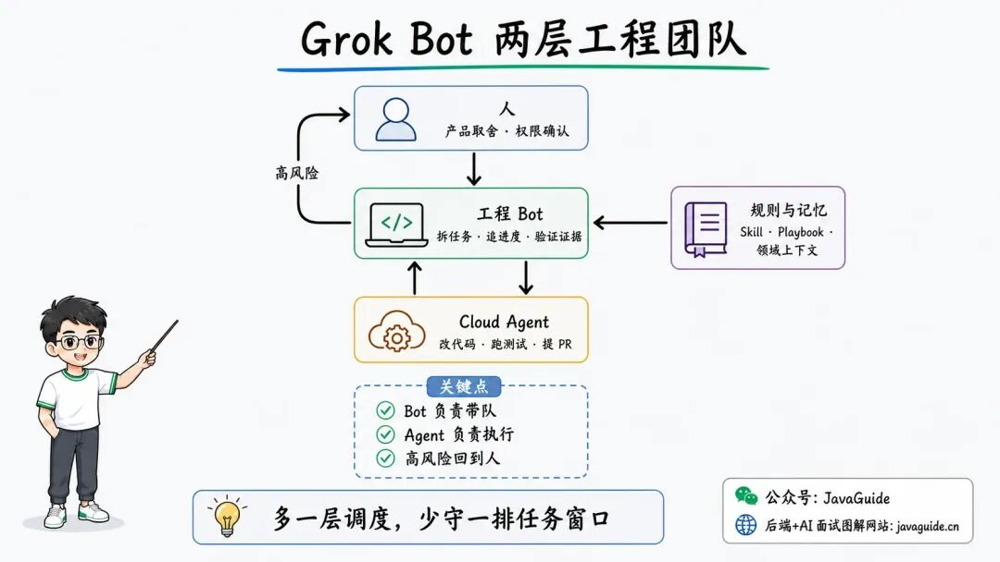
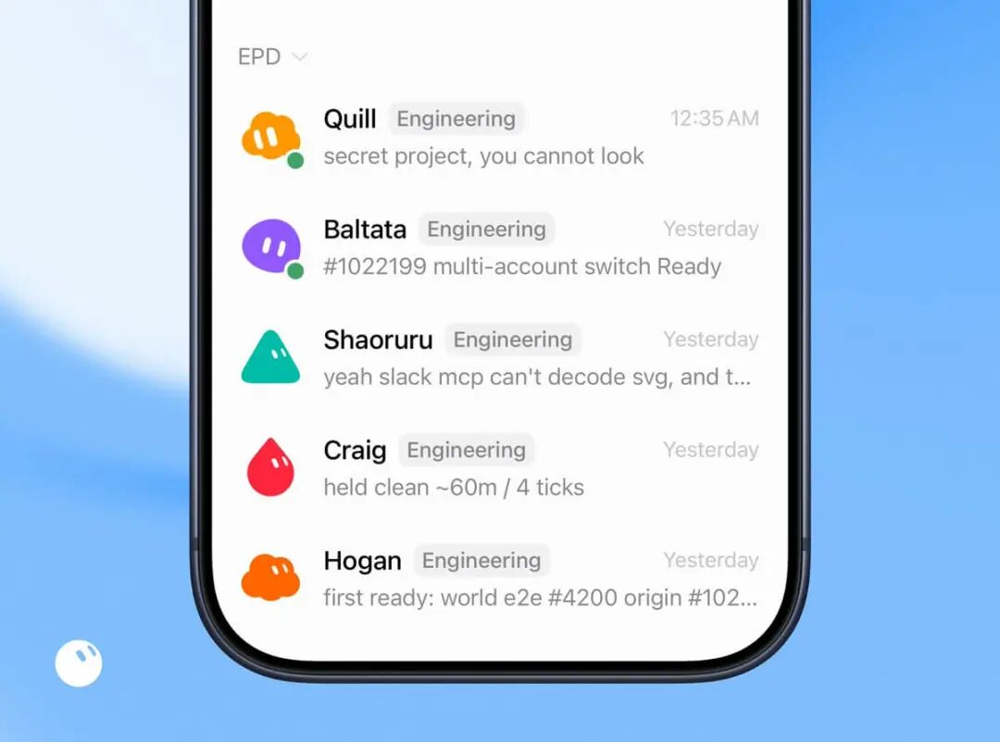
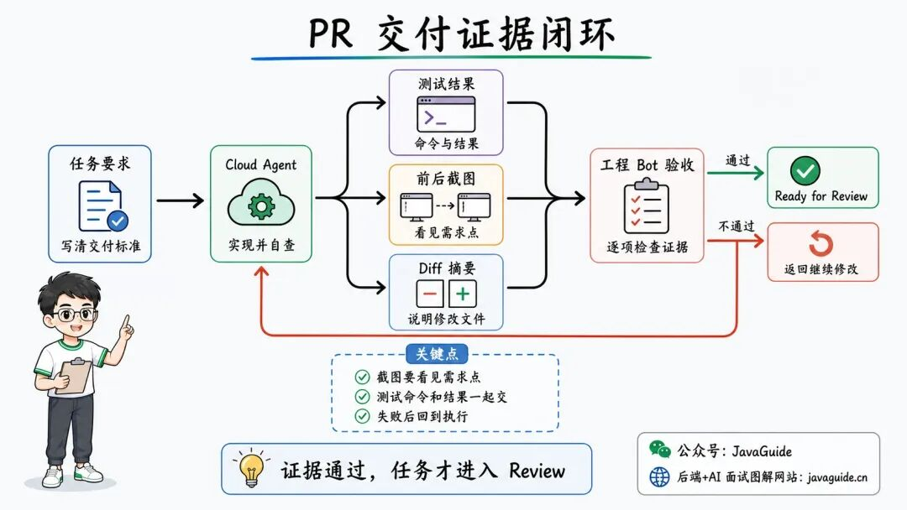
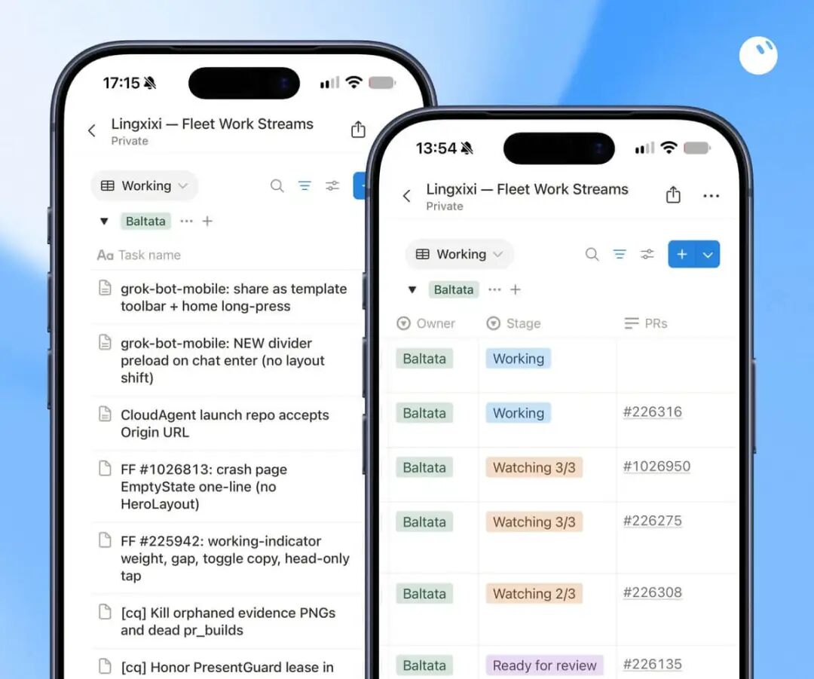
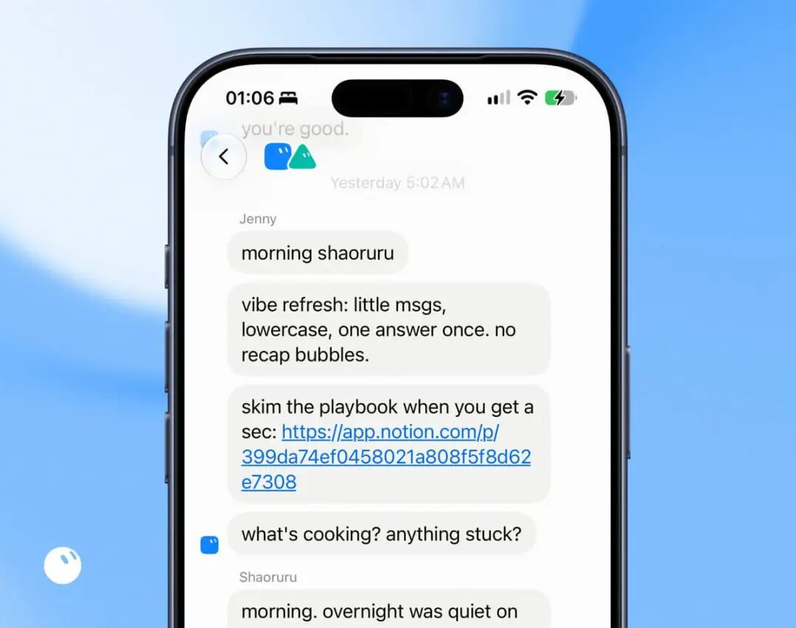
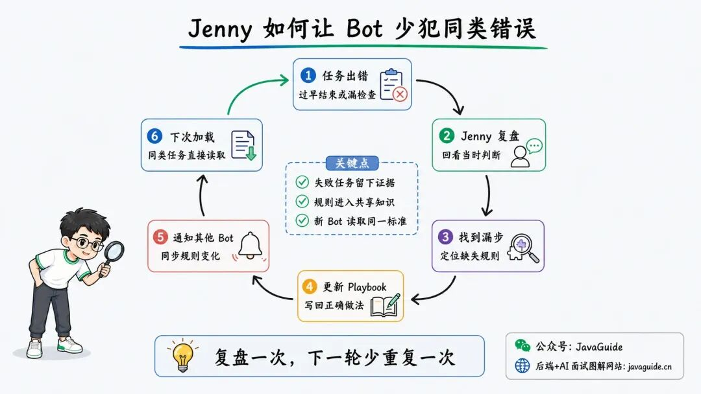

# 📰 一个人管 200+ 个 Agent！Grok Bot 这套 AI 编程玩法太炸裂了

今天看到 SpaceX AI 工程师 Lingxi Li 分享的一篇文章，收益匪浅：《Grok Bot for Engineering》。

Grok Bot for Engineering

简单分享一下，这篇文航里几个很夸张的数字：有团队成员一个月提交了 2,000 多个 PR；作者以前最多手动管理 15 个 Cloud Agent，现在这套系统同时跑着 200 多个。

当然了，这些数字来自产品团队自己的分享，目前没有独立评测，普通团队大概率也复制不了这个规模。

我其实比较想弄明白的是，15 到 200 之间多了什么。

多开几个 Codex、Claude Code 或 Cursor 任务大家都会，很简单。麻烦从任务跑起来以后才开始：这个在等权限，那个卡在测试，还有一个交了 PR，却没人检查截图和 Diff。

Grok Bot 给出的答案是：**在 Cloud Agent 前面再放一层工程 Bot**。

## 200 个 Cloud Agent 前面站着 5 个工程 Bot

这里的 Bot，指 Grok Bot 里长期运行、带着岗位记忆和工具权限的 AI 角色。工程 Bot 接任务、创建并跟进 Cloud Agent，Cloud Agent 则进入代码库修改和测试。可以简单理解为：前者带队，后者干具体任务。

Grok Bot 两层工程团队：人负责关键判断，工程 Bot 负责带队，Cloud Agent 负责执行

作者给五个工程 Bot 分了长期负责的领域。Baltata 管移动端共享层和 iOS，Shaoruru 管桌面端与 CI/CD，Hogan 处理基础设施和归属不明确的问题，Craig 负责 Android，Quill 则盯 Agent Harness。

五个负责不同领域的工程 Bot

每个 Bot 都有自己的记忆，能装下的上下文也有限。让它长期守着一个领域，发任务时带上的规格、设计原则和 Skill 会更具体。

比如一条 iOS 任务进来，Baltata 会创建 Cursor Cloud Agent，把任务说明、相关 Skill 和验收要求一起发过去。Cloud Agent 进代码库修改、测试、提交 PR；Baltata 留在外面读运行记录，卡住时补消息，方向跑偏时直接打断。

作者不再逐个守着任务窗口。产品取舍、权限不足以及影响范围较大的修改仍然会回来找人，其余运行中的小问题由工程 Bot 继续追。

## 截图没对上，PR 就退回去

原文给视觉任务定了一个很具体的条件：截图里必须真的出现需求要求的变化，最好还有修改前后的对照。代码提交了，页面却没跑通，或者截图答非所问，Cloud Agent 还得继续改。

这和我在[《AI 编程实战指南：Claude Code、Cursor、Codex、Trae 使用技巧与面试题》](https://mp.weixin.qq.com/mp/appmsgalbum?__biz=Mzg2OTA0Njk0OA==&action=getalbum&album_id=3845984209651990529&scene=126&sessionid=1779072612648#wechat_redirect)里反复提到的一点一样：AI 回复“已经修复”，不能当作验收结果。

任务发出去之前，可以把交付物直接写在末尾：

```

交付前请自查：- 使用项目现有命令运行相关测试，贴出命令和结果。- 页面改动提供前后截图，截图里要能看到需求点。- 简要说明 git diff 涉及了哪些文件。- 跑不通就继续排查；被权限或环境卡住，再写清阻塞。

```

截图只能证明页面确实变了，代码质量还要看测试和 Diff。Agent 连项目都启动不了时，开再多任务也只会多出几个等待人工处理的窗口。

PR 交付证据闭环：测试、截图和 Diff 通过验收后，任务才进入 Review

## 每 30 分钟扫一次 Notion

任务跨过一次会话后，光看聊天记录很难知道它停在哪。作者让工程 Bot 共同维护一个 Notion 数据库，每隔 30 分钟检查其中的 PR：CI 有没有失败、是否出现合并冲突、Bugbot 和安全告警是否成立。

工程 Bot 共同维护的 Notion 任务看板

发现问题，工程 Bot 就找到原来的 Cloud Agent 继续处理，并把任务改回 `Working`。CI、冲突和告警都处理好以后，状态才会变成 `Ready for Review`，接着再跑一次独立代码审查。

这张表解决的是“过一会儿还能不能接着干”。个人项目不一定要上 Notion，在 `TASKS.md` 或 Issue 里留下当前状态、阻塞、下一步和验收材料就够了。“移动端快照失败”后面最好跟着失败命令和对应 PR，只写“测试有问题”，换个会话还是得重新查。

## 凌晨 5 点，Jenny 开始复盘错误

Jenny 是这支队伍里唯一不写代码的 Bot。每天凌晨 5 点，它分别和工程 Bot 做一次 1:1，过一遍 Playbook 和阻塞，也负责给新 Bot 做入职。

运营 Bot Jenny 提醒工程 Bot 阅读 Playbook

某个 Bot 过早结束任务，Jenny 会回看它当时的判断，找到漏掉的步骤，再更新 Playbook，并把变化告诉其他 Bot。下次碰到同类任务，新的规则已经在上下文里了。

Jenny 复盘闭环：从任务出错到更新 Playbook，再由其他 Bot 加载新规则

普通项目用不着专门做一个 Jenny。假设 Agent 连续几次跑错测试命令，把正确命令和适用目录写进 `AGENTS.md`；要是漏掉的是合并前必须执行的检查，就让 CI 卡住；Code Review 总漏权限问题，再补一份专门的 Review Skill。

想继续看 Skill 怎么参与实际开发，可以参考我之前写的[《19w+ Star! 这四个神级 Vibe Coding Skill 夯爆了！》](https://mp.weixin.qq.com/s?__biz=Mzg2OTA0Njk0OA==&mid=2247555818&idx=1&sn=dcf4319e90e86184f61b832884a880db&scene=21#wechat_redirect)和[《再见 Superpowers！很多 Skill 真的可以扔掉了。》](https://mp.weixin.qq.com/s?__biz=Mzg2OTA0Njk0OA==&mid=2247555752&idx=1&sn=b4f6a64c77b0c5f8eef893d4cffb5e53&scene=21#wechat_redirect)。

密钥、生成目录这类明确不能碰的东西，适合交给权限规则、Hook 或 Sandbox。聊天里补一句提醒只管当前会话，下一次任务未必还记得。

## 我偷学到的

下一次把任务交给 Codex、Claude Code 或 Cursor 时，可以先补齐测试命令、截图或 Diff 这类完成证据。任务中断前，再往 `TASKS.md` 或 Issue 写下当前 PR、失败命令和下一步。

第二天回来，如果不用重读整段聊天就能继续，这一步才算有用。连续跑过几次，再加一个独立 Reviewer，只看 Bug、安全、兼容性和测试缺口。

定时巡检、自动提交 PR 和自动合并可以往后排。支付、权限、数据迁移和生产配置仍然由人确认关键判断，并保留操作记录和回滚方式。

此时 Agent 可能仍然只有一两个。先把这一两个任务跑到“能接续、能验证”，再增加并行数量。

更多 AI 应用开发和 AI 编程内容，我集中整理在[《AIGuide：AI 应用开发、AI 编程实战与面试指南》](https://mp.weixin.qq.com/s?__biz=Mzg2OTA0Njk0OA==&mid=2247555122&idx=1&sn=96278bed8e2b414434398b56785ea2bd&scene=21#wechat_redirect)里。

原文地址：**https://x.com/lingxi/article/2094493172516966781**


**⭐️推荐阅读**:

* [AIGuide：AI 应用开发、AI 编程实战与面试指南](https://mp.weixin.qq.com/s?__biz=Mzg2OTA0Njk0OA==&mid=2247555122&idx=1&sn=96278bed8e2b414434398b56785ea2bd&scene=21#wechat_redirect)（对标 JavaGuide，完全开源免费）

* [JavaGuide： Java 面试指南和后端通用面试复习资料](https://mp.weixin.qq.com/s?__biz=Mzg2OTA0Njk0OA==&mid=2247552140&idx=1&sn=551aeaa2298099436d22ac4983b17c49&scene=21#wechat_redirect)（Github 157k+ Star）

* [《SpringAI 智能面试平台》（2.0 版本已开源）](https://mp.weixin.qq.com/s?__biz=Mzg2OTA0Njk0OA==&mid=2247552320&idx=1&sn=a7e4e5a8d957446e6bb032d78b2fa5fb&scene=21#wechat_redirect)(Star 数量 **3k+**)

