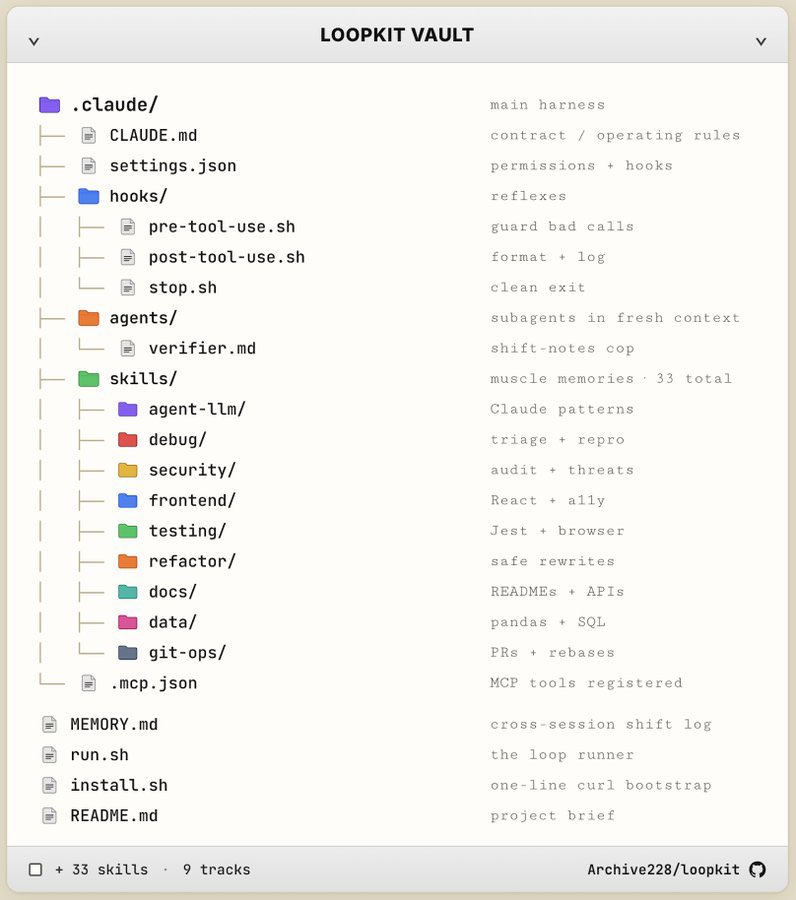

一个人干整个团队的活，年入120万美金。

你以为是天赋？是模型选得好？

都不是。

这位Anthropic高级工程师被问到秘诀时，一个字没解释，直接甩出了他的 .claude/ 文件夹。

同一个模型，有人用它写周报，有人用它当整个团队用。区别不在你用的是Opus还是Sonnet——在于你给AI装了什么样的“操作系统”。

他的文件夹长这样：

CLAUDE.md —— 主合约，定义AI的角色和行为准则
settings.json —— 权限和配置，限制AI能做什么不能做什么
hooks/ —— 自动反射，每次对话后自我复盘
agents/verifier —— 专门挑错的“警察AI”，盯着主AI别犯错
skills/ —— 33+个可复用技能，像肌肉记忆一样随时调用
.mcp.json —— 连接外部工具，让AI能动手干活
MEMORY.md —— 活记录，每一步决策和理由都记下来
最骚的是啥？

你不再跟AI聊天了。你写好这个文件夹，文件夹替你执行AI。每一次对话，AI自动加载这些规则、权限、记忆、技能——像一支经过严格训练的精英团队在替你干活。

他已经把完整结构公开了，复制粘贴就能用。

### 🖼️ Attached Media

## 💬 Replies

### 1 @hanqing1120 (hanqing)

*Sat Jul 11 15:03:22 +0000 2026*

@0xQiYan 你还在纠结选哪个模型，人家已经把AI打造成了需要HR部门的那种团队。

### 2 @nikiburstr8x (nikiburstr8x)

*Sat Jul 11 13:33:41 +0000 2026*

@0xQiYan 

### 3 @ResearchKONG (卖飞哥 🐊（互 F 🤝 学习）)

*Sun Jul 12 06:18:14 +0000 2026*

@0xQiYan 模型能力只是起点，真正拉开差距的是权限、记忆、工具和验证流程能否组合成稳定系统，复制文件夹也不能跳过调试。

### 4 @An_yhl (晚晚)

*Sat Jul 11 13:46:41 +0000 2026*

@0xQiYan 这年头差距都藏在配置文件里了

### 5 @gamewithnumber (lifepolish)

*Sun Jul 12 05:13:10 +0000 2026*

@0xQiYan Mark

### 6 @CarlMoneyBagz (CoinP95%返佣指南)

*Sat Jul 11 13:29:19 +0000 2026*

@0xQiYan 底层逻辑才是拉开差距的关键

