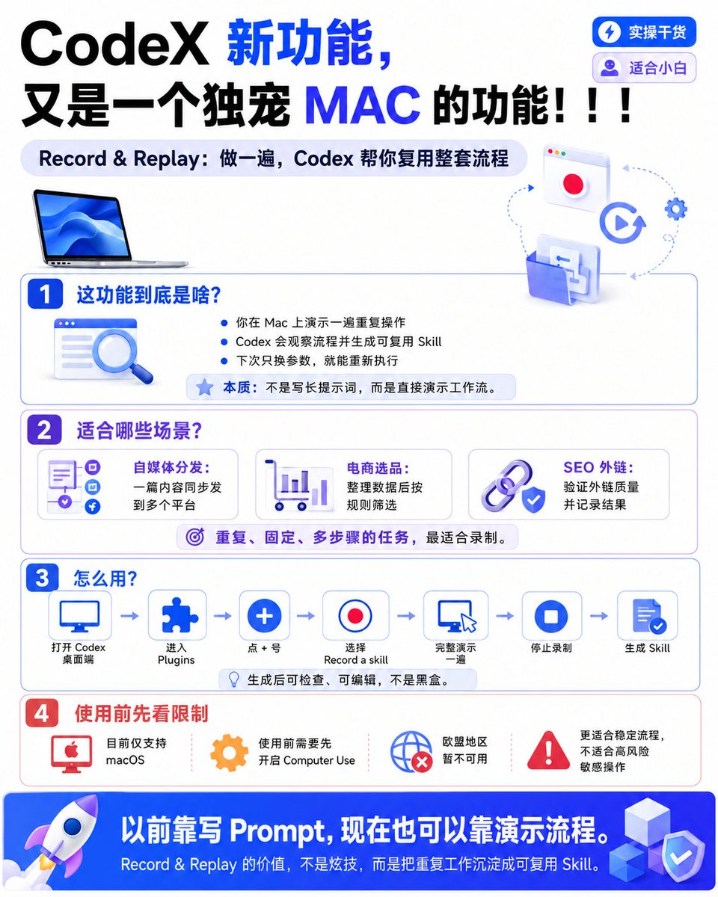
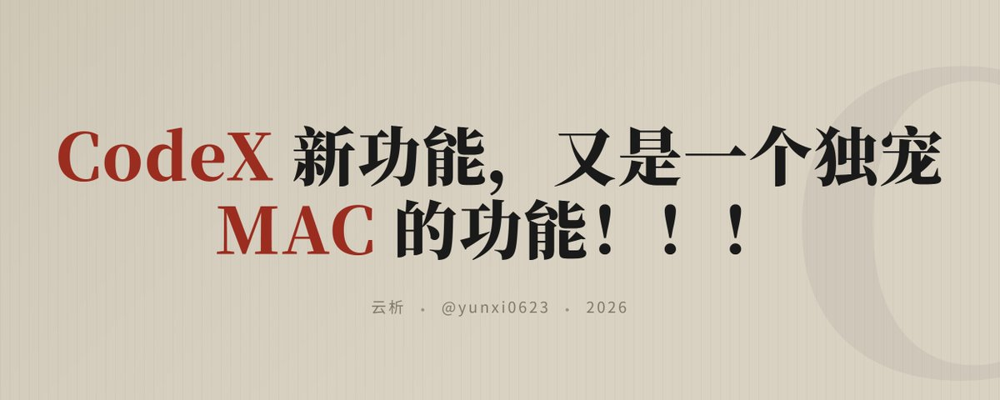

# 📰 CodeX 新功能，又是一个独宠 MAC 的功能！！！

Codex 又上新功能了，但这次 Windows 用户看完可能要沉默了：Record & Replay 目前还是一个“独宠 Mac”的功能。

这功能到底是干嘛的？

一句话说清楚：你在 Mac 上把一套重复操作演示一遍，Codex 会把它整理成一个可复用的 Skill。

不是让你写一大段 Prompt。
也不是让你手搓一份复杂 SOP。
而是你亲自做一遍，Codex 在旁边看一遍，然后帮你总结成可复用流程。

## [1️⃣](https://abs.twimg.com/emoji/v2/svg/31-20e3.svg) Record & Replay 是什么？

Record & Replay 可以理解成：录制你的操作 → Codex 分析流程 → 生成 Skill → 下次换参数复用。

比如你有一个固定工作流：

每周导出一份报表。
整理表格字段。
上传到某个系统。
填写固定表单。
提交之后再检查结果。

以前你要让 AI 做这件事，得写很长一段说明：

先点哪里。
再选什么。
字段怎么填。
遇到弹窗怎么办。
结果怎么判断成功。

但现在它的思路是：你不用先写说明书，你先完整操作一遍。

Codex 观察后，会生成一个 Skill，里面大概会包含：

- 什么时候使用这个流程

- 需要哪些输入参数

- 应该按什么步骤执行

- 如何验证任务完成

- 哪些细节需要注意

重点是：生成后的 Skill 不是黑盒，你可以检查，也可以手动改。

## [2️⃣](https://abs.twimg.com/emoji/v2/svg/32-20e3.svg) 它适合哪些人？

但如果你有大量重复流程它就很适合。

比如：

[✅](https://abs.twimg.com/emoji/v2/svg/2705.svg) 自媒体运营

一篇文章写完后，要分发到小红书、公众号、知乎、X、Medium。

每个平台要求都不一样：

标题长度不同。
正文格式不同。
标签不同。
封面图位置不同。
链接放置方式不同。

这类流程很烦，但步骤相对固定。

[✅](https://abs.twimg.com/emoji/v2/svg/2705.svg) 电商选品

从多个平台导出商品数据。

然后整理：

销量。
价格。
评论数。
上架时间。
竞品数量。
利润空间。

再按固定规则做第一轮筛选。

这种任务每次输入数据不同，但判断路径类似。

[✅](https://abs.twimg.com/emoji/v2/svg/2705.svg) SEO 外链

先导出竞品外链。

再逐个判断：

这个外链是否相关。
是否能提交。
是否有价值。
是否需要记录到表格。
是否进入下一轮执行。

这类流程写成文字很长，但演示一遍反而更清楚。

[✅](https://abs.twimg.com/emoji/v2/svg/2705.svg) 行政/财务/表单类重复任务

比如报销、请假、周报、CRM 录入、系统后台配置。

这些任务往往不是技术难，而是步骤多、页面多、细节多。

## [3️⃣](https://abs.twimg.com/emoji/v2/svg/33-20e3.svg) 小白怎么用？

使用路径大概是这样：

打开 Codex 桌面端
→ 进入 Plugins
→ 点击加号
→ 选择 Record a skill
→ 给 Codex 一点背景说明
→ 开始演示你的操作
→ 完整做一遍流程
→ 停止录制
→ Codex 生成 Skill
→ 检查并编辑 Skill
→ 下次新会话中调用这个 Skill

举个例子。

你可以录一个“文章多平台分发”的流程。

开始录制前先告诉 Codex：

我要录制一个文章分发流程。
目标是把同一篇文章根据不同平台要求，分别整理标题、正文、标签和封面说明。
之后每次使用这个 Skill 时我会提供原始文章和目标平台。
请重点记录每个平台的格式差异和检查步骤。

然后你正常操作一遍。

比如：

打开文章。
复制标题。
改成小红书标题。
整理标签。
检查封面文案。
再切换到另一个平台。
按另一个平台格式处理。
最后保存结果。

录完后Codex 会帮你把这个流程整理成 Skill。

下次你就可以直接说：

请使用我的文章分发 Skill。
这次原文是下面这篇，目标平台是小红书、公众号和 X。
请按之前录制的规则处理。

这就是它的价值：不是每次重新讲流程，而是把流程沉淀成可复用能力。

## [4⃣](https://abs.twimg.com/emoji/v2/svg/34-20e3.svg) 它不是万能的自动化

Record & Replay 不是万能脚本。
不是所有任务录一遍就能完美复用。
也不是所有 Codex 用户现在都能用。

目前它有几个重要限制：

第一，目前主要是 macOS

这也是为什么我说它又是一个“独宠 Mac”的功能。

Windows 用户现在先别急着跟风折腾，看到入口之前可以先当作了解趋势。

第二，需要开启 Computer Use

因为 Codex 需要观察和操作图形界面。

在 Mac 上一般还要给它相关系统权限，比如屏幕录制、辅助功能权限。

这一步很多新手可能会卡住。

第三，不适合高风险操作

比如：

支付。
转账。
删库。
改安全设置。
提交不可撤回申请。
处理密码、密钥、Cookie、Token。

这些任务即使能录，也不建议交给它自动跑。

能让 AI 做重复劳动，但不要让 AI 替你承担高风险决策。

第四，页面变化太频繁的流程不稳定

如果一个网站按钮经常变，页面经常改，登录经常跳验证，那么录出来的 Skill 也可能不稳定。

所以更适合录制：

步骤稳定。
页面稳定。
成功标准明确。
风险可控的流程。

## [5⃣](https://abs.twimg.com/emoji/v2/svg/35-20e3.svg) 我怎么看这个功能？

我觉得 Record & Replay 真正重要的地方不是“它能录屏”。

而是它代表了一种变化：AI 工作流正在从“写提示词”，走向“演示流程”。

以前你得把每一步都解释清楚。
以后你可以先做一遍，让 AI 学你的流程。

这对普通人反而更友好。

因为很多人不会写复杂 Prompt，也不会写自动化脚本，但会操作软件。

你让他说清楚每一步他可能说不明白。
但你让他做一遍他马上就能做出来。

这就是 Record & Replay 有意思的地方。

## 最后总结

如果你的工作里有大量重复流程，Record & Replay 值得关注。

尤其是内容分发、电商选品、SEO 外链、报表整理、后台录入这些场景。

这类任务不一定难，但一直重复做真的烦。

而 AI 最先接管的可能就是这些“你会做，但不想重复做”的事情。

### 🖼️ Attached Media

## 💬 Replies

### 1 @zhouluobo (zhouluobo)

*Wed Jul 01 14:05:53 +0000 2026*

@yunxi0623 这个功能基本上就是rpa的翻版了感觉，以后自动化测试啥的要轻松很多了

### 2 @yunxi0623 (云析) (Author)

*Wed Jul 01 14:22:21 +0000 2026*

@zhouluobo 是的

### 3 @linsir08 (五知见)

*Thu Jul 02 08:20:52 +0000 2026*

@yunxi0623 佬 文章最后面信息图skill能分享下吗？

### 4 @yunxi0623 (云析) (Author)

*Thu Jul 02 11:50:17 +0000 2026*

@linsir08 文章最后面的配图吗？

### 5 @Xing_zi_xing (星子星 Xingzixing)

*Wed Jul 01 14:16:35 +0000 2026*

@yunxi0623 正准备用，不过我之前选品已经用codex就能胜任了

### 6 @JasonJxm1997 (百特曼AI)

*Thu Jul 02 02:06:46 +0000 2026*

@yunxi0623 没买 MacBook 这下只有当下等公民了

### 7 @spcxap (Zhou)

*Wed Jul 01 23:43:09 +0000 2026*

@yunxi0623 正好需要这个，谢谢分享

### 8 @aken780 (阿肯)

*Wed Jul 01 14:37:22 +0000 2026*

@yunxi0623 还好买了个 mac mini😂

### 9 @xixiliren381057 (query)

*Thu Jul 02 02:25:38 +0000 2026*

@yunxi0623 优先上mac，后续应该会补上windows 吧？

### 10 @leosg6666 (赛博狮哥🦁)

*Wed Jul 01 14:33:34 +0000 2026*

@yunxi0623 独宠mac令人难受，苹果大涨价了……

### 11 @longlong_sky (Skivein)

*Wed Jul 01 14:05:44 +0000 2026*

@yunxi0623 可以可以🍎

### 12 @niuerxiong1 (neilson)

*Thu Jul 02 01:10:51 +0000 2026*

@yunxi0623 可惜不是mac用户

### 13 @hutianye1992 (𝘊𝘳𝘺𝘱𝘵𝘰 𝘏𝘶𝘨𝘰 胡)

*Wed Jul 01 17:27:47 +0000 2026*

@yunxi0623 这有点像hermes的功能

### 14 @ifun_au (iFun AU)

*Thu Jul 02 02:25:47 +0000 2026*

@yunxi0623 写出来的skill不能移植吗

### 15 @xinlingyidian (GOU HUANQIANG)

*Wed Jul 01 16:38:40 +0000 2026*

@yunxi0623 👍

### 16 @JieJing73654 (HonorJie（关注必回）)

*Wed Jul 01 17:32:31 +0000 2026*

@yunxi0623 有mac大佬能体验到不少功能

### 17 @OceanZhc (skyocean)

*Thu Jul 02 05:48:03 +0000 2026*

@yunxi0623 学（用） AI，第一步去windows化🤪

### 18 @Yaolm0y (Yao)

*Thu Jul 02 07:27:54 +0000 2026*

@yunxi0623 第一批优化掉只会执行的人；第二批优化掉会执行+会构建SOP+会表达的人；第三批是不是练做决策的人都要开始优化了……；如何让人们不焦虑呢？，共产主义真的会到来吗？，还是说穷人只能成为耗材……

