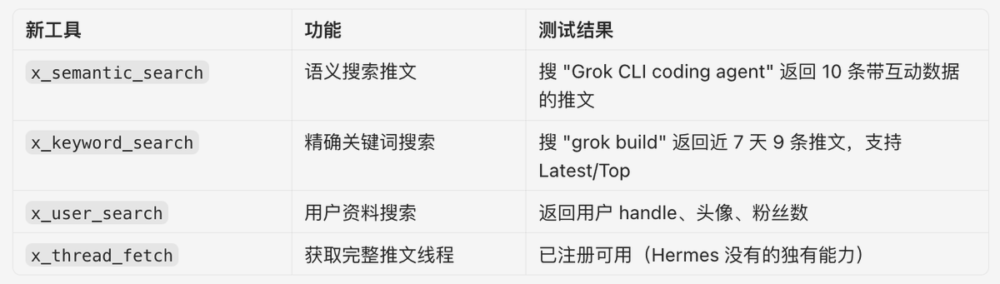

你的 AI Agent 现在能搜推特了。

Grok CLI 终于把 Twitter 的搜索能力给内置了。

X 官方搜索 API 很贵，Grok 这次加了 4 个搜索工具：

1、x\_keyword\_search：最强的一个，完整支持所有高级搜索操作符，from:、since:、min\_faves:、filter:images，Top/Latest 模式都有
2、x\_semantic\_search：语义搜索推文，支持日期范围和相关性过滤
3、x\_user\_search：搜用户
4、x\_thread\_fetch：抓完整推文线程，父帖加所有回复

关键是这东西在本地，你的 Agent 随时能调用，背后直接连着 Twitter 实时信息，价值巨大。

### 🖼️ Attached Media

## 💬 Replies

### 1 @zhang_baoqing (一地鸡毛)

*Mon Jun 01 13:32:38 +0000 2026*

@gkxspace 应该需要开通会员吧

### 2 @gkxspace (余温) (Author)

*Mon Jun 01 13:53:44 +0000 2026*

@zhang\_baoqing 免费额度给的很足

### 3 @daodao166888 (刀刀)

*Mon Jun 01 14:12:30 +0000 2026*

@gkxspace 有现成的谷歌插件，XQuery，你试试看，超级好用\~
要是搞不明白，就去我主页-文章里，往下能找到这篇教程 

### 4 @gkxspace (余温) (Author)

*Mon Jun 01 14:47:53 +0000 2026*

@daodao166888 感谢

### 5 @connorailab (Connor_AI)

*Mon Jun 01 11:50:53 +0000 2026*

@gkxspace 终于...

### 6 @gkxspace (余温) (Author)

*Mon Jun 01 11:51:25 +0000 2026*

@connorailab 可算...

### 7 @coolish (paulwei)

*Tue Jun 02 04:41:25 +0000 2026*

@gkxspace 不止如此，如果是 Grok + X API，
还可以这样：[x.com/coolish/status…](https://x.com/coolish/status/2053246840028774459)

### 8 @huoshan007 (火山哥🕊️)

*Wed Jun 03 01:46:41 +0000 2026*

@gkxspace 搜推特可算安排上了，这下找瓜连梯子都省了哈哈。

