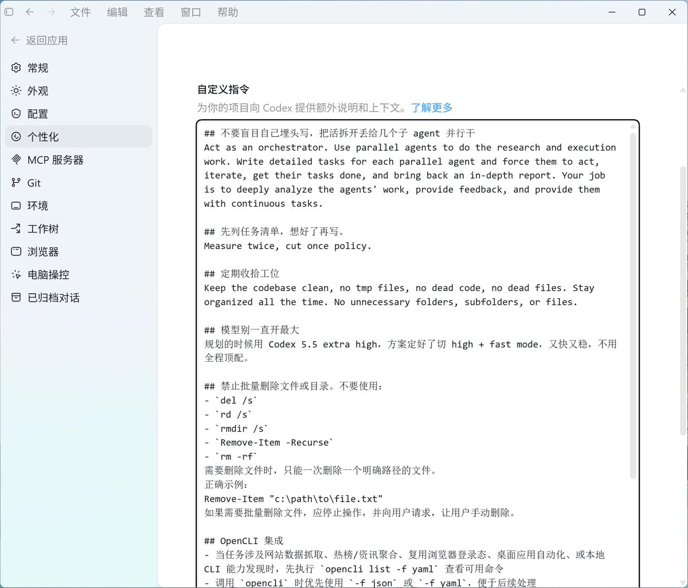

原来 Codex 桌面端也能直接用 /goal，这玩意儿太香了

1\. 先在终端里直接敲 \`codex features enable goals\`
2\. 重启一下 Codex
3\. 直接在聊天框开头打 \`/goal\` + 你的目标描述就行

目前桌面端 slash 菜单还没高亮显示 /goal，但可以直接用，启用后 goal 状态栏会自动跳出来

想让它真正用好 /goal，切记这几点：
1、目标一定要具体 + 可验证。比如：别写“帮我优化代码”，要写“把这个项目从 X 迁移到 Y，所有页面用 Playwright 测试保持视觉一致，测试通过率 100% 才算完成”。
2、用好子命令：\`/goal pause\` 暂停，\`/goal resume\` 继续，\`/goal clear\` 清掉当前任务，随时控场。
3、预算别忘控：长任务吃 token 猛，先在 config 里设上限。

### 🖼️ Attached Media

## 💬 Replies

### 1 @yaohui12138 (超级个体｜柿子)

*Wed May 13 13:24:56 +0000 2026*

@gkxspace 蹭蹭，现在claude也支持/goal了，而且还有新功能agent view，好用的很

### 2 @gkxspace (余温) (Author)

*Wed May 13 14:31:49 +0000 2026*

@yaohui12138 学到了，原来claude也能这样玩😋

### 3 @ffbaby_apt (ffbaby.apt 🧠 / .sui)

*Wed May 13 13:46:07 +0000 2026*

@gkxspace 不用的 直接 goal: XXXXX 就可以了

### 4 @gkxspace (余温) (Author)

*Wed May 13 14:32:09 +0000 2026*

@ffbaby\_apt 原来如此😑

### 5 @iBigQiang (强子手记)

*Thu May 14 11:08:12 +0000 2026*

@gkxspace 不知 /goal 这个命令是什么意思，前几天刚看到别人分享了一段指令，也是默认让他走多个子agent派任务并行的方式感觉还挺好用。cc我也经常遇到 搞一段时间任务还没走完 就提示超过32m大小了 让重新开启新任务 还没找到很好的方法，也用过多子agent同时分析代码还是会超容量 

### 6 @XiaoKooeye (Xiao Yang)

*Wed May 13 13:12:30 +0000 2026*

@gkxspace @Codex 桌面端也能直接用 /goal， 这里说的goal是什么，为啥作者这么激动？ 一般使用Codex 和在Codex里使用/goal，有什么优势？

### 7 @Keji715 (柯基是只猫)

*Thu May 14 11:16:53 +0000 2026*

@gkxspace 我老板要是知道下面这三点，就不会整天给我派一句话的目标了

### 8 @bangbuilds (Bangfa)

*Thu May 14 03:52:27 +0000 2026*

@gkxspace /goal 最有用的点是把“我要它干什么”从聊天里拎出来。任务一长，没有目标栏就很容易变成一路修一路忘。

### 9 @mylifcc (lifcc)

*Wed May 13 16:24:22 +0000 2026*

@gkxspace /goal 最容易被低估的不是 slash command，而是把“具体 + 可验证”挂进状态栏。长任务跑到一半时，这个边界比提示词本身更能防止任务散掉。

### 10 @ee4gaga (泉包)

*Wed May 13 16:51:24 +0000 2026*

@gkxspace 用goal的前提是 prompt非常精准，这既需要你知道codex能力的上限，也需要你对自己需求的精准把握。我还是喜欢用普通的，可以及时发现问题

### 11 @novacolasicu (novacolas)

*Thu May 14 02:02:58 +0000 2026*

@gkxspace /goal 开发一个新的ai操作系统，然后结果呢？

### 12 @jasonchia58 (chan9900)

*Wed May 13 23:08:51 +0000 2026*

@gkxspace 桌面没提示，总以为没有

### 13 @harrisonitsme (森叔)

*Wed May 13 12:28:06 +0000 2026*

@gkxspace 太干了

### 14 @wei_wang (Wei)

*Wed May 13 15:38:38 +0000 2026*

@gkxspace 我用goal跑了一个内容系统出来，跑了快20小时

但我还没去看他做了个什么鬼给我

### 15 @saibomeigui (雨)

*Thu May 14 21:47:34 +0000 2026*

@gkxspace 我想请教下桌面端和终端使用有啥区别，我的cc也是在桌面端用的😂

### 16 @songofhawk (Harry Smart)

*Sun May 24 04:24:33 +0000 2026*

@gkxspace 为什么我这儿在桌面版就看不到呢？我已经更新了最新的桌面版，用 chatGPT 账号登录。而且我在 cli 里可以用 /goal 模式的。为什么桌面版，就看不到这个命令呢？

### 17 @samly_1220 (myevercareus)

*Thu May 14 11:34:07 +0000 2026*

@gkxspace 共同进步样子

### 18 @ailands19 (ailands19)

*Wed May 13 17:55:16 +0000 2026*

@gkxspace 怎么设token上限呢？

