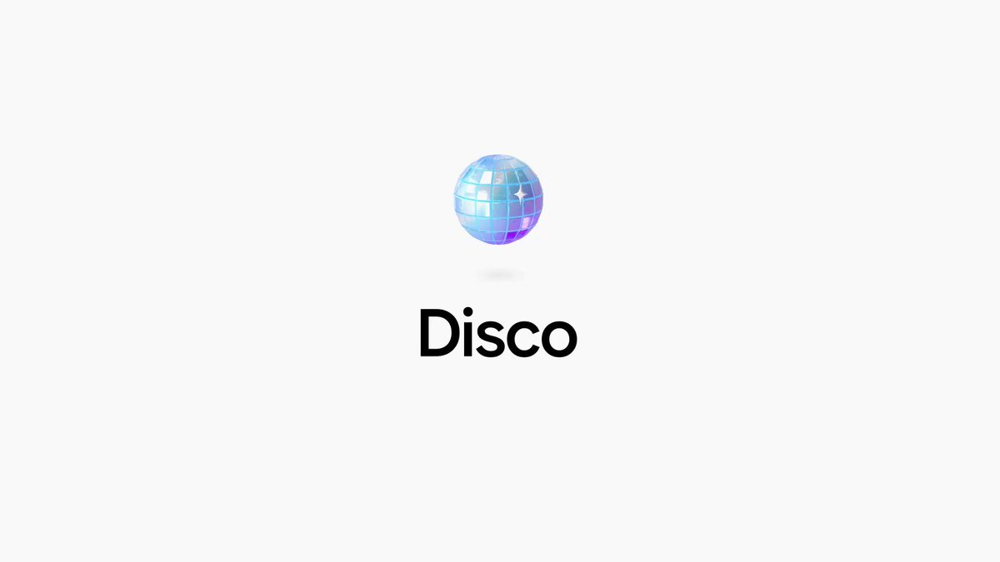

谷歌推出实验性AI浏览器Disco，浏览器大战再升级！
Disco的核心是由Gemini 3驱动的GenTabs功能，能把你的浏览行为直接生成一个可交互的定制化Web应用。查度假自动生成带地图的行程单，看食谱汇总成膳食计划，做研究生成可视化学习工具，完全不是传统浏览器只展示信息的逻辑。
这和OpenAI的Atlas形成鲜明对比：Atlas喊着要终结Chrome垄断，本质还是把AI当插件嵌进传统浏览器，难逃 “旧瓶装新酒” 的局限。最关键的是，Atlas是在谷歌的Chromium开源框架上做的，所以它的创新只能停留在叠加一些表层功能；而谷歌作为架构主导者，天然手握底层主动权。尽管Disco目前还是实验性产品，未来落地存在不确定性，但一场围绕 AI 浏览器的全新大战，已然正式拉开序幕。

### 🖼️ Attached Media

## 💬 Replies

### 1 @domainname (Jack@DN.com)

*Tue Dec 16 15:24:02 +0000 2025*

@FuSheng\_0306 大家都使用浏览器利好域名！

### 2 @makai1201 (三掌柜)

*Tue Dec 16 08:42:33 +0000 2025*

@FuSheng\_0306 从展示到生成，Disco彻底重构了交互。相比Atlas的改良，谷歌正利用底层架构权实施降维打击，定义未来入口。

### 3 @PastoralHu (Hu David)

*Tue Dec 16 13:36:55 +0000 2025*

@FuSheng\_0306 此前，马斯克表示未来手机上只有一个应用（大意如此），大概指的就是所有交互都由AI模型动态生成甚至在运行/交互过程中随时生成的意思吧，就是不知道对算力要求有多高

### 4 @harrisonitsme (森叔)

*Wed Dec 17 03:52:53 +0000 2025*

@FuSheng\_0306 AI浏览器这么激烈，还得是Google出手

### 5 @USJJ0420 (Mr. Tiger 🇺🇸)

*Tue Dec 16 21:40:51 +0000 2025*

@FuSheng\_0306 waiting list, thank you!

### 6 @shuizhuyu (Crio Songo)

*Tue Dec 16 09:08:23 +0000 2025*

@FuSheng\_0306 不破不立，google终于敢对自己下手了。

### 7 @thejoven_com (thejoven - ElizaOS)

*Tue Dec 16 09:44:33 +0000 2025*

@FuSheng\_0306 Lab 还有多少宝藏没拿出来的 😆

### 8 @LQGWarpSpeed (WarpSpeed)

*Tue Dec 16 12:18:26 +0000 2025*

@FuSheng\_0306 都在摸索新时代的抖音级端口

### 9 @Fantersi (饭特稀)

*Wed Dec 17 01:55:49 +0000 2025*

@FuSheng\_0306 现在的浏览器没一个能打过chrome

### 10 @bbu66396115 (Arthur.eth)

*Wed Dec 17 13:47:08 +0000 2025*

@FuSheng\_0306 谷歌最善于做教育

### 11 @hongjuehome1 (春觉)

*Tue Dec 16 13:52:50 +0000 2025*

@FuSheng\_0306 感觉人类进入了高速发展时代

### 12 @Peroperokun_nkl (ペロペロ君)

*Tue Dec 16 15:40:26 +0000 2025*

@FuSheng\_0306 交互过于复杂 上网如同上班

### 13 @Leonspace (iLeon)

*Thu Dec 18 03:33:45 +0000 2025*

@FuSheng\_0306 真正的狠人就是对自己动刀子😄

### 14 @kianaokaslana (Alyen)

*Wed Dec 17 06:54:44 +0000 2025*

@FuSheng\_0306 夸克的AI浏览器让我对AI浏览器的印象变得非常差。

### 15 @pandionkk (孙小帅 kk)

*Wed Dec 17 00:42:42 +0000 2025*

@FuSheng\_0306 谷歌还是太全面了

### 16 @AntipasRinger (Antipas)

*Tue Dec 16 15:42:43 +0000 2025*

@FuSheng\_0306 AI不只是“助手”，而是浏览器大脑，直接从你的浏览痕迹中“长出”个性化工具

### 17 @HowieC40427667 (BlackBerry)

*Wed Dec 17 06:33:49 +0000 2025*

@FuSheng\_0306 How about Perplexity? I think that is better than Chrome.

### 18 @Danielcao348770 (Daniel cao)

*Tue Dec 16 09:48:30 +0000 2025*

@FuSheng\_0306 把 learning about 装进对内容的理解里去了。

### 19 @LoveTechCalvin (iLoveTech)

*Tue Dec 16 13:31:02 +0000 2025*

@FuSheng\_0306 哪里能下载了吗？

### 20 @DougZeng (Doug Zeng)

*Tue Dec 16 15:20:48 +0000 2025*

@FuSheng\_0306 浏览器这个赛道还有的挖掘吗

### 21 @ptulongyou (林骅)

*Tue Dec 16 10:15:49 +0000 2025*

@FuSheng\_0306 还得再观察一下，等waitlist中，现在说革命还太早了。感觉这本质还是想掌控浏览入口，控制访问内容分发的权利，只不过通过AI加了一层归纳总结。未来商业模式不会又走回向内容方收过路费的老路上吧？

### 22 @Hey_BobAI (Bob | AI playground)

*Wed Dec 17 07:33:44 +0000 2025*

@FuSheng\_0306 谷歌 Disco 这波操作，简直是给 OpenAI 上了一课。

Atlas 还在那是 Chrome 的“精装修版”，想着怎么作为插件活得更好；Disco 的 GenTabs 直接把网页当素材，现场给你生成 App。

