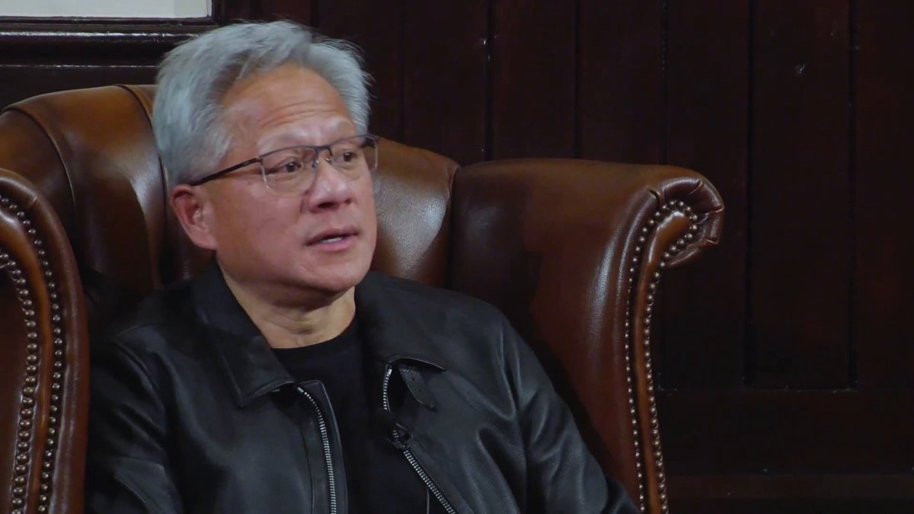

黄仁勋：创新不是从精英里挑出来的，是从试错里长出来的；末位淘汰不是激励，是扼杀活力。 

## 💬 Replies

### 1 @niqislucky (niq)

*Wed Nov 26 03:19:00 +0000 2025*

@FuSheng\_0306 被规则选出来的人，只适合维持规则。
无法被规则选出来的人，才会创造新规则。

### 2 @Jamesweb3dao (0xJamesZ)

*Thu Nov 27 05:13:09 +0000 2025*

@FuSheng\_0306 这到底说给谁听的哈哈哈

### 3 @TheNthReality (The Nth Reality)

*Tue Nov 25 15:04:59 +0000 2025*

@FuSheng\_0306 现在国内的好多企业搞末尾淘汰制，导致员工处于恐惧中，人人自危，需要在leader面前强力表现，往往会用力过猛。曾经在某大厂的白色恐怖时期，本来一个会议只需要几个人参加的，应是参加了20-30人，大家担心丢掉任何工作的上下文，丢掉任何表现的机会。

### 4 @wjsjw (wjs)

*Tue Nov 25 12:07:23 +0000 2025*

@FuSheng\_0306 但凡不搞末位淘汰的都算是好老板，好公司。

### 5 @Pink_Piglet002 (SweetHeart3.0 🐬TermMax)

*Tue Nov 25 16:17:13 +0000 2025*

@FuSheng\_0306 我靠，真的好新颖的说法，确实是这样的，现实里很多公司用末位淘汰机制来管理，这种机制真的压制年轻人的大胆尝试，让人更倾向于保守而不是创新。如果末位淘汰制度盛行，那些试错型创新者可能会因为一次失败被裁掉，而没有机会反弹

### 6 @joe19891984 (𝓙𝓸𝓮)

*Tue Nov 25 14:22:46 +0000 2025*

@FuSheng\_0306 没必要把黄仁勋的成功全部归功于他的管理智慧，站在风口上，猪都能给飞，黄只是碰巧站在了AI暴力大模型的风口，他一飞冲天的理由当然有他的智慧，但更重要的是时机，中国人貌似很喜欢造神，喜欢背语录

### 7 @PssBerg (Berg Guo)

*Wed Nov 26 01:45:32 +0000 2025*

@FuSheng\_0306 勇敢在公众面前暴露自己的缺点，从错误中学习，是通往创造者的一条路。

### 8 @jjamesw1 (紫水晶Amethyst)

*Wed Nov 26 18:20:27 +0000 2025*

@FuSheng\_0306 华为就是末位淘汰的集大成者。
不过，华为从来不搞创新，只要抄袭就行了。

### 9 @xiyinli1 (xiyinli)

*Tue Nov 25 14:27:29 +0000 2025*

@FuSheng\_0306 国内很多互联网公司都是末位淘汰制，比如阿里

### 10 @HEason3886 (Eason)

*Wed Nov 26 02:32:30 +0000 2025*

@FuSheng\_0306 末位淘汰是韦尔奇发明的，他在 1981 年出任通用电气 CEO 后推出了 “活力曲线” 管理法则，这正是末位淘汰制的核心形态。每年评估，将员工划分为三类 ：20% 优秀员工（A 类）、70% 合格员工（B 类）和 10% 落后员工（C 类）。C 类员工会获得 1 - 2 年的改进缓冲期，若逾期无明显进步便会被解雇。

### 11 @apple292939 (apple)

*Tue Nov 25 22:16:45 +0000 2025*

@FuSheng\_0306 我曾经面试过一家公司做业务，面试时跟我说3个月之后实施 末位淘汰……我果断下头，

### 12 @wumaowumao8888 (wumaowumao)

*Wed Nov 26 04:02:30 +0000 2025*

@FuSheng\_0306 主要是钱太多了 就可以装比了。哎

### 13 @baarlock (洛神父🐱)

*Wed Nov 26 04:07:18 +0000 2025*

@FuSheng\_0306 阿里、华为....

### 14 @Coma_Magnolia (Coma Magnolia)

*Tue Nov 25 21:18:37 +0000 2025*

@FuSheng\_0306 我去 黄仁勋不讲小故事的时候老有智慧了 🤣🤣

### 15 @OpqrBb10659 (Opqr bb)

*Wed Nov 26 09:12:03 +0000 2025*

@FuSheng\_0306 有没有大多数公司都不需要创新？都是将新技术转化为产品的劳力？各行各业只有头部的极少从业者在创新

### 16 @JustinBao_ (Justin Bao)

*Thu Nov 27 07:42:18 +0000 2025*

@FuSheng\_0306 一直记着老黄说的这句话，确实是英伟达一路走来的真是写照。[x.com/JustinBao\_/sta…](https://x.com/JustinBao_/status/1765287107977961653?s=20)

### 17 @CERBERUSDAO (Hieu Truong)

*Sat Jan 17 06:02:13 +0000 2026*

@FuSheng\_0306 unironically true

### 18 @MingfeiGuo (Mingfei Guo)

*Tue Nov 25 18:06:12 +0000 2025*

@FuSheng\_0306 好像今天早上在 NVIDIA 遇到你们😷很眼熟但
没戴眼镜不太确定

### 19 @d1lr (dllr)

*Mon Dec 08 22:43:42 +0000 2025*

@FuSheng\_0306 试错像杂草丛生，创新就在那乱窜里冒头。

### 20 @Victor_H_Tsai (Let it B)

*Wed Nov 26 13:39:24 +0000 2025*

@FuSheng\_0306 這段視頻哪裡怪怪的，臉會突然位移、閃爍？

### 21 @MariaElenaRuiz9 (DeFi Maria)

*Sat Jan 17 07:01:32 +0000 2026*

@FuSheng\_0306 exactly 
trial-and-error builds real innovation, forced ranking just kills the courage to fail fast

### 22 @Rolex_Core (POLLEN🔸)

*Tue Nov 25 11:56:56 +0000 2025*

@FuSheng\_0306 有道理，现在全世界都缺乏创新力！

### 23 @paul_928 (Paul Lo)

*Wed Nov 26 04:23:28 +0000 2025*

@FuSheng\_0306 應該改為：一年中試錯比率為5%末段的淘汰。
這樣所有員工就拼了命地嘗試各種方式試錯。

### 24 @DaddyTech (DaddyTech)

*Wed Nov 26 04:31:46 +0000 2025*

@FuSheng\_0306 就像好产品是从好公司里“长”出来的一个逻辑吧～

### 25 @nliu6964 (nliu)

*Thu Nov 27 21:00:44 +0000 2025*

@FuSheng\_0306 有道理！但不絕對！因創新失敗被淘汰的少之又少，在一個集體中創新者絕對是少數.

### 26 @logantwittter (RRR1234 嗷)

*Wed Nov 26 02:43:06 +0000 2025*

@FuSheng\_0306 三星就是這樣變喪屍公司的
大家都追逐近利 惡性競爭

### 27 @Xingge888668 (COYPTO阿星💎)

*Tue Dec 09 18:38:25 +0000 2025*

@FuSheng\_0306 傅总转的这段太对了！老黄这话真说到点子上了，试错才是创新的土壤啊

### 28 @Xingge888668 (COYPTO阿星💎)

*Thu Dec 04 19:04:29 +0000 2025*

@FuSheng\_0306 老黄这话太对了，试错才是真创新啊！大佬互关一个？

### 29 @nilufar252n (lili)

*Wed Nov 26 13:37:34 +0000 2025*

@FuSheng\_0306 Amen

### 30 @debox419 (DeBox)

*Wed Nov 26 01:14:57 +0000 2025*

@FuSheng\_0306 这老哥在暗批中国是教育体制。

### 31 @SeatonYY (SeatonY)

*Wed Nov 26 01:53:24 +0000 2025*

@FuSheng\_0306 我就不信英伟达不搞KPI末尾淘汰！

### 32 @0xkdbon (0xKDBON 🌊 RIVER|.edge🦭)

*Fri Jan 16 06:37:14 +0000 2026*

@FuSheng\_0306 yeah and most people don’t get this at all

### 33 @lamleiwo (L（David）)

*Wed Nov 26 01:55:40 +0000 2025*

@FuSheng\_0306 本尊？

### 34 @ianhyp (Nothing&All)

*Tue Nov 25 16:57:29 +0000 2025*

@FuSheng\_0306 马斯克恰恰相反

### 35 @Bruh57426632 (Bruh)

*Tue Nov 25 15:20:41 +0000 2025*

@FuSheng\_0306 又来废话了，为了就是 H1-B

### 36 @pianruojingh (TOM VD)

*Thu Nov 27 06:25:23 +0000 2025*

@FuSheng\_0306 absolute

