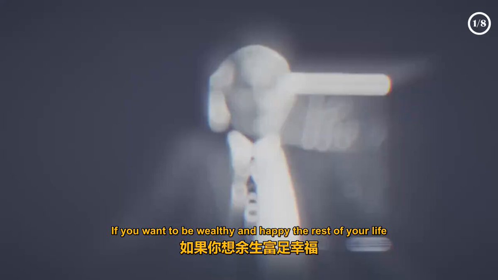

相信我，看完这个视频，定会对你的财富观念有翻天覆地般的改变！

如果你想余生富足幸福，只需学好这一课。吉姆·罗恩1981年的演讲，精典！

变的富有改变的三个步骤：

第一步：弄清事物运作规律

·  获取想法的三种具体方法：阅读、向成功人士学习、观察

第二步：立即行动

第三步：不试图击败系统 

## 💬 Replies

### 1 @cliuxinxin (Liuxinxin)

*Tue Oct 07 23:57:00 +0000 2025*

@binghe 我也刷到了，这人是谁？

### 2 @binghe (冰河) (Author)

*Wed Oct 08 04:47:01 +0000 2025*

@cliuxinxin 哥，你看我写的字。

### 3 @qiansun348944 (u j m kohg g s 321)

*Tue Oct 07 14:27:52 +0000 2025*

@binghe @grok 将视频内容给我总结出200字要求对我有帮助

### 4 @binghe (冰河) (Author)

*Tue Oct 07 14:39:02 +0000 2025*

它给你总结不出来，我给你总结吧。

自我提升与人生改变指南

引言

如果你想余生富足幸福，只需学好这一课。

自我提升的重要性

要学会在自我提升上比工作上更努力。根据经验，收入不会远超个人发展。有时收入会幸运地暴涨，但除非你同步成长，财富终将回归原点。生活充满奇妙法则，若有人给你百万美金，你最好速成百万富翁，这样才能守住财富，否则终将消散。有人说，若将全球财富平分，很快会回流原主口袋。成功是吸引来的，而非追逐所得。所以与其追逐成功，不如专注自我成长。真正快乐不在所得，而在所成。

改变的三个步骤

若你已准备好改变，以下三个步骤将开启人生转变，改变你的人生、性格、生活方式，一切皆可改变。

第一步：弄清事物运作规律

要改变人生，真正需要的是想法，没有想法改变不了的事。舒尔夫教导说，主要问题在于缺乏想法。起初总以为没钱是问题，实际上缺乏的是创造财富的想法，不是缺钱，而是缺创意，有了想法就能改变一切。

要获取想法，需要持续学习探索：想成功就研究成功，想快乐就研究快乐，想致富就研究财富，不要听天由命，要系统学习。有人整天碰运气，这行不通，要研究能改变你经济状况和个人生活的事物。舒尔夫还提到，发现有效方法时记入日志，别用大脑当文件柜，记下来才能执行，反复研读，终有一天想法会生根发芽，显现在银行账户、衣着、性格和生活方式中。

获取想法的三种具体方法：
阅读：所有成功人士都是优秀读者，求知欲驱动阅读，他们渴望知识，持续阅读。标准教育带来标准结果，若要突破，必须自我教育。一本书可能节省五年时间，书中记录了他人的经验和方法，能教你如何更强大、更果断成为领导者，提升人格魅力。
向成功人士学习：与成功人士交流，比如请他们吃饭。若能让成功人士花两小时交谈，他们可能会分享改变人生的想法，让收入翻倍甚至增长数倍。但很多人不愿这样做，而实际上，花 50-100 美元请成功人士吃一顿饭，可能带来巨大回报。
观察：成功会留下线索，观察成功人士的行为模式。他们会反复做某些事，通过观察可以学到这些方法。比如观察他们如何握手、回应他人，甚至走路方式，这些都可能是成功的一部分。要做一个敏锐的观察者，不仅用眼睛看（sight），更要用头脑看（insight），用眼睛看到事物，用头脑看到答案。
第二步：立即行动

对改变人生而言，最令人兴奋的是你有能力让自己去做必要的事。在任何一天，你都能极大地改变人生方向。自律的关键是从微小的自律开始，因为小的自律会通向大的自律。除非你先应对小挑战，否则无法处理生活中的大挑战。列出所有你能做的事，立即行动，通过这些行动锻炼自律能力，为应对大挑战做好准备。

第三步：不试图击败系统

人生改变还需要一个注意事项：不要试图击败系统，要弄清系统如何运作，然后按规律行事，而不是走捷径、找廉价答案。有些人学了一点就开始投机取巧，最终只会得到廉价的人生。要找到最佳方法并坚持去做，即使看起来需要更长时间，也要坚持正确的做法，不向错误妥协。

结语

1981 年的今天，深入挖掘自己，发挥那些未被利用的人类潜能，它们正等待被运用，然后你可以改变任何你想改变的事情。我挑战你这样做，因为你能改变。从今晚开始，你不必再保持原样，这只是选择问题。明天开始，你要做什么来改变人生方向？这是个好问题，明天开始做什么会带来不同？如果你明天不做任何能带来改变的事，猜猜会怎样？一切都会保持原样，未来五年会和过去五年一样，除非你从明天开始行动。你可以彻底改变、稍微改变、改变某些事，或者不改变，这是选择的时刻，你可以做任何想做的事，但重要的是要知道，任何一天你都可以改变整个人生。

### 5 @laoposhuodedui (田哥到哪都潇洒)

*Tue Oct 07 00:45:27 +0000 2025*

@binghe 后面有股票、期货大神请点拨一下我，
如果深入学习、贯彻“海龟交易法”
能否和当初海龟们一样，依靠数学、纪律获得财富自由，🙏谢谢你们了。

### 6 @JoyceCrystalWu1 (地球风云)

*Tue Oct 07 07:35:55 +0000 2025*

@binghe 在原有系统上有可能会出现极少数人富有，但绝不可能实现全民富有。不摧毁旧有系统，想实现全民皆富或者没有贫富差距，不过是白日做梦。
是只顾自己的富有，还是让全民皆富？这是拷问，也是反思。

### 7 @qingfengluanwu (web3｜ Hayek)

*Tue Oct 07 02:29:35 +0000 2025*

@binghe 这个视频真是个宝藏！吉姆·罗恩的演讲总是让人醍醐灌顶。

### 8 @chagan675426 (chagan)

*Tue Oct 07 03:28:59 +0000 2025*

@binghe 值的反复观看

### 9 @SEAMOUNT1976 (YANG)

*Tue Oct 07 15:10:39 +0000 2025*

@binghe 全文没有一句废话，全部都是干货。比我总结的好很多。

### 10 @Georgeistrue (George（马年大吉）)

*Tue Oct 07 11:25:01 +0000 2025*

@binghe great video，truly helpful

### 11 @Evander1980 (Evander)

*Mon Oct 06 17:07:00 +0000 2025*

@binghe Extremely valuable video, thanks for sharing.

### 12 @Ouyu2025 (oY)

*Tue Oct 07 10:52:42 +0000 2025*

@binghe 非常棒的视频推送。让我豁然开朗

### 13 @ethan_realone (Anker)

*Sun Oct 12 15:09:46 +0000 2025*

@binghe 真是牛逼，短短12分钟将精华幽默的输出，那还是1981年。这里面学习阅读永不褪色，保持学习力，好奇心才能接触到这些。

### 14 @myt029 (旭铭)

*Wed Oct 08 01:48:27 +0000 2025*

@binghe @grok 把这个视频下载链接发出来。

### 15 @Judy19812 (Judy1981)

*Tue Oct 07 19:26:40 +0000 2025*

@binghe 非常好的演讲，感谢分享！

### 16 @Nan16667993 (Nan)

*Mon Oct 06 23:43:10 +0000 2025*

@binghe @HeadlinerClip

### 17 @MINGZOU269951 (MING ZOU)

*Tue Oct 07 16:46:22 +0000 2025*

@binghe great doing

### 18 @nozL4WtUKK14xB0 (金正)

*Tue Oct 07 19:14:11 +0000 2025*

@binghe 第一步与第二步冲突了

