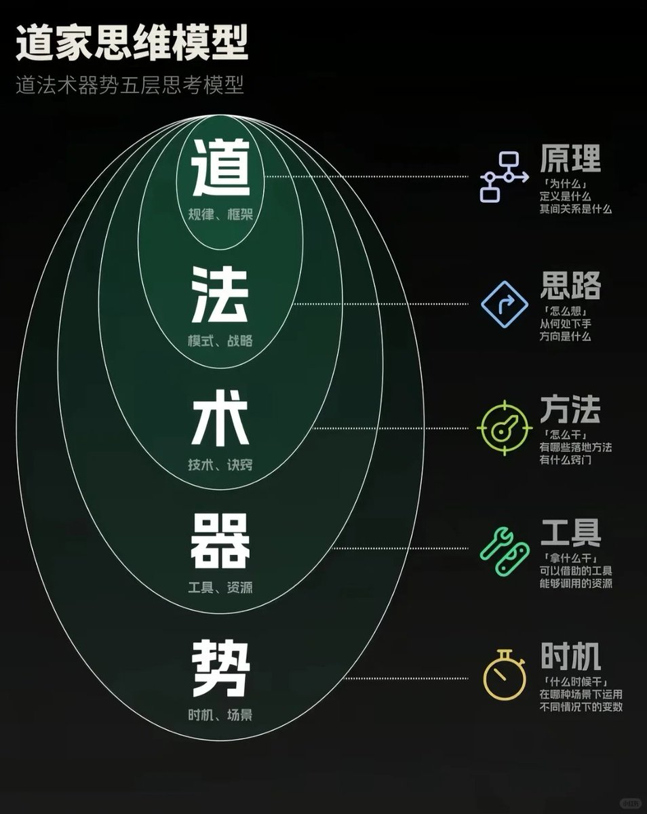
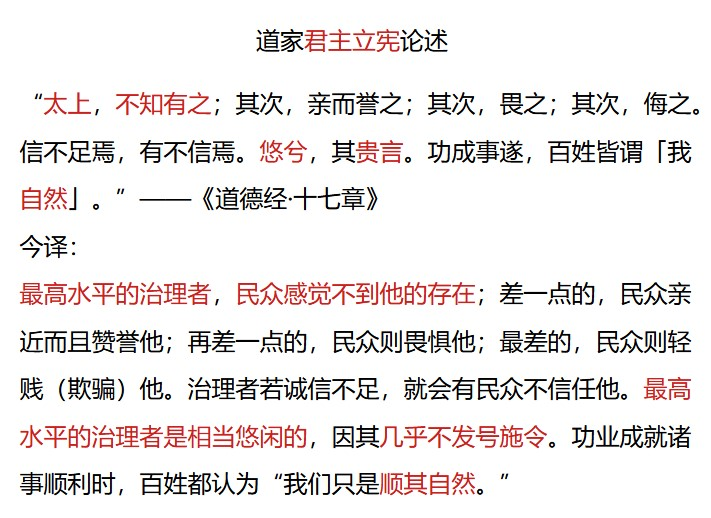
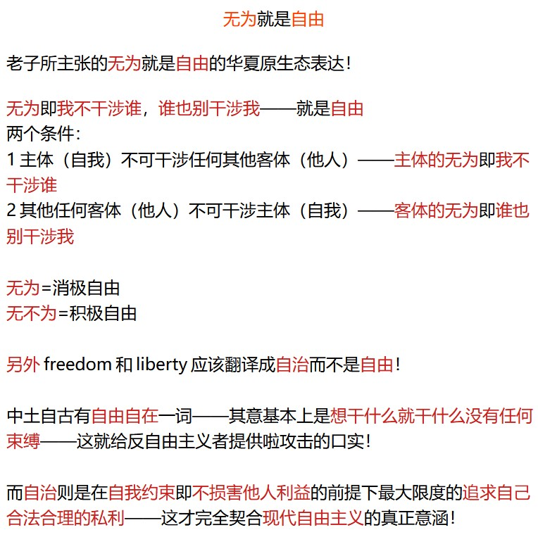
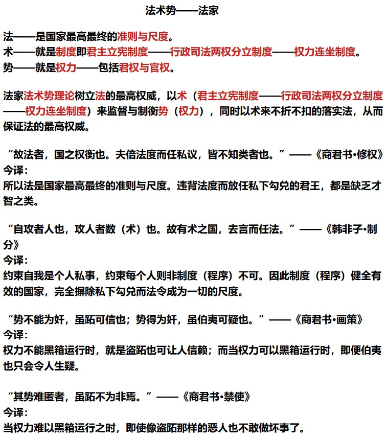

这张图，是源自道家的非常有效的思考框架图——道法术器势 
简单又实用，暗合了道家提倡的“大道至简” 展开讲一下： 
道，是底层原理，首先想清楚“为什么做？
法，是思路和方向，弄清楚“往哪个方向去做？
术，是采用什么方法，解决“怎么干”的问题 
器，是工具和资源，靠什么干？ 
势，是时机和局面，什么时候开始和结束？

### 🖼️ Attached Media

## 💬 Replies

### 1 @yichunqiu1 (異春秋)

*Wed Nov 12 18:38:46 +0000 2025*

@xingxingli45573 

### 2 @yichunqiu1 (異春秋)

*Wed Nov 12 18:35:08 +0000 2025*

@xingxingli45573 道家的生存规则是：人法地，地法天，天法道，道法自然——《道德经》。
道是生物的生存规则即自然之法。
那么于人而言道具体是一种怎样的规定呢？
若要合于自然之法，道于人而言就是——人自由的本性和人对自由的追求——道家是追求自由的思想体系。👇👇 

### 3 @yichunqiu1 (異春秋)

*Wed Nov 12 18:32:15 +0000 2025*

@xingxingli45573 

