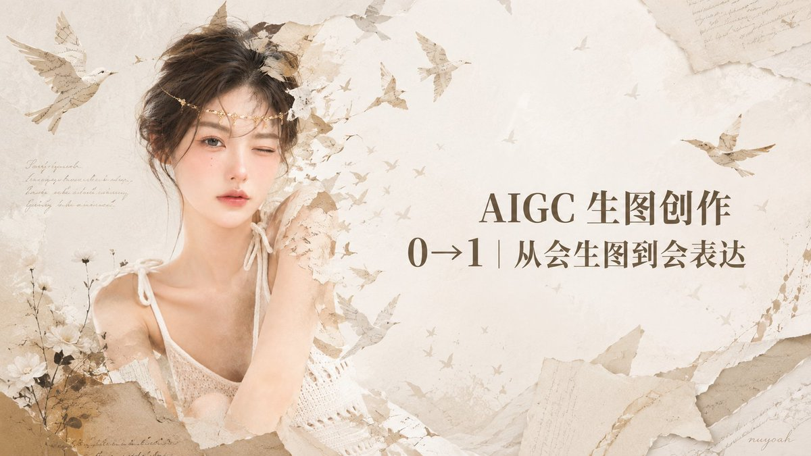
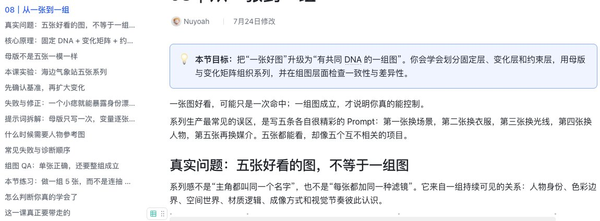
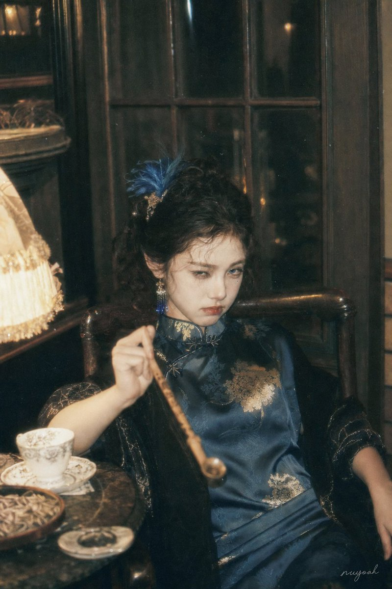
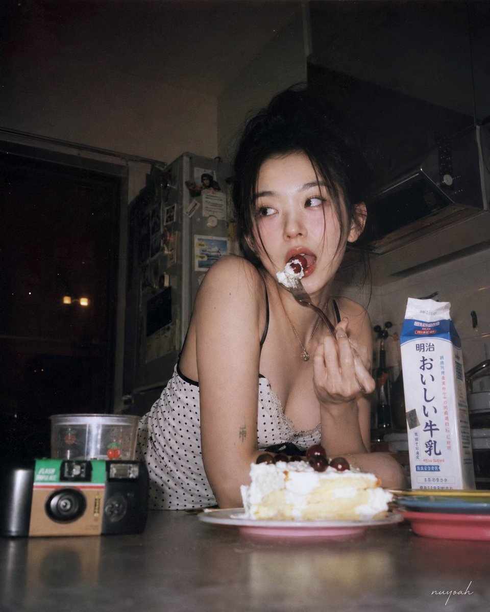
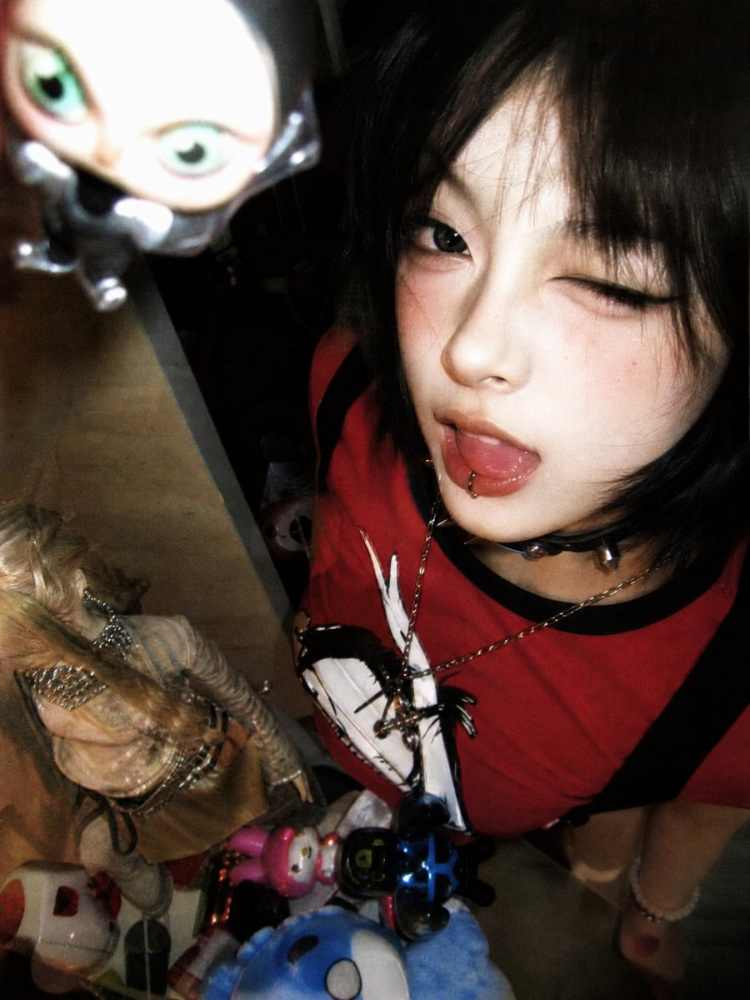
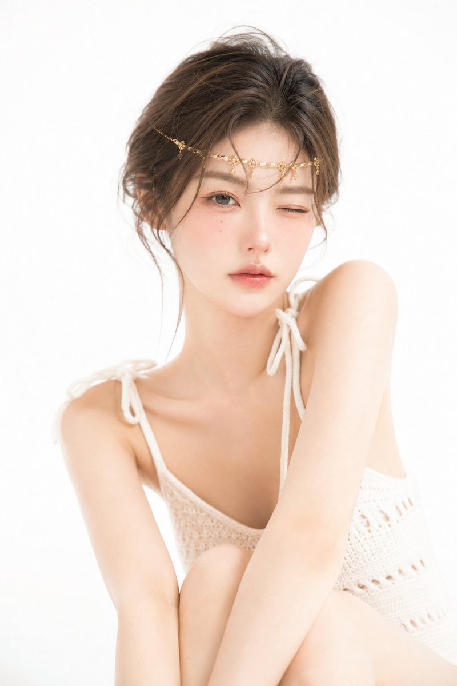
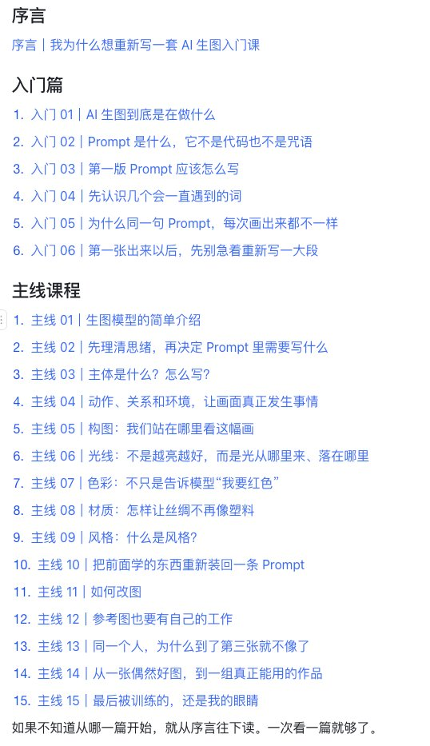
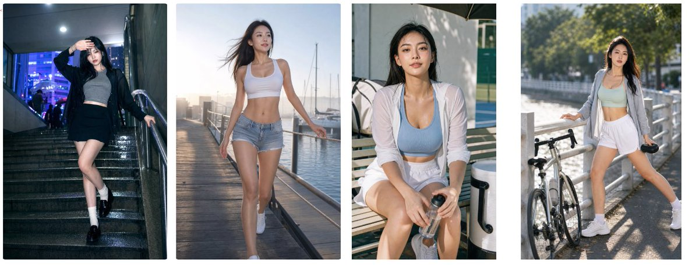

# 已经有一套 AI 生图课了，我为什么又重写了 7 万多字？

[VSC 社区课程入口，点击即可进入](https://vibeshot.club/courses/52703d31-dfd0-43fb-88bc-0fc53c4dcf39)

从构思到完全写完前前后后花了半个月～

感觉好像是在自己在折腾自己

明明手里已经有一套 AI 生图课，却还是决定把它先放到一边，从第一句话开始，重新写一套给小白的入门课。

不是在旧课后面补两章，也不是换个封面重新上架。

而是把自己重新放回第一次打开生图工具的那一天，再问一遍：

如果一个人连 Prompt 是什么都不知道，我到底应该从哪里讲起？

这个问题一冒出来，我就知道，旧课不能只靠修修补补解决了。

旧课当然也不是不能看。

里面有我过去做过的案例、踩过的坑，也留下了很多现在依然有效的方法。

下面这是之前的目录

只是它默认读者已经会一点：知道怎么打开工具，能写出一句提示词，也生成过几张图。于是我很自然地开始讲怎么控制画面、怎么拆构图、怎么处理光线和材质。

可对真正第一次接触 AI 生图的人来说，这个起点还是太靠后了。

他可能连输入框里该写中文还是英文都不确定，我已经把主体、构图、光线、色彩和一堆新名词端上来了。

这有点像一个人刚学会开火，我已经站在旁边问他：

“你今天想做中餐，还是法餐？”

可他连食材都还没认全。（我想了好久的比喻，形象么哈哈）

## 现在的 AI 生图，早就换了一种学法

我一开始没打算自己重写。

我想先去市面上找一套完整的入门课，看看别人是怎样把一个完全没做过图的人带进来的。

结果翻了一圈，系统内容不算多。有些教程讲得很专业，但起点还停在 Stable Diffusion 时代：采样器、步数、CFG、负面提示词、模型文件……

这些东西没有过时。

如果你正在使用 Stable Diffusion 工作流，它们依然有价值。

但今天一个普通人第一次接触 AI 生图，更常见的入口已经变成了：打开一个对话框，用中文说出自己的想法，上传一张参考图，再通过几轮对话和局部修改，把画面慢慢调到自己想要的样子。

工具已经走到了下一站，很多入门内容还在上一站。

另一边，Prompt 又被讲得越来越神秘。

社交平台上到处是几百字的“万能提示词”、JSON 结构、镜头型号和一串看起来很厉害的词。

复制很容易。

可真正轮到自己从空白开始写时，脑子里往往只剩一句：

所以，我到底该写什么？

这才是我想重新写这套课的真正原因。

## 小白真正卡住的，不只是不懂 Prompt

我做图越多，越觉得 Prompt 当然重要，但它不是最重要的。

一条很短的提示词，也可能碰巧生成一张很惊艳的图。

模型替你决定了人物站在哪里、光从哪边来、衣服是什么材质、画面为什么有情绪。你只说了很少，它帮你补完了剩下的大部分。

这种意外没有问题。

模型的意外，本来就是 AI 创作最好玩的部分之一。

上面这些图片需要很长很专业的的提示词吗？可能并不需要

真正的问题出现在下一步。

当你喜欢这张图的一半，又想改变另一半时，你能不能看出来自己想保留什么？

当你只觉得“哪里怪怪的”，能不能慢慢把这个“怪”说清楚？

当同一句提示词第二次生成了完全不同的结果，你知不知道这是正常波动，还是自己选错了工具？

当一张图偶然成功以后，你能不能继续做出第二张、第三张，而不是每次都重新抽奖？

这些才是大多数人从“会点生成”走到“真的会做图”时，会撞上的墙。

只收藏更多 Prompt，解决不了这些问题。

因为你缺的不是下一条咒语，而是一套看图、判断和继续沟通的方法。

## 所以这次，我把起点退回到了真正的第一次

新版课程没有从参数表开始，也没有在第一篇就塞给你一条“万能 Prompt”。

它先从最基础的问题讲起：AI 生图到底是在做什么，模型是什么，Prompt 又是什么，为什么同一句话每次画出来都不一样。

然后再陪你写下第一段描述，生成第一张图。

第一张出来以后，我们也不急着推倒重来，而是先看模型已经听懂了什么，哪里还不是自己想要的，再决定下一句话该怎么说。

这一次，我把整套内容拆成了：

- 一篇序言；
- 六篇入门课；
- 十五篇主线课。

入门篇负责把你从空白输入框前接上车。

你会先弄明白 AI 生图、模型和 Prompt 分别是怎么回事，写出第一段可以生成的中文描述，也会知道同一句话为什么不会永远得到同一张图。

更重要的是，第一张图出现以后，你不会只剩“好看”和“不好看”两个按钮。

你会开始判断：模型听懂了什么，哪里跑偏了，下一轮应该继续改，还是重新找一个方向。

到了主线，我们再把真正影响画面的东西一点点接起来。

主体是什么，人物在做什么，他们和环境有什么关系；我们站在哪里看这幅画，光从哪里来，颜色怎样建立情绪，丝绸为什么会被画成塑料，所谓“风格”到底在控制什么。

这些内容不会排成一张表让你背。

它们会在真正遇到问题时出现。

当人物总是挤在画面正中间，我们再聊构图。

当一件水手服被画成塑料雨衣，我们再聊材质。

当整体已经很好，只想换个背景，结果连脸也被换掉，我们再聊改图时怎样说清楚“改变什么、保留什么”。

后面还会继续讲参考图应该怎样分工、同一个人物为什么到了第三张就不像了，以及怎样把一张偶然出现的好图，慢慢扩成一组真正能用的作品。

从第一句不知道写什么，到最后可以做出一组有共同视觉 DNA 的图，这就是这套课完整的学习路径。

## 成功图让人心动，失败图才把问题讲明白

这次重写，我没有只挑最好看的图放进去。

手画坏了、人物跑偏了、参考图串味了、改到第三轮脸已经油腻得不行了，这些结果我也尽量保留。

因为一张成功图只能证明“这样做有可能成功”。

一组失败到修正的过程，才能让人看见究竟是哪一步出了问题，改动又为什么有效。

比如讲人物一致性，不是摆三张长得差不多的成品，然后告诉你“保持五官一致”。

真正需要讲清楚的是：哪些信息属于人物身份，哪些只是这张图里的妆造和姿态；参考图放得越多，为什么不一定越稳定；当模型把五官、服装和画面风格搅在一起时，该怎样重新分工。

讲系列创作也不是把五张好看的图放在一起，就宣布它们是一组。

一组图需要有持续不变的关系，也要给每张图留下变化的空间。哪些该固定，哪些可以变化，哪些必须约束，才是从“一张好图”走到“一组作品”的关键。

这些东西很难靠一句结论学会。

所以课程里尽量用真实案例、对比结果和修改过程，把判断摊开来讲。

不是为了证明我每次都能成功。

恰恰相反，是想让你看见：做图本来就是一个不断观察、选择和修正的过程。

## 这套课不押宝某一个模型

模型会更新，入口会调整，今天最好用的按钮，过一阵可能就换了位置。

如果一套课程只能教会你照着某个界面点一遍，它的有效期不会太长。

所以这套课会用 GPT Image 2、Grok Imagine 和其他真实作品来讲具体问题，但不会把全部方法绑死在某一个模型上。

我更想留下的是那些换了工具依然能用的能力：

看清主体、动作和关系，判断构图、光线、色彩、材质和风格，知道什么时候靠文字，什么时候交给参考图，也知道什么时候该继续改，什么时候该换一个方向。

以后模型再变，你可能要重新熟悉它的脾气。

但你不用每次都从零开始。

因为真正被训练过的，不是背模板的速度，而是自己的眼睛。

## 它适合谁，我也想说清楚

如果你刚接触 AI 生图，面对输入框总是不知道第一句话该写什么，这套课就是从这里开始的。

如果你已经会生成，也收藏了很多 Prompt，但结果一直像抽卡，不知道为什么这张好看、下一张又跑偏，它会帮你慢慢建立一套判断方法。

如果你想做的不只是一张偶然好图，而是稳定的人物、可继续修改的画面，或者一组有共同风格的作品，后面的主线会带你继续往前走。

但如果你已经有成熟的方法论，也形成了稳定的个人风格，这套课可能不会给你太多新的东西。

不用因为它篇数多，就再买一套放进收藏夹。

把时间和预算留给更适合自己现阶段的内容，反而更划算。

目前，这套课程有两个学习入口。

一个在 VSC 社区的课程板块，课程价格设置得比较低。如果你只是想从零开始学 AI 生图，直接选择这个入口就可以，不需要为了这套课单独加入我的个人社群。
[VSC 社区课程入口，点击即可进入](https://vibeshot.club/courses/52703d31-dfd0-43fb-88bc-0fc53c4dcf39)

另一个入口在我的个人社群学员知识库里。社群的加入费用会高于单独购买课程，更适合本来就想长期参与社群交流的同学，不建议只为了这一套入门课加入。

这套课现在已经全部更新完成。

零零散散写了七万多个字，也没想到会有这么多，这里夸我自己一下哈哈～

从一篇序言、六篇入门，到十五篇主线，我重新走了一遍自己学习 AI 生图的来时路，也把这几年做图时真正反复遇到的问题，尽量拆成了普通人能理解、能继续操作的步骤。

它不会保证你看完以后，每一张图都乖乖听话。

也不会让你突然拥有一套成熟的个人风格。

但我希望它能陪你完成最重要的第一段路：

从“我到底该写什么”，走到“我知道下一句该说什么”；再从偶然生成一张好图，走到慢慢做出自己真正想要的画面。

Prompt 到最后，可能反而没有那么神秘。

它只是你和模型之间的一段话。

真正变得更清楚的，是你自己。
