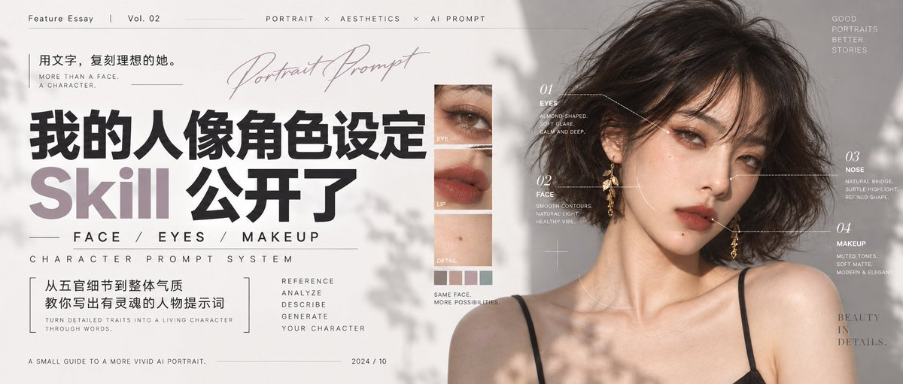
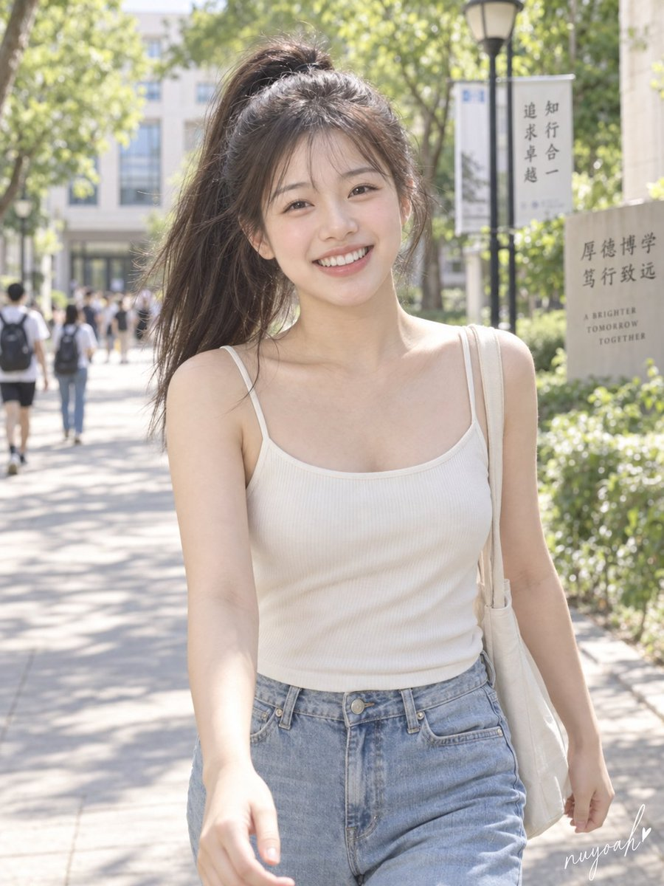
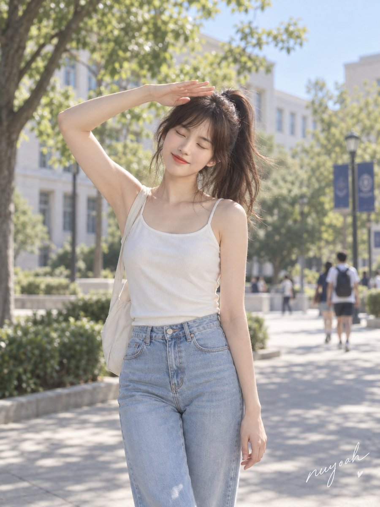
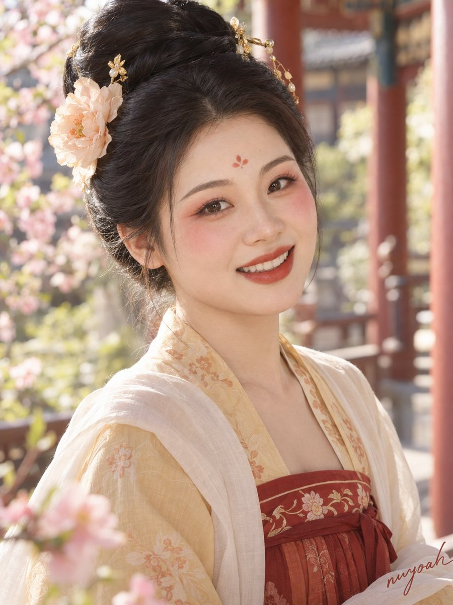
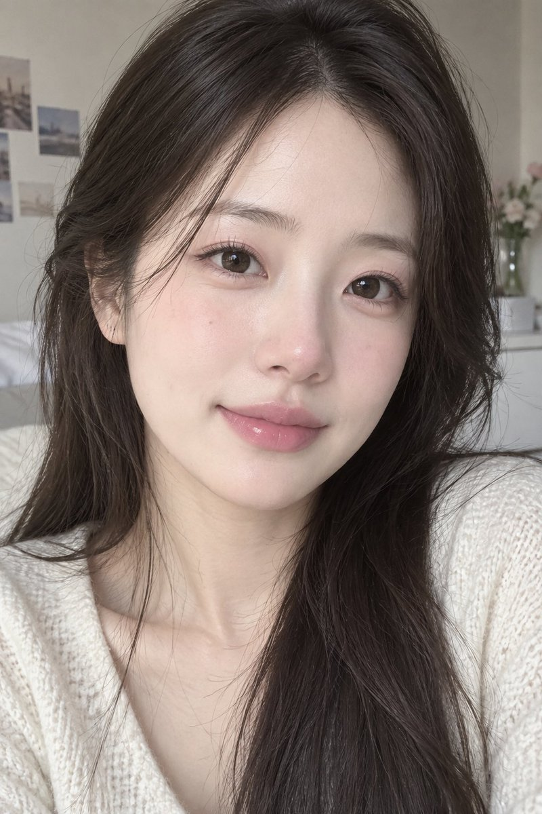
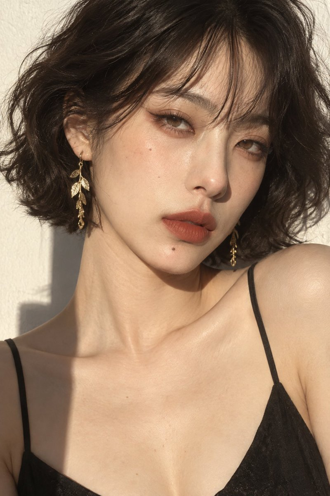

# 📰 想要什么气质，直接说：我的人像角色设定 Skill 公开了

来源：[X 状态](https://x.com/nanyuan0412/status/2098245691542061090) · [X 文章](https://x.com/i/article/2098244453391835136)



最近GPT Image 2.5更新了，我玩了两天，最让我无语的是，他那个脸一直都是底膜的脸，我就非常难受，非常难受。我就在想，怎么样才能解决这个问题？于是我就搞了这个Skill。

这次叫「人像角色设定师」。

它是从之前一些大的 Skill 里分出来的一个小功能，我把它单独拎出来，做成了一个 Skill。

能把你脑子里已经有一种感觉翻译出来：想要清冷一点，或者明媚一点，或者是那种青涩、软软的初恋感。但真让你写脸型、眼睛、腮红、唇色，可能打了半天，最后还是一句“好看，有气质”。（因为我就是这个样子）

我想把中间这段工作交给 AI。你把想要的感觉说清楚，它负责往下展开，写成一份能直接拿去生图的中文提示词。

先放几张用它做出来的效果。

```text
这张图只拆妆容，不要把参考人物的脸带过去。把妆容应用到我刚才设计的人物上，保留她原来的五官和肤色。
```

短卷发、暖光、砖红色嘴唇，人物的复古感比较明确。头发和耳饰也在配合这个方向。



这张就轻了很多。浅色针织衫，淡淡的唇色，嘴角稍微带一点笑，像日常拍照时会留下来的一张。

```text
一位26岁的中国女性，唐风人物肖像，气质明媚大方，带着春日游园时的轻快神采。

面部为略宽的椭圆轮廓，中庭比例适中，额头饱满；眉骨起伏平缓、眼窝较浅，眉眼之间留有舒展空间。颧部位置略高，横向宽度适中，饱满面颊柔和包覆颧骨；下颌比颧部略窄，转折圆缓，下巴短圆且不后缩。眼裂中长，窄双眼皮，外眼角轻微上扬，深棕色虹膜；鼻梁高度适中，鼻背略宽，鼻尖圆润，鼻翼保留自然体量。嘴唇宽度适中，上唇略薄、下唇丰润，唇峰柔和。

肤色为暖调浅米色，底妆细腻柔雾，保留轻微自然皮肤纹理。妆容以明亮的桃红胭脂为视觉重点：颜色集中于双颊上部，向外眼角下方柔和铺开，边缘渐淡成浅桃色，保留面颊的饱满感。眉毛以深灰褐色描成舒展的弧形长眉，眉头轻柔、眉尾收细。上眼睑薄铺暖桃色，睫毛根部用深棕细眼线勾勒，眼尾短短延伸，睫毛纤长分明。额心绘一枚小巧的朱红三瓣花钿。嘴唇沿天然唇形涂明亮朱红色，带少量橘调，唇缘清楚但不生硬，呈柔润缎光。

乌黑头发梳成丰盈高髻，两侧鬓发整洁，以小巧金钗和一朵浅杏色绢花点缀。穿杏黄色襦衫、石榴红高腰裙，肩头搭轻薄暖白披帛。头部轻转，目光看向镜头，眉间放松，嘴角上扬，微露上排牙齿，双颊随笑意自然抬起。

写实摄影，3:4竖幅胸像，完整保留发髻；柔和日光照亮面部，眼中有清楚的小面积光点。背景为虚化的庭院春花与暖色廊柱，面部妆容清晰，红、杏黄与暖白相互呼应。
```

换成冷一些的光、眼妆和蓝色耳饰，低头的状态又把人物带到了另一个方向。

这三张是我另外整理的效果展示。下面用一段完整的实际操作，把它怎么用讲清楚。Skill 也已经公开，文末有完整下载和安装方法。

## 就说一句你想要什么

我给它的第一条要求很简单：

```text
使用 $skill-installer，从 https://github.com/nuyoah-ai-works/nuyoah-portrait-character-designer 安装仓库根目录的 Skill，安装名称设为 nuyoah-portrait-character-designer。如果已有同名版本，先告诉我，不要直接覆盖。
```

它先给人物取了一个方向，叫「映棠」，然后把脸部、妆容、发髻、衣饰和拍摄场景展开。下面是当时返回的完整提示词，可以直接复制：

```text
保留刚才人物的五官、骨相、肤色、发型和拍摄设定，只把口红颜色换成酒红，保留原来的唇形与光泽。给我完整的新提示词。
```

读起来确实比我的要求长不少，但你不用把这些词全背下来。以后想换形象，继续用自己的话说就行。

这里面我会特别两件事：脸是不是我想要的，妆有没有抓住重点。比如这次的桃红胭脂、朱红花钿和偏橘的红唇，都在往“明媚”这个方向走。

确定之后，我再发了一句“生成图片”，得到这张：



这张按唐风创作来理解就好，没做严格的历史妆容复原。

还有个容易误会的地方：这个 Skill 默认先帮你写人物提示词。你明确说“生成图片”，它才接着调用当前平台的生图能力。

我这里是在 Codex 里生成的。你用的工具如果没有生图能力，就把完整提示词复制到自己的生图工具里。

## 脸、妆和表情，要分开说清楚

这套 Skill 里有一些规则，我觉得就算你暂时不安装，也值得学学。

比如“骨相清晰”这四个字，听着挺专业，可到底要清晰在哪里？眉眼起伏明显，还是下颌有转折？面颊要柔软，还是偏薄？如果一直停在大词上，留给模型补全的地方就很多。

所以我让它在原创人物里，把眉骨和眼窝、颧部、下颌和下巴的关系写具体。

柔和的脸也有结构。平缓的眉骨、较浅的眼窝、圆缓的下颌，都可以是明确的设计选择。没必要一提骨相，就把人全改成深眼窝、尖下巴。

这里还有几个很容易写混的地方。

眉骨和眉毛分开看。颧骨的位置高，跟它横向宽不宽，也分开看。下巴短，不代表一定往后缩。

妆容也是一样。

只写“桃粉腮红”，还可以继续追问到画面里：颜色放在双颊中央，还是偏外侧？横着铺开，还是向太阳穴轻轻延伸？边缘要柔，还是要画得很明确？

像这样就具体多了：

https://github.com/nuyoah-ai-works/nuyoah-portrait-character-designer

如果只是想让一个人物的妆变柔和，先从眼线的锐度、眉头、唇缘这些地方调。别眼线改完，脸型、肤色也跟着换了一套。

我还保留了一条很在意的规则：一种气质，可以有不同的脸。圆脸可以清冷，单眼皮也可以甜美。已有喜欢的五官，就先保留，再通过妆、表情和造型往目标上靠。

你完全可以直接对它说：“这张脸我喜欢，别动，只把妆改一下。”

上面这些东西也不用你自己完全记住，只是说我在这个 Skill 里面内置了一个这样的知识库，它会学会调用。

## 有感觉了，还可以继续往你喜欢的方向改

另一次，我想做一个初恋感的形象：成年年轻女性，青涩，软软糯糯，简单吊带，长披发。

它展开之后，生成的是这张窗边人像。



然后我想换成更亮的校园场景，扎高马尾，人物再青春洋溢一点。

结果它把青春感理解得太der比了：脸写得圆圆的，笑容也写成了露齿笑。嗯。AI 感满满我只能说是

```text
使用 $nuyoah-portrait-character-designer，同一套桃粉妆，设计三个不同脸的成年角色。每个人分别给一份完整中文提示词。
```

于是我给它补了一张参考图，把想要的状态重新说清楚：脸部轮廓更清秀，脸颊放松，嘴唇轻轻合上，只留一点笑意。动作换成闭眼、抬手挡阳光，镜头也离人物远一点。

```text
透明的暖粉色腮红，轻轻晕染在双颊中央，边缘柔和。
```

这一版能看到这些变化：脸在画面里的占比小了，笑意收住了，抬手的动作也给人物留出了一个正在发生的瞬间。

这轮同时用了参考图，也调整了脸部描述、表情、动作和构图，不能说全靠某一个词就改好了。但这个过程主要是来讲讲，怎么继续和 Skill 沟通。

“自然一点”当然可以说。但是这样的描述就太过笼统了，就再具体一点：“嘴唇合上，不露牙，脸颊放松，像朋友随手拍到的状态。”

我们主要的输入就是告诉它哪里感觉不对，然后 Skill 再把这些要求重新整理，输出一个完整的提示词。这样比你每次从头写，或者继续改，都方便很多。

## 想保留什么，直接点名

除了从零设计人物，我还设计了几种很实用的用法。

喜欢一套妆，想换几张不同的脸，可以这样说：



这里的“不同脸”，要从比例、眼鼻、下颌等结构上拉开。换发型、换衣服，不能拿来凑不同人物。妆容则保留主色、质地、线条方向和相对落点。

人物已经喜欢了，只想换一个妆容细节：

https://github.com/nuyoah-ai-works/nuyoah-portrait-character-designer/releases/download/v0.2.1/nuyoah-portrait-character-designer-v0.2.1.zip

看到参考图，单纯想借它的妆，也可以说：



这些是 Skill 里的设计与修改规则。本篇没有把每一种都做成图片对照，实际生图时，人脸有没有保持、妆有没有落准，还是要看结果。

其实我还让它设计的是：不要照着你的参考图作为垫图去生图。所以有时候它在妆容复刻方面，还是取决于 你的生图软件对妆容这类描述能吃进去多少。

对我来说，能明确说出“这部分留下，那部分继续改”，已经是很实用的沟通方式了。

## 完整 Skill 放这里，拿去试

打开 Skill 公开仓库

直接下载 v0.2.1 完整 ZIP

用 Codex 的朋友，最省事的方法，是把下面这段话直接发给它：

```text
使用 $nuyoah-portrait-character-designer，设计一个明媚妆容的女性角色，中国唐风妆容。
```

安装完成后，在下一轮输入前面的唐风要求，或者换成你自己想做的人物。正常应该先看到一句角色方向，再看到一份完整中文提示词。

喜欢这个方向，就继续让它生成图片；不喜欢，就直接说哪里要改。

如果要手动安装，下载 ZIP 并解压，把里面整个 nuyoah-portrait-character-designer 文件夹放到个人目录的 ~/.agents/skills/ 下。别只拿走 SKILL.md，它还要读取旁边的规则和词表。安装后没识别出来，先检查有没有多套一层文件夹，再重启 Codex。

暂时不想折腾安装的，也可以先复制本文的唐风提示词跑一张，感受一下这种写法。

你不用一开始就把脸、妆、表情全讲到位。先给一个自己想要的方向，看到结果，再把喜欢的部分留下。慢慢改到“嗯，就是这种感觉”，这个过程本身也挺有意思。

——

我是南鸢，主要做 AI 生图控制、Skill 和本地工作流。

日常会分享真实测试过的方法和工具。

如果想要进群一起交流的，欢迎加入，方式在主页置顶（备注来意）

