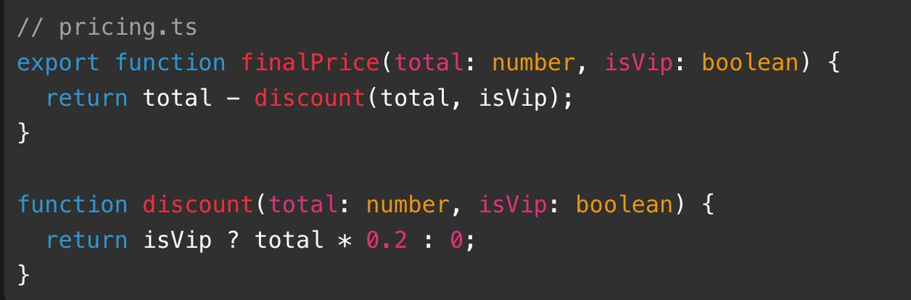
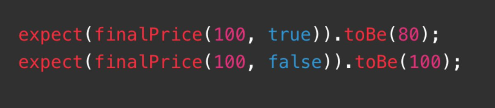

# 📰 总结 Grill-Me 中你能用上的专业术语

@[mattpocockuk](https://x.com/mattpocockuk) 的 Grill-Me 系列 Skill 设计非常简洁优雅。打开 Skill 文档前，你很难相信功能强大的 Grill-Me 核心只有 3 句话。

其中一个关键原因是 —— 他用了很多 AI 能理解 & 含义丰富的专业术语。

本文总结 Matt系列 Skills 中的高价值专业术语，看了立刻就能用在自己的 Skill 中。

## Tracer Bullet

来自《The Pragmatic Programmer》一书，直译是“曳光弹”。夜间射击时，机枪手看不清子弹轨迹。曳光弹射击后会发光，可以帮助机枪手修正瞄准偏差。

在软件工程领域，他指一种竖切的开发策略。举个例子，你要做一个完整功能：

用户上传文件 -&gt; 后端解析 -&gt; 存数据库 -&gt; 前端展示

如果直接让 AI 帮你做，他会：

1. 实现 model 

1. 实现后端解析逻辑

1. 实现 API

1. 实现前端

这就是横切的开发策略，也就是切（实现）完一层，再切下一层。

横切的坏处是：

1. 反馈太晚：前端是最后一层

1. 容易做错抽象：很容易先实现一些“后续层才会用的方法”，结果后续层实现时不一定用到

1. 不容易做集成测试、e2e测试

当你提到 Tracer Bullet 开发模式，AI 会先实现很薄的e2e路径：

1. 上传一个最简单文件

1. 后端读到一行内容

1. 存一条最小记录

1. 前端显示这一条记录

虽然简陋，但它竖切了所有层，后续实现都能在此基础上延伸，就像曳光弹一样修正实现偏差。

在 Matt 的 Skills 中，/to-tickets Skill 使用这个词创造竖切的执行计划，同时也为后续 /tdd 提供 集成测试、e2e测试 的线索。

## Seam

来自《Working Effectively with Legacy Code》一书，直译是“接缝”。比如衣服上两块布料连接的地方就是 seam。

也就是 两块布料相接、可以拆开、替换、重新缝合的位置。

将布料理解为“应用中的模块”，seam 就是模块间的连接点，可以替换、测试、隔离。

举个实际代码例子，你对 agent 说：给如下模块写测试

agent 很可能导出并单独测试 discount 方法：

如果对 agent 说：先找到这个模块的 seam，再在 seam 上测试行为

agent 会识别 finalPrice 才是 seam，也就是外部调用者真正接触的接口。于是测试变成：

总结来说：“先找到模块 seam” 会把 AI 从“测试内部细节”拉回到“测试模块公开边界上的行为”。

在 Matt 的 Skills 中，/to-spec 识别 seam，/tdd 将 seam 作为 生成测试用例的切口。

## Design Tree

来自《The Design of Design》一书，这是设计领域的概念，把设计看成一棵相互依赖的决策树，每个分支代表一个选择、约束或待定问题。

主要作用于“人类与 AI 对齐需求”环节，比如 /grilling 中的用法：

> 遍历 Design Tree 的每一个分支，逐一解决各决策之间的依赖关系。针对每个问题，给出你的建议答案

另一种常见的“对齐需求”方式是 Superpowers 的 brainstorming，两者的区别：

- Design Tree 假设你脑海里已有方案，只是缺少细节。类似广度优先遍历

- brainstorming 假设你只有模糊的想法，AI 就你的想法给你指方向。类似问路：路人给你指方向，你朝方向走一段路再问下个路人，直到到达目的地

从实现原理看， 使用 Design Tree 会获得更详细的需求，代价是 会被拷问更多细节。

## Throwaway Prototype

来自《The Pragmatic Programmer》，指“为了验证结论而建立的用完即弃的原型”。他和上面介绍过的 Tracer Bullet 区别：

- Tracer Bullet：e2e 原型，后续功能在此基础上延伸

- Throwaway Prototype：得出结论后就废弃的原型

如果你对 Agent 说：“帮我实现一个 Demo”，他倾向于实现一个最小可用品。

但如果说：“帮我实现一个 Throwaway Prototype，验证 xxx”，他倾向于围绕“你要验证的问题”来设计 Demo，与目标不相关的其他领域（比如代码质量、基建、测试 会被忽略”。

在 Matt 的 Skills 中，/prototype 用于在 /grilling 过程中遇到不确定的问题时验证结论。

## 后记

其实还有些专业术语（比如 TDD）实在太有名了，就没列出来。

如果大家对这篇文章的内容感兴趣，请多给我反馈，后续我再从其他知名的skill中收集专业术语。

### 🖼️ Attached Media

## 💬 Replies

### 1 @balabala289 (吧啦（格林版）)

*Fri Jul 10 04:14:01 +0000 2026*

@kasong2048 感谢分享，感觉应该用 Agent 来帮我系统学习一下他的这个仓库 所有skills。

### 2 @Immerse_code (Immerse)

*Fri Jul 10 07:53:24 +0000 2026*

@kasong2048 学到了

### 3 @daniel_du (Daniel Du)

*Fri Jul 10 05:07:30 +0000 2026*

@kasong2048 Grill-Me 那套用『术语即接口』的思路确实巧，把领域词当成 Skill 的 API，AI 理解成本直接降一截。

### 4 @stingh711 (stingh711)

*Fri Jul 10 08:31:04 +0000 2026*

@kasong2048 这个横切的例子不是很好，不实现前端，api，解析，model做不到纵切里面的上传文件，读一行，存一条记录

