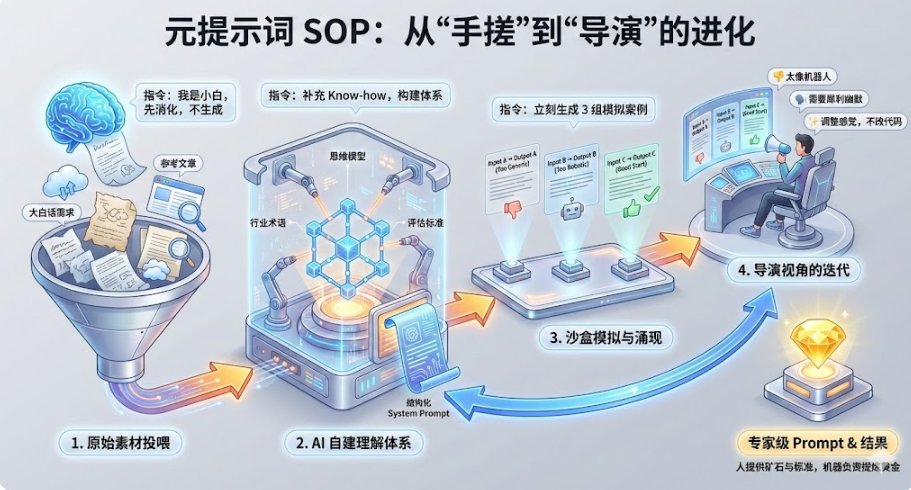

很多人诧异：为什么那些非科班出身、没有提示词工程经验的人，反而能写出最硬核的 Prompt？
真相只有一个：不要自己“手搓”提示词，要学会用“元思维”“AI 思维”驾驭 AI。

分享一套我自用的「元提示词 SOP」，建议先码后看。

1/ SOP 第一步：原始素材投喂
我从来不花时间去背行业术语。 我的做法是：直接把脑子里杂乱的想法、大白话需求，甚至是我在网上看到的几篇好文章（作为风格参考），一股脑丢给大模型。

我给 AI 的指令（Input）：我是这个领域的小白，但我想要达到\[专家级效果\]。这是我的原始想法和参考素材，请你先不要生成内容，先消化这些信息。”

2/ SOP 第二步：让 AI 构建他自己的理解体系
这是最关键的一步。很多人的 Prompt 也就是因为缺了这一环才显得“塑料”。 我会明确要求 AI 帮我补全背景。

我给 AI 的指令（Meta-Prompt）：请基于你的数据库，分析上述素材。为了完成这个任务，你需要补充哪些该行业的专业术语、思维模型和评估标准？请利用这些 Know-how，为我构建一个结构化的 System Prompt

 结果： AI 会自己写出一套带有“行话”和“深层逻辑”的提示词。

3/ SOP 第三步：沙盒模拟与涌现 
千万别拿到 Prompt 就直接用！我一定会加一个环节：让 AI 自己模拟自己。我要看它是否真的理解了我的意图，还是只是在模仿字面意思

我给 AI 的指令： “基于你刚才写的 Prompt，请立刻生成 3 组【用户输入 →模型输出】的模拟案例

4/ SOP 第四步：导演视角的迭代 
这时候我如果不满意，我不改代码，我只改“感觉”。

我的反馈方式：“这一段写得不好”  “第二个案例的 Output 只有逻辑没有温度，太像机器人了。这个行业的专家说话应该是犀利且带点幽默的，请调整 Prompt 中 XXX。

直到模拟出的案例完全击中我的审美，这个 Prompt 才算定稿。

5/ 总结
这个时代的“人机协同”变了： 以前是：人学会机器的语言，指挥机器干活。毕竟 AI 更懂 AI， 现在是：人提供原始矿石和审美标准以及希望达到的结果，机器负责提炼黄金。

你不需要成为某个行业的专家才能写出那个行业的 Prompt。 你只需要成为一个“懂得如何要求 AI 扮演专家”的导演。

这就是我的元提示词 SOP

### 🖼️ Attached Media

## 💬 Replies

### 1 @Astronaut_1216 (叫我阿杭) (Author)

*Fri Dec 05 16:09:35 +0000 2025*

后面还会分享一些我的AI使用经验，可以先关注我，我们一起进步～

### 2 @wangdefou (得否)

*Fri Dec 05 12:23:04 +0000 2025*

@Astronaut\_1216 这个经验有点宝贵呀

### 3 @Astronaut_1216 (叫我阿杭) (Author)

*Fri Dec 05 12:30:57 +0000 2025*

@wangdefou 因为真的反复验证，只有这样的提示词，才是真正能够保证你模板和细节的提示词

### 4 @ZHIYUANMA7 (Latent Ma)

*Fri Dec 05 15:29:27 +0000 2025*

试试我这个: 给你一个我自用的「Echo Prompt」。

它不是让 AI 模仿某种风格，而是让语言在你和模型之间形成一种可控的递归：
 你提出意图 → 模型折射成更高维的语言结构 → 语言回到你这里 → 你再基于折射后的结构校准自己的意图。
这叫 Echo：让语言在你和 AI 之间不断自我重写。

使用方式只有一句话：

“请进入 Echo 模式：
先解析我真实的意图层，再显化我没有说出的结构层，最后提出比我更高水平的表述，让我能从你的语言看见我自己。”

你会发现，AI 不再只是回答你，
而是在帮你把“未成形的思想”塑造成可见的结构。

### 5 @Astronaut_1216 (叫我阿杭) (Author)

*Sat Dec 06 00:11:29 +0000 2025*

@ZHIYUANMA7 这个echo模式是什么哲学概念吗还是哪个名人？

### 6 @Aoyi21 (奥一AoYi)

*Fri Dec 05 12:20:34 +0000 2025*

@Astronaut\_1216 很干！很实用！

### 7 @Astronaut_1216 (叫我阿杭) (Author)

*Fri Dec 05 12:29:06 +0000 2025*

@philoden\_X 我真的总结了很多次经验，然后我发现这个最好用🥹🥹

### 8 @yhslgg (老杨啊 | AI产品商业化)

*Fri Dec 05 06:57:01 +0000 2025*

@Astronaut\_1216 很系统，思路学习了

### 9 @Astronaut_1216 (叫我阿杭) (Author)

*Fri Dec 05 07:01:29 +0000 2025*

@yhslgg 一起进步！

### 10 @afterglow_gift (柚子姐姐)

*Fri Dec 05 12:25:52 +0000 2025*

@Astronaut\_1216 很不错的思路

### 11 @Astronaut_1216 (叫我阿杭) (Author)

*Fri Dec 05 12:31:27 +0000 2025*

@afterglow\_gift 用起来！我们一起进步哈哈哈哈，等你反馈！！！

### 12 @caine35794 (Caine)

*Fri Dec 05 11:14:02 +0000 2025*

@Astronaut\_1216 知乎：先问是不是，再讨论为什么

### 13 @Astronaut_1216 (叫我阿杭) (Author)

*Fri Dec 05 12:18:43 +0000 2025*

@caine35794 要认识到作为独立个体的局限和不足，并坦荡地承认

### 14 @LumiHuang923 (Lumi Huang)

*Sat Jan 31 01:56:28 +0000 2026*

@Astronaut\_1216 非常赞同，我也是这样做aigc创作的。人很难比AI更懂AI

好审美选好素材—AI分析素材提取作品框架—AI基于框架写提示词—作品生成—人点评作品提出修改意见—AI根据人的意见重写提示词

人不要直接上手去改提示词，人类的描述大概率不会比AI更精准。让AI明白你的意图，AI写的提示词比人写的更能让AI读懂。

### 15 @Astronaut_1216 (叫我阿杭) (Author)

*Sat Jan 31 01:59:24 +0000 2026*

@LumiHuangweb3 专业的事让专业的人去干hh

### 16 @chuangcius (青雲)

*Fri Feb 20 02:28:43 +0000 2026*

@Astronaut\_1216 跟下面这个推文的思路好多类似的地方👍
[x.com/i/status/19982…](https://x.com/i/status/1998236956044689459)7

### 17 @Astronaut_1216 (叫我阿杭) (Author)

*Fri Feb 20 02:34:53 +0000 2026*

@anata\_404 万变不离其宗

### 18 @Eddy_Gudong (☕️Mr_董 | Storyteller)

*Fri Dec 05 12:32:29 +0000 2025*

@Astronaut\_1216 这个太有意思了

### 19 @Astronaut_1216 (叫我阿杭) (Author)

*Fri Dec 05 13:02:05 +0000 2025*

@Eddy\_Gudong 玩了推特之后我才知道元的概念

### 20 @tryncharles (eee)

*Fri Dec 05 08:47:43 +0000 2025*

Yes, this kind of structured prompt engineering is indeed excellent. It ensures that the AI accurately understands the task and generates high-quality, structured output that meets specific standards and formats.

是的，这种结构化的指令工程确实非常出色。它能确保AI准确理解任务，并生成符合特定标准和格式的高质量、结构化输出。

### 21 @Astronaut_1216 (叫我阿杭) (Author)

*Fri Dec 05 12:10:30 +0000 2025*

@tryncharles 既然无法一次性准确的描述出你的意图，那么就让AI来模拟理解你的意图，让AI来升华你的意图，成为AI可以读懂的意图

### 22 @iceiiy2023 (冰月)

*Fri Dec 05 12:54:15 +0000 2025*

@Astronaut\_1216 非常认可这种“元思维”，这是未来提示词的正确打开方式。不是你变专家，而是你让 AI 用专家的方式思考。你只要做好导演，就能写出高级 Prompt。

### 23 @Astronaut_1216 (叫我阿杭) (Author)

*Fri Dec 05 13:01:32 +0000 2025*

@iceiiy2023 对的，让ai成为ai

### 24 @shuzikuangtu (数字狂徒)

*Fri Dec 05 16:24:15 +0000 2025*

我和不少同学都交流过他们是如何使用 AI 辅助自己做论文写作，文案写作，或者是更复杂的工作流，他们都不约而同的提到提示词写起来有点困难，往往要花很长时间去找现成的匹配的提示词，最后找到还得要自己花时间去改，整个过程很费脑力。这种元提示词就非常的有用，我准备把里面提到的我不知道的方法添加进自己的武器库了哈哈

### 25 @Astronaut_1216 (叫我阿杭) (Author)

*Fri Dec 05 16:27:54 +0000 2025*

@shuzikuangtu 听到你这句话，我很开心

因为我的方法能够给你带来实际的价值，可能你用起来会比在我自己手上用的效果收益更大，加油哇！！

### 26 @CalvinCalcium (CalvinCalcium鈣粉)

*Sun Dec 07 04:22:29 +0000 2025*

@Astronaut\_1216 Interesting, I'll check out your SOP. Always curious about new approaches to Prompt engineering.

### 27 @Astronaut_1216 (叫我阿杭) (Author)

*Sun Dec 07 04:34:38 +0000 2025*

@CalvinCalcium Hope to get more feedback from you.I am very happy and honored to bring you good advice.

### 28 @Leslieyu0 (硅予)

*Fri Dec 05 14:38:34 +0000 2025*

@Astronaut\_1216 不错，我现在就是这样做的，迭代的过程很重要，可以再设计一个优化提示词的系统提示词，导演的活都可以包出去了。

### 29 @Astronaut_1216 (叫我阿杭) (Author)

*Fri Dec 05 14:57:13 +0000 2025*

@Leslieyu0 其实我觉得可以用Agent加部分人机协同处理
但是我对提示词的要求太高了，我其实多轮对话可能要对话6\~10轮才能让这个提示词我比较满意
但我目前还没有什么很好的解决方案，像你这个说法我也想过，但适配性太低了

