# 📰 一文讲透多Agent协作：4种模式、3个判断标准、4大工程落地陷阱

写文章这件事情，在我们日常的工作中占了很重要的一部分，如果让Agent来写文章，会是一个什么情况呢？

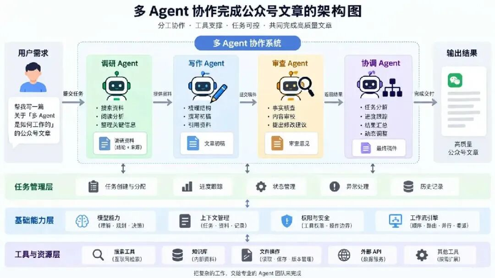

假设我需要完成一篇公众号文章，我可以交给一个同学去完成，让他自己查资料、写草稿，最后再审查一遍。我们也可以多安排几个人来做，比如一个同学搜集资料，一个同学写稿，另外一个同学负责审查。

如果我们把 Agent 当作数字员工来看，让一个 Agent 独立完成写作，从查资料一直做到最后完稿，就可以看作单 Agent。让不同的 Agent 分别负责调研、写作和审查，合作完成这篇文章，就可以看作多 Agent。

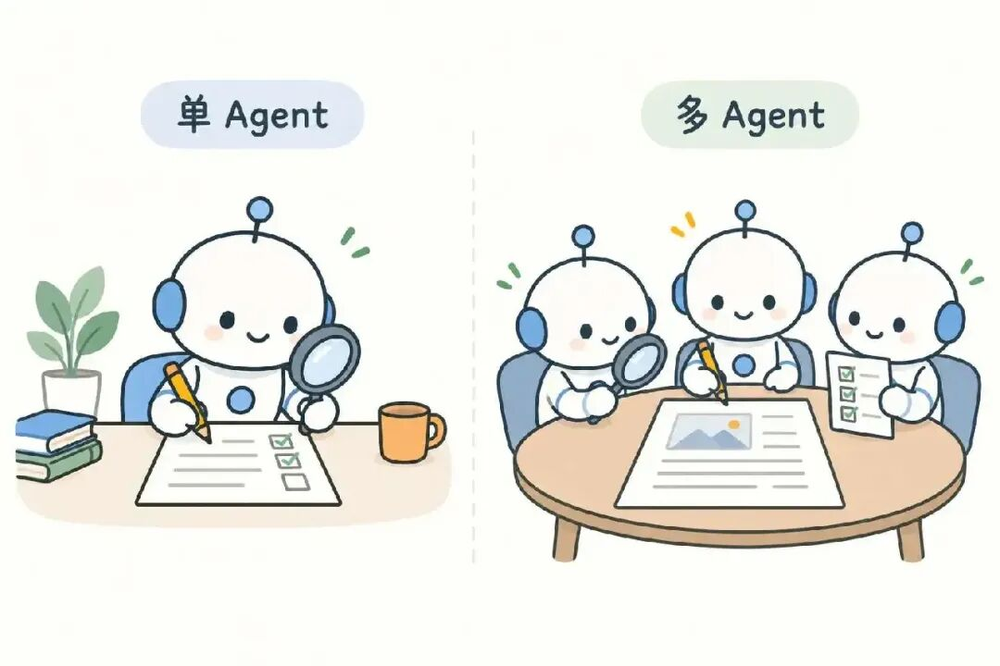

那么我们今天就来聊一聊，这种合作完成写作的多 Agent 系统是如何实现的，它会面临哪些问题，有哪些好的处理方式。

## 一个 Agent 是怎么完成工作的

我们先看一个同学独立完成文章的情况。当他拿到写作主题以后，需要先看看自己对这个主题是否熟悉，手里的资料够不够，要不要去网上再搜集一些资料。如果资料不够，就继续搜集，等资料准备得差不多了，再开始写作。写完以后，还要检查一下，看看有没有遗漏或者需要修改的地方。

接下来，我们看看 Agent 是怎么做的。为了方便理解，我们可以先用一个简单的表达来认识它，Agent = 模型 + 工具。模型负责理解任务、判断下一步做什么，工具负责执行具体操作。这个表达可以帮助我们理解它的基本分工，完整的 Agent 还需要其他安排，后面我们再说。

单 Agent 的工作方式，和一个同学独立写文章非常相似。我们把主题交给 Agent，它先判断需不需要搜索资料，或者查询知识库。拿到结果以后，再判断这些资料是否足够。如果不够的话，就继续查，如果资料足够了，就可以开始写草稿。

在这个过程中，大模型负责理解我们的要求，并根据已有材料决定下一步做什么。真正上网搜索、读取资料或者保存稿件的时候，还需要相应的工具。工具把执行结果返回给大模型，大模型再根据结果继续判断。

前面我们说，写文章需要搜集资料、写草稿，再进行审查。Agent 实际做的时候，也可能先写一部分，发现资料不够，再回去补查。具体下一步做什么，由模型根据当前情况判断，我们只需要给它提要求和提供必要的工具

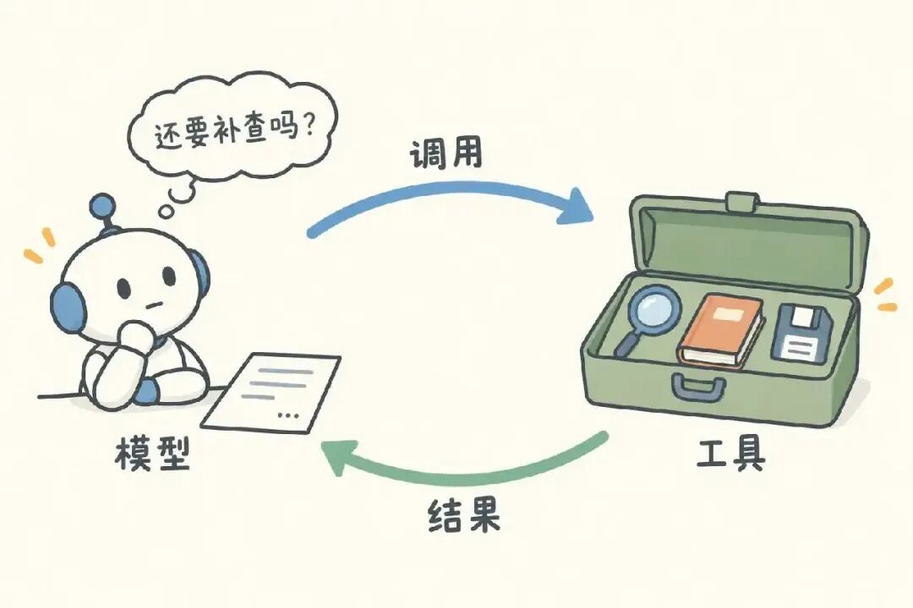

那么，有了模型和工具，Agent 就能把工作做好了吗？

简单的任务，我们可以先用这样的方式做起来。但实际使用的时候，还有一些事情需要安排。比如模型一次能处理的内容有上限，资料越查越多、对话越来越长，就需要整理上下文，保留后面还需要用到的信息。这里说的上下文，就是 Agent 当前能看到的任务要求、资料和工作记录。工具也需要设置权限，能读取资料，不代表就应该能修改或者删除资料。

所以，一个 Agent 要能稳定地完成工作，通常还需要考虑下面这些设置。

## 1. **系统提示词**

   告诉 Agent 负责什么工作、应该怎么做，以及任务的边界在哪里。比如写作 Agent 要按照什么风格写，资料不足的时候应该怎么处理。

## 2. **上下文管理**

   管理 Agent 当前能看到的要求、资料和工作记录。内容太长时，可以压缩或整理，但要保留关键要求、来源和未完成的事情，避免后面做到一半忘了前面的约定。

## 3. **工具管理**

   明确有哪些工具可以使用，调用时需要提供什么信息，执行失败以后怎么处理。比如搜索失败了可以重试，保存稿件失败了则要让 Agent 知道，不能当作已经保存成功。

## 4. **权限和安全边界**

   规定 Agent 能访问哪些文件，哪些操作需要确认，以及最多运行多久。比如允许写作 Agent 修改草稿，但发布文章需要我们确认。这些限制需要程序执行，不能只靠提示词提醒。

把这些安排好，我们就可以让一个 Agent 在规定的范围内完成写作。接下来，如果工作比较多，想让几个 Agent 一起做，又应该怎么处理呢？

## 什么时候需要多个 Agent 一起工作

一个 Agent 已经可以查资料、写稿和审查，可以自主推进任务进度直到完成，为什么还需要多个 Agent？在安排更多Agent之前，我们要先要看清楚，如果只安排一个 Agent 来做这件事，任务会卡在什么地方，分工能不能解决这个问题。

写一篇文章这个需求，如果写作要求没有说清楚，或者根本没有可用的资料，多安排几个 Agent 也不会自动解决问题，我们应该先把写作要求和资料进行补充，只有当几项工作总要等来等去、不同任务的信息混在一起容易混乱，或者一个 Agent 很难兼顾几种工作时，才值得考虑拆开做。

## 先看瓶颈：哪些工作值得单独交出去

仍然以写公众号文章为例，下面几种情况，可以成为引入多 Agent 的理由。

**第一，有几项可以独立推进的工作，逐项完成让等待时间太长。**

比如一篇文章要比较三个行业使用 AI 的情况。每个行业都需要查案例、核对数据，资料不够时还需要要继续搜集资料，只要比较的维度已经确定，这三项调研就可以分别推进，最后交给写作 Agent 汇总。

这里需要区分**同时执行几个操作**和**同时推进几项任务**。如果只是把三个关键词交给搜索工具，再统一整理结果，单个 Agent 并发调用工具就可能够用。如果每个方向都需要根据查到的内容，自己判断下一步查什么、哪些说法需要检查核实，才更有理由让多个 Agent 分别负责处理，分出去的是一段需要持续判断的工作。

**第二，某项工作需要处理大量细节，但后续工作只需要其中一小部分结果。**

比如为了核实文章中的一个数字，需要翻阅多份报告、比对统计口径。写作时真正需要的是这个数字能不能用、适用于什么范围，以及依据在哪里。如果所有检索过程都留在同一个 Agent 的上下文里，文章主线、读者定位等写作要求就要和大量核查细节一起留在了上下文里面。

这时可以把核查交给单独的 Agent，让它保留完整的调查过程，交回结论、适用条件和来源。这样拆分的价值，在于不同工作可以各自保留需要的上下文。不过，摘要也可能丢失信息，所以交付结果必须保留关键限制，后续还要能回到原始资料核对。如果写作时始终需要重读全部调查过程，这种拆分能带来的收益就很有限。

**第三，不同职责需要各自的工作条件，放在一起难以兼顾。**

比如写作侧重表达是否清楚、有吸引力，事实核查侧重每个判断是否有证据。单个 Agent 也可以先写后查，但如果实际使用中，它总是沿用写稿时的假设、漏掉同一类问题，就可以尝试让另一个 Agent 按明确标准重新核查，并给它访问原始资料的工具。

写作和核查，关注的事情不一样，需要的资料和工具也不一样。写作时，要围绕文章主线组织材料，把话说清楚，核查时，要逐条检查说法有没有依据，必要时还得翻阅原始资料。如果一个 Agent 来回切换这两种工作，总是顾了这头、漏了那头，就可以把它们分开，让各自负责的 Agent 按照不同的要求、使用相应的资料和工具来完成。

## 再看任务怎么拆：每个 Agent 要做什么，结果怎么用

如果我们发现了单Agent的瓶颈，找到了值得单独交出去的工作，接下来还要把分工说清楚。就像我们找几个同事帮忙，不能只把工作分下去，还得想好：**每个人具体负责什么，最后交回什么结果，这些结果拿回来以后怎么用。**

比如前面提到，一篇文章要比较三个行业使用 AI 的情况，可以让三个 Agent 各查一个行业。但如果只是简单的说一下 你们分别去查查，一个可能重点找应用案例，一个重点找市场规模，另一个重点看技术发展。它们都完成了调研，拿回来的资料却很难放在一起比较，它们的调研方向完全不同。

如果我们先明确调研方向，比如这篇文章要比较的是 AI 在三个行业中实际解决了哪些问题 ，就可以给三个 Agent 提出相同的要求，各找两个已经落地的案例，说明原来有什么问题、AI 用在哪个环节、取得了什么效果，并附上来源。这样的话，每个 Agent 都知道要查什么，它们查询的方向一致，后续也方便比较。

如果连要比较什么都还没想清楚，可以先安排一轮初步调研，用来确定接下来值得深入的问题，再按确定的要求分头查。初步调研也可以由多个 Agent 完成，但这一轮交付的结果的是提供选择方向和线索的数据。

所以，判断任务能不能拆开，关键是能否说清楚各自的任务和交回结果的用途。至于几个 Agent 同时做，还是一个做完再交给下一个，是接下来安排协作方式时要考虑的问题。

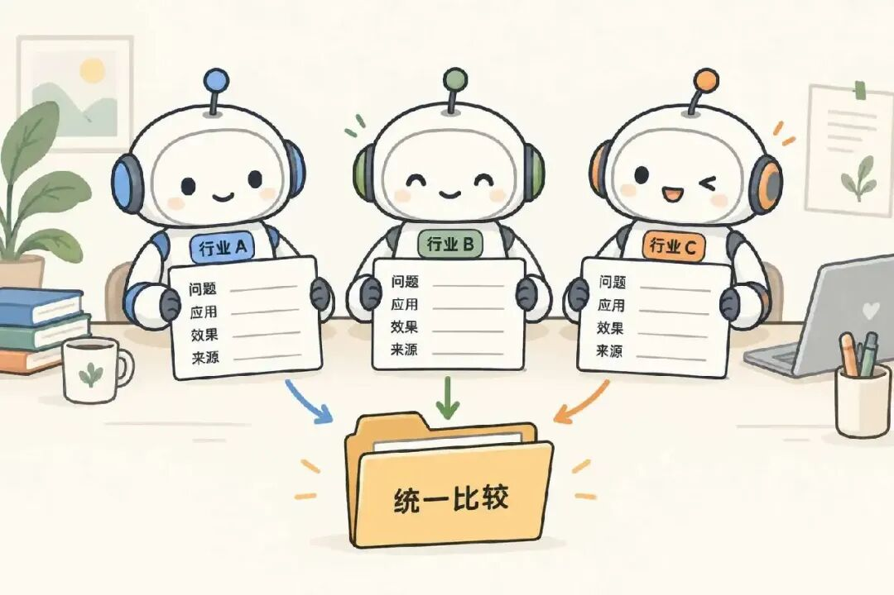

## 最后算收益：节省的工作，够不够支付交接成本

我们在系统每增加一个 Agent，都要交代任务背景、任务要求、准备上下文、检查任务结果。多 Agent 同时运行，也会增加模型调用和工具使用的费用。

判断是否值得引入多 Agent，要看整项任务做下来，效果有没有变好，时间和费用是否划算。多Agent分头工作，可以缩短任务的等待时间，各自处理任务可以减少历史指令的干扰。但交代任务、汇总结果，以及补充交接时遗漏的信息，同样需要投入。即使每个子任务都提前完成，如果最后汇总和返工花了更多时间，整项任务也可能比一个 Agent 做得更慢。

我们可以据此决定：**先找到单 Agent 的具体瓶颈，再确认能拆出独立交付的工作，最后判断收益是否值得增加的成本。**满足这些条件以后，才进入下一个问题：这些 Agent 应该怎么合作。

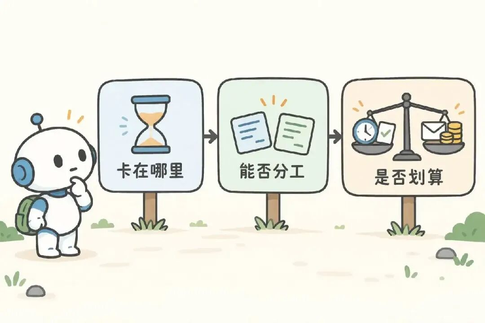

## 多个 Agent 可以怎么合作

决定分工以后，接下来要考虑的事情是，这次任务交给谁，哪些工作可以同时做，哪些要等前一步完成。下面几种协作方式，分别处理这些问题，我们可以根据需要组合使用。

## 顺序交接

我们可以让调研 Agent 先提交资料，写作 Agent 根据资料写稿，再交给审查 Agent 检查。前一个环节达到约定的要求，后一个环节才能开始。如果审查发现某一段缺少依据，就返回调研环节补查资料。

这种方式适合步骤比较稳定的任务。假设我们要求，资料整理完成以后才能开始写，稿件审查通过以后才能交付，就可以把这些步骤和条件提前写进程序。这种按照预先安排的步骤和条件运行的方式，我们把它就叫工作流。

那么工作流和 Agent 有什么区别呢？我们可以看下一步由谁决定。工作流的步骤和分支由程序预先规定，Agent 则可以根据当前结果，在允许的范围内判断下一步做什么。Anthropic 公司在介绍工作流和 Agent 时，也采用了这样的区分方式。

两者也可以配合。比如程序规定调研结束以后才进入写作，但调研时搜索什么、资料不够时再多调研几次，可以让调研 Agent 自己判断。如果工作流中的某一步只需要按固定要求生成一次内容，直接调用模型就可以。

顺序交接也有一个问题，前面漏掉的内容可能一路传到后面。比如调研没有查到某个关键条件，写作和审查又都只看调研摘要，就可能一起漏掉。所以后面的 Agent 遇到疑问时，还需要能回到原始资料进行核对。

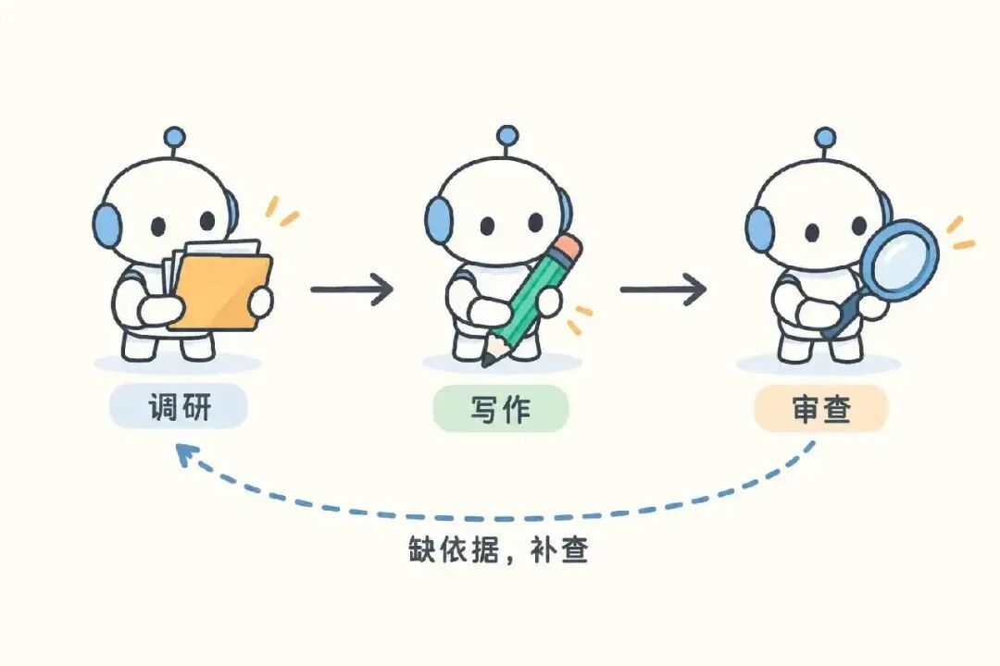

## 主管分工

除了我们上面说的提前安排好“先调研、再写作、最后审查” 这样的Agent，让他们分工协作。我们也可以让一个 Agent 根据实际情况决定怎么分工。比如修改一篇文章时，先由它通读稿件，判断哪些地方需要补查资料，哪些地方需要调整结构，再把具体工作交给其他 Agent，最后汇总结果。这个负责分工和汇总的 Agent，我们叫它协调 Agent，接到具体任务的叫执行 Agent。

比如协调 Agent 发现，稿件的引文需要核对，结构也要调整。它就可以把引文核查的事情交给其他Agent来做，自己先处理文章结构。如果只需要改几个词，它自己就可以完成，不必每次都安排其他 Agent。

任务交给执行 Agent 后，协调 Agent 还要根据返回的结果决定怎么继续。资料缺了一部分，就安排补查。这种方式允许它随着任务进展改变安排，即使一开始不能列出所有要做的事情，也可以随着任务推进，逐步确定下一步的工作。

如果执行 Agent 某项任务仍然很大，也可以允许执行 Agent 继续往拆分。这时就形成了多层委派，我们就需要在程序中控制分工的层数和任务数量，不能无限委派下去。

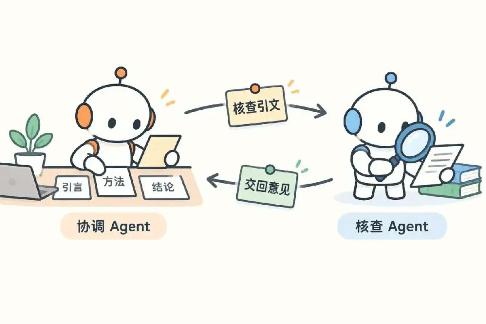

## 专家路由

如果请求的类别已经比较明确，我们可以先判断这次要做什么，再交给对应的 Agent。

比如我想确认一段引文有没有出处，就交给能搜索资料的 Agent。如果只是想把原文中的一段话改的更加通顺，就交给改稿 Agent。这种按请求类型分配工作的方式，就叫路由。每一类工作由谁负责，通常已经提前安排好，一次请求可能只用到其中一个 Agent。

这种方式适合不同类别需要不同工具或权限的情况。如果改稿 Agent 收到任务后，发现问题涉及事实，需要重新核查，也需要把疑点做详细说明，交回给负责分配任务的程序或 Agent，然后再重新调整安排。

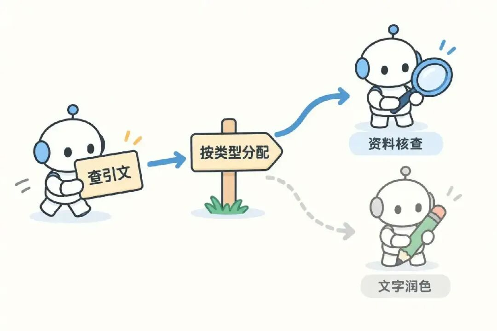

## 并行协作

并行协作模式的比较简单，假设我们现在要检查一篇文章，需要核对事实，也要看看表达是否清楚。这两项工作没有什么交集，可以分别完成，我们就可以安排两个 Agent 同时做，一个检查事实，一个检查语言表达。

那么，它们检查的时候，能不能直接修改文章呢？如果两个 Agent 同时改同一份稿件，就可能覆盖对方的内容。所以我们可以先让它们分别提交检查意见，等意见回来以后，再由写作 Agent 统一修改。

这种可以各自完成、不需要互相等待的工作，就适合并行。

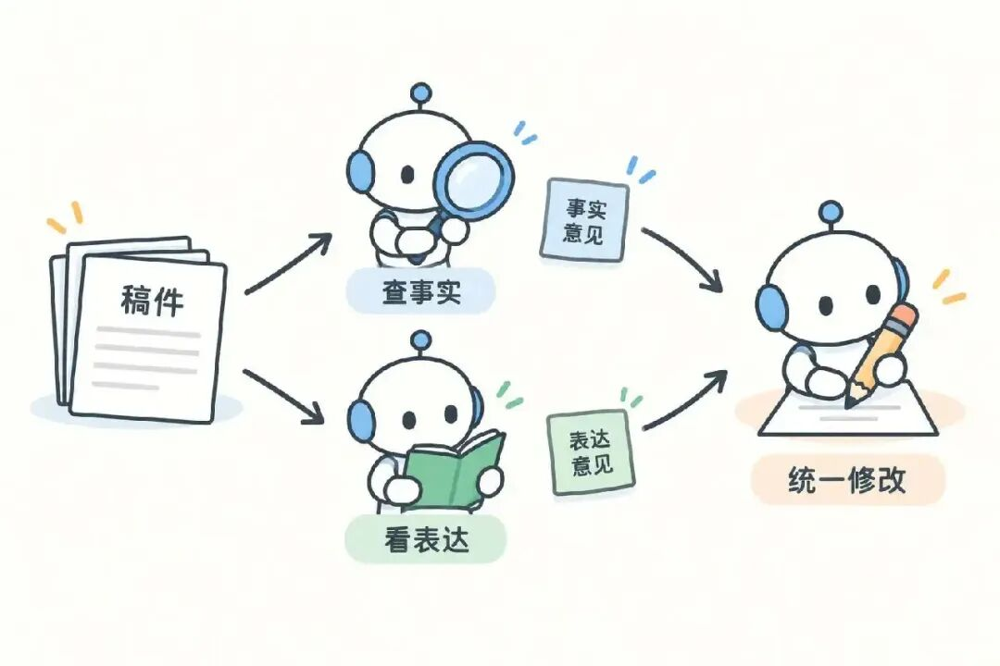

## Agent拆分工作后，系统还要做什么

前面我们介绍了顺序交接、主管分工、专家路由和并行协作。这些都是Agent合作的方法，分好工不代表大家就能配合好。工作交出去了，我们总得知道对方做完没有，遇到问题也得有人处理。

如果把单个 Agent 比作一名员工，那么多个 Agent 一起工作，就像组成了一个项目组。项目组里有人负责分工，也有人负责具体执行。项目组通常会用项目管理工具来管这些事。比如一项核查工作交给了同事，我们可以在工具里看到他的进度，做完以后也能找到他提交的检查意见。

多 Agent 系统也一样，协调 Agent 可以决定把引文核查交给其他Agent处理，自己继续调整文章结构，系统则需要记录这次安排，启动核查任务，并在完成后把结果交回来。如果核查迟迟没有完成，或者用户中途换了稿件，也要能找到对应的任务，调整后续安排。

这里的项目管理工具，不一定是一个独立的软件，而是程序提供的一组能力。比如协调 Agent 想查看核查进度，就调用程序提供的查询工具。下面我们继续用改稿的例子，看看系统具体需要做什么。

## 1. 创建和管理任务

协调 Agent 提交委派请求后，程序首先要把它记录为一项可以跟踪的任务。

比如这次引文核查，程序会先给任务分配一个编号，把核查要求和对应的稿件版本存下来。这项任务也要关联到发起它的协调 Agent，完成后才知道把结果交给谁。后面协调 Agent 想查进度，或者取消这次核查，用这个编号就能找到它。

程序还要随着任务进展更新状态。任务还在排队，就标记为等待中，任务开始执行核查了，再改成执行中。同时任务成功和失败都要记录下来。

程序还需要控制同时运行的任务数量和资源开销。假设最多允许同时运行五项任务，新提交的任务就需要排队。对于允许继续委派的 Agent，也要限制委派层数和任务总数，避免一项工作不断拆分，超出原先的时间和费用预算。

如果任务运行超过约定时间，程序需要按规则停止或通知后续处理，如果用户取消整次改稿，程序也要根据任务之间的关系，停止相关的子任务，记录已经完成的部分。

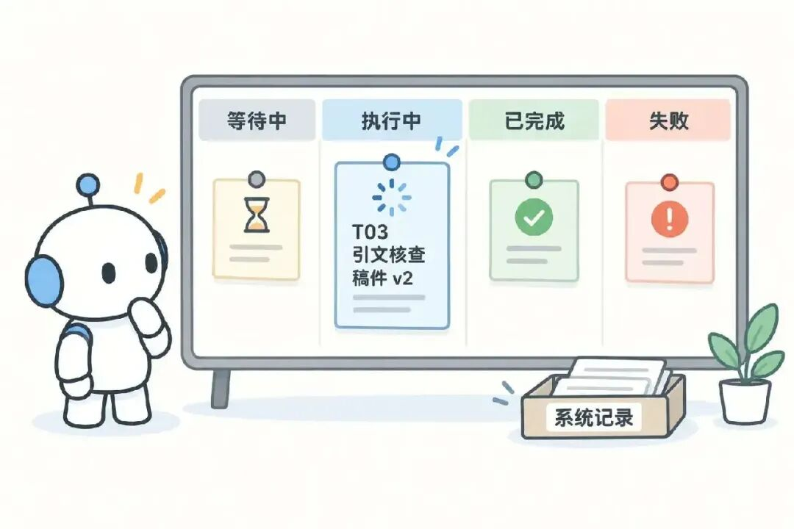

## 2. 准备上下文，限制工具权限

启动核查 Agent 之前，程序需要准备它完成任务所需的上下文。即使它们使用同一个模型，协调 Agent 之前的对话也不会自动出现在核查 Agent 的上下文里。

我们可以把待核查的段落和已有参考资料交给它，再说明这次要查到什么程度。比如找到了引文出处还不够，还要读一下原文，确认稿件有没有曲解作者的意思。

这些内容可以由协调 Agent 整理，再由程序传入。上下文不必每次都包含完整的对话历史，但也不能为了缩短长度，只留下一句含糊的任务要求。需要传多少内容，取决于执行 Agent 需要哪些上下文信息才能把事情做好。

工具权限也要在启动时确定。如果核查 Agent 只负责提交意见，程序可以给它搜索和读取工具，不开放修改稿件的能力。协调 Agent 可以提出需要哪些工具，最终是否允许使用，仍要由程序根据权限规则检查。

仅在提示词里写上不要修改原文，并不能代替权限限制。程序需要在工具开放和调用时实际执行这些限制，确保任务只能在允许的范围内进行。

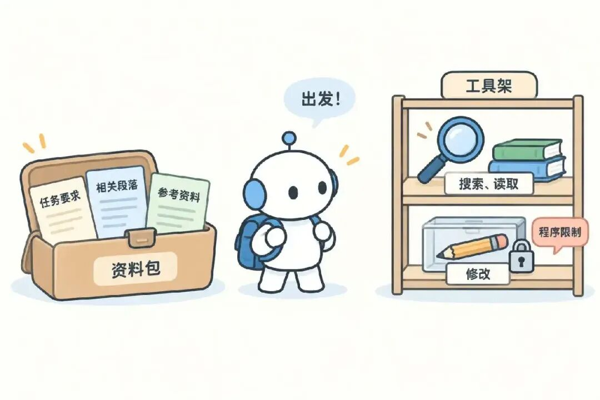

## 3. 记录进度，交回执行结果

核查任务启动后，协调 Agent 可以继续调整文章结构。程序则需要保存核查任务的状态，让协调 Agent 在需要时知道它是否已经完成。

一种方式是提供查询工具，由协调 Agent 查询任务进度。另一种方式是在任务结束时发送通知，把结果交回协调 Agent。具体采用哪种方式，可以根据协作流程决定。如果下一步必须等核查完成，就等待结果；如果还有其他工作可以推进，就先处理其他工作。

如果事实核查和语言检查同时进行，程序需要分别保存它们的状态和结果。后续是等两项检查都完成再改稿，还是先处理已经返回的意见，可以由协调 Agent 判断，也可以在工作流中提前规定如何处理。

收到意见后，负责汇总的 Agent 还要自己做出判断，不能直接把所有建议都改进稿件。比如语言检查建议简化一句引文，但事实核查要求保留原话，就需要先解决这个冲突。对结果有疑问的时候，可以再安排一次补查，由程序启动新的任务。

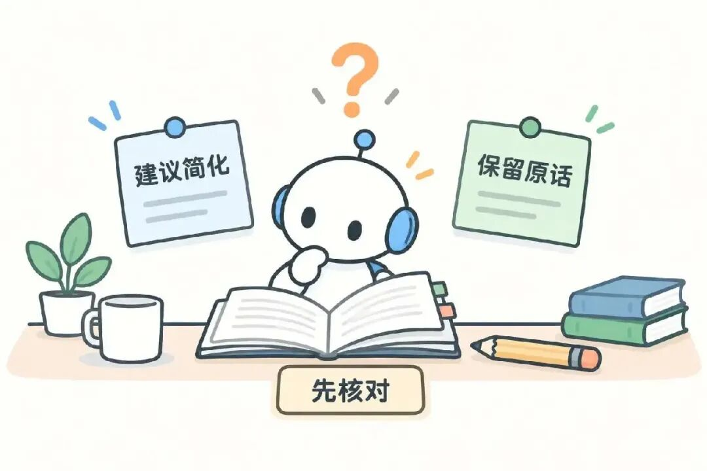

## 4. 处理需求变化和执行失败

当任务安排出去以后，原来的安排也可能发生变化。比如用户缩小了任务范围，协调 Agent 就要重新检查已经派出去的工作。有些可以继续，有些已经没必要做了。程序需要提供修改或取消任务的工具，让协调 Agent 能把安排调整过来。

如果任务要求已经变了，之前启动的 Agent 可能还在按旧要求执行。程序需要保留它接收到的任务需求，同时返回的结果时也带上这份请求记录。协调 Agent 才能判断结果是否还适用，避免直接采用已经过时的结果。

如果任务执行失败，我们还需要分情况处理。比如外部服务暂时连不上，可以稍后重试，如果是缺少必要资料，重复执行通常没有用，需要先把资料补上。应用程序要把任务失败原因返回给协调 Agent，后续可以按预设规则处理，也可以让协调 Agent 决定下一步怎么处理。

任务出了问题以后，我们还需要能够回来查询执行细节。比如某个 Agent 提交的结果不符合要求，可以先看它收到的任务说明，再检查执行过程中的工具调用和返回结果。因此，程序需要留下这些记录，帮助我们找到原因，而不只是告诉我们任务失败了。

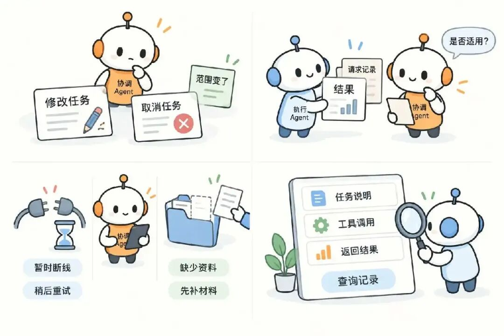

回到最初写公众号文章的那个场景，如果有些工作值得分开做，我们就可以像带一个项目组那样，想清楚谁负责什么，需要拿到哪些资料，做完以后交给谁。每个 Agent 在自己负责任务的部分继续查资料、作判断，程序负责把任务启动起来、记录进度、再把结果传回来。如果中间发现资料不够，或者前后意见对不上，就需要补查资料，或者核对后再修改。。多 Agent 就是这样，通过一次次分工、交接和调整，把一项工作共同做完。

### 然后对 AI 深度学习感兴趣的可以点击：

**[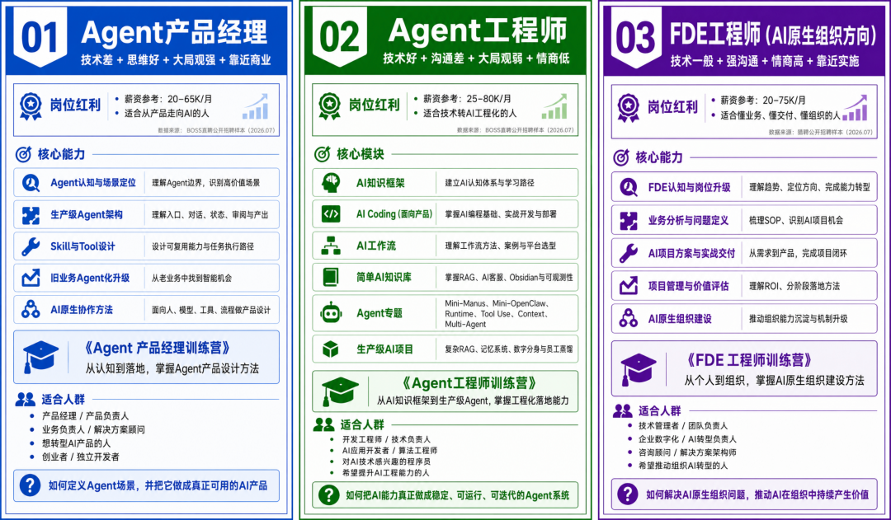]()**

