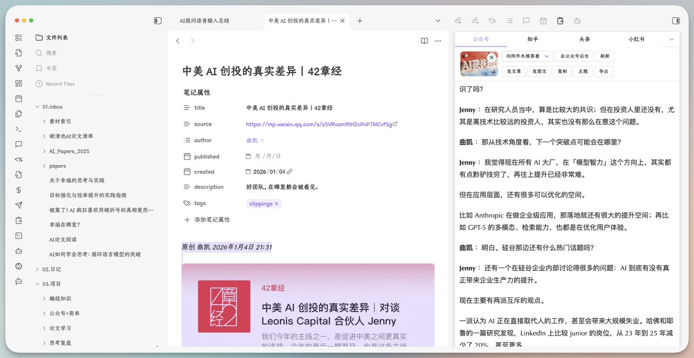
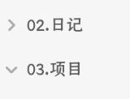
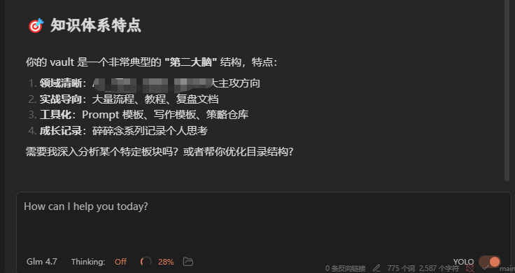

Obsidian + AI = ？ 只需3个插件，重新爱上本地笔记

几年前很痴迷安装各种Obsidian插件，后来弃坑。

发现还是iOS备忘录方便。

现在有了Code Code，发现Obsidian这种本地Markdown，太适合与AI整合了。

如何不想过于折腾，分享个极简Obsidian配置方案。

1\. 主题安装Baseline，简洁优雅。

2\. 中文字体参考tw93兄开发的妙言，用TsangerJinKai02，代码字体用 JetBrains Mono

3\. 插件安装Claudian，把CC整合到侧边栏，能读取当前Markdown对话。

4\. 公众号写作，可安装NoteToMP插件，一键发草稿箱。

另外推荐官方的剪藏插件，能把任意内容转Markdown存本地，方便AI处理省token。

所有插件、字体我会放评论区。

### 🖼️ Attached Media

## 💬 Replies

### 1 @vista8 (向阳乔木) (Author)

*Sun Jan 04 14:45:43 +0000 2026*

中文字体 [github.com/tw93/MiaoYan-N…](https://github.com/tw93/MiaoYan-NetNewsWire-Theme/blob/main/TsangerJinKai02-W04.ttf)

英文字体 [jetbrains.com/lp/mono/](https://www.jetbrains.com/lp/mono/)

Baseline主题，官方应该可以搜到，没有用这里
[github.com/aaaaalexis/obs…](https://github.com/aaaaalexis/obsidian-baseline?tab=readme-ov-file)

Note2MP，官方市场有，发公众号应该是付费功能，也不贵 [github.com/sunbooshi/note…](https://github.com/sunbooshi/note-to-mp)

Caudian ，把CC装到Obsidian [github.com/YishenTu/claud…](https://github.com/YishenTu/claudian)

OB官方剪藏Chrome插件 [chromewebstore.google.com/detail/obsidia…](https://chromewebstore.google.com/detail/obsidian-web-clipper/cnjifjpddelmedmihgijeibhnjfabmlf)

### 2 @Vincent_AINotes (Vincent)

*Sun Jan 04 14:43:53 +0000 2026*

@vista8 这套方案在桌面端确实优雅，但移动端同步与体验通常是弃坑的高发区。 iOS 备忘录的优势在于 iCloud 的无感毫秒级同步。而 Obsidian 在 iOS 上如果文件过多（特别是包含大量 .git 或缓存文件时），启动速度会显著变慢。

### 3 @vista8 (向阳乔木) (Author)

*Sun Jan 04 14:49:03 +0000 2026*

@win1688888888 买了官方的同步，会好一点。

### 4 @Jimmy_JingLv (吕立青_JimmyLv 2𐃏26)

*Mon Jan 05 02:21:16 +0000 2026*

@vista8 为什么只有日记和数字 02. 有空格啊？！！ 逼死强迫症😒k

### 5 @hiheimu (赖叔 | LaiShu.ai)

*Sun Jan 04 15:14:59 +0000 2026*

@vista8 有时候发现工具太多真不是好事

飞书剪映、obsidian的剪切插件、youmind的剪切插件、Notion，，

我有时都不知道该把内容存哪里了？ 

### 6 @dywfjyie2489 (JimmyJuan)

*Mon Jan 05 14:38:04 +0000 2026*

@vista8 ios的obsidian有一个问题, remotely save + 阿里云的oss同步速度太慢.

### 7 @Yirasumi (^薄荷奶昔^)

*Sun Jan 04 16:32:28 +0000 2026*

@vista8 Code Code是什么

### 8 @BrahmosK150212 (史前生物圈)

*Mon Jan 05 05:00:47 +0000 2026*

@vista8 感谢大佬分享，那个claudian 插件确实很实用，值得大力安利

### 9 @bigdatabong (add)

*Tue Jan 06 15:07:37 +0000 2026*

@vista8 感谢

### 10 @whateverhk2025 (Sibyl)

*Mon Jan 05 10:50:49 +0000 2026*

@vista8 @readwise save thread

### 11 @JarryR2D (Jarry | Industry AI)

*Sun Jan 04 22:57:16 +0000 2026*

@vista8 @readwise save

### 12 @TZ84gg6fPy6EoDj (张小伟在努力)

*Mon Jan 05 08:56:45 +0000 2026*

@vista8 爱看，多发点。业余爱好者买了GLM季卡，发现对于不会编程的人来说，实在是鸡肋。正好用在obsidian

### 13 @xiaowen52085050 (xw)

*Mon Jan 05 11:45:29 +0000 2026*

@vista8 试一下剪藏插件

### 14 @praveen82423263 (praveen soni)

*Wed Jan 14 11:08:31 +0000 2026*

@vista8 发现 claudian 无法读取 PDF，博主的可以读取吗

### 15 @praveen82423263 (praveen soni)

*Wed Jan 14 11:02:59 +0000 2026*

@vista8 请问下博主 claudian 可以用订阅的 Claude 账号吗，还是只能用 API

### 16 @haibin00103029 (七十七.七)

*Mon Jan 05 01:45:16 +0000 2026*

@vista8 感谢分享，为了好好的投喂agent，我也准备notion切ob

### 17 @nemoisme (nemo)

*Mon Jan 05 14:49:54 +0000 2026*

@vista8 已经安排到位，确实强大，正好今天买了GLM的一年套餐，可以代码写作两不误搞起了 

