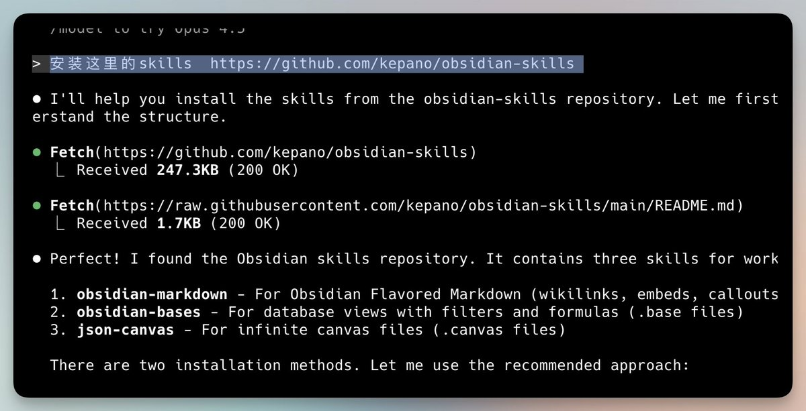

Obsidian CEO写的Skill，基于X用户调研。

这几天，他好像经常问大家用给Ob写了什么好玩的Claude Skill。

其实，大家的回复更精彩，但他写的很基础底层。

① 写出Obsidian风格的Markdown （内链、属性等）
② 生成.Base 文件的过滤器和公式
③ 生成Canva无限画布等

用这个很简单，只需要告诉Claude Code：

安装这里的skills  [github.com/kepano/obsidia…](https://github.com/kepano/obsidian-skills)

### 🖼️ Attached Media

## 💬 Replies

### 1 @0xkakarot888 (0x卡卡撸特🍌🧪🤖😈)

*Wed Jan 07 04:08:07 +0000 2026*

@vista8 好像今天都在发这个，收藏了

### 2 @0xhardman (0xhardman)

*Thu Jan 08 11:27:22 +0000 2026*

@vista8 卧槽急需这个 每次和cc对话学习后都做笔记到ob里

### 3 @selfhosted_ai (Eugene Pyvovarov)

*Wed Jan 07 13:32:49 +0000 2026*

@vista8 nice find!! added it to @MCPbundler skills marketplace

### 4 @sephirx_li (sephirx)

*Wed Jan 07 12:15:28 +0000 2026*

@vista8 gemini不用的，可以直接写的，效果非常不错，还有ui设计

### 5 @alex_metacraft (Alex🦇🔊 e/acc)

*Wed Jan 07 18:47:25 +0000 2026*

@vista8 我还没从notion彻底迁到Obsidian，想问问你们都是直接让ClaudeCode操作vault里的md文件及结构呢？还是通过MCP调用Obsidian的？

### 6 @bigdatabong (add)

*Wed Jan 07 10:18:44 +0000 2026*

@vista8 @readwise  save thread

### 7 @creeksuen (creek)

*Thu Jan 08 06:29:29 +0000 2026*

@vista8 还没试过  先记录下

### 8 @dali51334388 (行者达达)

*Wed Jan 07 07:13:39 +0000 2026*

@vista8 最近兜兜转转又回到了 obsidian，obsidian 的本地存储 md 格式文档，对于 AI 的调用、分析等简直太方便和友好了。

