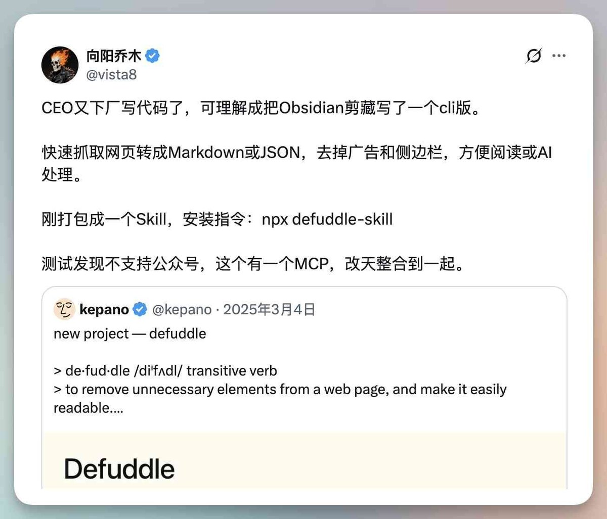
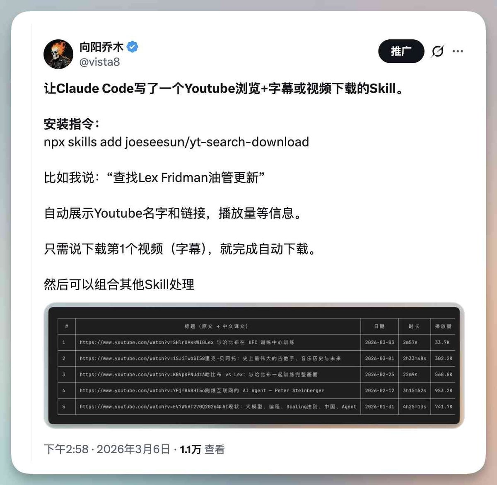
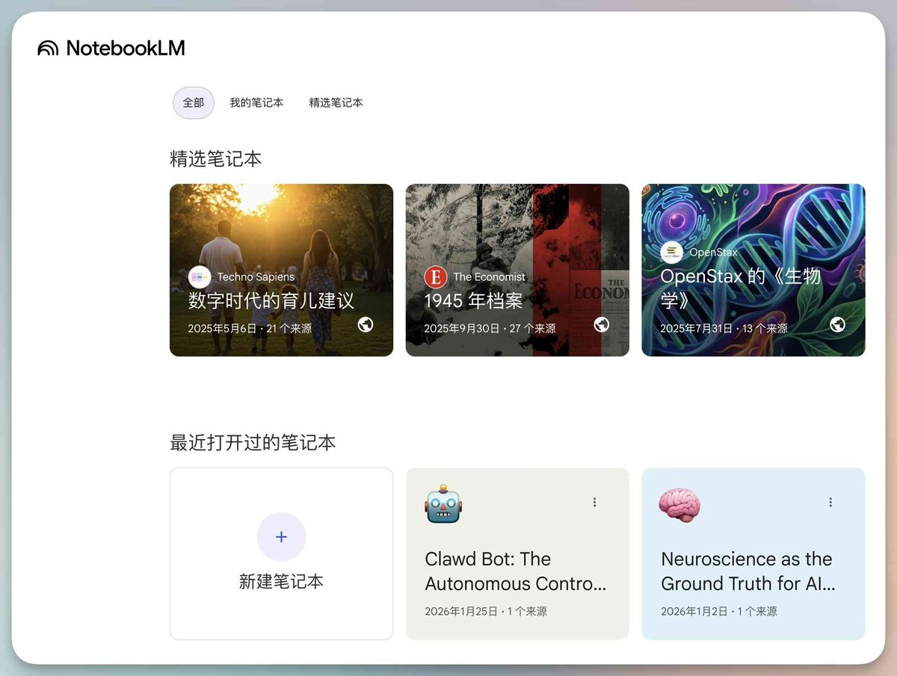
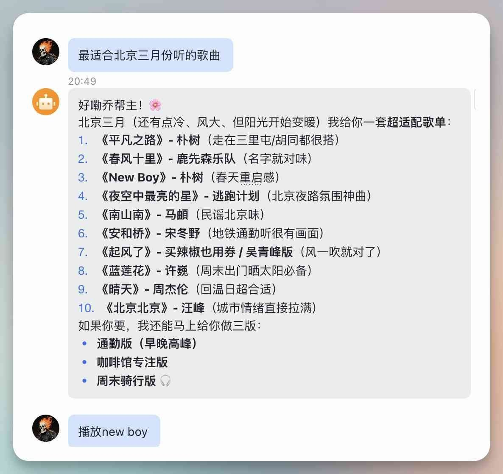
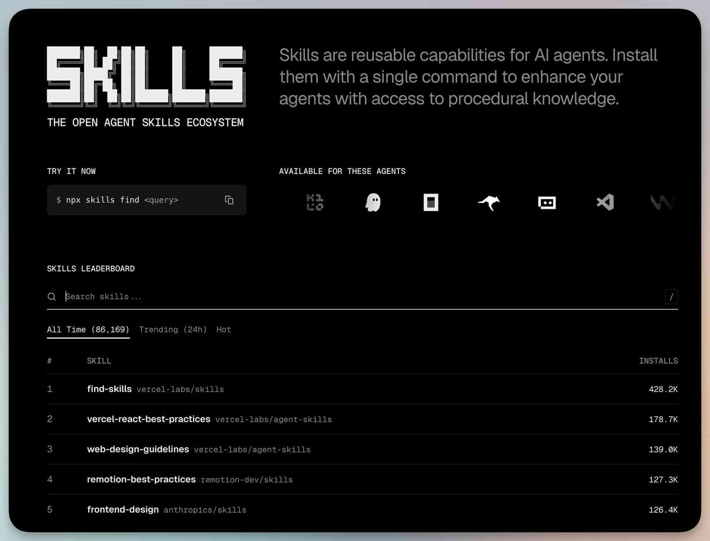
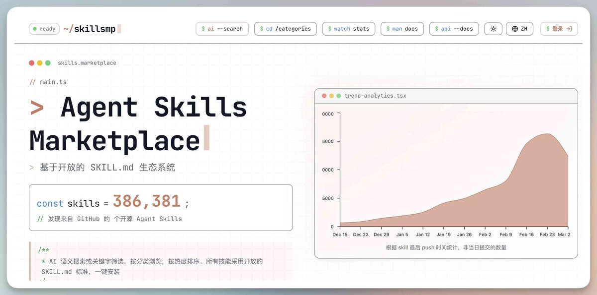
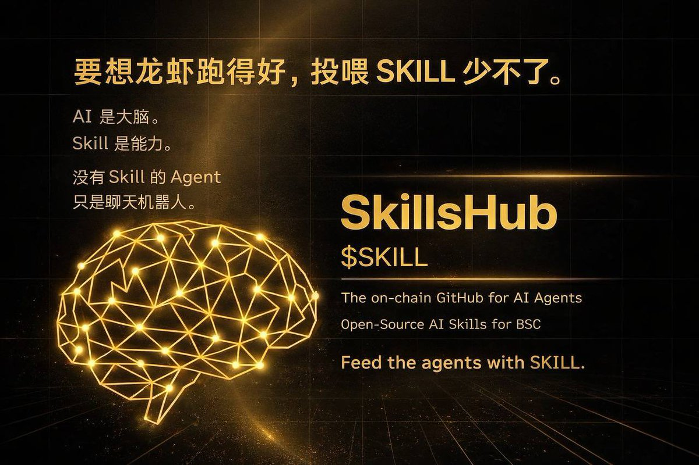

# 📰 劝一句：龙虾越火，越应该研究Skill，千万别跑偏！附送乔帮主精选Skills

最近龙虾（OpenClaw）火得不像样。

先不说早先因为龙虾卖爆的 Mac mini。

也不必说国内各个云主机厂商纷纷跟进热点，全都支持一键部署安装龙虾。

国内各大模型厂商都推出 Coding Plan，为了让大家接入龙虾用。

最近甚至出现上门付费安装，现已经卷到免费安装阶段。

比如今天腾讯安排 20 个技术人员免费给大家安装龙虾，场面异常火爆。

我的直观感受：最近所有邀约活动，全和龙虾相关，绝了！

不是想泼冷水啊。

我认为，龙虾越热，普通人更应该沉下心打磨 Skill。

否则龙虾装了也没太大用处。

下面推荐几个自己和网友们写的 Skill，未来可以被龙虾调用，抛砖引玉。

## 常用 Skill 有哪些？

发现多数人都会搞一套自己的信息抓取采集 Skill。

道理很简单，AI 再聪明，得先喂得进东西才行。

下面按「抓取采集」「内容创作」「效率工具」三条线介绍。

## 一、抓取采集 Skill

## 1\. Agent Reach —— 给 AI 装上眼睛

> 仓库：https://github.com/Panniantong/Agent-Reach

一句话概括：零 API 成本，让 AI Agent 能访问整个互联网。

网页抓取、YouTube 字幕提取、Twitter/X 搜索、GitHub 访问、Reddit 解析、B 站、小红书、抖音、微信公众号、RSS 订阅、语义搜索……能想到的信息源基本全覆盖了。

亮点：

- 全部使用免费开源后端，不需要单独申请各家 API Key

- 本地凭证存储，cookie/token 不外传

- 支持中文平台（小红书、抖音、微信）

- 内置诊断工具 agent-reach doctor，一键排查环境问题

安装方式：让 AI Agent 说

> "帮我安装 Agent Reach: https://raw.githubusercontent.com/Panniantong/agent-reach/main/docs/install.md"

需要 Python、yt-dlp、gh CLI 等基础环境，中文平台（比如小红书）需 Docker 运行 MCP 服务。

## 2\. Defuddle —— 网页正文提取神器

> https://github.com/joeseesun/defuddle-skill

一句话概括：从网页中提取干净的文章内容，去除广告、侧边栏等杂乱元素。

Obsidian CEO下厂写的命令行工具，我把它封装成了Skill。

你跟 AI 说「帮我提取这个链接的文章内容」，它自动调用 Defuddle，返回干干净净的 Markdown 正文 + 标题、作者、发布日期、字数等元数据。

安装：

> npx skills add joeseesun/defuddle-skill

## 3\. YouTube 搜索下载，视频转写第一步

> Github：https://github.com/joeseesun/yt-search-download

一句话概括：YouTube 全站搜索 + 视频下载 + 字幕提取，一站搞定。

支持按日期/播放量/相关性排序搜索，频道浏览及频道内搜索。

多画质视频下载（最高 4K），MP3 音频提取，字幕获取（SRT 带时间戳 + TXT 纯文本）。

英文标题还会自动翻译成中文。

典型用法：

- 搜索某个主题的最新视频

- 下载视频并提取字幕，用于后续内容创作（写长文、写推文等）

- 只提取音频做播客素材

安装：

> npx skills add joeseesun/yt-search-download

前置条件：先免费申请 YouTube API Key + yt-dlp（brew install yt-dlp）。

注意，要经常更新yt-dlp，使用纯净度高的IP。

## 4\. Anything to NotebookLM —— 万物皆可用NotebookLM处理

> https://github.com/joeseesun/anything-to-notebooklm

一句话概括：把任何内容（微信文章、YouTube 视频、PDF、EPUB 等 15+ 格式）扔进 Google NotebookLM，自动生成播客、PPT、思维导图、测验等。

整合了多个开源项目，比如好友tenglin的NotebookLM-py、微软的Markitdown等。

这个 Skill 打通了从「内容获取」到「NotebookLM 输出」的完整链路。

你可以说「把这篇微信文章变成播客」，它自动完成抓取 → 转换 → 上传 → 生成。

支持的输入格式：微信公众号、YouTube、PDF、EPUB、网页、Office 文档、图片、音频……

支持的输出格式：播客、PPT、思维导图、测验、报告、视频、信息图

安装：克隆仓库后运行安装脚本——

> git clone https://github.com/joeseesun/anything-to-notebooklm.git
cd anything-to-notebooklm
./install.sh

## 二、内容创作 Skill

## 5\. 宝玉老师的 Skill 合集 —— 内容创作全家桶

> 仓库：https://github.com/jimliu/baoyu-skills

宝玉老师（@dotey）的 Skills 合集堪称「一个人的内容工厂」。

涵盖了从图文创作到社交媒体发布的完整链路：

视觉内容生成：

- 小红书信息图：多种风格 × 多种布局定制

- 通用信息图生成器：20 种布局 + 17 种视觉风格

- 封面图工具：5 维度设计系统（类型、配色、渲染、纹理、排版）

- 幻灯片创建器：14+ 风格预设

- 漫画生成、文章插图

社交媒体发布：

- X (Twitter) 发布

- 微信公众号发布

- 小红书自动发布

内容处理工具：

- Markdown 格式化与转换

- 图片压缩（WebP/PNG）

- DeepL 翻译

- URL 转 Markdown

安装：

> npx skills add jimliu/baoyu-skills

这套合集特别适合做自媒体的朋友，一个 Skill 包解决从内容生产到分发的全部需求。

6\. Markdown 一键发 X 长文

> 仓库：https://github.com/joeseesun/qiaomu-x-article-publisher

一句话概括：写好 Markdown，一键发布为 X (Twitter) Articles 草稿。

支持完整 Markdown 格式（标题、加粗/斜体、列表、引用、代码块、链接、图片），自动处理图片上传，7 天免重复认证。

安装：

> git clone https://github.com/joeseesun/qiaomu-x-article-publisher.git \~/.claude/skills/qiaomu-x-article-publisher
pip install Pillow pyobjc-framework-Cocoa patchright
python auth\_manager.py setup

## 7\. Knowledge Site Creator —— 一句话生成学习网站

> 仓库：https://github.com/joeseesun/knowledge-site-creator

一句话概括：告诉 AI 你想学什么，自动生成一个完整的学习网站并部署上线。

比如你说「帮我创建一个学习进化心理学的网站」。

AI 自动完成主题分析 → 内容创作 → 页面设计 → Vercel 部署，全程不需要你写一行代码。

学习模式：闪卡、渐进学习、测验、索引、进度追踪

技术特点：

- PWA 支持，离线也能用

- SEO 优化，自带 Meta 标签和站点地图

- 零前端依赖，原生 HTML/CSS/JS

- 极简黄色主题，干净清爽

安装：

> npx skills add joeseesun/knowledge-site-creator

## 三、效率工具 Skill

## 8\. Spotify 音乐播放器 —— 用自然语言听歌

> https://github.com/joeseesun/qiaomu-music-player-spotify

一句话概括：用自然语言控制 Spotify，内置 5947 种音乐风格数据库。

跟 AI 说「放点适合写代码的音乐」或「来首 Bohemian Rhapsody」，它自动搜索匹配并播放。

支持搜索、播放、暂停、跳曲、音量调节、队列管理，还能根据场景/情绪推荐。

亮点：

- 5,947 种音乐风格，分层组织

- 30+ 风格快捷播放

- 自然语言描述映射到具体风格

- 零外部依赖，纯 Python 标准库

- 自动 OAuth token 刷新

安装：

> npx skills add joeseesun/qiaomu-music-player-spotify

需要 Spotify Premium 账号（淘宝150一年，还可以）

具体用法和配置见：

https://github.com/joeseesun/qiaomu-music-player-spotify

## 9\. Design Advisor —— 乔布斯式设计顾问

用自己的一个Prompt生成的UI设计Skill。

没想到效果经常有意外惊喜。

> https://github.com/joeseesun/qiaomu-design-advisor

一句话概括：融合乔布斯产品直觉 + Rams 功能纯粹主义的 UI/UX 设计顾问。

不是那种「这里颜色改一下」的敷衍建议。

它会深入挖掘表面需求背后的真实用户需要，审视每个细节（间距、色温、动画时序）。

为每个问题提供三个层级的解决方案（渐进改进、结构重设计、理想方案），并透明展示权衡。

触发词："重新设计"、"redesign"、"review UI"、"优化交互体验"

安装：

> npx skills add joeseesun/qiaomu-design-advisor

## 四、Skill 管理与发现

写好 Skill，怎么发布？

最好的方式是用 Git 管理起来，甚至发布到 GitHub 共享（也可放私有库）。

写了个 Skill 帮不熟悉的朋友做这件事——Skill Publisher：

> 仓库：https://github.com/joeseesun/skill-publisher

它会自动完成：验证 SKILL.md 元数据  → 创建 GitHub 仓库 → 推送代码 → 验证可通过 npx skills add 安装。

> npx skills add joeseesun/skill-publisher

需要 GitHub CLI (gh) 已安装并认证。

去哪找更多 Skill？

推荐三个渠道：

## 1\. Skills.sh —— Vercel 官方技能目录

> https://skills.sh/

Vercel 打造的开源 Skills 目录，收录超过 86,000+ 个 Skills。

支持 20+ 平台（Claude Code、GitHub Copilot、Cursor、Cline、Gemini 等），可按热度、趋势筛选。

## 2\. Find Skills —— 用 Skill 找 Skill

> https://skills.sh/vercel-labs/skills/find-skills

装上这个 Skill 后，直接在终端搜索和安装其他 Skill。

可以称之为：“元Skill”

> npx skills add vercel-labs/skills/find-skills

然后就可以用 npx skills find react performance 这样的命令搜索了。

## 3\. SkillsMP —— 最大的 Skill 集市

> https://skillsmp.com/zh

社区驱动的 Skills 聚合平台，收录 38w+ 个 Skills，支持中文界面。

从 GitHub 公开仓库自动抓取和同步，有基本的质量过滤（最低 2 stars 门槛）。

## 写在最后

Skill 是龙虾的灵魂。

没有 Skill 的龙虾，就像一台没装 App 的手机。

龙虾越热，越该沉下心打磨自己的 Skill。

与其追热点装龙虾，不如先想清楚：你让 AI 帮你干什么？

这个问题想清楚了，Skill 自然就知道怎么写了。

### 🖼️ Attached Media

## 💬 Replies

### 1 @dotey (宝玉)

*Fri Mar 06 23:12:59 +0000 2026*

@vista8 感谢推荐

### 2 @GoSailGlobal (Jason Zhu)

*Fri Mar 06 15:35:51 +0000 2026*

@vista8 @grok  给到所有推荐的skills名字和链接

### 3 @yanhua1010 (Yanhua)

*Fri Mar 06 15:18:48 +0000 2026*

@vista8 哇塞 好全面的skills 好多都安装了

### 4 @cnyzgkc (木马人)

*Sat Mar 07 00:42:17 +0000 2026*

@vista8 收藏了，感谢乔帮主

### 5 @0xReggieJ (ReggieJ)

*Mon Mar 09 08:41:07 +0000 2026*

@vista8 请大佬指正 [x.com/0xReggieJ/stat…](https://x.com/0xReggieJ/status/2030890681380802967)

### 6 @ablenavy (iGarlic)

*Fri Mar 06 16:35:11 +0000 2026*

@vista8 真正用起来，发现很多问题，还需要结合自己的需求进行调教

### 7 @ross_TNTT (贰万)

*Fri Mar 06 23:19:45 +0000 2026*

@vista8 @GoSailGlobal 看了些列举的 skill，没有任何一个是让人兴奋的，龙虾就干这个？和 cc 有啥区别，这玩意除了干自媒体还有啥用？

### 8 @HuskysTech (哈士奇)

*Fri Mar 06 16:06:23 +0000 2026*

@vista8 宝玉老师的skill里不支持小红书的发布哦，只是生成小红书图片。

### 9 @yungui_ml (云归)

*Sat Mar 07 01:31:19 +0000 2026*

@vista8 @dotey 基本覆盖了素材抓取、内容创作、UI设计、内容自动发布全流程，非常全面，至少现在看起来 Skill 是最通用的东西，包括龙虾、Claude Code、或者是 AI IDE（Cursor）都是适用的

### 10 @WellonQl (🏹瑞珈🏹)

*Sat Mar 07 01:14:41 +0000 2026*

@vista8 @grok
给到所有推荐的skills名字和链接

### 11 @yuanfu_cn (Crypto-圆富 🔶 BNB)

*Tue Mar 10 08:51:48 +0000 2026*

@vista8 0x26637e4a038e48caa302c7ac384d2307ec834444

龙虾没有用的，昨天CZ也说了的，想要龙虾有用就必须要用SKILL，但是SKILL从来不是单数，当CZ说出来的时候一定是SKILLS

无论是龙虾还是TOKEN这一轮选择的都是MEME而不是AI所以我选择MEME的SKILLS

### 12 @wyp9999984219 (Yang🔝Bro)

*Tue Mar 10 08:34:37 +0000 2026*

@vista8 @Skill\_BSC   这不就是专门做SKILL的么，跑出来挺久了

### 13 @hzyyqysysai (BBJ.AI)

*Sun Mar 08 03:54:08 +0000 2026*

@vista8 乔帮主的文章先赞再看

### 14 @huynhvy789972 (scorpionn69💰💵)

*Sat Mar 28 06:00:01 +0000 2026*

@vista8 0x26637e4a038e48caa302c7ac384d2307ec834444

### 15 @bearsxy (Rateltalk)

*Fri Mar 06 15:34:52 +0000 2026*

@vista8 Notebookllm 是只有移动端应用那个吗？为啥我的打开后不支持上传word文档、

### 16 @Oracle86257429 (Oracle)

*Fri Mar 06 23:45:02 +0000 2026*

@vista8 @dotey @threadreaderapp unroll

### 17 @Dthinkc (大小王)

*Fri Mar 06 21:31:09 +0000 2026*

@vista8 热潮中保持冷静。工具越火，越要修炼内功。就像对抗脆弱一样，真正的优势来自于独立思考和独特技能，而非追逐热点。

### 18 @agentbuff_dev (AgentBuff)

*Fri Mar 06 16:23:17 +0000 2026*

@vista8 现在装龙虾，都捆绑技能卖了🤣

### 19 @iBigQiang (强子手记)

*Fri Mar 06 15:40:27 +0000 2026*

@vista8 宝藏帖。龙虾试玩了下感觉还是有点难各种不可控未知的问题，还是skill简单高效，功能可以根据业务定制完全可控。

### 20 @0XBrianXYZ (Brian Zhang)

*Fri Mar 13 13:36:25 +0000 2026*

@vista8 skill graph [x.com/0XBrianXYZ/sta…](https://x.com/0XBrianXYZ/status/2028262563340054833?s=20)

### 21 @0XBrianXYZ (Brian Zhang)

*Fri Mar 13 13:35:44 +0000 2026*

@vista8 skills 多了就需要skill graph
[x.com/0XBrianXYZ/sta…](https://x.com/0XBrianXYZ/status/2032448232283078757?s=20)

### 22 @weiym1991 (醉烂漫（MD）)

*Tue Mar 10 08:36:23 +0000 2026*

@vista8 #SKILL
定不负有缘人
@Skill\_BSC 

### 23 @higandesign (Eddieshen)

*Sat Mar 07 13:24:17 +0000 2026*

@vista8 @grok 
给到所有推荐的skills名字和链接

### 24 @kejiones (jack)

*Sun Mar 08 04:06:29 +0000 2026*

@vista8 @GoSailGlobal @grok 整理好发给我

### 25 @uniswap666666 (Exist)

*Sat Mar 07 07:43:41 +0000 2026*

@vista8 @grok

给到所有推荐的skills名字和链接

### 26 @aisloth_gg (bullmax)

*Sun Mar 08 01:53:14 +0000 2026*

@vista8 @grok 给我所有推荐的skills名和链接

### 27 @firekinger (Kinglake)

*Mon Mar 09 12:54:22 +0000 2026*

@vista8 @grok
给到所有推荐的skills名字和链接

### 28 @harrysoog (𝚑𝚞𝚠𝚎𝚒𝚜𝚘𝚘𝚐)

*Sat Mar 07 12:04:57 +0000 2026*

@vista8 龙虾炒作无非为了卖Token

### 29 @cdexsta (炎朗 Gavin)

*Sat Mar 07 06:23:37 +0000 2026*

@vista8 能够贴近自己最近的需求，用上几个最好手的skill，搞定自己能用上手的流程最重要。ps:有谁碰到telegram bot接收不到图片附件的？代理没问题，弄了好久没搞定。。。。

### 30 @vic_cc33 (VictoriaCC)

*Sun Mar 08 09:14:12 +0000 2026*

@vista8 @grok
给到所有推荐的skills名字和链接

### 31 @option_king1 (信徒（2013Crypto OG AI版）)

*Sat Mar 07 09:02:10 +0000 2026*

@vista8 有不少是在推荐skills我感覺官方发布的足够用了，不知道使用安全嘛

### 32 @Alafu18 (Alafu)

*Sun Mar 08 04:08:37 +0000 2026*

@vista8 @grok 汇总一下推荐的 skills名称和链接

### 33 @H_688888 (梁山社区-H688)

*Tue Mar 10 14:31:21 +0000 2026*

@vista8 感谢分享

### 34 @ma_zhenyuan (小麦搞钱计划)

*Sat Mar 07 00:41:01 +0000 2026*

@vista8 skills工程师 必然会是趋势：
可以明白AI的边界，用AI可以理解的语言，把行业经验，工作经验沉淀成skills
剩下的交给AI

### 35 @crypto20c_ (0xTimi)

*Sun Mar 08 03:56:14 +0000 2026*

@vista8 语音skill必备啊 [x.com/crypto20c\_/sta…](https://x.com/crypto20c_/status/2030244088231207273?s=20)

### 36 @Alanshanwei (兰善伟)

*Sat Mar 07 16:37:22 +0000 2026*

@vista8 @grok 将文章内容整理成我可以直接操作的格式发给我

