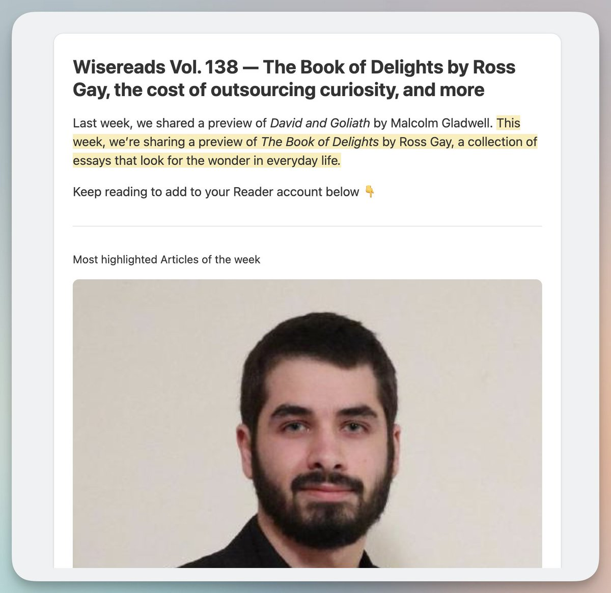

如果你每周时间有限，但又想获得前沿AI信息？

除了刷推特，分享三个精选信息源，读完基本不落伍。

1\. 老牌AI Newsletter

沉浸式翻译原作者Owen推荐我，三年以来更新稳定，每周AI热点和AI工具非常全面。

[bensbites.com](https://www.bensbites.com/)

2\. AK大神去Huggingface后搞的热门AI论文Digg榜。

靠人工投票筛选出每日、每周、每月最热AI论文。

[huggingface.co/papers/week/20…](https://huggingface.co/papers/week/2026-W17)

3\. 著名在线阅读器 Readwise 精选每周必读。

随着AI火热，AI相关文章越来越多。

除AI，还有行业大牛文章推荐，好书推荐，让你不局限于信息茧房，最新一期是138，每周修改URL+1访问即可。

[wise.readwise.io/issues/wiserea…](https://wise.readwise.io/issues/wisereads-vol-138/)

### 🖼️ Attached Media

## 💬 Replies

### 1 @MEJ50749 (MEJ毛毛姐)

*Tue Apr 21 06:21:17 +0000 2026*

@vista8 谢谢分享

### 2 @key_lantern (啦)

*Tue Apr 21 04:24:19 +0000 2026*

@vista8 推荐 bestblogs ，AI 领域文章聚合，最近还出了播客早报、个人早报，还有 cli 和 skill 方便和 agent 结合

### 3 @blanplan (BlanPlan)

*Tue Apr 21 09:01:17 +0000 2026*

@vista8 Owen那个周刊我订了三年没断过，中文AI newsletter里保持率算是最高的。AK的HF Digg榜是个好补充但热门论文有时候会比Twitter晚一天左右，作为周报素材比实时风向标更合适。Readwise那个权重偏美国科技叙事，做国内产品的话需要另配一份国内来源对冲。

### 4 @stark_nico99 (Nicolechan)

*Tue Apr 21 04:56:57 +0000 2026*

@vista8 学习了 非常实用！

### 5 @Keji715 (柯基是只猫)

*Wed Apr 22 06:19:21 +0000 2026*

@vista8 感谢乔木老师的推荐，最近正在搭建自己的信息流，感谢补充

### 6 @tonitrades_ (toni)

*Tue Apr 21 14:44:20 +0000 2026*

@vista8 Newsletters help, but curated content always lags.

By the time something gets summarized and sent, the real discussion has already moved somewhere else.

### 7 @agilertao (Eni係鬼)

*Tue Apr 21 06:34:45 +0000 2026*

@vista8 收藏学习了

### 8 @cjie17510 (arthur)

*Tue Apr 21 08:33:03 +0000 2026*

@vista8 到底要怎么开始，有人带还是自学，跟不上

### 9 @inbrief_info (InBrief Info)

*Wed Jul 01 02:46:08 +0000 2026*

@vista8 懂这种感觉，信息源多了反而累。我其实自己搞了个工具，把RSS、Reddit、X这些全揉一起，自动去重给摘要，省时间。它在我主页，感兴趣可以看看。

### 10 @will443840 (Javis)

*Wed Apr 22 00:59:58 +0000 2026*

@vista8 收藏了！

### 11 @susubutter75890 (susubuteroi)

*Wed Apr 22 06:21:34 +0000 2026*

@vista8 收藏了

### 12 @ChipWang007 (Chip)

*Tue Apr 21 17:47:17 +0000 2026*

@vista8 good

