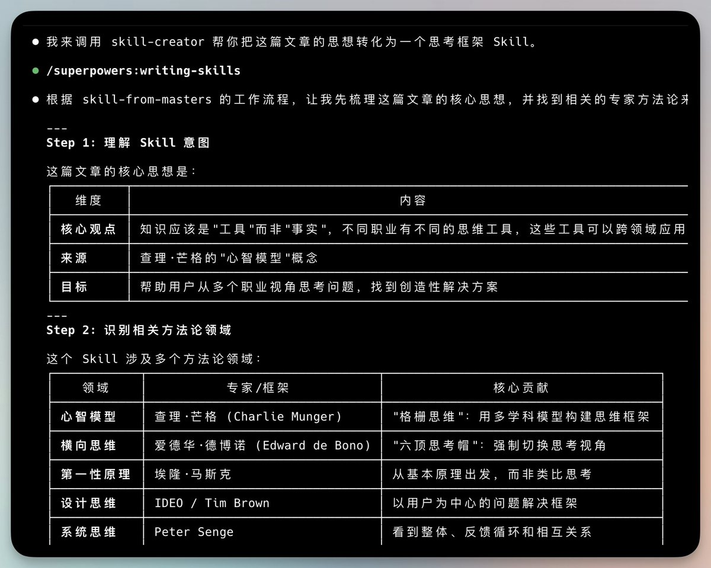
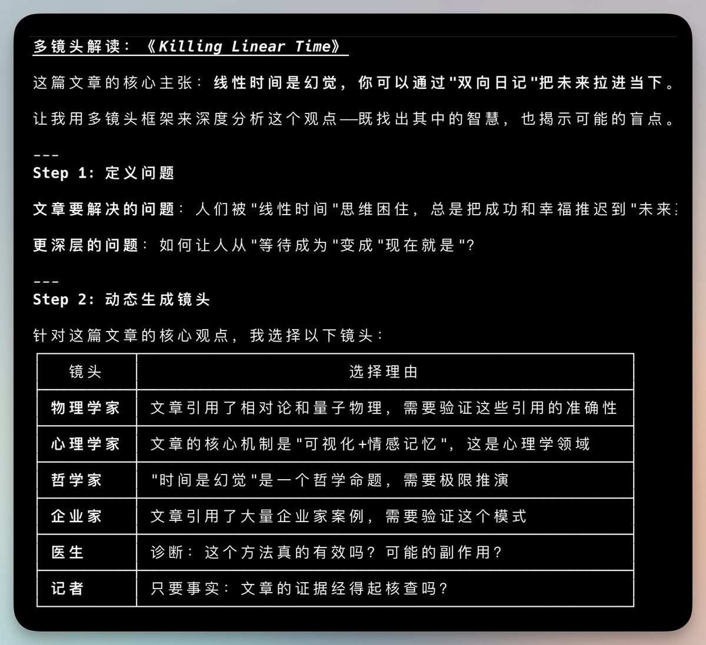
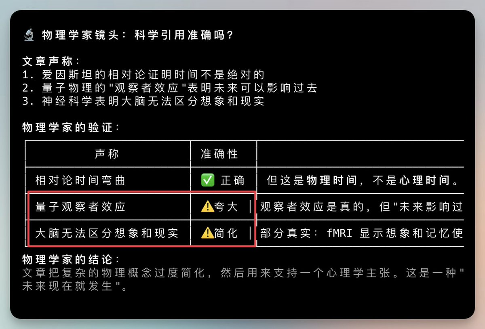
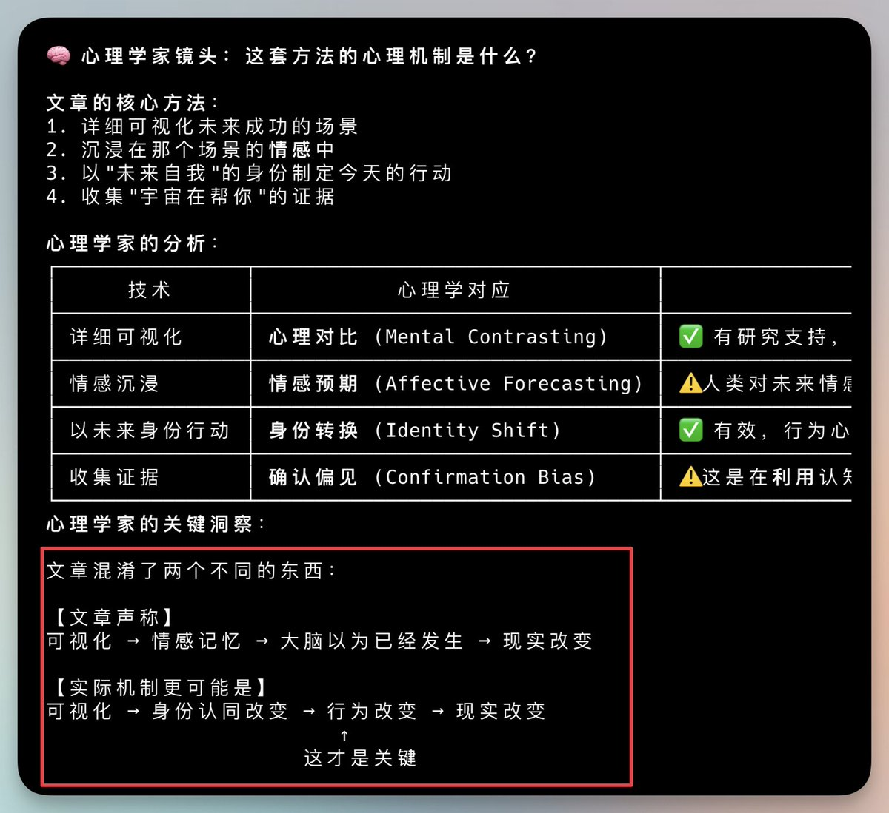
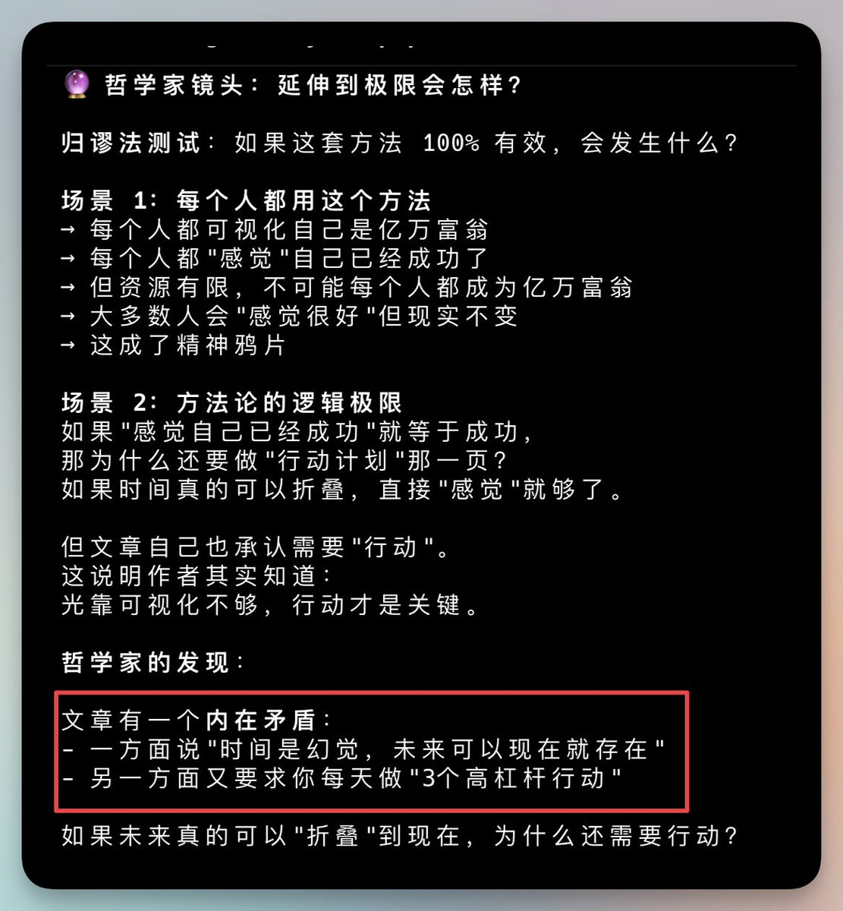

安装superpowers 这个牛逼的Claude 插件。

然后跟Claude 说，调用skill帮我把下面文章变成Skill。

一个思考框架Skill就写好了。

1.5w Star的Claude 插件安装地址。
[github.com/obra/superpowe…](https://github.com/obra/superpowers)

### 🖼️ Attached Media

## 💬 Replies

### 1 @berryxia (Berryxia.AI)

*Fri Jan 09 17:18:32 +0000 2026*

@vista8 真卷啊 乔木老师 嘿嘿

### 2 @SteadyForward08 (慢步(互关))

*Sat Jan 10 01:40:57 +0000 2026*

@vista8 效果咋样

### 3 @vista8 (向阳乔木) (Author)

*Sat Jan 10 01:46:17 +0000 2026*

@SteadyForward08 安装不复杂，可以试下，感觉还可以。

甚至能解读文章，很有批判思考精神。 

### 4 @RayChan54032058 (Ray Chang)

*Sat Jan 10 00:45:04 +0000 2026*

@vista8 没有 claude pro  skills 还没用吗

### 5 @vista8 (向阳乔木) (Author)

*Sat Jan 10 01:03:47 +0000 2026*

@RayChan54032058 任何一个Claude code中转都可以用，国内的模型也可以对付一些简单东西。

### 6 @maid_crypto (CryptoMaid加密女仆お嬢様 .stand)

*Fri Jan 09 18:08:58 +0000 2026*

@vista8 我靠原来是这么用的 今天在github看了半天没看明白

### 7 @oneikunman (ikun)

*Sat Jan 10 10:07:06 +0000 2026*

@vista8 一波接着一波  这也太快了吧？

### 8 @dreams_in_dream (bing)

*Sat Jan 10 02:27:43 +0000 2026*

@vista8 未来或许每个人都能成为AI能力的“产品经理”，自定义专属智能助手。我现在正在用Gemini ai studio开发一个小应用，放在以前，简直不敢想象，我就是一个小白啊。什么语言也不懂啊

### 9 @edenyanglawyer (Eden 杨燕亭 律师)

*Sat Jan 10 10:37:37 +0000 2026*

@vista8 这个厉害

### 10 @yihao_wenzheng (木木彡)

*Fri Jan 09 18:04:52 +0000 2026*

@vista8 太卷了😂一浪推一浪

### 11 @lumm256 (路漫漫)

*Fri Jan 09 17:51:51 +0000 2026*

@vista8 已安装，这个插件真强，可以写 skills 的 skills

### 12 @zhouql1978 (DavidZhou)

*Sat Jan 10 01:02:13 +0000 2026*

@vista8 superpowers的插件的确很强

### 13 @SeaDarrenAgent (sea Darren)

*Sat Jan 10 15:17:54 +0000 2026*

@vista8 这个superpower 和claude自带的create skill 有什么区别吗？哪个更好用？

### 14 @gogohoward (howard huang)

*Sat Jan 10 01:33:08 +0000 2026*

@vista8 感觉有点混淆，图片里显示用的是 skilll from master 这个 skill 的工作流程，不是 superpowers

### 15 @x_tom_jp (tom)

*Sun Jan 11 07:03:09 +0000 2026*

@vista8 @threadreaderapp unroll

### 16 @xili06116 (西里)

*Sat Jan 10 01:29:52 +0000 2026*

@vista8 有人试过转化技术文档吗？

### 17 @bigdatabong (add)

*Sat Jan 10 01:11:55 +0000 2026*

@vista8 一天一个skill

### 18 @bigdatabong (add)

*Sat Jan 10 01:10:56 +0000 2026*

@vista8 @readwise save thread

### 19 @freedom21166 (福瑞德木)

*Fri May 29 06:35:28 +0000 2026*

@vista8 太水了，这跟superpowers有啥关系，这不就是skill-creator吗

### 20 @aiyinsitanniu (爱因斯坦)

*Sat Jan 10 00:19:19 +0000 2026*

@vista8 学习使用起来

### 21 @zawe6hWtCAEkHHe (一个赛博木匠)

*Sat Jan 10 13:21:34 +0000 2026*

@vista8 以前用 Claude 只是在聊天，现在有了 Superpowers 真的变成了生产力工具。

把长文章直接结构化成可调用的 Skill，这本质上是在建立个人的“知识技能库”。
效率提升不是一点半点，而是从“随机发挥”到了“标准化输出”的质变。

### 22 @hbs1313 (Ben)

*Fri Jan 09 23:49:36 +0000 2026*

@vista8 @readwise save thread

### 23 @AITechCon (Lil)

*Sat Jan 10 05:00:34 +0000 2026*

@vista8 和直接让claude code总结生成skill有差别吗

### 24 @toomuchzozo1 (toomuchzozo)

*Sun Jan 11 00:12:53 +0000 2026*

@vista8 @readwise  save

### 25 @explorer_mt (Cybexr)

*Sat Jan 10 08:00:32 +0000 2026*

@vista8 你这啥字体啊 表格线很齐啊

### 26 @Fr3rty (Fr3rty)

*Sun Jan 11 11:27:13 +0000 2026*

@vista8 @readwise save

### 27 @zjp1997720 (智见AI-大鹏)

*Sat Jan 10 00:17:24 +0000 2026*

@vista8 这个 writing skill 比官方的 skill creator 要好用吗？

### 28 @momoroasky (Paraneaee)

*Sat Jan 10 10:47:23 +0000 2026*

@vista8 没多大用，徒占context window罢了

