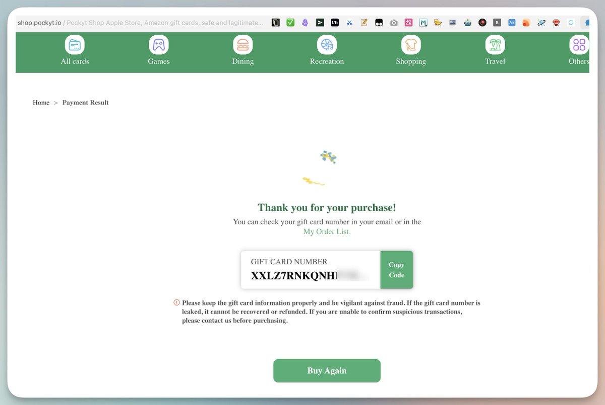
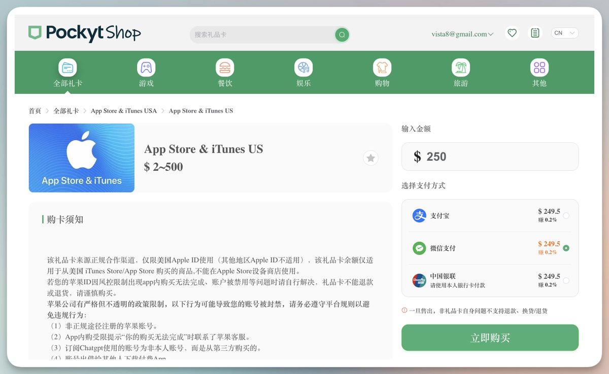
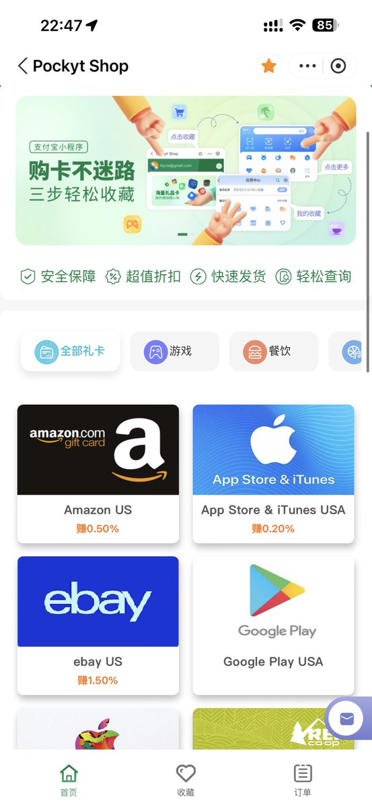
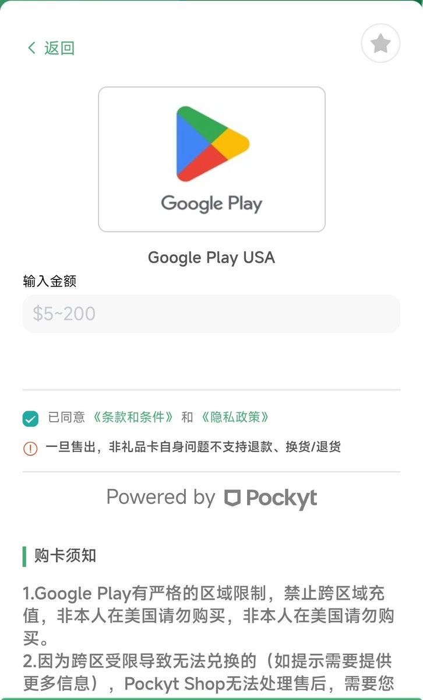
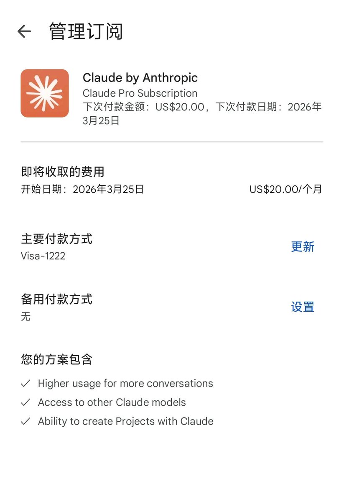

感觉苹果礼品卡才是硬通货！订阅Claude Code方便。

1\. 打开pockyt，微信或支付宝下单买需要金额。

2\. 然后打开苹果手机：

设置-&gt;媒体与购买项目-&gt;查看账户-&gt;管理付款方式-&gt;点apple 账户-&gt;点兑换-&gt;手动输入兑换码

兑换后打开Claude，用apple id余额支付升级即可。

前提：用美区Apple ID

### 🖼️ Attached Media

## 💬 Replies

### 1 @vista8 (向阳乔木) (Author)

*Thu Feb 26 14:22:26 +0000 2026*

直达购买地址 ：[shop.pockyt.io/pc/goodsDetail…](https://shop.pockyt.io/pc/goodsDetail/vc1aYhc/App%20Store%20&%20iTunes%20USA/all) 

### 2 @berryxia (Berryxia.AI)

*Thu Feb 26 14:42:57 +0000 2026*

@vista8 哈哈 我以为大家都知道

### 3 @vista8 (向阳乔木) (Author)

*Thu Feb 26 14:43:50 +0000 2026*

@berryxia 其实很多人不知道，我一直用这个订ChatGPT，但怕Claude Code封号，一直没敢订。

### 4 @CxxVen (B.Z.在下张三)

*Thu Feb 26 14:32:28 +0000 2026*

@vista8 这个方法有一个大问题：这个 Apple  id 会和你的当前登录的 claude 账号绑定，ChatGPT 账号也一样。如果更换 Claude 或 GPT 账号，再次用同样的 Apple id 的余额充值新的账号，则还是充值旧账号里，哪怕原账号封号了也是一样。（亲身经历）🤣

### 5 @vista8 (向阳乔木) (Author)

*Thu Feb 26 14:33:04 +0000 2026*

@CxxVen 对，这个特别SB，很多人都被坑过至少20美元 哈哈哈。

### 6 @Pixelxzen (紫苏子ACG)

*Thu Feb 26 14:23:30 +0000 2026*

@vista8 也有封号风险不？

### 7 @vista8 (向阳乔木) (Author)

*Thu Feb 26 14:24:56 +0000 2026*

@Pixelxzen 用美国家庭静态IP，比较稳些

### 8 @xkxzly (星下良夜)

*Thu Feb 26 14:31:01 +0000 2026*

@vista8 使用时是否需要配合住宅ip？

### 9 @vista8 (向阳乔木) (Author)

*Thu Feb 26 14:32:15 +0000 2026*

@xkxzly 最好是这样，A社有点变态

### 10 @haibin00103029 (七十七.七)

*Thu Feb 26 14:43:59 +0000 2026*

@vista8 同理，能订阅gemini吗

### 11 @vista8 (向阳乔木) (Author)

*Thu Feb 26 14:45:47 +0000 2026*

@haibin00103029 刚测试了下，可以的。

### 12 @Jason_Young1231 (Jason Young)

*Thu Feb 26 14:26:51 +0000 2026*

@vista8 我之前写过几篇从注册美区 Apple ID 到礼品卡订阅的教程，需要的朋友可以参考 [github.com/farion1231/Way…](https://github.com/farion1231/Way-to-ChatGPT-Plus)

### 13 @VigoCreativeAI (Vigo Zhao)

*Thu Feb 26 14:29:12 +0000 2026*

@vista8 强烈同意，我一般都是买礼品卡的，因为港卡没办法充，而且不知道怎么回事，我今天在订阅 ChatGPT 的时候，明明已经显示订阅了，会员却并没有充上，但是费扣了。

### 14 @Lonely__MH (Lonely)

*Thu Feb 26 14:47:41 +0000 2026*

@vista8 我一般用支付宝小程序购买✌️ 

### 15 @bruc3van (Bruce Van)

*Thu Feb 26 14:28:52 +0000 2026*

@vista8 补充一下 Android 手机的选择：用 Google Play 订阅，充值方式两个选择：
1、pockyt 买 Google Play 礼品卡
2、Google Play 绑定招行 Visa 信用卡 

### 16 @WilliamCuiX (William Cui (William说))

*Fri Feb 27 02:53:33 +0000 2026*

@vista8 不用这么麻烦，直接用Google Pay就可以了
[youtube.com/watch?v=4sZcx5…](https://www.youtube.com/watch?v=4sZcx5vCRL4)

### 17 @Lucretia_Uu (Lucretia_uu)

*Thu Feb 26 15:10:28 +0000 2026*

@vista8 可以直接国内信用卡官方渠道买的

### 18 @zad1130 (Zad)

*Thu Feb 26 14:28:02 +0000 2026*

@vista8 这条路真的是最方便的，就是苹果太黑心，max订阅得多付25%😐

### 19 @Shawn_Wu__ (Shawn Wu)

*Thu Feb 26 15:43:29 +0000 2026*

@vista8 确实是硬通货，通过这个帮了好多国内的朋友，完成了GPT的付费，太稳定了

### 20 @woshiniguang (逆光～)

*Fri Feb 27 03:20:00 +0000 2026*

@vista8 我一直都用这个方式订阅的

### 21 @laogui (老鬼)

*Thu Feb 26 15:31:19 +0000 2026*

@vista8 之前在很多平台买礼品卡，现在只用闲鱼，感觉比任何平台都快，支付方便，自动发码。

### 22 @wan_ruirui (Ruirui Wan)

*Fri Feb 27 10:05:50 +0000 2026*

@vista8 难道都没人订阅 200 的吗 用 app 订阅会多收 50 刀 还挺多的

### 23 @seazon000 (moni)

*Sun Mar 01 01:59:53 +0000 2026*

@vista8 礼品卡订阅的，被封号是不是就退不了了

### 24 @shuye82 (learner)

*Thu Feb 26 23:30:38 +0000 2026*

@vista8 这个路径确实能省不少折腾时间，尤其临时续费时很实用。不过礼品卡的汇率和手续费有时会把差价吃掉，你们一般在哪一步最容易踩坑？

### 25 @Lordsdan (偃青)

*Fri Feb 27 02:04:41 +0000 2026*

@vista8 有没有好的办法，毕竟max贵25%，为了能冲，我还特意开了新加坡汇丰信用卡，ChatGPT结果能用，到了a家这里被strip拦截用不了

### 26 @plutomiao (plutomiao)

*Sat Mar 14 08:24:55 +0000 2026*

@vista8 我也是礼品卡充值成功，美区id，vpn也是美国的，但是在claude app内订阅都说不成功。。不知道怎么回事

### 27 @puzige_ai (Puzige)

*Sat Feb 28 07:12:28 +0000 2026*

@vista8 那applepay已经支持visa了

### 28 @Snape_Jiang (不定格)

*Thu Feb 26 23:26:20 +0000 2026*

@vista8 cc和谷歌一直没敢用这个方法，怕ip不稳定，倒是gpt一直都是走app store礼品卡在ios平台买的

### 29 @0xt7ink (Zer0ne)

*Thu Feb 26 17:09:14 +0000 2026*

@vista8 美国家庭静态IP有推荐的吗？

### 30 @Harry1942313 (Bigodd)

*Fri Feb 27 01:10:17 +0000 2026*

@vista8 买了这个用过以后被苹果封号了

### 31 @AIBinaryTree (binarytree)

*Thu Feb 26 16:28:26 +0000 2026*

@vista8 我用的尼区账号+闲鱼礼品卡，便宜不少

### 32 @jack65320 (j ac k)

*Thu Feb 26 14:52:27 +0000 2026*

@vista8 贵20%

