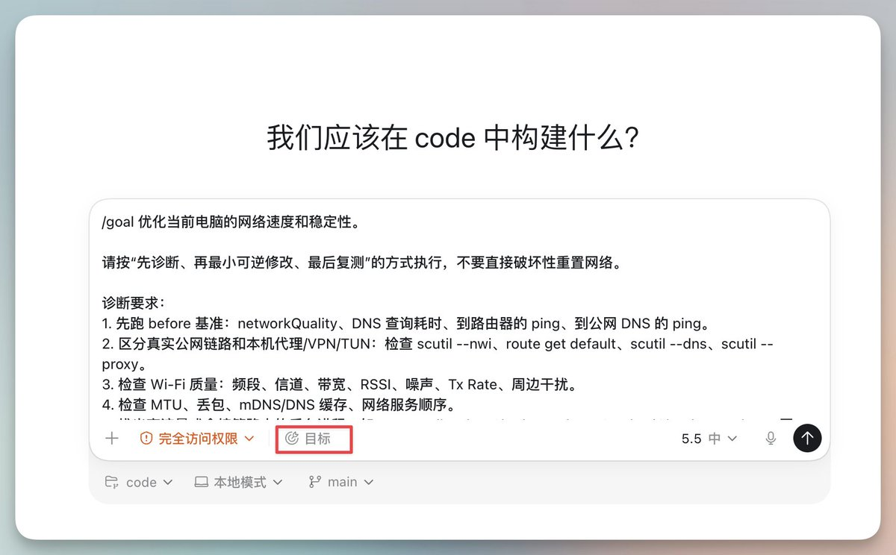
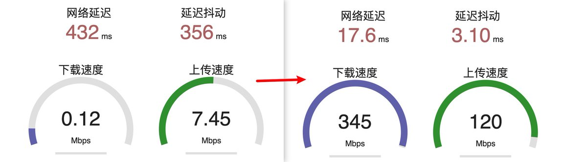
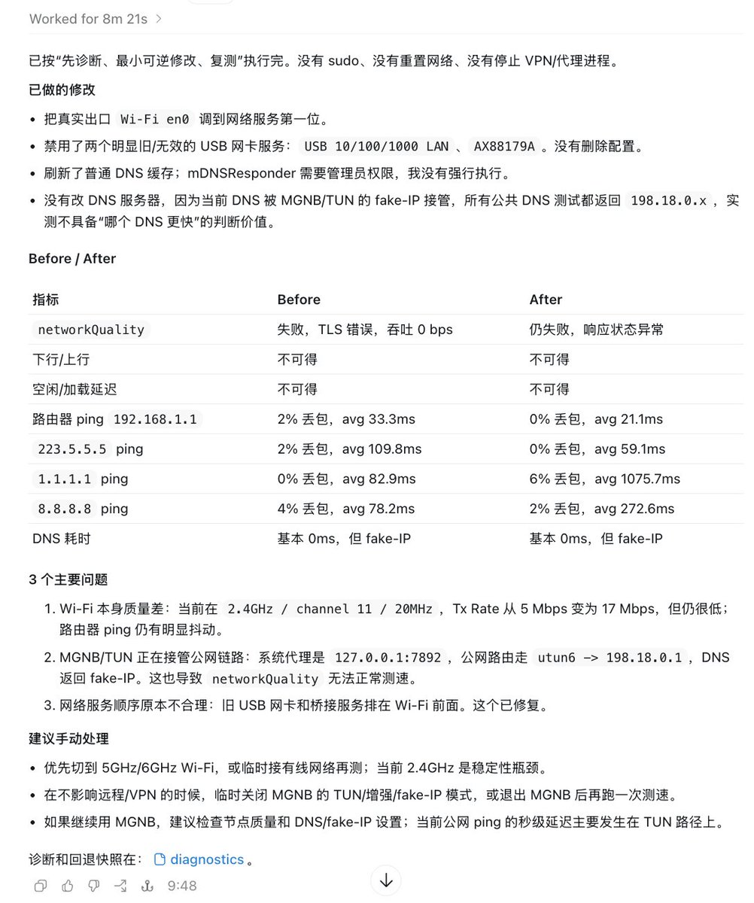
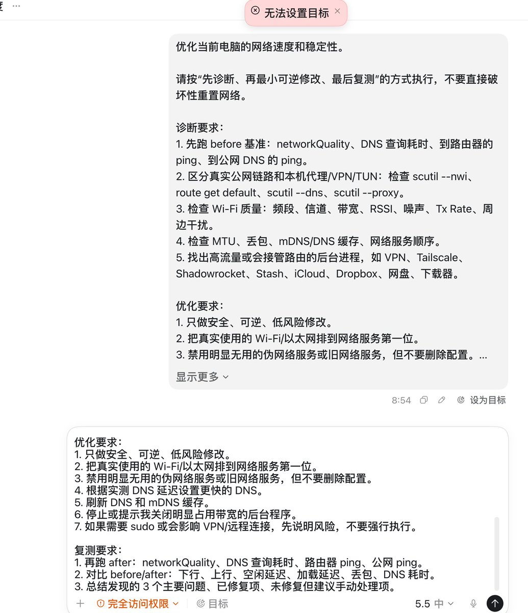

最近最火的Codex优化网络速度Use Case，写了个提示词，亲测效果不错：

1\. 在Codex中输入 “/goal” ，如果中文版输入 “/目标”，如果不用，直接发提示词也行。

2\. 提示词如下：

优化当前电脑的网络速度和稳定性。

请按“先诊断、再最小可逆修改、最后复测”的方式执行，不要直接破坏性重置网络。

诊断要求：
1\. 先跑 before 基准：networkQuality、DNS 查询耗时、到路由器的 ping、到公网 DNS 的 ping。
2\. 区分真实公网链路和本机代理/VPN/TUN：检查 scutil --nwi、route get default、scutil --dns、scutil --proxy。
3\. 检查 Wi‑Fi 质量：频段、信道、带宽、RSSI、噪声、Tx Rate、周边干扰。
4\. 检查 MTU、丢包、mDNS/DNS 缓存、网络服务顺序。
5\. 找出高流量或会接管路由的后台进程，如 VPN、Tailscale、Shadowrocket、Stash、iCloud、Dropbox、网盘、下载器。

优化要求：
1\. 只做安全、可逆、低风险修改。
2\. 把真实使用的 Wi‑Fi/以太网排到网络服务第一位。
3\. 禁用明显无用的伪网络服务或旧网络服务，但不要删除配置。
4\. 根据实测 DNS 延迟设置更快的 DNS。
5\. 刷新 DNS 和 mDNS 缓存。
6\. 停止或提示我关闭明显占用带宽的后台程序。
7\. 如果需要 sudo 或会影响 VPN/远程连接，先说明风险，不要强行执行。

复测要求：
1\. 再跑 after：networkQuality、DNS 查询耗时、路由器 ping、公网 ping。
2\. 对比 before/after：下行、上行、空闲延迟、加载延迟、丢包、DNS 耗时。
3\. 总结发现的 3 个主要问题、已修复项、未修复但建议手动处理项。

### 🖼️ Attached Media

## 💬 Replies

### 1 @andrew_zyf (𝘼𝙣𝙙𝙧𝙚𝙬 𝙕𝙮𝙛)

*Sat May 23 17:22:32 +0000 2026*

@vista8 可能起了心理作用

### 2 @vista8 (向阳乔木) (Author)

*Sat May 23 17:30:21 +0000 2026*

@andrew\_zyf 至少改DNS还是明确有效果的。

### 3 @AriXZone (魔都老猿)

*Sat May 23 21:39:02 +0000 2026*

@vista8 都不需要写这么多的专业术语。网络知识本来就是它擅长的。告诉它目标即可。

### 4 @narrativenavi (ナビ)

*Sun May 24 00:19:44 +0000 2026*

@vista8 /goalのあとはテンプレート化するな。最小ゴールの邪魔だろうが！ちゃんと考えて作りなさい。

### 5 @jiangding01 (一页繁华)

*Sat May 23 17:27:37 +0000 2026*

今天刚学到的比较好的/goal结构，我也去试试看

/goal 达成 &lt;你希望 Codex 最终完成的目标&gt;，并通过 &lt;具体可验证的证据&gt; 来确认结果有效，同时保持 &lt;必须遵守的限制条件&gt; 不被破坏。只能使用 &lt;允许使用的输入、工具、文件范围或操作边界&gt;。在每一轮迭代之间，Codex 需要根据 &lt;如何判断下一步最优行动&gt; 来选择下一步。如果遇到阻塞，或者已经没有有效路径可以继续尝试，Codex 必须停止，并报告 &lt;已经尝试过的方法、已获得的证据、当前阻塞点，以及还需要什么信息或权限才能继续推进&gt;

### 6 @0xjinchuan (瑾川)

*Sun May 24 01:30:00 +0000 2026*

@vista8 完全不懂网络的人我不建议用codex去操作家里的网络！搞不好如果断网了都不知道怎么自己手动解决！那就好玩了

### 7 @aocici127 (cici)

*Sun May 24 08:24:24 +0000 2026*

@vista8 我以前过的是什么日子 

### 8 @zhjiewithu (sinian(震旦))

*Mon May 25 01:05:26 +0000 2026*

@vista8 对于我们这种网络知识不够硬的同学，我更推荐使用grill-me这个skill（ [github.com/mattpocock/ski…](https://github.com/mattpocock/skills/blob/main/skills/productivity/grill-me)）先跟codex对齐需求再让他执行。

### 9 @hiheimu (赖叔 | LaiShu.ai)

*Sun May 24 04:00:54 +0000 2026*

@vista8 还是习惯知道向阳老师推导出这一段提示词的流程方法
因为有涉及比较多的网络专业名词，这对于大部分人来说，没办法一次性描述清楚。
是不是不断地与GoText去交互，如何优化网络会更好一些？
一致性的提示词，在当下有高顶级模型加持的AI Agent工具之中，该如何的更好的使用它呢？

### 10 @shog86 (Zhongjun Ge)

*Sun May 24 01:07:07 +0000 2026*

@vista8 国内还得加上 不要动隧道或者 VPN配置

### 11 @IAN_GAO (Ian.GAO)

*Sun May 24 02:55:47 +0000 2026*

@vista8 对于网络知识不多的朋友，建议在跑这个提示词之前，先让codex识别现有网络状态，对齐自己的网络需求。再运行上述提示词。

### 12 @schnautze (RahRahRah)

*Sun May 24 01:19:42 +0000 2026*

@vista8 哈，然后surge断了，它断了…

### 13 @42mayfly (cliche)

*Sun May 24 03:15:18 +0000 2026*

@vista8 前提是你的带宽本来就很快加上默认配置存在问题。不然没卵用

### 14 @Insignie2049 (Insignie)

*Sat May 23 21:46:13 +0000 2026*

@vista8 这种/goal用法本质是 prompt 在内化成 skill   但写得越好越值得抽离成 .claude/skills 文件，未来不同 codex session之间能复用和版本化

### 15 @MOoAIfield (MOo)

*Sun May 24 04:02:10 +0000 2026*

@vista8 这个案例好在不是让 Codex “帮我优化一下”。

而是给了它边界：

先诊断，
最小可逆修改，
最后复测 before/after。

/goal 最怕大而空，最适合这种能验收、能回滚、能停止的任务。

### 16 @shuizhuyu (Crio Songo)

*Sun May 24 02:32:33 +0000 2026*

@vista8 我回头也去试试这个提示词，这个“先诊断再最小修改”的思路确实不错，避免上来就瞎改把配置搞乱了，刚好我最近正头疼家里网络时不时掉速，测完看看效果怎么样。

### 17 @ai_yuanhuang (薛元煌)

*Sun May 24 02:11:05 +0000 2026*

@vista8 老师，按照你的提示词跑了一下，但就是怎么确定自己这个网络确实是被优化了呀？ 

### 18 @hhquan888 (hhquan888)

*Mon May 25 00:56:28 +0000 2026*

@vista8 大佬，请求一下，我直接使用你的这个例子，但提示无法设置目标。大佬有遇到过这个问题吗？有解决方法吗？ 

### 19 @dadaotongdao (JIMMY仔)

*Sun May 24 01:57:24 +0000 2026*

@vista8 它比我懂得多，一句话就搞定了

### 20 @dadaotongdao (JIMMY仔)

*Sun May 24 01:46:30 +0000 2026*

@vista8 不需要写提示词吧

### 21 @buhuaguo1 (不滑锅)

*Sat May 23 23:40:13 +0000 2026*

@vista8 /goal的意义就在于说清楚目标吧？！

### 22 @Kimson666 (Kimson)

*Sun May 24 07:24:41 +0000 2026*

@vista8 在优化了，五小时的额度一下子干完了。

### 23 @criscxuan (cxuan)

*Sat May 23 22:33:19 +0000 2026*

@vista8 这个网络修复的也是太好用了。烦恼的 reconnect 问题都解决了。

### 24 @harrysoog (𝚑𝚞𝚠𝚎𝚒𝚜𝚘𝚘𝚐)

*Sun May 24 05:52:30 +0000 2026*

@vista8 Agent了，一还提示词

### 25 @brotherkunny (坤哥玩花卉Kunny's garden)

*Sun May 24 10:21:38 +0000 2026*

@vista8 已经用了，有用，谢谢乔木老师

