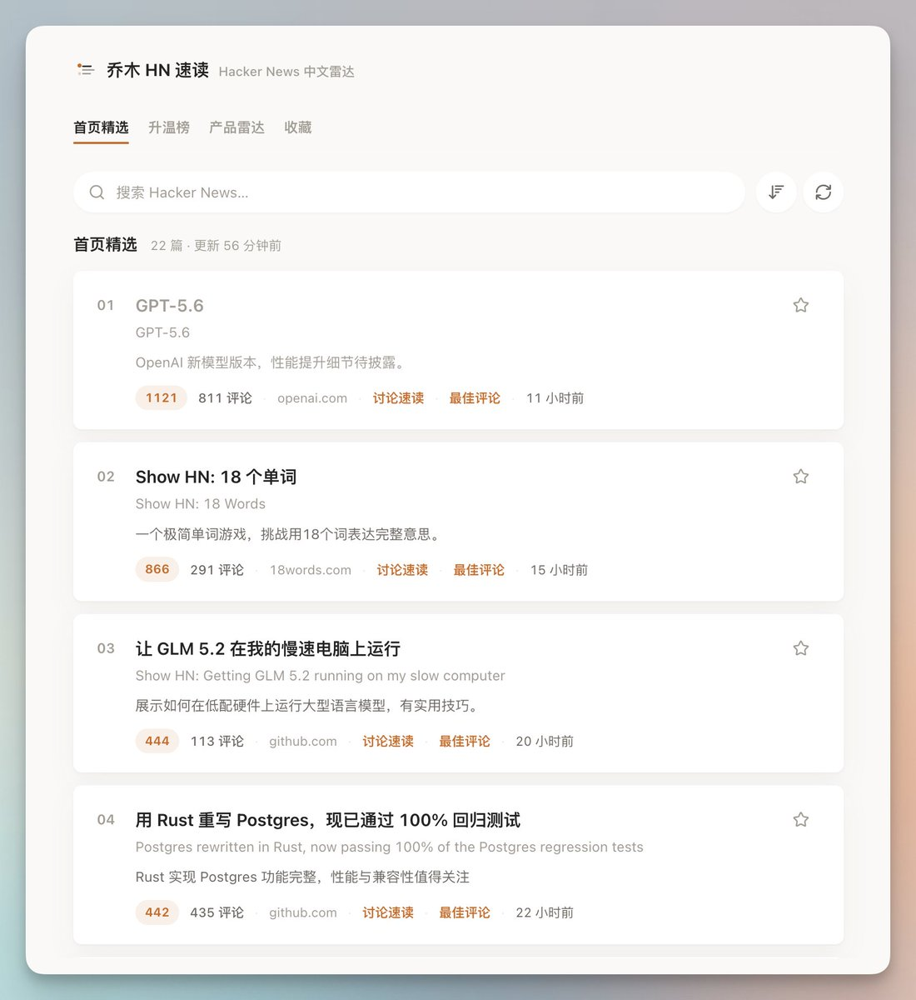

身边不少程序员朋友，都喜欢看YC的Hackernews

上面 AI 资讯又多又快，讨论激烈。

基于 HNRSS 开发了一个 Hackernews 速读站

核心功能：

1\. 精选 Hackernews 首页热帖，自动翻译标题。
2\. 不用翻看几百条评论，AI总结要点、摘录最佳评论。
3\. 监控正在上升的帖子，捕获跟产品相关内容。
4\. 支持 PWA安装为 Mac 软件

直接访问：[hn.qiaomu.ai](https://hn.qiaomu.ai/)

技术含量不高，胜在全中文、简单清爽，高价值信息快速获取。

项目免费开源，地址见评论区

### 🖼️ Attached Media

## 💬 Replies

### 1 @vista8 (向阳乔木) (Author)

*Fri Jul 10 05:01:06 +0000 2026*

项目Github开源地址 [github.com/joeseesun/qiao…](https://github.com/joeseesun/qiaomu-hn-reader)

### 2 @QT9277 (阿台🕊️)

*Fri Jul 10 05:03:50 +0000 2026*

@vista8 好东西，收了！

### 3 @duhh4520 (Joy (哈哈du))

*Sat Jul 11 03:02:53 +0000 2026*

@vista8 太好了，正想着要拓展之前的github热榜。找需求的很好方式，看github / hackernews / producthunt 上快速增长的项目

### 4 @Hunter_ctime (I am Hunter)

*Fri Jul 10 14:57:35 +0000 2026*

@vista8 这种解决自己痒点的项目做起来手感最好，我自己顺手做的小工具最后都比正经规划的活得久
收藏了

### 5 @AgentWangCN (智能体老王)

*Fri Jul 10 07:53:34 +0000 2026*

@vista8 Hackernews的确有不少有价值的信息，乔帮主开源的这个中文工具，可以免去自己部署HNRSS的麻烦

### 6 @redman_talk (红孩儿Redman)

*Fri Jul 10 07:38:37 +0000 2026*

@vista8 Finally, no more scrolling 300 comments.
AI summaries? Yes please.
Bookmarking this now.

### 7 @benjamin_demo (ben)

*Sat Jul 11 03:05:10 +0000 2026*

@vista8 优雅

