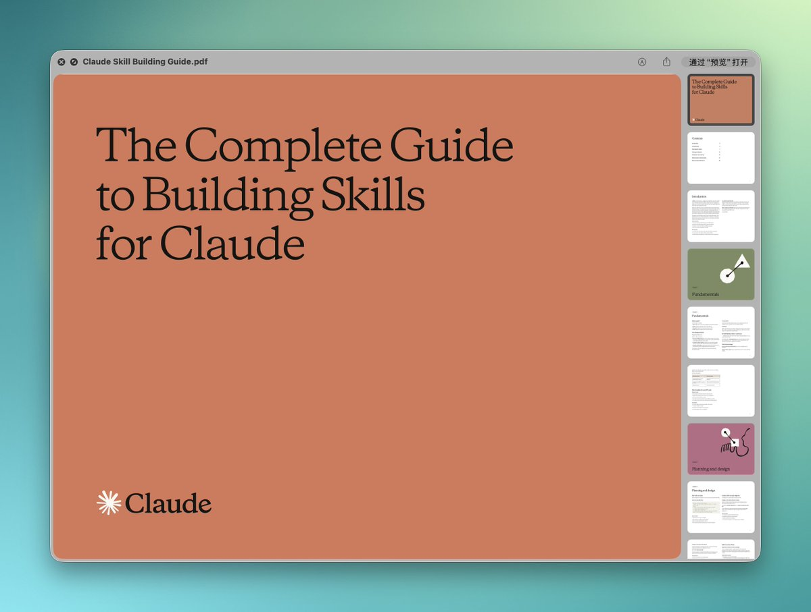
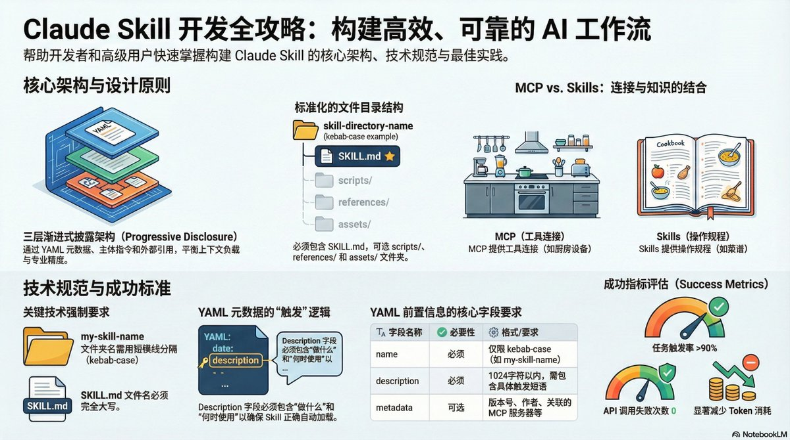

Anthropic 发了份 32 页的 Claude Skills 构建指南，把技能开发从规划到分发整个生命周期讲透了。

最值得看的是五种核心设计模式和触发可靠性测试方法——与其每次重复写 prompt，不如把常用工作流封装成 Skill，一劳永逸。

[resources.anthropic.com/hubfs/The-Comp…](https://resources.anthropic.com/hubfs/The-Complete-Guide-to-Building-Skill-for-Claude.pdf) 

## 💬 Replies

### 1 @Rubywang (Ruby@Day1Global Podcast)

*Thu Feb 19 06:54:51 +0000 2026*

@Jimmy\_JingLv 太好了，正好需要

### 2 @CloudMory (Cloud Mory)

*Thu Feb 19 07:02:20 +0000 2026*

@Jimmy\_JingLv Claude Skills 指南真正把AI应用从玩具变成工具。五种设计模式中，状态机模式特别适合复杂业务流程，值得细读。先让我搜藏起来再慢慢研究...

### 3 @WeiyanNOW (カオス製造機)

*Thu Feb 19 07:48:49 +0000 2026*

@Jimmy\_JingLv 这份指南把技能开发系统化得太及时了。很多团队还在重复造轮子，Claude Skills 的五种设计模式简直是生产力加速器。特别适合需要标准化流程的企业场景。

### 4 @scopenumber (pokerpxx)

*Thu Feb 19 03:14:09 +0000 2026*

@Jimmy\_JingLv 英雄，咱考虑把 BiBiGPT 的那个校对重新写一下吧，功德无量啊，功德无量

### 5 @onlywhiter (022 里昂少年感)

*Fri Feb 20 01:29:59 +0000 2026*

@Jimmy\_JingLv 1

### 6 @baoweiheihei (heihei)

*Thu Feb 26 02:53:31 +0000 2026*

@Jimmy\_JingLv 信息图 

### 7 @lalafang001 (风的无稽之谈)

*Fri Feb 20 20:13:08 +0000 2026*

@Jimmy\_JingLv 学习💪

### 8 @jimlee1414478 (jim lee)

*Fri Feb 20 20:00:54 +0000 2026*

@Jimmy\_JingLv m

