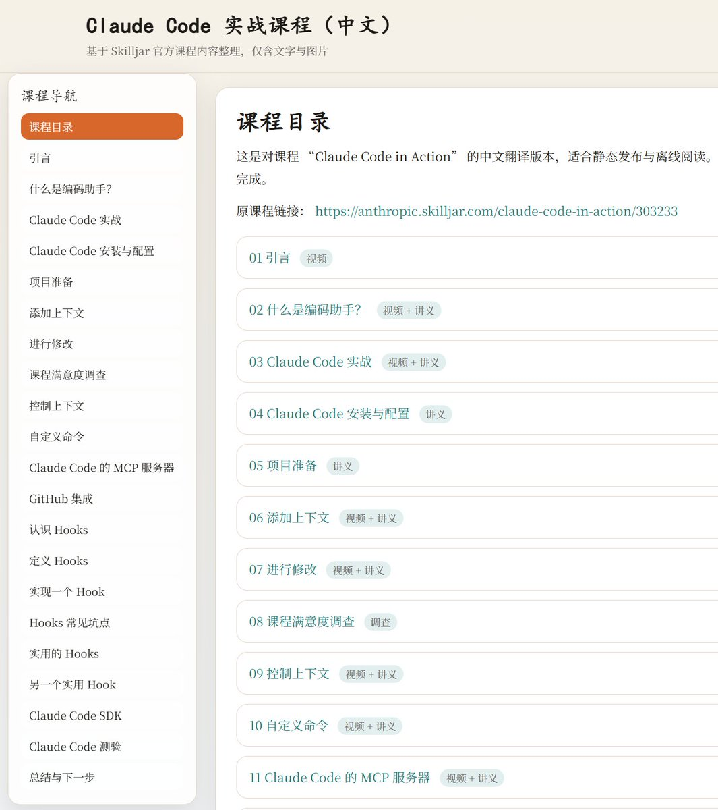
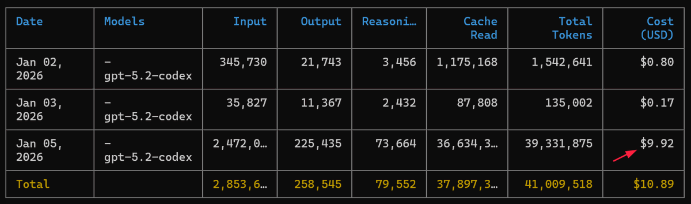

把 Anthropic 官方出的 Claude Code in Action 翻译成中文版了。

在线阅读：[cholf5.com/claude-code-in…](https://cholf5.com/claude-code-in-action/index.html)
源码：[github.com/cholf5/claude-…](https://github.com/cholf5/claude-code-in-action) 

## 💬 Replies

### 1 @cholf5 (周尔复) (Author)

*Mon Jan 05 01:38:28 +0000 2026*

用 Codex CLI + Chrome MCP 完成的，消耗了不到 10 刀的 Token 

### 2 @wangwei1237 (17Ge)

*Mon Jan 05 06:23:48 +0000 2026*

@cholf5 赞赞赞，LGTM\~\~\~👍👍👍

### 3 @pandionkk (孙小帅 kk)

*Mon Jan 05 13:31:39 +0000 2026*

@cholf5 好东西

### 4 @xyue13 (风口)

*Mon Jan 05 04:48:10 +0000 2026*

@cholf5 造福中文圈

### 5 @huzhouagi (胡诌AGI)

*Mon Jan 05 04:49:25 +0000 2026*

@cholf5 为何大佬们都如此优秀，这叫我情何以堪，完全跟不上步伐

### 6 @yhslgg (老杨啊 | AI产品商业化)

*Mon Jan 05 07:53:20 +0000 2026*

@cholf5 值得收藏学习

### 7 @Jarvis2hang (Jarvis贾维斯)

*Mon Jan 05 05:20:14 +0000 2026*

@cholf5 这个是真有价值，收藏点赞

### 8 @Linguista2025 (Linguista)

*Mon Jan 05 05:08:07 +0000 2026*

@cholf5 感谢分享，排版太好看了！

### 9 @LeighMeng (Leigh Meng)

*Mon Jan 05 06:02:33 +0000 2026*

@cholf5 👍👍👍

### 10 @0ximst1ll (ImStill)

*Mon Jan 05 04:11:10 +0000 2026*

@cholf5 最近正打算学这门课，👍🏻

### 11 @rover_tang (Rover路华)

*Mon Jan 05 08:31:03 +0000 2026*

@cholf5 已收藏，感谢感谢！

### 12 @tang_shelton (Shelton Tang)

*Mon Jan 05 05:43:01 +0000 2026*

@cholf5 学不过来了😁

### 13 @OiiDev (OSDev)

*Mon Jan 05 21:54:17 +0000 2026*

@cholf5 rst @readwise save thread

### 14 @Hangyi2031 (Hongyu)

*Tue Jan 06 07:16:27 +0000 2026*

@cholf5 水硕生狠狠地焦虑了...有一起学习的吗🥲

### 15 @ripple_z (ripple_k)

*Mon Jan 05 15:46:44 +0000 2026*

@cholf5 good

### 16 @zzt02511 (AI产品赵叔)

*Mon Jan 05 22:45:26 +0000 2026*

@cholf5 nice

### 17 @SStwangkaiyan (STKane Wong)

*Mon Jan 05 14:22:52 +0000 2026*

@cholf5 Mark

### 18 @otto_bulk (otto pan)

*Tue Jan 06 01:29:10 +0000 2026*

@cholf5 @threadreaderapp unroll

### 19 @Alexwz89 (Alex)

*Mon Jan 05 19:01:20 +0000 2026*

@cholf5 正在觉得英文版难啃，中文教程就来了

### 20 @DylanYinn (Dylan Yin)

*Tue Jan 06 16:18:35 +0000 2026*

@cholf5 感谢分享！

### 21 @QiuhuiChina (Qiuhui)

*Tue Jan 06 05:33:47 +0000 2026*

@cholf5 谢谢佬！太有用了

### 22 @hxhpttcn (夏寒)

*Sat Jan 10 19:50:17 +0000 2026*

@cholf5 感谢分享

