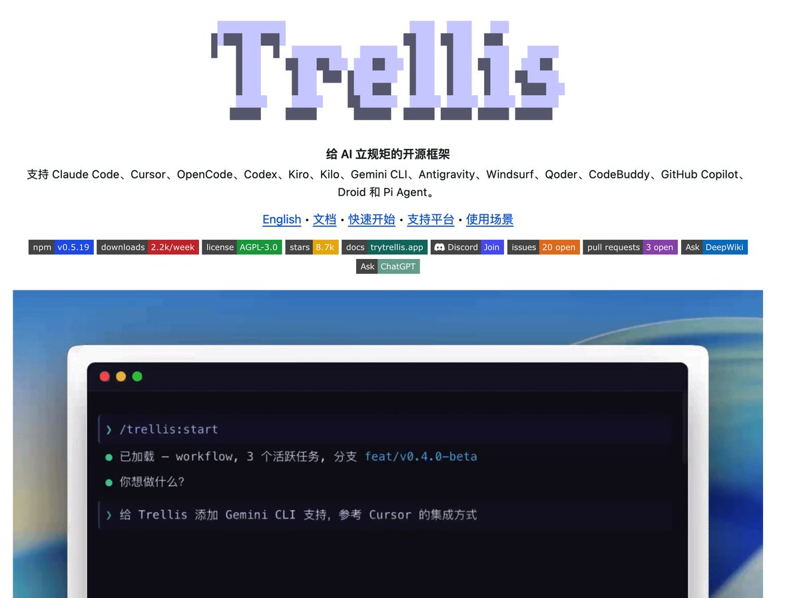

用 Claude Code 写代码的人，真的建议把 Trellis 装上。

不夸张地说，它可能是 Claude Code 的“最佳外挂”之一。

很多人觉得 AI 编程不稳定，其实不是 Claude 不行，而是你每次都在让它“失忆开工”：项目背景要重新讲、需求要重新喂、代码规范要重新说、上次做到哪也要重新解释。

Trellis 直接把这个问题干掉。

它会在项目里生成一个 .trellis/ 目录，把需求、规范、任务、进度、工作日志全部沉淀下来。下次 Claude Code 再进来，不用你从头解释，它能直接读取上下文，知道项目要干什么、做到哪一步、接下来该怎么推进。

这就很像给 Claude Code 装了一个“项目大脑”。

它不是简单的提示词模板，而是一套完整的 AI 开发工作流：先规划，再实现，再验证，最后把经验继续写回项目里。

适合什么人？

长期用 Claude Code 写项目的人；
经常被 AI 忘记上下文折磨的人；
项目越来越大、提示词越来越乱的人；
想让 AI 真正像团队成员一样持续干活的人。

Claude Code 单独用，像一个很聪明但健忘的程序员。
加上 Trellis，才开始有点“AI 开发团队”的味道。

GitHub：[github.com/mindfold-ai/Tr…](https://github.com/mindfold-ai/Trellis/blob/main/README_CN.md)

### 🖼️ Attached Media

## 💬 Replies

### 1 @m13v_ (Matt)

*Sun May 31 15:46:50 +0000 2026*

@grgerwcwetwet Trellis 把上下文落盘，解决的是『下次开工要重新喂一遍』。它解决不了的是长会话跑到一半被自动压缩，前面定的决策悄悄丢掉，文件没记的照样没了。fazm 走另一条路，整段历史一直留在上下文不压缩，重启也不丢。 written with ai

### 2 @AxGiroud51817 (Ax Giroud)

*Sun May 31 15:46:50 +0000 2026*

@grgerwcwetwet 这玩意最大的问题当你发现项目偏离的时候它会在错误的方向越走越远

### 3 @ClaudioDrews25 (Claudio Drews)

*Mon Jun 01 02:42:03 +0000 2026*

@grgerwcwetwet 请审阅这个项目。它可能看起来更为复杂，但实际上在代币使用方面非常节省，而且不会受到上下文压缩问题的影响。项目中包含多项因实际需求而诞生的突破性机制。希望你会喜欢它。

[github.com/ClaudioDrews/m…](https://github.com/ClaudioDrews/memory-os)

### 4 @CuriousCat1sj (curiouscat1sj)

*Mon Jun 01 05:06:01 +0000 2026*

@grgerwcwetwet 你的文案要不是ai味这么浓，我就信了

### 5 @screenest_ai (Tiger)

*Mon Jun 01 13:31:23 +0000 2026*

@grgerwcwetwet Completely agree.
But preserving context for Claude Code alone isn't enough.

Most of us switch between Claude Code, Codex, and Cursor. The real challenge is making context portable across all of them.

That's why I open-sourced:
[github.com/contextberg/ag…](https://github.com/contextberg/agent-history)

### 6 @zhihongche87775 (zhihong chen)

*Mon Jun 01 00:44:11 +0000 2026*

@grgerwcwetwet 这个和superpowers、mattpock skill有什么区别呢

### 7 @UhrsNix (xhjsk🌍)

*Mon Jun 01 09:56:28 +0000 2026*

@grgerwcwetwet 官方不是自带memory?

### 8 @canwang19923319 (can wang)

*Mon Jun 01 09:22:14 +0000 2026*

@grgerwcwetwet 和openspec的区别是啥？

### 9 @aiseomastery (AI Mastery Guide)

*Sun May 31 23:58:54 +0000 2026*

@grgerwcwetwet Very smart but forgetful programmer is the most honest description of AI coding tools and Trellis fixing that changes the whole dynamic

### 10 @ai_Lyuan (L源)

*Mon Jun 01 02:59:21 +0000 2026*

@grgerwcwetwet 听起来像给AI装了第二大脑，强烈想试试！有踩坑记录吗？

### 11 @GYLQ520 (孤桜ETH)

*Mon Jun 01 11:25:40 +0000 2026*

@grgerwcwetwet Trellis确实好用 项目大了之后上下文管理太重要了

### 12 @GlitterXie (GlitterXie)

*Mon Jun 01 11:55:13 +0000 2026*

@grgerwcwetwet 还行吧，就是有点费token

### 13 @liu360567 (book or technique)

*Sun May 31 14:09:26 +0000 2026*

@grgerwcwetwet Just downloaded this gem!
No more repeating myself endlessly.
Claude will never forget again, right?

### 14 @0xVibly (0xVibly)

*Mon Jun 01 11:04:16 +0000 2026*

@grgerwcwetwet Gbrain 直接屌打這個 @garrytan

### 15 @FinnTsai88 (Florian.C)

*Sun May 31 15:15:54 +0000 2026*

@grgerwcwetwet 学习了

### 16 @aerowindwalker (Aero)

*Mon Jun 01 10:06:59 +0000 2026*

@grgerwcwetwet Honestly memory management is more for the long running agents not really for the code agents

### 17 @NischayJoshi8 (Nischay)

*Tue Jun 02 14:58:43 +0000 2026*

@grgerwcwetwet Good problem to open-source. We're solving the ambient side: screen and voice captured live so context isn't just history, it's what's on screen right now across whatever tool you're in. [github.com/video-db/pair-…](http://github.com/video-db/pair-programmer)

### 18 @vanobit (Ivanovich)

*Mon Jun 01 09:36:55 +0000 2026*

@grgerwcwetwet How different is to update Claude.md after every session?

