# 📰 数据建模到底在建什么？业务、逻辑、物理模型一次讲清

很多人一提到数据建模，第一反应就是：建几张表、定义几个字段、画一张ER图。

但真正的数据建模，远不只是“把数据存进数据库”。

企业里大量数据问题，看上去是报表问题，实际上根源往往在模型层。

* 销售部门统计销售额，按照订单金额计算；  

* 财务部门统计销售额，按照收入确认金额计算；  

* 运营部门则按照实际发货金额计算。

三个数字可能都没有算错，但由于业务对象、统计范围和时间口径没有在模型中统一，最终就变成了“三个部门、三个销售额”。

所以，**数据建模真正要解决的，不是表怎么建，而是客户、商品、合同、订单、交付、发票、应收和回款这些现实业务，应该怎样被准确、稳定地表达为数据。**

如果你正在梳理企业数据仓库、数据分层、主题域和数据模型，我整理了一份《数据仓库建设资料包》，其中包含数据仓库规划、建模思路和项目落地相关内容。

需要自取：<https://s.fanruan.com/xwgup>  

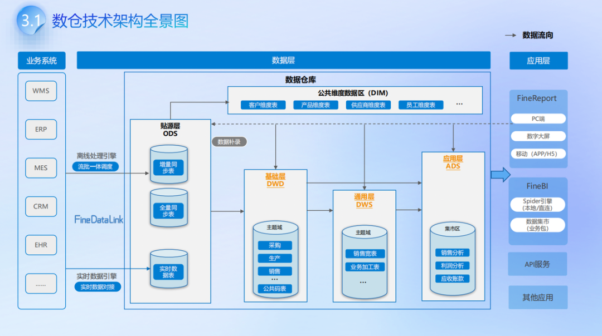

## 一、数据建模到底在建什么？

数据建模，本质上是在完成三次翻译。

### 第一次，是把现实业务翻译成业务模型

----------

企业每天都在发生大量业务活动：客户签订合同、销售创建订单、仓库完成发货、财务开具发票、客户支付货款。

业务模型要做的，就是从复杂流程中识别核心对象，明确业务从哪里开始、经过哪些环节、最终形成什么结果。

### 第二次，是把业务模型翻译成逻辑模型

----------

业务人员知道“客户下了一张订单”，但数据模型还需要继续说明：

客户和订单是什么关系，一张订单包含哪些商**品，订单金额记录在哪一层，退款如何关联原订单，客户地区变化后历史数据如何统计。**

### 第三次，是把逻辑模型翻译成物理模型

----------

到了这一层，才真正涉及数据库表、字段类型、主键、索引、分区、存储位置和更新方式。

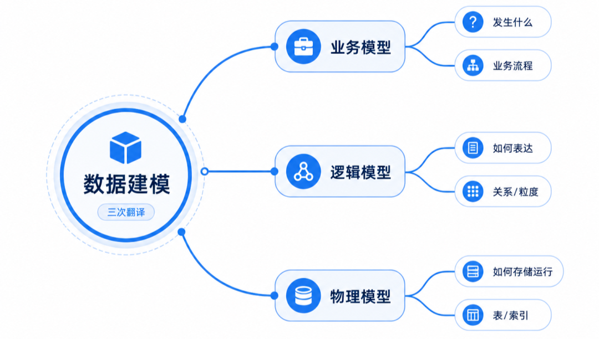

因此，三层模型解决的问题完全不同。

* 业务模型回答的是：企业究竟在发生什么业务。  

* 逻辑模型回答的是：这些业务应该如何被数据表达。  

* 物理模型回答的是：这些数据最终如何存储、计算和运行。

三者不能相互替代。

* 业务模型没有梳理清楚，技术人员建出来的表可能根本无法反映真实业务；  

* 逻辑模型不合理，数据一汇总就会重复或遗漏；  

* 物理模型设计不当，即使数据口径正确，也可能出现查询缓慢、维护困难和任务频繁失败。

所以，**数据建模真正建的，不只是数据结构，而是一套从业务事实到分析结果的转换规则。**

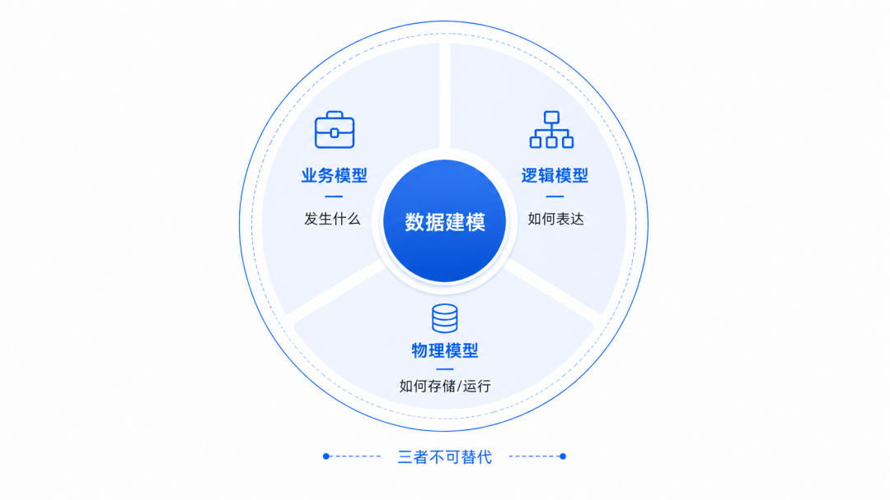

## 二、业务模型：先把真实业务看明白

业务模型是整个数据建模的起点。

**它不应该从“系统里已经有哪些表”出发，而应该从“企业实际发生了什么业务”出发。**

以销售业务为例，企业可能同时存在客户、商机、合同、订单、商品、发货、验收、发票、应收和回款等对象。

如果只看系统表，很容易把这些对象理解成互不相关的数据。但在真实业务中，它们是一条连续链路：

* 客户产生需求，形成商机；  

* 商机转化为合同；  

* 合同拆分为订单；  

* 订单形成发货和验收；  

* 验收后确认收入并开具发票；  

* 发票形成应收；  

* 客户付款后完成核销。

业务模型首先要做的，就是把这条链路梳理清楚。

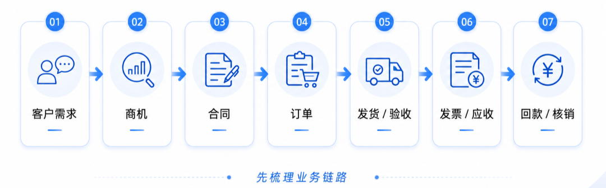

## 1.明确模型边界

同样是建设“销售模型”，边界可以完全不同。

有的模型只覆盖下单环节，只能回答卖了多少、卖给了谁、哪些商品卖得好。

有的模型一直延伸到交付、开票和回款，才能进一步分析订单履约率、开票进度、应收账龄和现金回收效率。

### 模型边界决定了它能够回答什么问题

如果企业希望分析回款率，却只建设到订单层，后续无论增加多少图表，都无法真正解释资金为什么没有回来。

因此，建模前必须先确定：分析对象是什么，业务从哪个节点开始，到哪个节点结束，哪些环节属于本次模型，哪些环节暂时不纳入。

企业的真实难点往往还在于，这些业务数据并不集中在一个系统中。客户信息可能在CRM，订单在ERP，发货在仓储系统，发票和回款则在财务系统。

这时可以通过 **FineDataLink** 连接不同**数据库、业务系统、接口和文件**，把分散在各系统中的客户、合同、订单、发货和回款数据汇集到统一的数据平台。只有先打通业务链路，业务模型才能从“流程描述”进一步变成可以验证的数据关系。

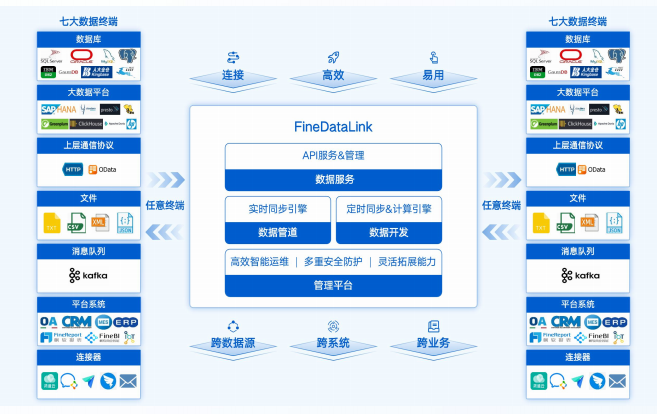

## 2.识别业务对象与业务事件

业务模型中的数据，大体可以分为两类。

* 第一类是相对稳定的业务对象，例如客户、供应商、商品、员工、组织和门店。  

* 第二类是不断发生的业务事件，例如下单、发货、入库、开票、付款和退款。

**对象解决“是谁、是什么”的问题，事件解决“发生了什么”的问题。**

如果不区分对象和事件，模型很容易出现大量重复信息。例如把客户名称、客户行业和客户地区直接存放在每一条订单明细中，一旦客户信息发生变化，就可能出现同一个客户对应多个版本的数据。

## 3.明确业务关系

业务模型最重要的工作之一，是判断对象之间到底是什么关系。

一个客户可以有多个合同，一个合同可以拆分为多个订单，一张订单可以包含多个商品，一张发票也可能对应多个订单。

现实业务中的关系往往不是简单的一对一，而是一对多、多对多，甚至存在跨期、拆分和合并。

例如，一张100万元的合同可能分三次发货、开两张发票、收四笔回款。如果模型强行把合同、发票和回款设计成一对一，数据虽然能够存进去，但业务关系已经失真，后续也无法准确计算开票率和回款率。

**好的业务模型，不是让数据看起来整齐，而是要尽可能还原真实业务关系。**

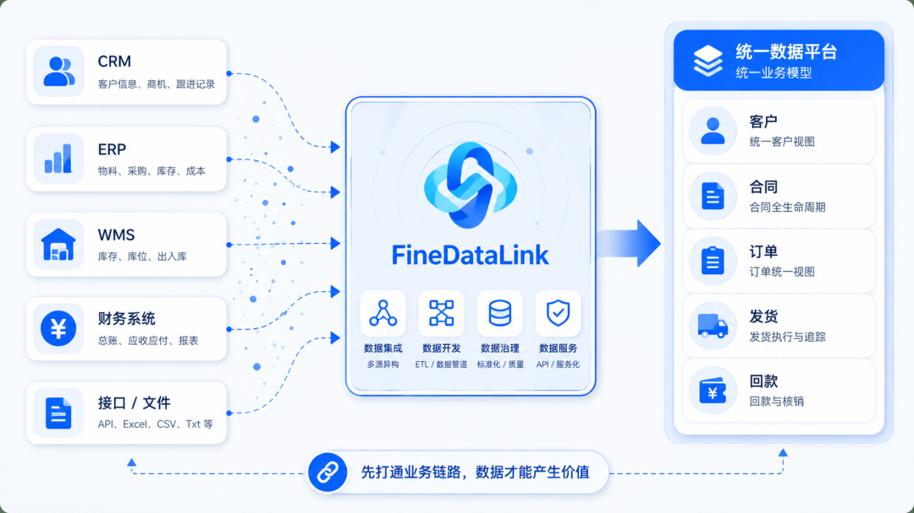

## 4.统一业务定义

业务模型不仅要描述流程，还要明确关键业务概念。

* 什么是有效订单？  

* 取消订单是否计算销售额？  

* 退款按退款申请时间还是退款完成时间统计？  

* 新增客户按首次注册、首次下单还是首次付款判断？

这些问题看似属于指标计算，实际上必须在业务模型阶段就说清楚。

否则，后续逻辑模型只能机械地加工数据，却无法判断哪一种规则更符合真实业务。

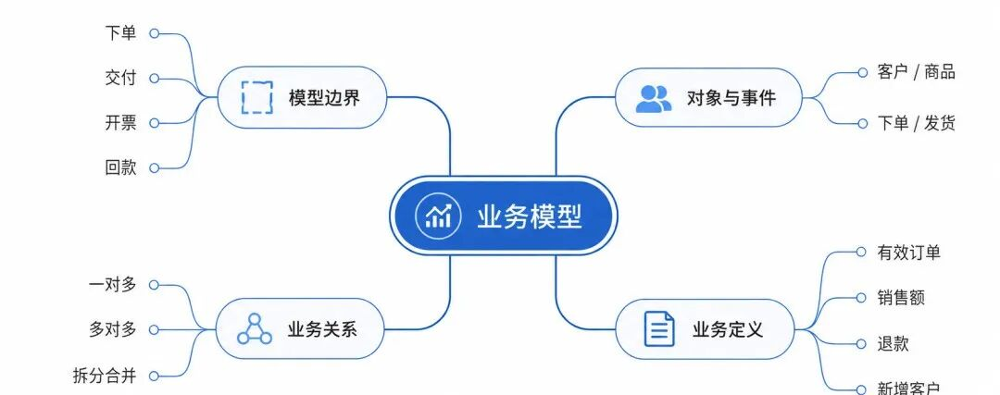

## 三、逻辑模型：把业务关系转化为可计算的数据结构

业务模型解决“描述什么”，逻辑模型解决“怎样描述”。

在逻辑模型中，业务对象会被转化为实体，业务特征会被转化为属性，对象之间的联系会被转化为关系。

例如，“客户”是一个实体，客户编号、客户名称、所属行业、所在地区和客户等级是它的属性；“订单”是另一个实体，订单编号、下单时间、订单状态和订单金额是它的属性。

客户和订单之间通常是一对多关系：一个客户可以产生多张订单，但一张订单通常只属于一个客户。

逻辑模型看似是在设计结构，真正的核心却是以下几个问题。

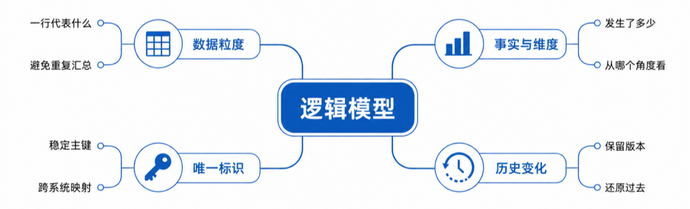

## 1.先确定数据粒度

数据粒度指的是：**一行数据到底代表什么。**

订单表的一行代表一张订单，订单明细表的一行代表一张订单中的一个商品，日销售汇总表的一行可能代表某个门店、某个商品在某一天的销售结果。

粒度不同，能够计算的指标也不同。

假设一张1000元的订单包含3种商品。订单表中只有一行，订单明细表中有三行。如果将订单表和明细表连接后，直接汇总订单金额，1000元就可能被重复计算三次。

**很多企业报表出现销售额放大、客户数重复和成本虚高，并不是计算公式写错了，而是连接了不同粒度的数据，却没有先处理汇总关系。**

因此，每张事实表在建模时都必须明确：

* 一行代表什么业务事件；  

* 唯一标识是什么；  

* 数据在什么情况下新增；  

* 数据发生变化时是覆盖还是保留历史。

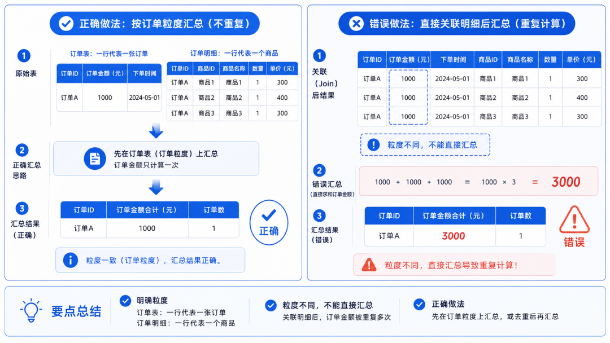

## 2.区分事实和维度

逻辑模型中常见的设计方式，是把数据分为事实和维度。

* 事实是可以统计和聚合的业务结果，例如销售数量、订单金额、

* 购成本、库存数量和回款金额。  

* 维度是观察这些结果的角度，例如客户、商品、地区、时间、渠道和组织。

**事实回答“发生了多少”，维度回答“从哪个角度看”。**

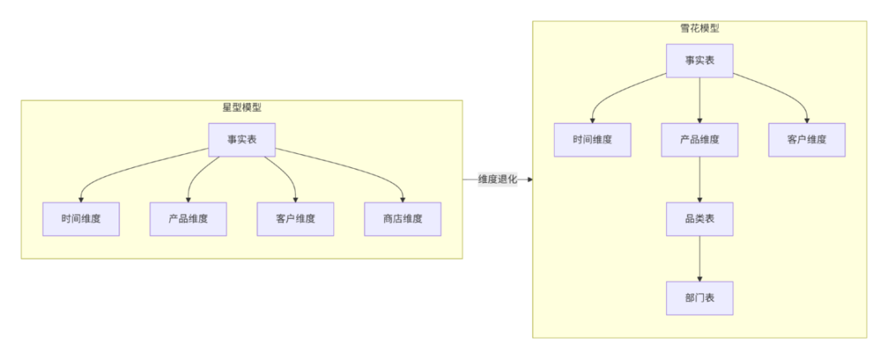

例如，销售额本身是事实；按地区、商品和月份分析销售额，则依赖地区维度、商品维度和时间维度。

如果事实与维度混在一起，后续模型就会越来越复杂。一旦客户分类、组织架构或商品品类发生变化，大量事实数据都可能需要重新处理。

业务关系梳理完成后，还要把不同系统中的编码、格式和口径统一起来。例如CRM中的客户名称、ERP中的客户编码和财务系统中的结算主体，可能并不能直接对应。

借助 **FineDataLink**，可以在数据同步过程中**完成去重、字段映射、格式转换、数据关联和规则加工**，再将处理后的数据写入客户维度表、订单事实表等目标模型。这样，逻辑模型不只是停留在设计图上，而是可以被稳定地加工出来。

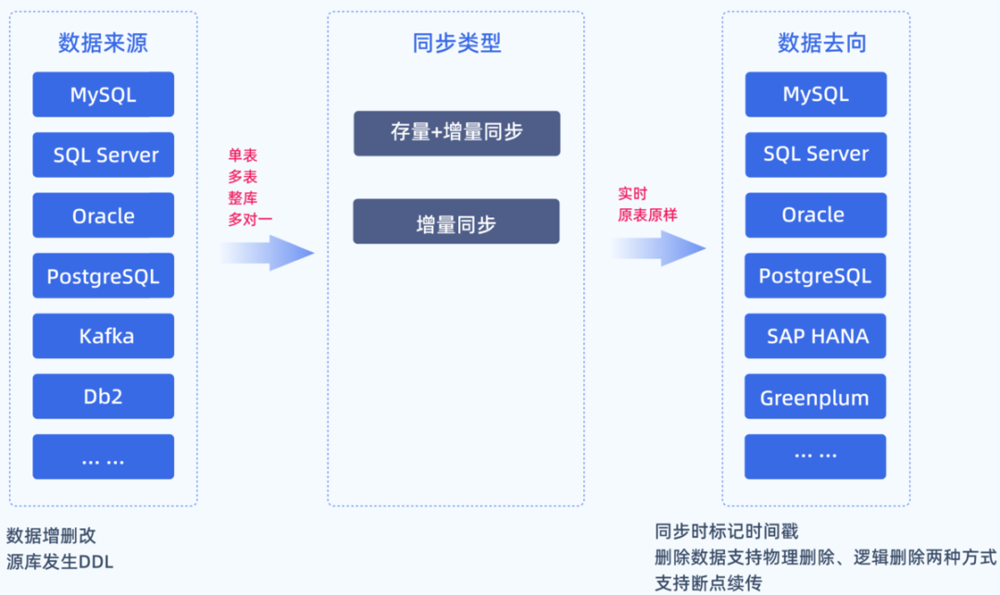

## 3.建立稳定的唯一标识

客户名称、商品名称和供应商名称都不适合作为唯一标识。

名称可能修改，也可能重复。集团客户还可能存在母公司、子公司、门店和结算主体多个层级。

逻辑模型必须建立稳定的主键，例如客户编码、商品编码或系统生成的代理键。不同系统之间的编码不一致时，还要建立映射关系。

否则，同一个客户在CRM中叫“某某科技有限公司”，在财务系统中叫“某某科技”，在合同系统中又使用简称，最终就会被识别为三个客户。

**主键解决的不是命名问题，而是业务对象能否在不同系统、不同时间和不同场景中被准确识别的问题。**

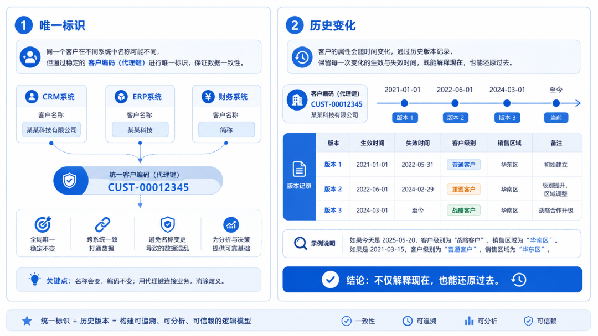

## 4.处理历史变化

逻辑模型不能只描述当前状态，还要回答历史如何保留。

例如，一名销售人员今年负责华东区域，明年调整到华南区域。查看今年的销售业绩时，应该按照今年的归属统计，还是按照当前组织归属重新统计？

客户等级、商品分类、部门结构和区域划分都可能变化。

如果模型只保留最新值，历史报表就会随着基础信息修改而变化，企业无法还原当时真实情况。

因此，逻辑模型需要根据业务场景决定：是直接覆盖旧值，还是保留生效时间、失效时间和历史版本。

**一个成熟的逻辑模型，不仅要能解释现在，还要能够还原过去。**

## 四、物理模型：让数据不仅正确，还能稳定运行

**物理模型是逻辑模型在数据库、数据仓库或数据平台中的实际落地。**

到了这一层，关注重点从“业务是否表达准确”，进一步转向“数据怎样存储、更新和查询”。

物理模型通常需要确定：

* 表和字段如何命名；  

* 字段使用什么数据类型；  

* 主键和外键如何设置；  

* 哪些字段建立索引；  

* 大表如何分区；  

* 数据采用全量还是增量更新；  

* 历史数据保留多长时间；  

* 高频查询是否需要汇总表或宽表。

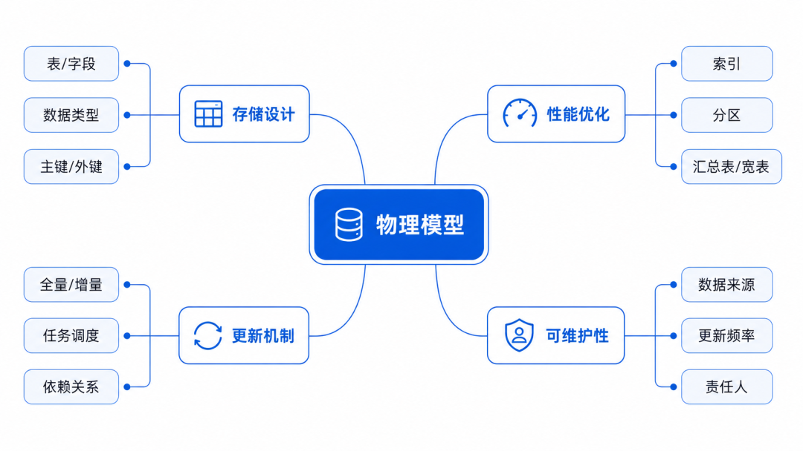

## 1.不能照搬业务系统结构

业务系统中的表，通常是为了支持录入、审批和交易处理。

例如订单系统可能把订单状态、审批记录、操作日志和商品明细拆分到多张表中，以保证事务处理的准确性。

但分析场景更关注查询效率和统计便利。如果每做一张销售报表，都需要关联十几张业务表，不仅查询缓慢，也容易因为关联条件不同产生口径差异。

因此，分析模型通常会在业务系统原表基础上重新组织数据，形成客户主题、销售主题、库存主题和财务主题。

**业务系统的表适合支撑业务运行，但不一定适合直接支撑经营分析。**

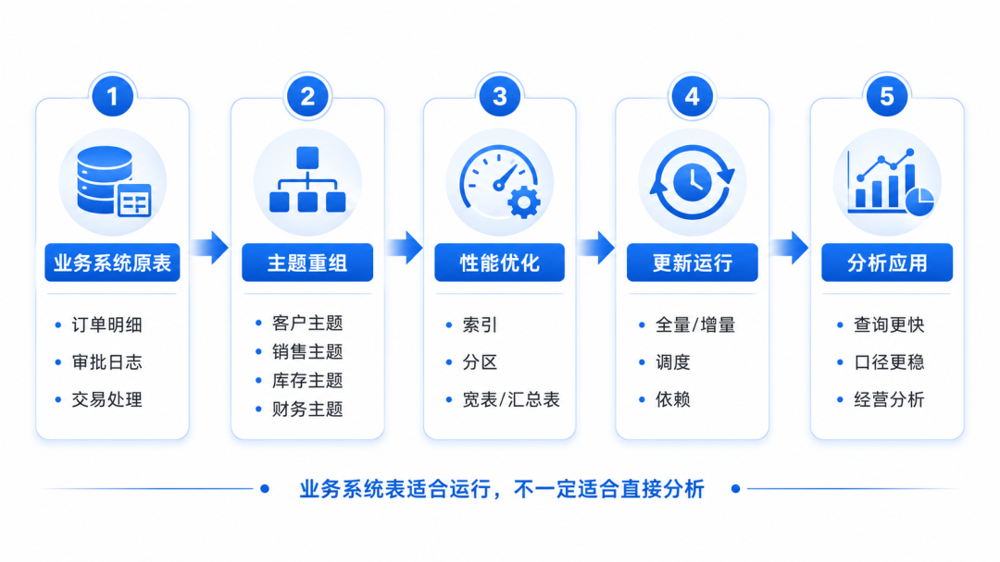

## 2.规范化与查询效率需要平衡

数据库设计强调减少冗余，但分析模型不能机械追求完全规范化。

如果所有属性都被拆得过细，一次查询需要大量关联，性能和使用难度都会明显上升。

因此，在分析场景中，可以适度建设宽表、汇总表和公共数据集，用一定的数据冗余换取查询效率。

但冗余必须受控。

同一个指标如果同时存在于多张表中，就必须明确统一来源、更新规则和负责人，否则宽表越多，数据版本也会越多。

**分析模型追求的不是零冗余，而是在口径一致的前提下，提高查询和使用效率。**

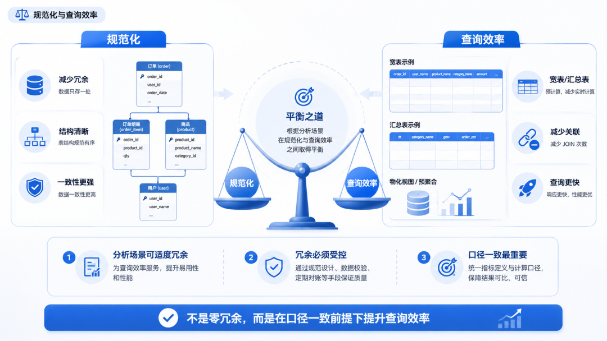

## 3.根据数据规模设计存储方式

当数据量较小时，一张普通明细表可能就能满足需求。

但随着订单、日志和明细数据持续增长，模型需要考虑按日期、地区或业务类型进行分区，对高频筛选字段建立索引，并将历史冷数据与近期热数据分开管理。

同时，数据更新也不能一直依赖全量覆盖。

对于每天新增大量订单的企业，更合理的方式通常是识别新增记录和变化记录，通过增量同步降低计算压力。

物理模型真正投入运行后，还需要管理大量上下游任务。例如客户数据没有更新完成，订单模型就不应提前运行；明细数据加工失败，销售汇总表也不能继续生成。

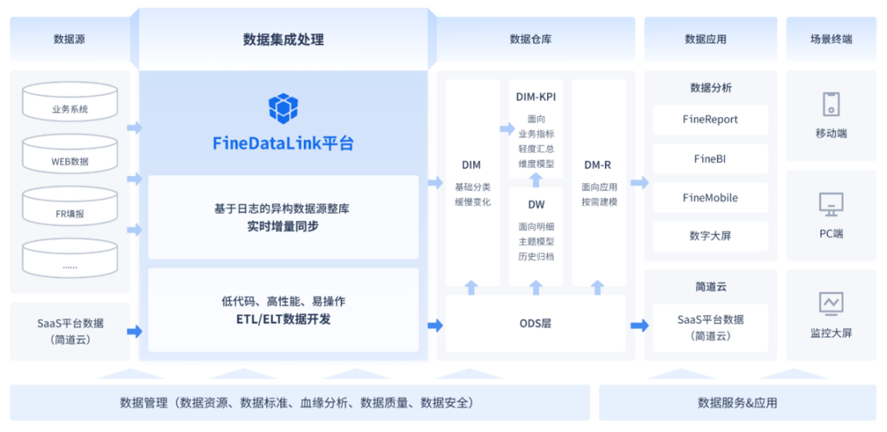

**FineDataLink**可以将**全量同步、增量更新和定时任务**纳入统一调度，并按照上下游依赖安排执行顺序。一旦出现任务失败、数据延迟或同步数量异常，系统能够及时识别并反馈，避免错误数据继续流入后续模型。

**因此，物理模型的价值不只是把表结构落到数据库中，更要保证数据能够按时更新、异常能够被发现，并在数据规模持续增长后依然保持稳定。**

## 4.把可维护性纳入模型设计

一个物理模型不能只由最初的开发人员看懂。

表名、字段名、字段含义、数据来源、更新频率和责任人都需要形成清晰说明。

否则，人员调整后，新的开发人员无法判断某个字段为什么存在，也不知道修改一张表会影响哪些报表和下游任务。

可维护性并不是项目上线后的补充工作，而应该在模型设计阶段就被考虑进去。只有来源清晰、口径明确、依赖可追溯，数据模型才能长期支撑业务，而不是运行一段时间后重新推倒建设。

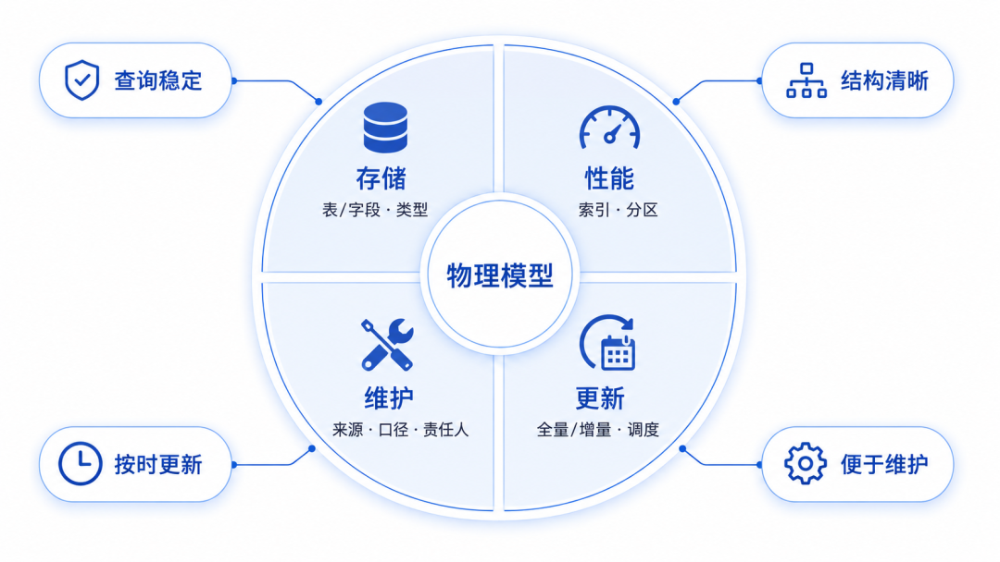

## 结语

数据建模不是简单地建表，也不是画完一张ER图就结束。

* 业务模型决定企业要描述哪些业务事实；  

* 逻辑模型决定这些事实如何形成对象、属性、关系和指标；  

* 物理模型决定数据怎样存储、更新和高效运行。

这三层中，任何一层缺失，都会影响最终分析结果。

* 业务模型不清，数据就不知道应该反映什么；  

* 逻辑模型不清，数据关系和计算口径就会混乱；  

* 物理模型不合理，数据即使正确，也可能查询缓慢、任务不稳定、维护成本越来越高。

真正成熟的数据建模，不是表越多、字段越全、结构越复杂，而是能够让现实业务被准确记录，让同一指标在不同场景中保持一致，让数据变化能够追溯，让模型在业务增长后依然可以扩展。

**说到底，数据建模建的不是几张表，而是企业对业务的共同理解，以及把这种理解转化为可信数据的规则。**

### 点击【阅读原文】，体验文中同款资料包

