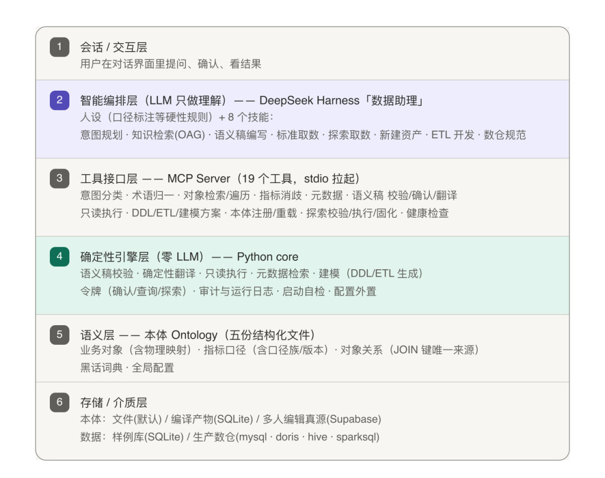
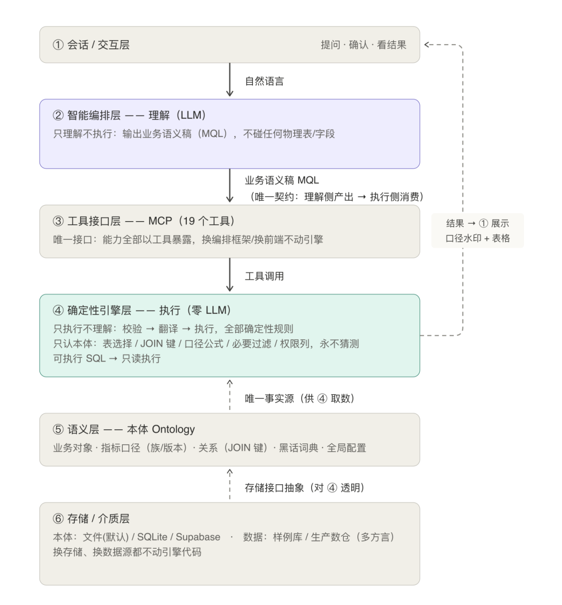
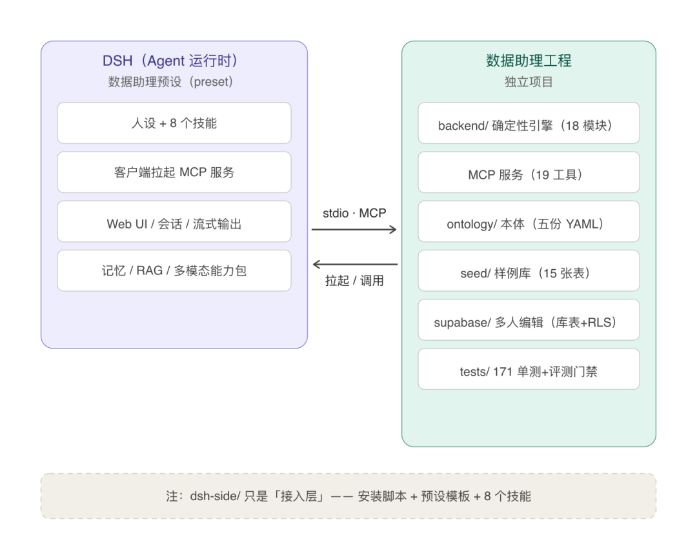
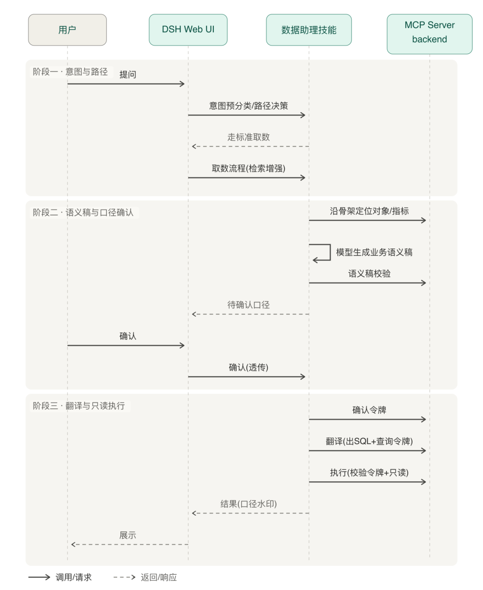
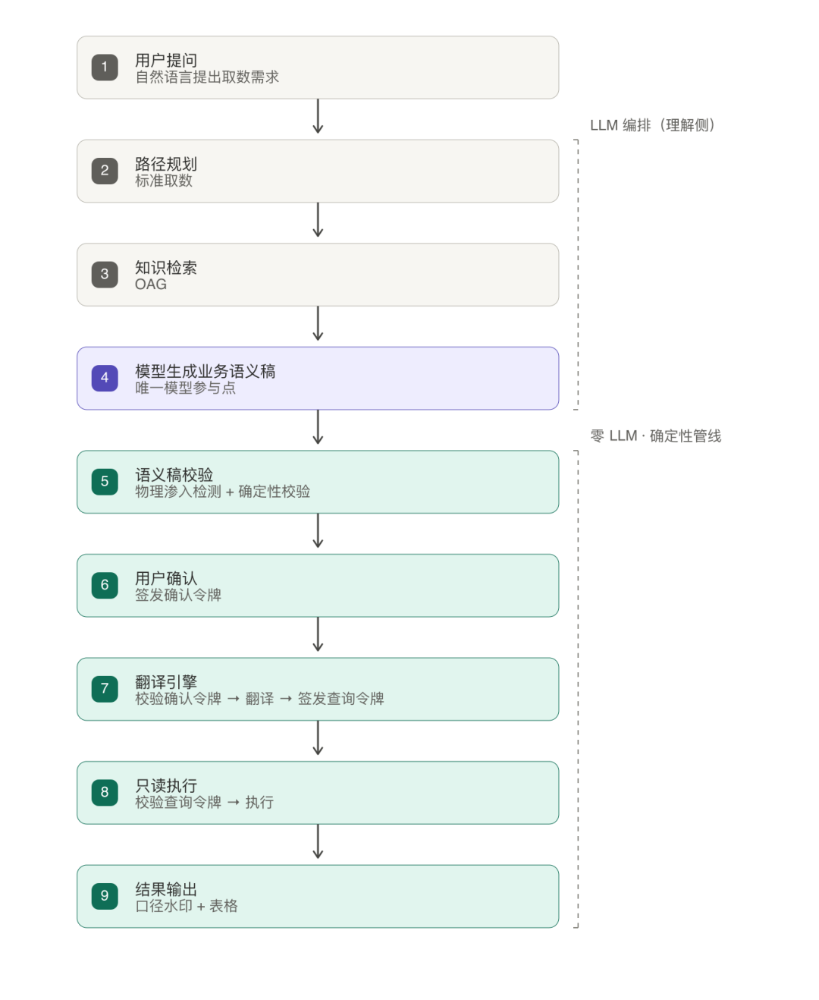
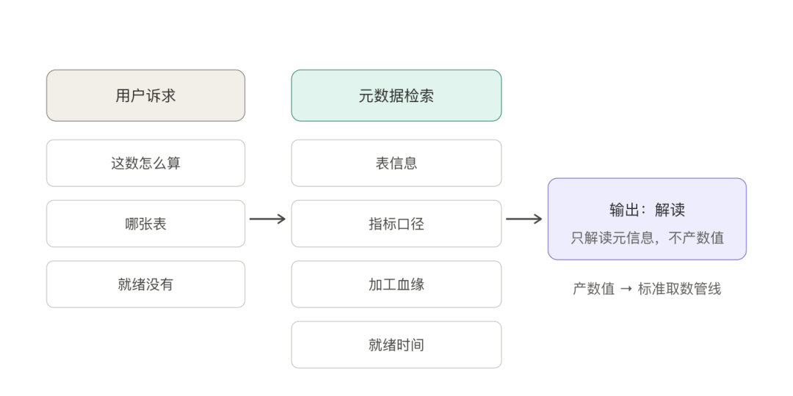
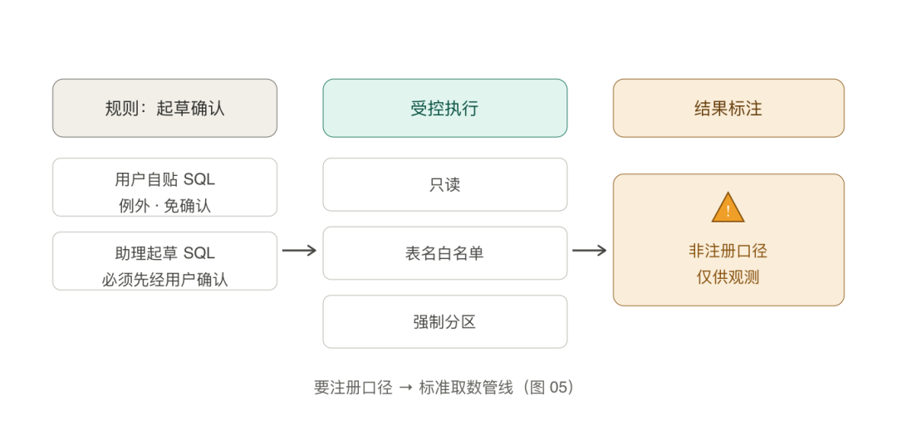
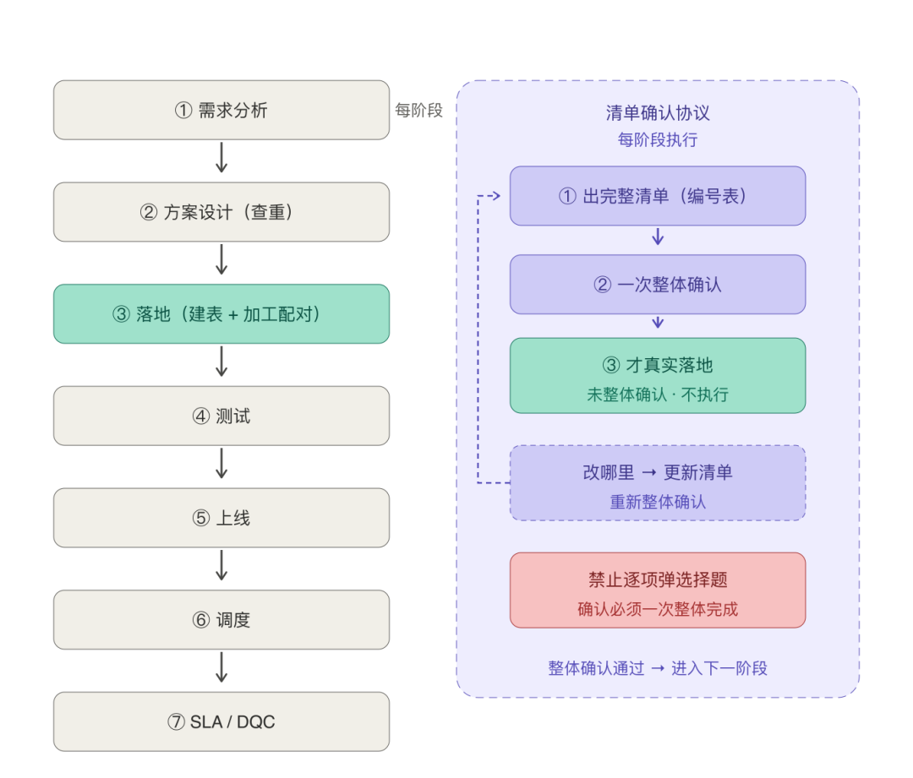

# 📰 基于DeepSeek Harness（DSH）的Data Agent 落地方案

数据 Agent 要解决的，是把自然语言问题变成准确、可信、可审计的数据服务，能力闭环是「生产数 → 取到数 → 分析数」。Text2SQL 是落地最关键的技术：LLM 负责理解（把问题解析成业务语义稿 MQL），确定性引擎负责执行（把 MQL 编译成可执行 SQL），理解与执行之间用一份“业务语义稿”隔开——各管各的、互不越界。本文讲清四件事：能力全景怎么划分、系统分几层、语义层（本体）怎么设计、每类能力怎么落地。

## 1. 能力全景（一条闭环）

主线一句话：**生产数 → 取到数 → 分析数**。系统的所有能力都挂在这条主线上。

—1.1　面向用户的能力

能力全景要回答的问题是：用户带着各种诉求来，系统怎么一一接住？每一条“能力”，都是一组“诉求 → 处理 → 结果”的完整闭环：用户说一句话，系统判断它属于哪条能力，按该能力的标准流程走完，交回一个确定的结果。按诉求不同，系统提供四条核心能力。

—① 取数：把数据取出来（最高频的诉求）

·**用户诉求：**比如“上个月华东区客单价”。

·**系统怎么接：**

–指标**已注册** → 直接走标准取数（理解 → 确认 → 翻译 → 执行）；

–指标**没注册也要数** → 走非标取数：

–缺表缺指标 → 先新建（走建模流程）；

–表在、指标没注册 → 先探索取数，观测稳定后固化注册为正式指标。

·**用户拿到：**带口径标注的表格结果。

—② 口径咨询与元数据查询：先搞清楚“这数是怎么来的”

·**用户诉求：**这个数怎么算 / 哪张表 / 就绪时间 / 血缘…

·**系统怎么接：**查本体与元数据，**表信息、指标口径、加工血缘、就绪时间**四类信息一次返回。

·**用户拿到：**元信息说明（不产数值）；诉求混着取数时，**先答口径、末尾再问是否一并取数**。

—③ 建模与运维：没有的数，把它造出来（面向研发）

·**用户诉求：**新建指标 / 表、改 ETL、配调度与配监控。

·**系统怎么接：**需求 → 方案 → 模型设计 → ETL 开发 → 测试 → 上线 → 调度 → SLA/DQC（服务等级与数据质量治理），**阶段化推进、逐阶段确认**。

·**用户拿到：****建好即可用**的新资产（建表同时自动注册本体、采集表元数据）。

—1.2　预留能力：分析

·**用户诉求：**基于取到的数 / 建好的数做解读、出报告。

·**说明：**是拿到数据后的衍生动作，后续以技能（Skill）补充，本文不展开，后续单独介绍。

—1.3　贯穿机制（所有能力的地基与护栏）

上面四条能力回答的是“用户找上门的事怎么办”。但一套系统要长期稳定地跑，还需要两类不直接面向用户、却贯穿所有能力的机制——它们不产出某个数，而是保证每条能力“跑得对、跑得稳、越跑越好”：

管控与安全（让每条能力跑得对）：三令牌（确认 / 查询 / 探索）+ **审计留痕** + **只读护栏，每一次取数、探索、建模都在这套护栏内执行，谁操作、改了什么、结果多大，全程可回溯**

评测与反馈（让每条能力越跑越好）：金标准数据集回归 + **反馈飞轮**  
任何规则改动都要过回归门禁（防“救一个 case、打挂十个 case”），线上用户的采纳/修改/拒绝反哺本体与模板，驱动持续进化

## 2. 分层架构

系统自顶向下分六层：上面两层是**“理解”**（LLM），中间是**“接口”**（MCP），下面三层是**“执行 + 语义 + 存储”**（零 LLM、纯确定性）。



—2.1　各层职责

|       层级        |                                                 职责与说明                                                  |
|-----------------|--------------------------------------------------------------------------------------------------------|
|    ① 会话/交互层     |                                           用户在哪说话、在哪确认、在哪看结果                                            |
|② 智能编排层（LLM 只做理解）|DeepSeek Harness（DSH）「数据助理」预设（preset）——人设（口径标注、流程规范等硬性规则）+ 8 个 skills，负责意图识别、路径规划、知识检索、生成业务语义稿、口径确认、组织回答|
|     ③ 工具接口层     |                        引擎能力的唯一出口——19 个 MCP 工具；DSH 不 import 任何引擎代码，耦合面收敛到工具接口定义                         |
| ④ 确定性引擎层（零 LLM） |                   Python core——语义稿校验、确定性翻译、只读执行、元数据检索、DDL/ETL 生成、令牌 ×3、审计与运行日志、启动自检                    |
|      ⑤ 语义层      |                       本体 Ontology（业务对象 / 指标口径 / 对象关系 / 黑话词典 / 全局配置）——翻译与校验的唯一事实源                       |
|    ⑥ 存储/介质层     |                                      本体存储三模式 + 数据介质两态（样例库 / 生产数仓）                                      |

—2.2　层与层的关系



## 3. 语义层：本体（Ontology）设计与应用

本体结构的完整设计思路在上篇[Data Agent核心能力text2sql的确定性解法——语义层](https://mp.weixin.qq.com/s?__biz=MzkwODMzMDkzMg==&mid=2247483672&idx=1&sn=cf60f39fadad2241c57a99b8497e3bf5&scene=21#wechat_redirect)中详细展开过，本篇只做必要补充，重点讲清楚它长什么样、怎么被各模块消费——因为**本体的设计直接决定翻译引擎的正确性和可扩展性**。

—3.1　本体是什么：把业务知识“结构化、可机器读取”

一句话：本体 = **业务字典 + ER 图 + 指标手册** 的三合一，由五份结构化文件组成，人工可维护、机器可读取：

* 业务对象

有哪些业务实体（订单 / 支付 / 用户 / 门店…）、每个对象有哪些属性、数据存在哪张表、字段怎么映射

* 指标口径

每个指标怎么算（公式）、必要过滤条件、口径版本、口径族（如 GMV 有支付 / 下单 / 消费三个口径）、**反面说明**

* 对象关系

对象之间怎么关联（关联键、基数）——**翻译引擎写 JOIN 的唯一来源**

* 黑话词典

poi → 门店　｜　成交额 → GMV　｜　user\_id 多叫法，回答时回译用户用词

* 全局配置

时间维度叫什么、分区列叫什么——换业务主题只改这里

—3.2　结构设计要点（关键字段）

·**业务对象（objects）：**

–**治理信息：**业务域、对象类型（事实/维度）、状态（在用/废弃）、责任人、敏感级、别名

–**属性：**类型、单位、描述、是否为必要过滤

–**物理映射（来源表）：**分层（ODS/DWD/DWS/ADS/DIM）、权威等级（金\>银）、支持粒度、字段映射、预聚合列、权限列

–**对象级必要过滤：**如“只算有效单 is\_valid=1”

·**指标口径（functions）：**

–公式（**只允许白名单函数与算子**）、必要过滤、支持维度 / 粒度

–版本（v1.0/v2.0…）+ 口径族与默认口径（多口径时**先问用户，不静默选**）

–**反面说明 do\_not**（“不要直接 AVG，要先按订单去重”）——防幻觉的关键

·**对象关系（relations）：**关联键 join\_key、关系语义、基数（1:1 / 1:N / N:M）。

·**黑话词典（glossary）：**原始词 → 标准术语，必须指向已注册对象 / 指标 / 属性。

·**全局配置（config）：**时间维度名、分区列名。

—3.3　本体示例（精简）

```

# 业务对象：Order（订单）
- name: "Order"
  display_name: "订单"
  description: "用户在平台完成的一次购买行为，从下单到支付完成"
  object_type: fact
  domain: ord
  required_filters: ["is_valid = 1"]
  properties:
    - {name: "pay_amount", type: decimal, unit: "元",
       description: "订单实际支付金额，含运费不含税"}
  source_tables:
    - {table: "dwd_ord_pay_di", layer: "DWD", authority: "gold",
       granularities: ["day", "week", "month", "quarter", "year"],
       field_mapping: [{property: "pay_amount", column: "pay_amt"}]}
# 指标口径：GMV 的支付口径（口径族 gmv 的默认变体）
- name: "gmv"
  display_name: "GMV"
  formula: "SUM(pay_amount)"
  required_filters: ["is_valid = 1"]
  family: "gmv"                 # 口径族：支付/下单/消费
  variant_label: "支付口径"
  version: "v1.0"
  do_not: "不要直接 SUM(pay_amt)，必须先过滤 is_valid=1"
# 对象关系：JOIN 键唯一来源
- {source: "User", target: "Order", type: "places",
   join_key: "user_id", cardinality: "1:N"}

```

—3.4　谁在消费本体

>
>
> 一个设计原则贯穿始终：**口径、JOIN、过滤、单位全部以本体为准，任何模块都不自己"发明"**——这是"写 SQL 不出错"的根基。
>
>

|   模块    |                    消费本体的方式                     |
|---------|------------------------------------------------|
|知识检索（OAG）|   对象定位（按名称/别名/域）、关系图扩展（拿到 JOIN 键、必要过滤、指标公式）    |
| 语义稿校验器  |      指标/维度/属性存在性检查；物理渗入检测（物理表/字段名集合从本体收集）      |
|  翻译引擎   |表选择（粒度/权威等级/预聚合）、写 JOIN（关系里的关联键）、注入必要过滤与权限列、默认时间|
|  确认环节   |             把公式/版本/口径族展示给用户确认后再翻译              |
|  元数据检索  |               表信息、指标口径、加工血缘、就绪时间               |
|   换主题   |             只替换五份文件 + 样例库，引擎代码零改动              |

## 4. 技术架构与选型

—4.1　为什么用 DSH（DeepSeek Harness）实现，而不是自己从头写一个 Agent

调研一圈后，我没有选择从零搭一套 Agent 系统，而是直接用 DSH 的预设（preset）功能来实现。理由有五条：

·**省掉大量“非核心”开发：**会话管理、流式输出、工具调度、Web UI 这些通用活，自研得忙好几周还得反复调体验；DSH 开箱即用，精力全花在数据能力上——**交付时间省了大半**。

·**业务逻辑和框架解耦：**数据助理是独立项目，DSH 侧只有接入层；两边走标准接口，**框架升级搞不挂业务**，数据能力还能单独拿给别人用。

·**用户体验不用自己踩坑：**流式渲染、表格、代码高亮这些磨人的细节，DSH 已经打磨好了；以后官方升级 UI（图表、移动端），自动沾光。

·**独立项目、独立迭代：**引擎、本体、测试、评测门禁都是自己的工程单元；版本发布、CI/CD 按自己节奏走，不被框架发版周期绑架。

·**跟着生态走，不吃孤岛亏：**DSH 迭代快，社区能力包（记忆/RAG/多模态）不断出，作为标准预设加新能力基本零成本；自研的话每个都要写适配层。

一句话总结：借助 DSH 预设（preset）做 Agent，不是偷懒，是**把有限的工程资源花在刀刃上**——框架的事交给框架，数据的事交给我，各干各擅长的事。

—4.2　对接架构：DSH 与数据引擎怎么连

关键认知：**真正的复杂度都在 backend/ 里，DSH 预设只是它的“接入层”**。DSH 通过标准协议拉起 backend 的 MCP 服务，调用 19 个确定性工具；技能只负责编排，不碰数据逻辑。



—4.3　一次完整提问的调用时序

以“上个月华东区活跃用户的平均客单价，按周拆分”为例：



说明：模型只出现在“生成语义稿”一步，其余全是确定性工具调用；**确认、翻译、执行三步各带一枚令牌，环环校验**。

—4.4　本体存储与数据介质

·**本体存储三模式：**

–**文件（默认）：**五份结构化文件，发布基线快照、克隆即跑

–**编译产物：**SQLite

–**多人编辑真源：**Supabase（revision 乐观锁，团队共同维护口径）

·**数据介质：**

–**本地样例库：**SQLite，order 主题 15 张表，固定种子、结果可复现

–**生产数仓：**MySQL / Doris / Hive / SparkSQL 多方言（配 DATA\_AGENT\_DSN\_\*）

·**换存储不动引擎：**只动读取层（存储接口抽象）；换主题只换 backend/ontology/ 五份文件，代码零改动。

说明：具体存储选型根据自己业务的数据量来确定，以上只是做本地项目演示时临时使用。

## 5. 取数（核心能力）

—5.1　设计要点（先讲思路）

·**为什么 Text2SQL 难落地：**直接让大模型一步生成 SQL，等于让它同时承担“理解业务”和“写 SQL”两件事——容易出现**编造 JOIN 键、漏过滤条件、口径不稳、无法审计**等问题。

·**本方案的做法：**把“理解”与“写 SQL”**分开**——LLM 只把自然语言解析成业务语义稿（MQL），由确定性翻译引擎把语义稿编译成可执行 SQL。写 SQL 仍然是最核心的环节，只是交给了“不会犯错”的规则：**不猜表名、不猜 JOIN、不猜过滤**。

·**链路上三个关键设计：**

–**理解侧（LLM）：**知识检索（OAG）增强 → 生成业务语义稿。语义稿只有业务语义，出现任何物理表名/字段名 = 格式错误，直接拒绝

–**执行侧（零 LLM）：**校验 → 用户确认 → 确定性翻译 → 只读执行，每一步都是纯规则

–**两道令牌：**确认令牌（防跳过确认直接翻译）+ 查询令牌（防绕过翻译引擎裸执行 SQL）

·**回答强制口径标注：**指标名 + 口径版本 + 公式 + 数据截至时间，结果用表格展示。

—5.2　取数链路（标准取数完整路径）



—5.3　翻译引擎（核心实现示意）

设计要点：指标按归属对象分组——**同对象合并单表、跨对象用临时结果集（CTE）对齐**；选表按“粒度覆盖 × 维度覆盖 × 预聚合 × 权威等级（金 &gt; 银，废弃跳过）”；**JOIN 键唯一来源是本体关系，永不猜测**。

```

# 翻译引擎：MQL → 可执行 SQL（确定性，零 LLM）
def translate(mql, user, dialect):
    # ① 指标按归属对象分组（同对象合并单表，跨对象走 CTE 对齐）
    groups = {}
    for m in mql.metrics:
        fn = ontology.get_function(m.name)          # 指标必须已注册
        groups.setdefault(fn.owner, []).append((m, fn))
    # ② 权限注入：按用户可见区域列表加行级过滤（步骤 0）
    #    user.region_ids → WHERE F.region_id IN (...)
    if len(groups) == 1:
        sql, meta = single_table_sql(groups, mql, user, dialect)   # 同 owner
    else:
        sql, meta = multi_table_sql(groups, mql, user, dialect)    # 跨 owner
    # ③ 元信息：用表清单 / 指标版本 / 注入的过滤 / 方言
    return {sql, metadata:{tables_used, metric_versions,
                           auto_injected_filters, dialect}}
def single_table_sql(owner, items, mql, user, dialect):
    # 选表：粒度覆盖 × 维度覆盖 × 预聚合 × 权威等级（金>银，废弃跳过）
    best_t, mode, joins = select_table(owner, metric_names, dims, gran, perm)
    # SELECT：预聚合列直接取 或 按公式白名单编译（SUM/COUNT/AVG/MAX/MIN/DISTINCT）
    select = metric_selects(items, best_t, mode)
    # WHERE：MQL 过滤 + 必要过滤自动注入(required_filters) + 权限过滤 + 时间(默认 t-1)
    where = [mql_filters, required_filters, perm_filter, time_clause]
    # JOIN：关联键唯一来源是 Ontology 关系，永不猜测
    return assemble(select, from=best_t, joins, where, group_by, order, limit)

```

—5.4　只读执行器（真实护栏）

设计要点：翻译引擎只负责“生成 SQL”，真正落地执行的是只读执行器——**双重拦截 + 行数上限**，即使 SQL 生成正确，写操作 / 全表拉取也进不来。

```

# 执行器：只读查询，双重拦截 + 行数上限
MAX_ROWS = 1000
FORBIDDEN = re.compile(r"\b(insert|update|delete|drop|alter|create|"
                       r"attach|detach|pragma|vacuum|reindex)\b")
def execute(sql):
    if FORBIDDEN.search(sql):
        return error("只读执行器拒绝非查询语句")     # ① 正则拦截
    conn = sqlite3.connect(f"file:{dsn}?mode=ro")    # ② 只读模式（双保险）
    rows = conn.execute(sql).fetchmany(MAX_ROWS + 1)
    return {columns, rows, row_count, truncated, elapsed_ms}

```

## 6. 口径咨询与元数据查询

—6.1　设计要点

·提问**：**用户问“这个数怎么算 / 哪张表 / 就绪没有”时，要的是元信息而不是数值 → **只查、不产数**。

·**返回：**表信息（分层 / 字段映射 / 业务含义）、指标口径（公式 / 版本 / 必要过滤）、加工血缘（这个数怎么来的）、就绪时间（数据到哪天 / 更新频率）等相关信息。

·**边界规则：**咨询不产生数值结果；若诉求混着取数（“这口径怎么算 + 顺便拉个数”），**先答口径、末尾再问“要不要一并取数”**。

—6.2　检索流程与实现



```

# 元数据检索：四类信息一次返回
def search(query):
    return {
        tables:    find_tables(query),      # 表信息：分层/字段映射/业务含义
        metrics:   find_metrics(query),     # 指标口径：公式/版本/必要过滤
        lineage:   lineage(query),          # 加工血缘：这个数怎么来的
        readiness: readiness(query),        # 就绪时间：数据到哪天/更新频率
    }
# 数据源优先级：多人编辑真源(表元数据库) > 本体回落（本地）

```

## 7. 探索取数与固化（指标没注册时，先取数观察）

—7.1　设计要点

·**出现场景：**指标没注册但想先看数据——非标取数里“表在、指标没注册”的分支，是缺指标时的默认可行路径。

·**安全模型：**与正式链路**物理隔离（独立令牌）但护栏一致**（只读 + 表名白名单 + 强制分区 + 行数上限）——探索不是“放开的裸 SQL”。

·**三模式交互：**贴 SQL / 自然语言起草 / 起草 + 精修；除用户自贴 SQL 外，起草的必须先确认再执行。

·**闭环：**探索稳定 → 固化草稿（口径自动提取、物理列自动反查业务属性）→ 人工确认 → 注册本体 → **新指标立即可走标准取数**。

—7.2　三模式交互

**① 贴 SQL**：用户自己写/粘 SQL → 直接受控执行

**② 自然语言起草**：说诉求 → 起草 SQL → 确认后执行

**③ 起草+精修**：先给 SQL 骨架 → 对话稿（加维度/聚合）→ 确认后执行

规则：除用户自贴 SQL 外，起草的必须先确认



—7.3　探索校验与执行（实现示意）

设计要点：**防编造表名、防全表扫描**——SQL 引用的表必须已注册（白名单）、必须带时间分区条件、必须只读；校验通过才签发探索令牌（绑定 SQL 指纹，120 秒有效）。

```

# 探索 SQL 校验：与正式链物理隔离，但护栏一致
def validate_explore_sql(sql, allowed_tables):
    errors = []
    if FORBIDDEN.search(sql):                 # ① 只读（与执行器双保险）
        errors.append("只允许 SELECT/CTE，禁止写操作/DDL")
    if not sql.lstrip().lower().startswith(("select", "with")):
        errors.append("必须以 SELECT 或 WITH(CTE) 开头")
    tables = extract_tables(sql)              # ② 提取出现的物理表名
    unknown = [t for t in tables if t not in allowed_tables]
    if unknown:                               # ③ 表名白名单：必须已注册
        errors.append(f"未注册表: {unknown}")
    if not DT_FILTER_RE.search(sql):          # ④ 强制分区：必须带 时间分区，如dt 条件
        errors.append("探索 SQL 必须带分区条件")
    return {ok: not errors, errors, tables}
# 通过 → 签发探索令牌（绑定 SQL 指纹，短 TTL）→ 受控执行

```

—7.4　固化桥接（探索结果 → 正式指标）

设计要点：探索结果稳定后，把探索 SQL 反推为注册草稿——SELECT 聚合 → 候选指标公式、GROUP BY → 候选维度、WHERE → 必要过滤；物理列通过字段映射自动反查业务属性，反查不到的列入待人工补充。**草稿经清单确认后才注册激活**。

```

# 探索稳定后：SQL → 口径草稿 → 人工确认 → 注册
def build_register_draft(sql):
    extracted = {
        metrics: extract_select_metrics(sql),   # SUM(x)/COUNT(DISTINCT y) → 候选指标公式
        dimensions: extract_group_dims(sql),    # GROUP BY 列 → 候选维度
        filters: extract_where_filters(sql),    # WHERE 非时间条件 → 必要过滤
        source_tables: extract_tables(sql),     # 源表（必须已注册）
    }
    # 物理列 → 业务属性自动反查（field_mapping）；反查不到 → 列入待人工补充
    changes = []
    for m in extracted.metrics:
        changes.append(function_draft(m))       # 公式/归属/过滤，status=draft(未激活)
    for t in unregistered_tables:
        changes.append(object_draft(t))         # 未注册源表 → 候选对象草稿
    return {changes, note: "探索固化草稿，人工确认后激活"}
# 草稿经清单确认 → 注册进本体 → 新指标立即可走标准取数

```

## 8. 建模与运维（面向研发）

—8.1　设计要点

·**面向研发：**需求 → 方案（查重）→ 模型设计 → ETL 开发 → 测试 → 上线 → 调度 → SLA/DQC，一条完整的数据开发链路。

·**先报告后执行：**每个阶段先产出**完整逻辑清单**（每项带编号）→ 一次整体确认 → 才真实落地；改哪里 → 更新清单 → 重新整体确认（禁止逐项弹选择题）。

·**配对生成：**N 张表 = N 对（建表 + 加工），工具层强制数量一致；维度表无聚合加工，只出建表。

·**建好即可用：**建表同时自动采集关联表元数据、注册本体，**落库即被检索到**。

·**存量运维：**改 ETL / 调度 / 配置直接调用对应能力执行；涉及口径变更仍需用户确认。

—8.2　建模流程（阶段化 + 清单确认协议）



—8.3　配对生成（实现示意）

设计要点：变更清单的每一项映射到确定的产出——新建 / 加字段必须**建表与加工成对**（数量强制），改加工逻辑只改加工、注册只注册；返回每项的被编辑字段供确认环节逐项编辑。

```

# 建模方案：变更清单 → 配对 {DDL, ETL} 列表
VALID_TYPES = {create, add_field, modify_logic, register}
def generate_modeling_plan(changes):
    for i, c in enumerate(changes):
        if c.type == "create" or c.type == "add_field":
            ddl = generate_ddl(c.obj, c.layer)      # 建表（分层命名规范）
            if c.layer != "DIM":                    # 维度表无聚合 ETL
                etl = generate_etl(c.obj, ...)      # 加工逻辑（源=明细 → 目标=汇总）
                assert ddl_count == etl_count       # 成对强制：N 表 = N 对
        elif c.type == "modify_logic":
            etl = generate_etl(c.obj, ...)          # 仅 ETL，无 DDL
        elif c.type == "register":
            entry = register_draft(c.obj)           # 仅注册项
    return {changes, summary:{paired, errors}}
# 建表同时自动采集关联表元数据、注册本体 —— 建好即可用

```

—8.4　存量迭代运维

·**改 ETL / 调度 / 配置：**直接调用对应能力执行。

·**涉及口径变更：**仍需用户确认——**口径不是随便改的**。

## 9. 管控与安全

—9.1　设计要点

·**三个必须防住的绕过：**跳过确认直接翻译　｜　绕过翻译引擎裸执行 SQL　｜　绕过校验直接探索。

·**解法：****三令牌链路**——每类操作必须携带对应令牌，令牌与内容强绑定（换内容即失效）、短有效期。

·**其他护栏：**权限继承（行级过滤注入，看不到的区域不进结果）、审计留痕（不落明细数据）、只读双拦截 + 行数上限 1000。

—9.2　三令牌链路

·**确认令牌：**翻译前展示口径 / 维度 / 时间 → 用户确认 → 签发（绑定语义稿指纹）。语义改了 → 必须重新确认（**防跳过确认直接翻译**）。

·**查询令牌：**翻译成功 → 签发（绑定 SQL 原文）；执行必须携带且 SQL 一致。**防绕过翻译引擎裸执行任意 SQL**。

·**探索令牌：**探索校验通过 → 签发（绑定 SQL 指纹）；与正式链物理隔离。

—9.3　令牌实现（核心示意）

设计要点：令牌不是“门禁口令”，而是**内容指纹的绑定**——签发时绑定内容（SQL 原文 / 语义稿指纹），校验时比对内容，**换内容重放直接被拒**。

```

# 令牌基类：TTL + 容量淘汰 + 惰性 GC + 签发/校验骨架（两令牌共用）
class TokenStoreBase:
    def issue(self, payload):                    # 签发
        token = secrets.token_hex(16)
        entry = TokenEntry(expires_at=now + ttl)  # 短 TTL（默认 300s）
        self._bind(entry, payload)                # 绑定内容（SQL 原文 / 语义稿指纹）
        return token
    def verify(self, token, payload):            # 校验
        if token not in self._tokens:  return False, "令牌无效或已过期"
        if expired:                    return False, "已过期，请重新翻译"
        if not self._matches(entry, payload):
            return False, "内容与令牌不匹配：禁止绕过翻译引擎执行"   # 防换内容重放
        return True, "ok"

```

—9.4　其他护栏

·**权限继承：**用户可见区域列表注入查询（看不到的区域不进结果）。

·**审计留痕：**全链路日志（调用方 / 动作 / 入参摘要 / 耗时 / 结果规模，不落明细数据）。

·**只读护栏：**FORBIDDEN 正则 + 只读模式双拦截 + 行数上限 1000。

## 10. 评测与反馈闭环

—10.1　设计要点

·**确定性引擎最大的红利：****可单测、可回归**——金标准数据集（29 条真实需求 → 标准语义稿 / SQL / 意图）+ 171 项单测 + CI 门禁自动跑。

·**翻译快照锁定：**改一条规则即见全量回归，防止“救一个 case、打挂十个 case”。

·**反馈飞轮：**采纳 / 修改 / 拒绝三态 → 归因 → 改进（补本体 / 优化检索 / 修映射 / 固化模板）。

—10.2　分层评测（金标准回归）

```

# 令牌基类：TTL + 容量淘汰 + 惰性 GC + 签发/校验骨架（两令牌共用）
class TokenStoreBase:
    def issue(self, payload):                    # 签发
        token = secrets.token_hex(16)
        entry = TokenEntry(expires_at=now + ttl)  # 短 TTL（默认 300s）
        self._bind(entry, payload)                # 绑定内容（SQL 原文 / 语义稿指纹）
        return token
    def verify(self, token, payload):            # 校验
        if token not in self._tokens:  return False, "令牌无效或已过期"
        if expired:                    return False, "已过期，请重新翻译"
        if not self._matches(entry, payload):
            return False, "内容与令牌不匹配：禁止绕过翻译引擎执行"   # 防换内容重放
        return True, "ok"

```

—10.3　反馈飞轮

|用户行为|样本类型|                          归因 → 改进动作                          |
|----|----|-------------------------------------------------------------|
|用户采纳|正样本 |                        强化模板 / 优化提示词                         |
|用户修改|记录差异|实体识别错 → 补对象 / 别名（本体）；语义稿错 → 优化检索上下文；翻译错 → 修物理映射；高频模式 → 固化为新模板|
|用户拒绝|负样本 |                           案例归因改进                            |

## 小结

地基是**语义层**，主线是“**生产数 → 取到数 → 分析数**”，写 SQL 交给**确定性引擎**，护栏是**令牌与审计**，进化靠**评测与反馈**。  

预告：下一篇文章提供项目代码git仓库地址及工具可视化介绍

DATA AGENT 系列 · 未完待续

觉得有用，欢迎点个「在看」转发给同事

