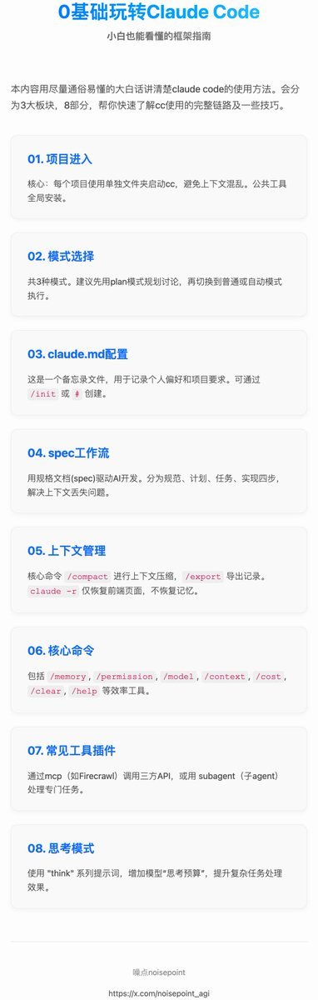

一文教你0基础玩转Claude Code，小白也能看懂的框架指南

本文尽量用通俗易懂的大白话讲清楚clauded code的使用方法。对于没接触过claude code或刚接触的可以快速了解cc使用的完整链路及一些技巧。

先从框架讲起，再分享一些具体的技巧教程；会分为3大板块，8部分：需求前期工作（项目进入——模式选择——claude. md 配置）——工作流管理（spec工作流开发介入）——高频操作及功能（上下文管理——核心命令——常见工具插件——思考模式）；

其中从项目进入到spec工作流部分即为基础的完整开发流程，也就是在这些环节就可以把自己的一些需求进行变现，直接看到需求实现效果，后面的几部分是cc在具体开发过程中效率更高或结果更好的一些核心要素。

需求前期

项目进入：
这是新手最容易踩的一个坑。

在安装完cc后就直接在主目录或安装cc的目录里启动了，然后不管做什么需求都在同一个目录空间里运行，尽管cc也是可以正常跑的，但这里面的一个巨大风险为cc是基于项目文件夹的工具，它在生成 claude.  md 时会参考整个codebase代码库，这也就意味着如果你启动cc的这个目录空间里有不同项目，它就会全部参考，也就会让出现上下文混乱和逻辑冲突的概率大大增加。

简易之就是你在做一个新需求时，他既会参考你空间里的A项目，也会参考B项目，这就很容易出错，所以强烈建议每个完整项目都有自己的单独文件夹，然后在终端里进入到这些嵌套的具体项目文件里去启动cc，然后参考的codebase就只是这个项目文件里的了。

对于一些公共的cc设置和不区分项目的工具尽量全局安装，也建议在装时尽量自己安装，不让AI去装，AI有时虽然装上了能用，但可能会做成项目级，新项目空间里就失效了。

现在建好项目文件夹，在终端cd进入到具体的项目文件夹，再启动claude code，就完成了关键的第一步，进到了主界面。

模式选择：
在cc中有3种模式，通过shift+tab可以切换，分别是普通模式、plan模式、自动接受代码编辑模式；

普通模式：进入主界面就是普通模式，这个没什么好说的；

plan模式：这个模式只会去讨论沟通，不会执行写代码，在项目前期需要规划功能的时候可以用到这个模式，它会自动给到计划方案，然后会和你确认是否执行；

自动接受编辑模式:这个模式就是根据和AI讨论的方案，它会自动进行任务执行比如写代码；

建议一开始用普通或plan模式，plan模式最佳，可以使劲和cc讨论你的需求，让他不断调方案，给文档建议，都确定好了后退出plan模式，切换到普通或自动接受模式进行相关执行。

claude. md创建：
进入项目了解选择完模式后，在开始沟通具体需求前还有个环节可以操作，那就是claude.  md；

这是一个特殊文件，类似官方提供的你和cc之间的备忘录，Claude 在开始对话时会自动将其内容拉入上下文，所以它既可以记录一些你个人的习惯如特殊偏好、常用命令、代码风格等，也可以针对项目记录一些具体项目要求，如项目背景、注意事项、测试说明等，总之一切你想要claude知悉的事项都可以写进入；

Claude. md分为用户级和项目级，用户级的意思是不关联项目，只要是在你这个用户名登陆下任何项目都会遵守这个claude.  md 文档规则；而项目级则只对该项目生效，切换项目后就不会再遵守。

通过2种方式可以生成claude. md：

1\. 直接运行/init命令：会自动参考你的项目空间codebase生成文档；

2\. 通过输入# 后面可直接添加memory记忆，然后让你选择是添加到用户级还是项目级，这个memory也就是claude的内容。
如果是不想自动生成，也可以手动添加一个项目级claude.  md，怎么写直接和ai讨论就行，核心包括项目介绍、开发偏好、技术栈

claude md记忆内容查看：
通过运行/memory 可以查看claude. md里的记录内容，项目级和用户级都可查看；

工作流管理

把上面前期环节都走完后，就可以来到真正的需求沟通和执行环节了。
这个环节我觉得最核心的就是一句话：文档，文档，还是文档；只要把需求细节都讲清楚，让他照着文档做，选个好模型，做出来的产品与预期不会偏离太多；具体工作流用的比较多的是spec。

spec工作流：
spec即规范规格，用规格文档来驱动AI开发，可以理解为这个规格是AI要遵守的唯一契约，必须按照spec文档做事执行；spec具体分4部分：

\- 规范specification：这个文档不用官技术相关内容，主要是关于项目的描述，功能需求，目标人群等，把这些大的需求相关信息告诉AI，让AI生成一个规范文档，这是一个将模糊想法转化为结构化需求的过程。

\- 计划plan：然后把上面刚生成的规范文档以及你的一些技术偏好，项目相关约束如框架、语言，测试计划等发给AI，让他生成一个完整的技术文档。

\- 任务task：把上面的两个2文档再发给ai，让他参考这2个文档把你的功能需求按确认后的技术偏好拆分成一个个具体的、可执行的子任务，每个任务都可以独立实现和测试。

\- 实现Implementation：让他先把上面的3个文档汇总成一个大的spec.  md发给你确认，如果觉得有问题就修改，确认无误后发给ai，让他进行代码编写开干。

相比claude.  md来说，spec文档会更侧重于具体功能的详细实现计划，claude.  md会相对更大一点，当然对于简单小需求，只写一个即可；

这个spec工作流解决的最大问题就是上下文问题，现在模型上下文都很有限，如果上下文用满后再开一个窗口不能把这些上下文内容100%记录，就会造成上下文丢失，开发效果会大大折扣，而文档记录正好解决了这一问题，可以让AI能看到完整的上下文背景信息。

我个人工作流习惯是：
1\. 先自己写个大致文档需求；
2\. 然后发给ai和他基于这个文档讨论沟通，让他给我建议；
3\. 然后让他把讨论过程中我确认的信息再完整复述给我，我来确认，确保双方理解无误；
4\. 确认无误后让他更新到我之前的文档中，这些文档会包含上面提到的spec完整环节比如技术文档、任务拆分等，生成最终文档；
5\. 将最终文档发给他，让他开始执行，你最后测试需求效果；

当然这只是个人习惯，没什么固定格式，只要自己用的顺手，能够把需求细节描述清楚、上下文给到位，其他任意工作流样式都可以，此处介绍spec只是举例罢了。

以上基本就覆盖了claude code实现需求的核心链路和环节，能够让一个需求变成一个产品的全过程。

高频操作及功能：
下面会再介绍在这个开发链路过程中会经常用过的一些高频功能和技巧，以及注意事项：

上下文管理：
上下文可以说是任何AI工具的核心，没有足够完整的上下文，结果一定会与预期偏差较大。

在claude code中有几个高频命令可以进行上下文管理：

compact：
直接在cc里输入/compact可以进行上下文压缩，ai会自动去掉无关信息，保留核心信息的关键摘要；也可以按你的需求进行压缩，比如只保留压缩你想要的某一部分内容；

当然系统也会上下文用尽时自动压缩，建议是最好主动压缩，看到页面空间剩下20%时就要留意是不是要压缩新开窗口了。

export：
可以将完整聊天记录进行导出，放到文档里再发给ai参考；

claude -r：
当退出会话后，可以在终端用claude -r恢复会话，但一定要注意，这个恢复只是前端页面，是方便用户看聊天记录的，并不会恢复模型的上下文记忆；

常用命令：
memory：claude. md记忆管理
permission：功能及工具权限确认
compact：上下文压缩
export：导出当下会话，方便给ai参考
config：进入配置栏，进行cc相关配置，如主题等
status：查看当前你的claude code状态
model：进行模型切换
context：tokens消耗情况查看
cost：费用查情况查看
exit：退出claude code
clear：清空上下文，新开启会话；
help：所有命令查看

以上是一些比较常见的命令，能帮助提升一些使用效率。

常见工具及插件：
在claude code里面，还支持自定义添加很多工具来增加claude code能力，比如mcp、插件、subagent等；

mcp：
简单理解为就是api的一种，本身也是一种协议，可以来调用三方工具扩展能力；

常见的mcp像Comtext 7（获取官方最新文档，如api对接、库文档等），Firecrawl（网页内容抓取），playwright mcp（浏览器自动化工具）等；

然后在cc中/mcp即可查看已安装的mcp列表，使用时直接说明用某某mcp去执行任务即可，比如用firecrawl来查询总结这篇文章内容。

subagent：
本质就是一个agent，可以理解claude code支持你添加不同的子agent来专门负责完成对应的任务，这些子agent即subagent可以设置不同的能力，比如专门做需求分析、写代码、做测试等；

每个agent都有自己独立的上下文；需要注意的是subagent执行完毕的结果是返回给主agent即claude code，而不是你，claude code会把这些subagent执行的结果统一处理后再返回给你；

使用/agent可以进行agent管理，包括新建、编辑、管理等。

有2种使用方法，一种是claude code会根据你的任务自行判断是否调用subagent，调用哪个subagent；还有一种就是显式调用，直接在对话里和ai说清楚即可；

思考模式：
在claude code中可以通过think提示词来激活思考模式，有几个层级：“think” &lt; “think hard” &lt; “think harder” &lt; “ultrathink”，思考程度依次增强；

原理是通过调节“思考预算”（即模型在内部推理阶段可用的资源／token数）让模型在遇到复杂任务时“多花点时间思考”再出结果，，效果会更好，当然费用也会更多；

注意这个扩展思考模式不是切换模型，只是让同一个模型在内部保留更多推理步骤或token数来思考更久。

以上基本就是使用claude code的核心知识点，涵盖了3大板块，8部分，包括前期工作（项目进入——模式选择——claude.  md配置）——工作流管理（spec工作流开发介入）——高频操作及功能（上下文管理——核心命令——常见工具插件——思考模式）；

当然claude code不止用来写代码，很多场景只要是有可能AI解决的，都可以在claude code尝试解决。多用才是上手最快的方法。

### 🖼️ Attached Media

## 💬 Replies

### 1 @cellinlab (Cell 细胞)

*Fri Nov 07 06:42:47 +0000 2025*

@noisepoint\_agi 感觉 X 还是不适合 长文 hhh

### 2 @noisepoint_agi (噪点noisepoint) (Author)

*Fri Nov 07 06:47:31 +0000 2025*

@cellinlab 哈哈哈，准备测测这类效果。如果从操作上看，真的确实好麻烦……

### 3 @ChatGptAstra (摸鱼巨匠🔨)

*Fri Nov 07 06:45:52 +0000 2025*

@noisepoint\_agi 这个排版加粗有点问题

### 4 @noisepoint_agi (噪点noisepoint) (Author)

*Fri Nov 07 06:49:52 +0000 2025*

@EternalDay98 好的，我检查下😁，第一次用pc发长文，还不太熟悉

### 5 @indiehackercase (Olivert)

*Fri Nov 07 07:29:49 +0000 2025*

@noisepoint\_agi 学习了

### 6 @noisepoint_agi (噪点noisepoint) (Author)

*Fri Nov 07 07:54:04 +0000 2025*

@indiehackercase 😁😁😁

### 7 @20mprofitai (20xbrights)

*Fri Nov 07 07:20:17 +0000 2025*

@noisepoint\_agi 我以前都不知道用memory 都是直接对话让AI写入[CLAUDE.md](http://CLAUDE.md)  这下得到学习了！

### 8 @noisepoint_agi (噪点noisepoint) (Author)

*Fri Nov 07 07:23:45 +0000 2025*

@eagle6616 可以#自定义添加的

### 9 @victor_wu (victor-wu.eth)

*Sat Nov 08 03:18:21 +0000 2025*

@noisepoint\_agi 有没有codex cli的教程🥹,先提前感谢

### 10 @noisepoint_agi (噪点noisepoint) (Author)

*Sat Nov 08 03:20:18 +0000 2025*

@victor\_wu 后面我有计划写一篇😁😁

### 11 @Adam38363368936 (Adam也叫吉米)

*Fri Nov 07 07:17:07 +0000 2025*

@noisepoint\_agi 确实有一点长😂

### 12 @noisepoint_agi (噪点noisepoint) (Author)

*Fri Nov 07 07:23:01 +0000 2025*

@Adam38363368936 哈哈哈，我一开始在app草稿里编辑都发不了，换到pc才发出来

### 13 @Chen1983Xuan (Chen Rebecca)

*Sat Nov 08 09:22:28 +0000 2025*

@noisepoint\_agi 能不能教一下墙内如何获得claude 稳定账号

### 14 @noisepoint_agi (噪点noisepoint) (Author)

*Sat Nov 08 17:18:59 +0000 2025*

@Chen1983Xuan 额，这个我也想知道，哈哈哈，反正我知道的高频用官方的基本都被封过，所以我现在用的glm的api

### 15 @zimoc33 (子墨笔记)

*Sat Nov 08 06:52:58 +0000 2025*

@noisepoint\_agi span 工作流水 claude code 里面自带的么，还是要自己写的

### 16 @noisepoint_agi (噪点noisepoint) (Author)

*Sat Nov 08 08:18:10 +0000 2025*

@zimoc33 不是自带的，可以自己让ai按框架写，也可以直接装三方插件，比如spec kit，直接在github上搜就行有很多

### 17 @li5359826589201 (砰砰砰)

*Fri Nov 07 06:43:39 +0000 2025*

@noisepoint\_agi 太棒了，谢谢

### 18 @noisepoint_agi (噪点noisepoint) (Author)

*Fri Nov 07 06:47:48 +0000 2025*

@li5359826589201 😁😁😁感谢感谢

### 19 @River_77777 (阿赞AIFullStack)

*Fri Nov 07 12:28:14 +0000 2025*

@noisepoint\_agi 手把手系列之cc，用起来

### 20 @noisepoint_agi (噪点noisepoint) (Author)

*Fri Nov 07 13:13:26 +0000 2025*

@River\_77777 手把手系列可还行，hhh

### 21 @pandionkk (孙小帅 kk)

*Sat Nov 08 23:26:00 +0000 2025*

@noisepoint\_agi 不错

### 22 @noisepoint_agi (噪点noisepoint) (Author)

*Sun Nov 09 01:34:26 +0000 2025*

@sunshuaishuai5 😊😊😊

### 23 @XMjinyu (金鱼爸爸（好笑群群主）)

*Fri Nov 07 08:21:22 +0000 2025*

@noisepoint\_agi 收藏了

### 24 @noisepoint_agi (噪点noisepoint) (Author)

*Fri Nov 07 13:15:38 +0000 2025*

@XMjinyu 😎😎

### 25 @Astronaut_1216 (叫我阿杭)

*Fri Nov 07 06:38:41 +0000 2025*

@noisepoint\_agi 这个太好用了

### 26 @ZenHuifer (ZenHuifer)

*Sun Nov 09 01:31:41 +0000 2025*

@noisepoint\_agi 蹭一下  [fc75euxpwk.feishu.cn/wiki/VT8Gw8oTT…](https://fc75euxpwk.feishu.cn/wiki/VT8Gw8oTTijxWykOhryc7V7TnA4)

### 27 @OiiDev (OSDev)

*Sat Nov 08 01:25:29 +0000 2025*

@noisepoint\_agi rst @readwise save thread

### 28 @bugjay4 (Bugjay)

*Fri Nov 07 11:01:31 +0000 2025*

@noisepoint\_agi @readwise save thread

