# 📰 0 元打造专属于你的纯净代理 IP，高速稳定还无限流量

> [⚠️](https://abs.twimg.com/emoji/v2/svg/26a0.svg)Tips： 本教程仅限于技术学习交流，禁止用于商业行为，任何将本账号内容进行传播的行为与本账号的运营者无关

## 说在前面

这是一篇 0 成本搭建起专属于你纯净度极高的代理 IP，虽然是 IDC 机房 IP，但最终纯净度、稳定性、高峰速度等测试下来远远优于绝大部分机场节点，特别适合用海外 AI 大模型的伙伴。全文不涉及技术原理和复杂的理论描述，全是我个人实操截图，只要你动手跟我一起做，肯定能跑起来\~

先看跑起来的 IP 质量截图：

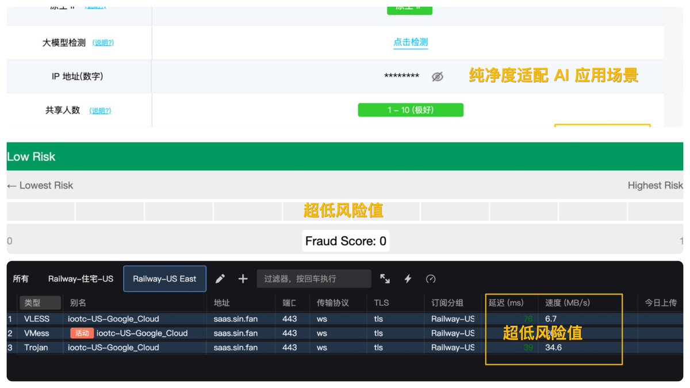

## 主要涉及的工具和站点

应用托管：GitHub，确保注册了 GitHub 账号；
域名注册：Spaceship，唯一可能花费的地方（可选）；
域名解析：Cloudflare，首次注册的可以用 GitHub 账号登录；
应用部署：Railway，应用托管部署，新用户赠送 $5 免费试用 30 天；
代理工具：v2rayN，以你个人习惯喜好为准，只要支持 VLESS 协议 即可。

## 操作核心流程步骤

- 1.注册域名及解析（已有域名解析可忽略）

- 2.创建网络连接隧道

- 3.应用设置编译

- 4.应用部署配置

- 5.订阅验证

废话不说，直接开整\~

## Step 1 注册域名 （[spaceship.com](https://spaceship.com/)）

> 已有域名的伙伴可忽略，直接看 Step  2

前面说的可能发生的成本就在这里，以下所有操作建议在 PC 页面上进行。

域名选购

访问 [https://www.spaceship.com/](https://www.spaceship.com/) 官网，切换语言和货币（非必须，反正后面支付结算按实时汇率），完成常规邮件注册，无需绑定手机。

建议选定 数字.xyz 域名，近期 spaceship.com 对数字类 xyz 域名有超值特惠活动 ——注册第一年 仅 $0.67（约 ￥4.6 元），购买后立即以 $0.67/year 直接续费 9 年；10 年一共 $6.7，换算当前汇率6.83，也就是 46 元左右。挺适合用来做个人工具站点等。你也可以按照你的需求购买域名，后续操作不影响。

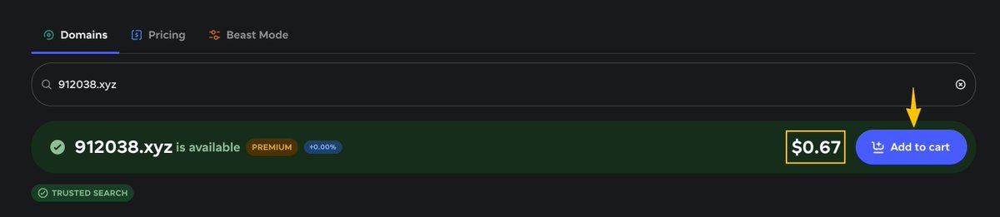

整体流程我就不详细截图了，就是常规电商购物步骤：

选定域名 -&gt; 添加购物车 -&gt; 购物车结算 -&gt; 绑定支付宝 -&gt; 跳转收银台 -&gt; 扫码付款完成

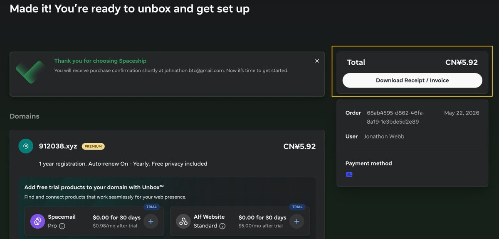

域名续费

关闭自动续费：选择  Launchpad - Domain Manager，点击 关闭自动续费：

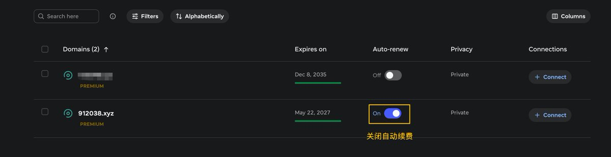

操作续费订阅：选中域名，点击 右侧 订阅续费 按钮，弹出续费年限选择框：

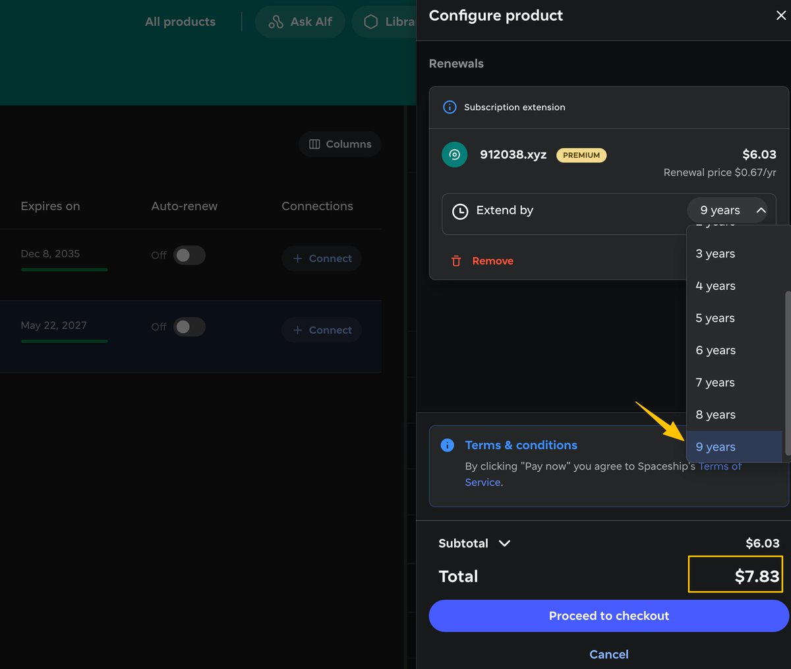

[⚠️](https://abs.twimg.com/emoji/v2/svg/26a0.svg)Tips 这里我发现总金额好像不对，核对了一下，最近他们增加税费，居然涨价了（$0.2/年）！但也无妨，你可以按你的需求续费\~ 合计也差不了几块钱。记住：注意需要先购买一年，再进行续费。

小结： 完成域名注册，按需续费，总计花费 $0.67 + $0.2 = $0.87（约 6 元，按一年计算）

## Step 2 域名解析（[cloudflare.com](https://cloudflare.com/)）

> 已在 Cloudflare 解析过的伙伴可忽略，直接看 Step  3

Step 1 我们注册了域名，但需要接入大名鼎鼎的 Cloudflare，方便后续 DDNS 以及域名管理。

CF 账号注册

官网，切换语言，支持 Google/Github 三方登录，教程很多就不赘述了。访问[https://dash.cloudflare.com/login](https://dash.cloudflare.com/login)

CF 域名接入

登录进入控制台之后，选择 左边菜单栏  域名-概览，点击右上角的 添加域名，在弹出页面中 选择 连接域名 后 在文本框内输入你的域名，然后点击 继续 按钮，如下图示：

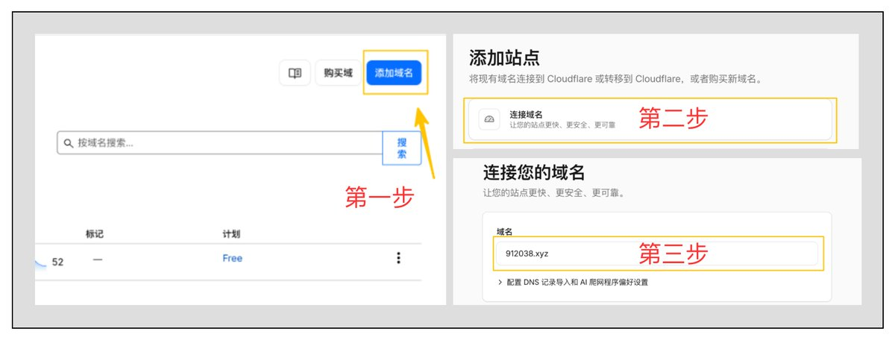

然后 选择 Free 计划（免费），会自动生成 DNS 解析，然后点击 继续前往激活，在弹出的页面中会出现两个已经分配的名称服务器地址，如下图所示：

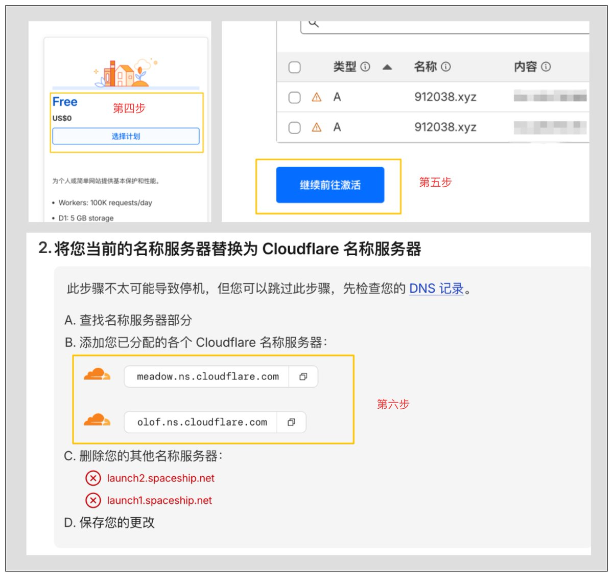

Spaceship 名称服务器配置

打开刚才注册域名的 Spaceship 站点，右上角 点击 Launchpad，弹出页面中选择 Advanced DNS（高级 DNS），打开页面后点击你的域名地址，进入 名称服务器 管理页面，点击 Change（变更） 按钮 弹出名称服务器维护页面，选中 Custom nameservers（自定义名称服务器） 填入刚才 Cloudflare 分配的两个名称服务器地址，最后保存提交，如下图示：

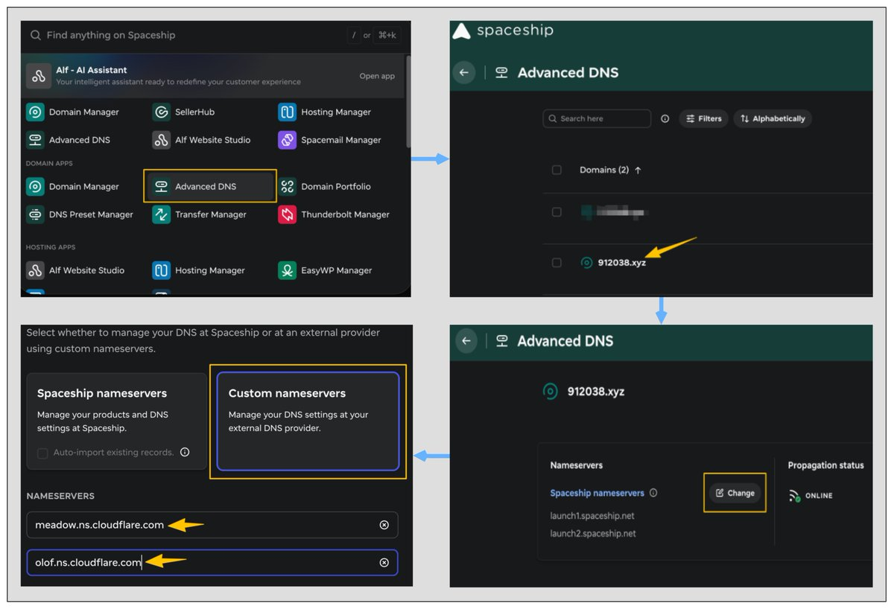

Cloudflare 验证域名解析

回到 Cloudflare，点击页面中 已完成服务器设置，这里会出现 正在等待注册机构更新服务器，让它自行更新，这个过程预计 20\~30 分钟左右，最终效果如下图示：

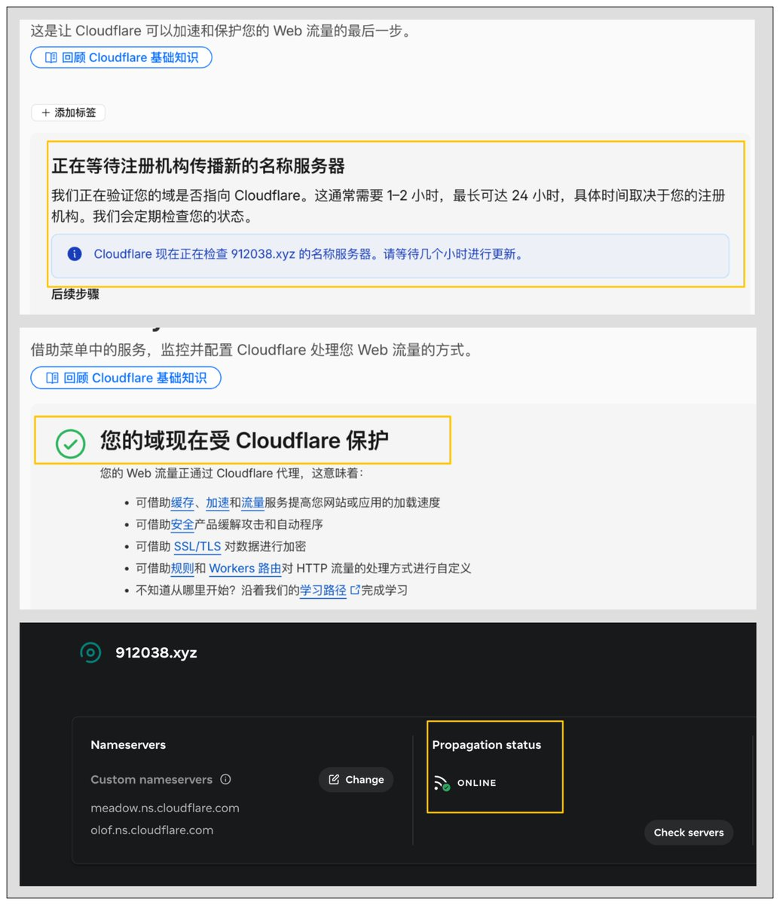

小结：我们完成了域名接入和 DNS 解析，域名已正常提供服务，可以 Ping 通你的域名测试。

## Step 3 隧道创建（[cloudflare.com](https://cloudflare.com/)）

我们域名完成注册和解析后，可以开始进行网络隧道连接器配置，在 CF 控制台按以下图示操作：

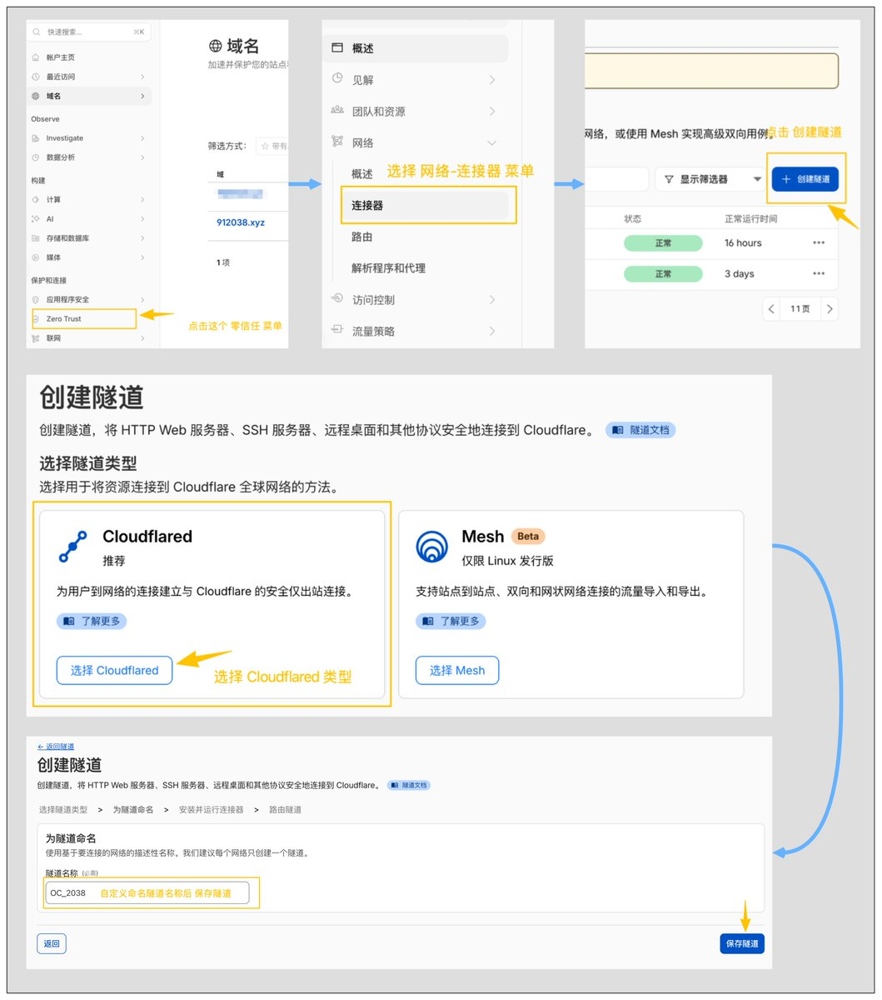

保存隧道后这里补充说明一下，需要复制这个令牌秘钥，最好在本地文本编辑器中保存一下，以防丢失。按照 以下图示配置 子域名、目标域名、服务类型、服务URL，其中 URL 必须设置为 localhost:8001（不要改！不要改！不要改！），记录保存完整主机名。

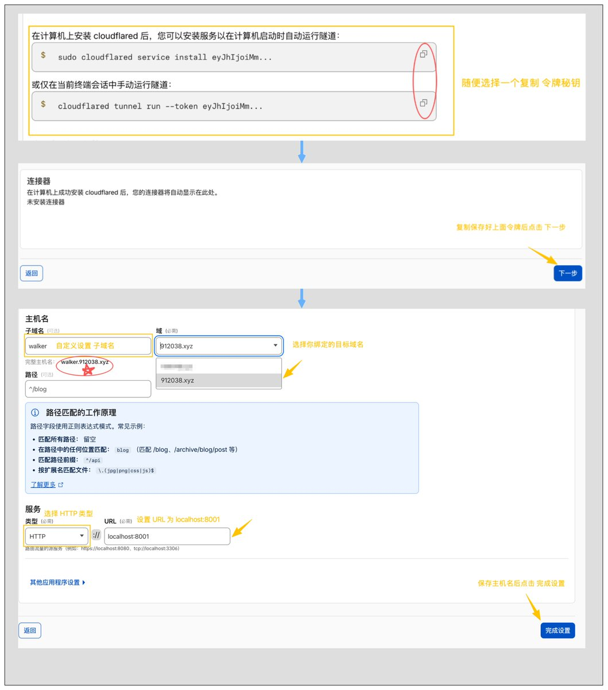

小结： 我们完成了网络隧道创建，最终产出并暂存了以下两个内容： 

a、子域名完整主机名：[walker.912038.xyz](https://walker.912038.xyz/)
b、Cloudflared 应用服务令牌秘钥

## Step 4 基于 GitHub 本地化应用设置并编译 

> 再次补充说明一下，我图示内容仅限于交流学习，请大家一定详细阅读开源项目须知和协议！ 

开源项目：https://github.com/eooce/nodejs-argo 
请自行阅读 README.md 知悉一些项目情况和部署说明，直接开始操作：

- fork 应用到自己 Repo，并重命名应用名称，移除原项目 Description，主要是避免同源项目，防止被 GitHub 风控

- 应用 fork 到本地后删除 README.md 文件

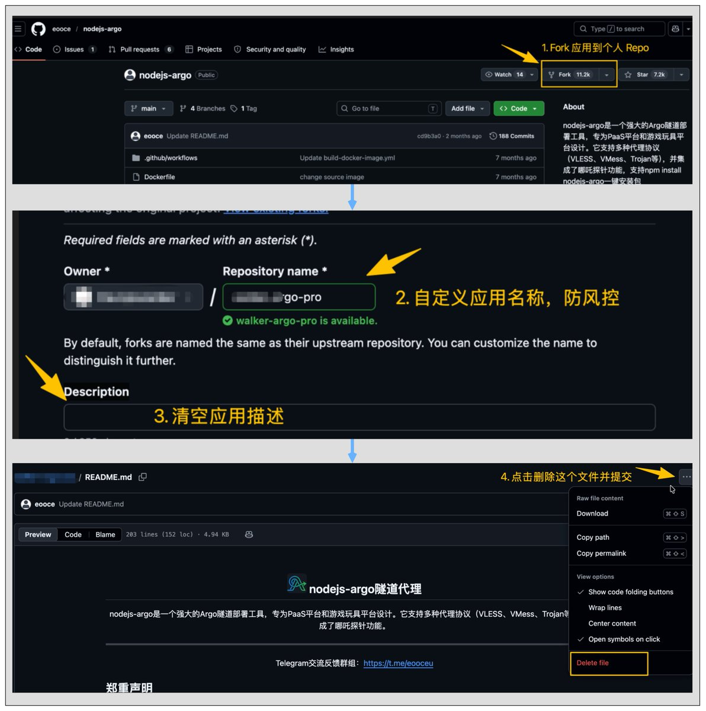

- 点击 build-docker-image.yml，修改第 42 行 末尾配置：

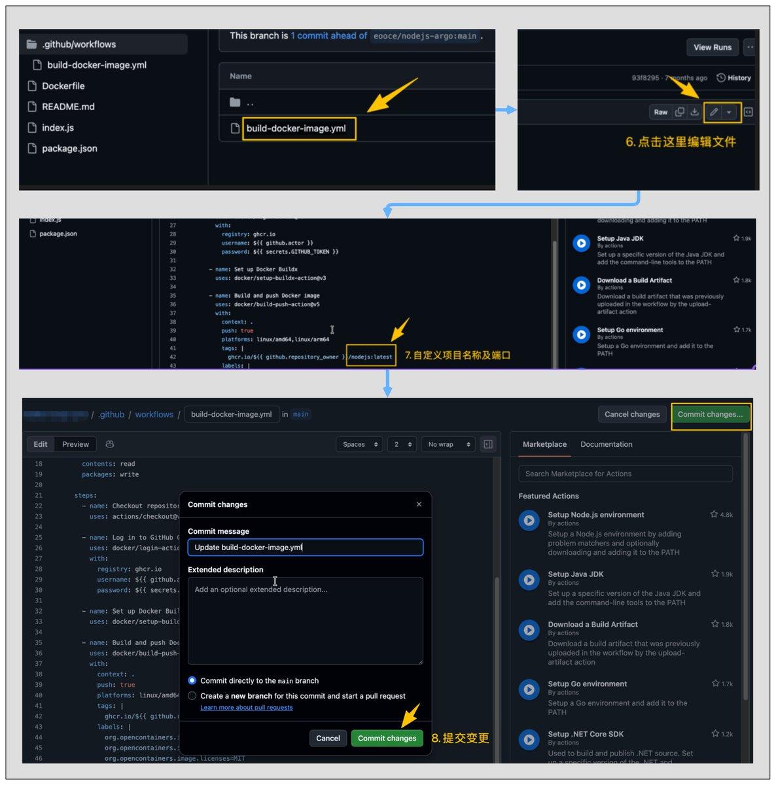

- 第 42 行代码修改示例：

\`\`\`bash
\# 修改名称及端口号
ghcr.io/${{ github.repository\_owner }}/pro\_name:port

\# 示例：walker:9878
ghcr.io/${{ github.repository\_owner }}/walker:9878
\`\`\`

- 点击 index.js 文件，按以下提示修改代码： 

\`\`\`bash
\# 总共四个修改点：

\# 1. 修改第 15 行 值内容 UUID，UUID 生成（推荐选择 UUID7）
（UUID 生成工具站：https://www.uuidgenerator.net/version7 ）

\# 2. 修改第 19 行 值内容 ARGODOMAIN，ARGODOMAIN 即隧道主机名：xxoo.xyz 

\# 3. 修改第 20 行 值内容 ARGOAUTH，ARGO\_AUTH 即 隧道令牌秘钥：eyJhIjoiMm 开头的内容 

\# 4. 修改第 24 行 值内容 NAME，NAME 即自己指定名称，我这里设置 NAME 为  'walker'
\`\`\`

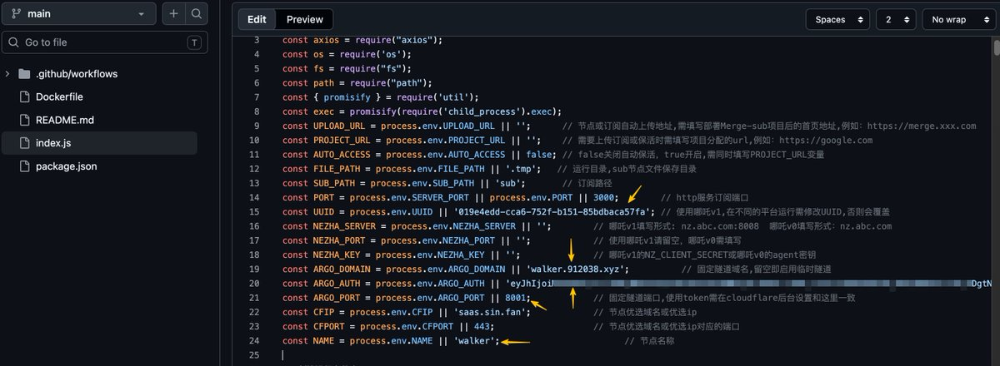

- 进行源代码混淆

全选 index.js 的内容，复制/剪切 到代码混淆工具构建混淆代码（最好在文本编辑器暂存一下复制的内容，以防内容丢失）。
代码混淆工具：https://obfuscator.io/，这里我忽略注册流程，免费套餐即可。执行后复制混淆代码，回到 GitHub，清空 index.js 内容，粘贴混淆代码，提交变更内容，如下图示：

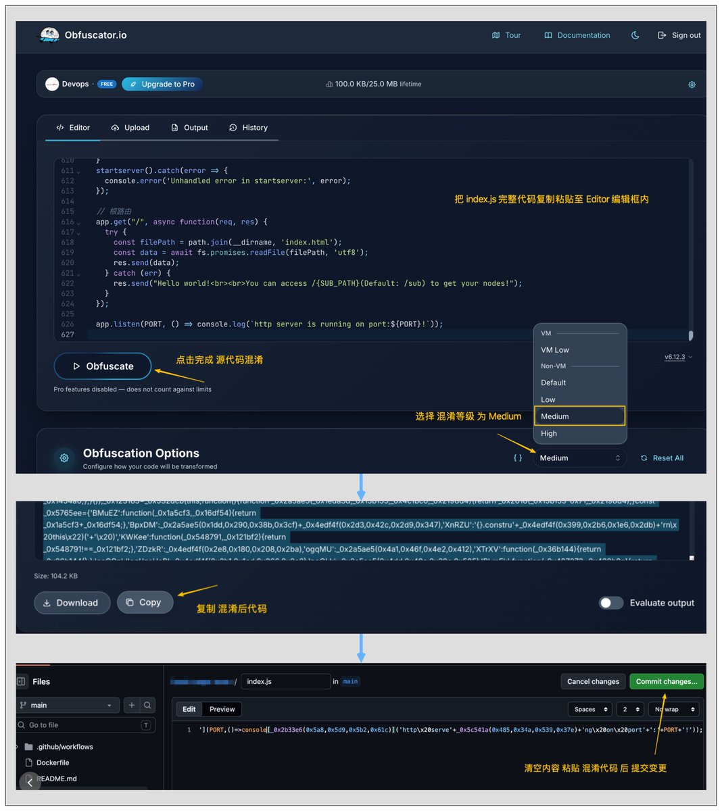

- 应用编译构建

选择应用 Action  -&gt; 左侧点击 Build and Push Docker Image -&gt; run workflow -&gt; build [✅](https://abs.twimg.com/emoji/v2/svg/2705.svg)绿标。编译成功后，回到应用 Package 进入最新制品页面 复制 Command。操作如下图示：

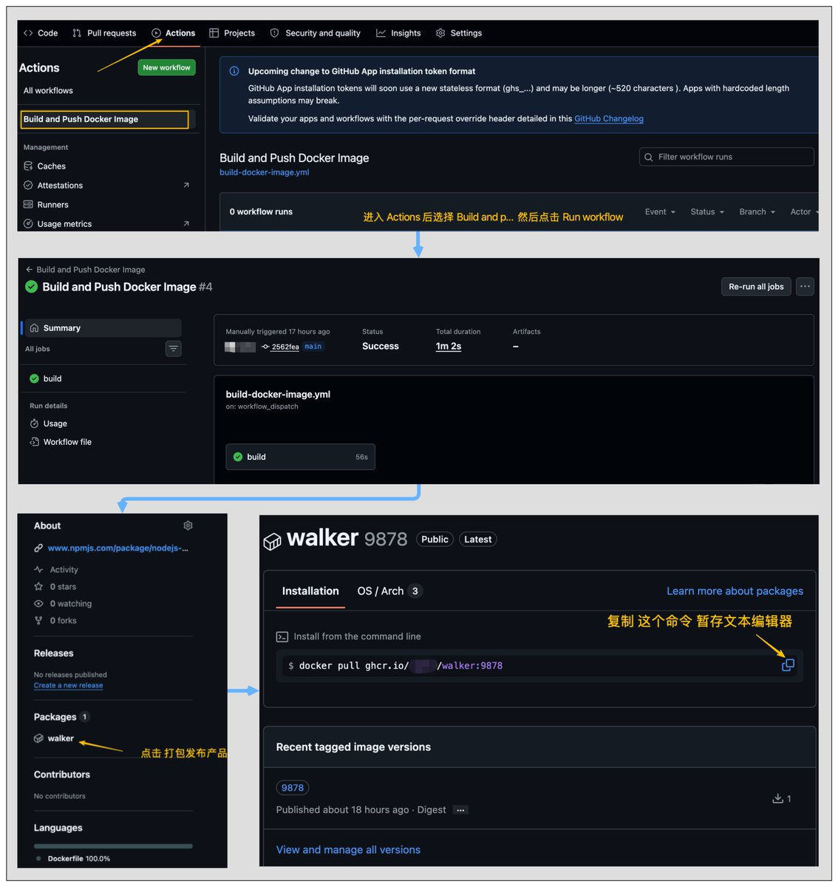

小结： 我们完成了第 4 步应用的构建编译，并生成了 docker 镜像制品，接下来就是最后的部署托管了\~

## Step 5 注册 Railway 完成应用部署托管

> Railway 是这套方案的发动机，我们可以利用新用户赠送 $5 免费试用 30 天的福利（到期了删除账号再用原账号重新注册），最终实现 0 元部署，也可以购买他们家 $5 套餐，完全够用的；

Railway 注册选择 Login with GitHub

这里有个网络要求，不要用国内网络，选择一个纯净度较高的代理网络环境（保证新手福利提示是绿色），如果是黄色或者红色，都会导致赠送 $5 试用 30 天福利失效。如果网络环境不好，建议多切换几个节点试试。

Railway 官网：[https://railway.com](https://railway.com/) 点击 Deploy  选择 Continue with GitHub，然后 同意 隐私和数据政策登录， 账号福利没问题就新建 项目，如下图示：

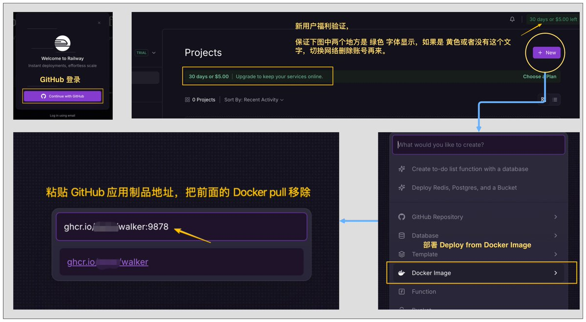

部署成功后配置应用，如下图示：
操作路径：Setting -&gt; # Networking -&gt; Generate  Domain -&gt; 选择 8080 端口 -&gt; 生成域名跳转 Hello world!

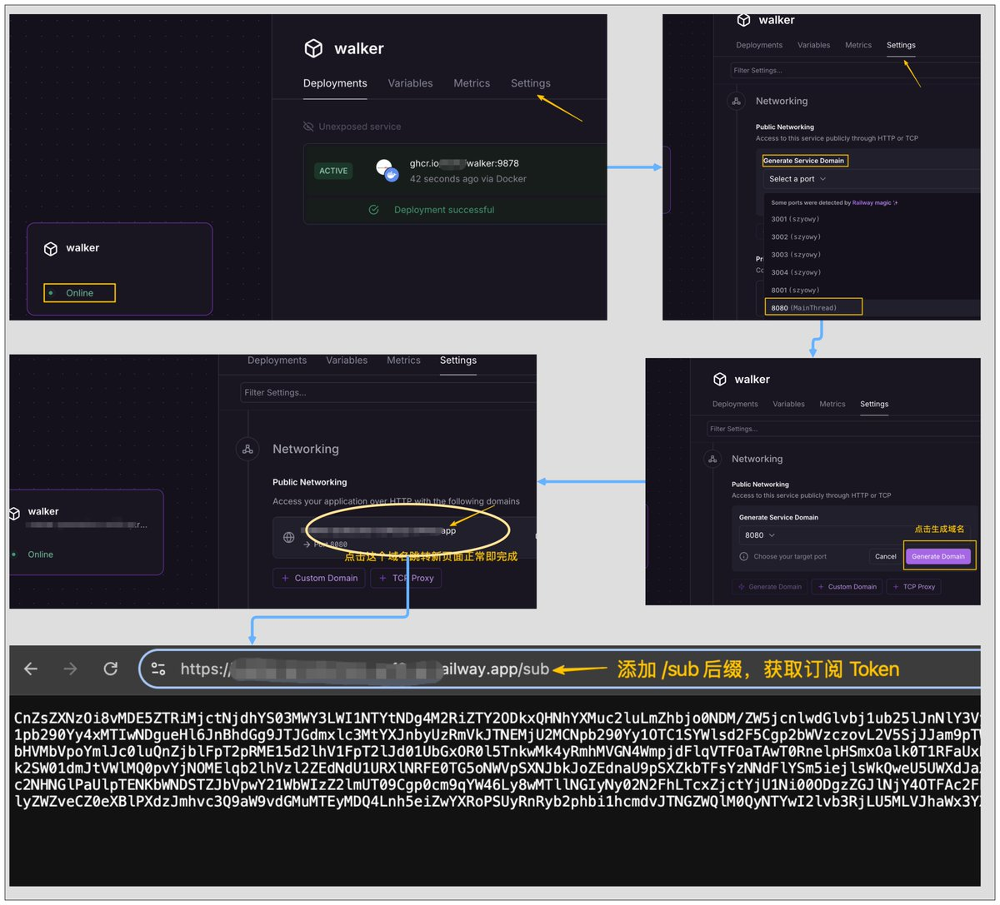

服务地区修改，可选 # Scale -&gt; Regions & Replicas

- US West 美国西部

- US East 美国东部

- 新加坡

- 欧洲

如果修改了地区或者其他设置，重新 Deploy 即可，如下图示：

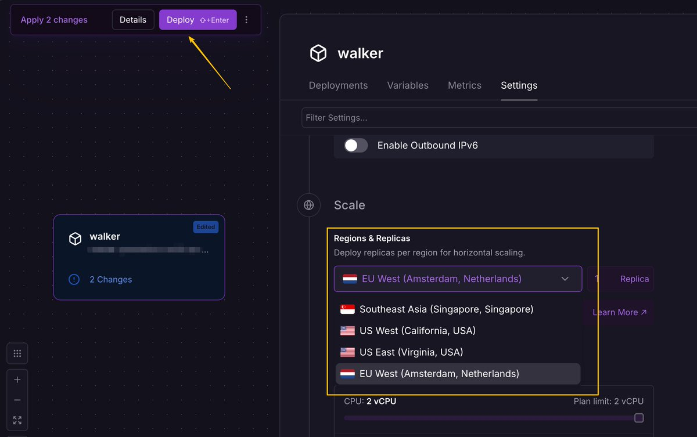

小结： 我们成功完成应用部署托管，我们最终产出了代理订阅地址，代理网络服务已经生效了，接下来只需要用代理工具订阅即可。

订阅地址：https://xxx.railway.app/sub（以实际生成的为准）。

## Step 6 下载代理工具更新订阅服务

代理工具下载：https://github.com/2dust/v2rayN/releases/tag/7.22.2，我这里 PC 端用 v2rayN，按个人习惯，只要支持 VLESS 协议即可。

- 添加订阅分组

设置别名：xxx 
可选地址（URL）：https://xxx.railway.app/sub（部署托管后生成的域名 + 加上 /sub 后缀）

- 更新订阅地址

订阅分组 -&gt; 更新当前订阅（不通过代理），测试延迟  -&gt; 测试速度，自动配置系统代理（全局-Global）等一些常规工具使用不再赘述。

操作步骤如下图示：

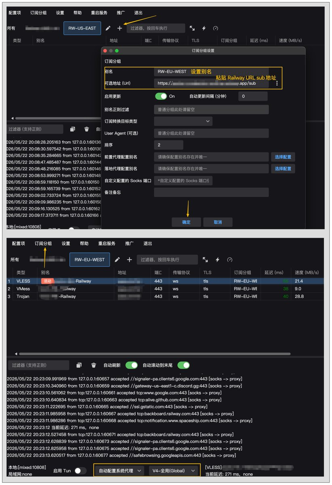

## Step 7 使用网络工具验证 IP 质量

到这里，我们整个搭建流程已经全部完结，一起去看看我们的 IP 质量如何吧\~

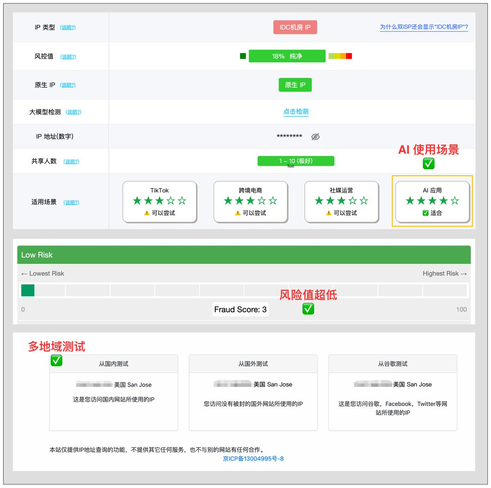

适用场景：https://ping0.cc/
多地域访问：[https://ip111.cn/](https://ip111.cn/)
风险值检测：[https://scamalytics.com/ip/](https://scamalytics.com/ip/)

整体情况来看，应该超过绝大部分机场了吧\~
如果发现 IP 质量不是很好，那就换一个区域重新 Deploy 一下，只要你有心，好运伴你行\~

## 结语

这是我第一次写长文，怕大家操作上有遗漏所以尽量用图示表达，所以文章图片比较多，如果有疑惑的地方，欢迎留言或者 Message，我都会一一回复。

我是四多，祝大家周末愉快\~

## 附录

代理原理及网络协议：不良林 YouTube@bulianglin

### 🖼️ Attached Media

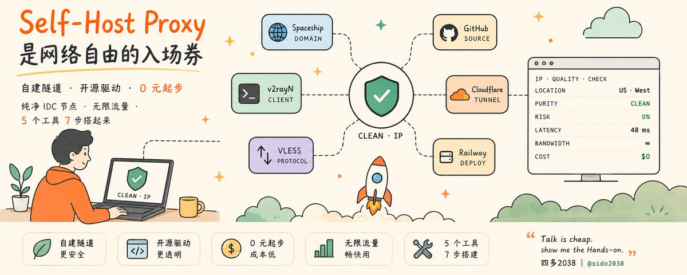

## 💬 Replies

### 1 @PierceZhang34 (omega.欧米茄.AI)

*Mon May 25 01:43:38 +0000 2026*

@sido2038 好全面的教程，任何 VPS IP 都适用这个方法变成干净IP吗?

### 2 @sido2038 (四多2038) (Author)

*Mon May 25 08:56:27 +0000 2026*

@PierceZhang34 它其实基于 Railway 的机房服务器

Railway 基本都是 Google/AWS 服务

### 3 @lanceshi8 (lance.shi)

*Sun May 24 18:08:10 +0000 2026*

@sido2038 感谢，写的太详细了

### 4 @sido2038 (四多2038) (Author)

*Mon May 25 08:59:15 +0000 2026*

@lanceshi8 感谢支持

### 5 @senjin001 (木啊$_Mua)

*Sun May 24 16:31:53 +0000 2026*

@sido2038 这种的域名开始的和直接买 VPS 有什么不一样呢？

### 6 @sido2038 (四多2038) (Author)

*Mon May 25 01:18:06 +0000 2026*

@senjin001 买 vps 需要看它提供服务器和网络的供应商

域名和 vps 是两个概念

可以先简单浏览一下

### 7 @duange6099 (程序员端哥)

*Sun May 24 12:35:56 +0000 2026*

@sido2038 干货很多啊 目前我也在看搭建个纯净IP环境 保障自己的账号的运行环境 不然容易限流

### 8 @sido2038 (四多2038) (Author)

*Sun May 24 12:38:51 +0000 2026*

@duange6099 我目前用下来 蛮稳定，主要高峰期不掉速，基本就是一个人

### 9 @kingbacktim999 (calary)

*Sun May 24 12:32:18 +0000 2026*

@sido2038 干货满满！感谢四多分享这么详细的 0 成本纯净 IP 搭建教程 实操性拉满，图文并茂，新手应该也能跟着跑通。几个小问题想请教：Railway 用完 $5 额度后，删号重注册的成功率高吗？会被风控吗？
这个方案的 IP 主要适合 Claude / GPT / Grok 这种大模型吗？长时间高频使用稳定性如何？

### 10 @sido2038 (四多2038) (Author)

*Sun May 24 12:35:25 +0000 2026*

@kingbacktim999 实测没问题

关于账号，目前成功率 100%
关于 IP 质量，主流模型我没有被封过，当然跟个人使用习惯也有关系。比如 CC，我几乎不用手机使用😂

### 11 @Soranlan (Soran)

*Sun May 24 12:39:47 +0000 2026*

@sido2038 相当保姆级了

### 12 @sido2038 (四多2038) (Author)

*Sun May 24 12:43:42 +0000 2026*

@Soranlan 部署跑起来！

### 13 @gogoalba (Andy Hu)

*Mon May 25 11:09:22 +0000 2026*

@sido2038 [xxx.railway.app/sub](http://xxx.railway.app/sub) 这个域名打不开，总是提示：无法访问此网站

### 14 @sido2038 (四多2038) (Author)

*Mon May 25 13:06:19 +0000 2026*

@gogoalba 这是一个示例网站 老哥 实际以你在 railway 部署好的地址稳准

### 15 @R7Ruk (虚惊一场。)

*Sun May 24 12:34:44 +0000 2026*

@sido2038 🐮，又省了一笔钱

### 16 @sido2038 (四多2038) (Author)

*Sun May 24 12:38:06 +0000 2026*

@R7Ruk 🤣 悄悄告诉你 可以搞两个账号 实现高可用

### 17 @aoaoao (嗷嗷镜)

*Sun May 24 12:55:49 +0000 2026*

@sido2038 纯净的环境 出海必备啊

### 18 @sido2038 (四多2038) (Author)

*Sun May 24 13:05:57 +0000 2026*

@aoaoao 真的是，静态住宅IP有点高的

### 19 @nieyunbo (tudo.best)

*Wed May 27 01:55:19 +0000 2026*

@sido2038 小火箭好像不行

### 20 @sido2038 (四多2038) (Author)

*Wed May 27 05:31:39 +0000 2026*

@nieyunbo 看下版本，小火箭 PC 版本吗？

### 21 @mrjiang1980 (MrJiang)

*Mon May 25 13:53:23 +0000 2026*

@sido2038 教程的文字部分跟图片不一致。不知道以哪个为准？

### 22 @sido2038 (四多2038) (Author)

*Mon May 25 14:20:54 +0000 2026*

@mrjiang1980 我直接发你PDF吧

### 23 @mrjiang1980 (MrJiang)

*Mon May 25 13:49:48 +0000 2026*

@sido2038 楼主很用心，但是上面有不少我不清楚的地方。端口是在哪一行修改（build-docker-image.yml的42行，  [ghcr.io](http://ghcr.io/)${{ github.repository\_owner }}/mytun:3000），还是index.js的第15行（const PORT = process.env.SERVER\_PORT \|\| process.env.PORT \|\| 3000;        
）？

### 24 @sido2038 (四多2038) (Author)

*Mon May 25 15:04:41 +0000 2026*

@mrjiang1980 具体遇到的问题，可以私聊一下

我们一起看看

### 25 @vincemask (Vince 聊开发)

*Sun May 24 12:47:58 +0000 2026*

@sido2038 好文，纯洁代理IP是刚需

### 26 @sido2038 (四多2038) (Author)

*Sun May 24 12:51:21 +0000 2026*

@vincemask 嗯，大佬肯定有自己的部署节点 这个适合动手能力强小伙伴

### 27 @iswangwenbin (AI 有两下子)

*Sun May 24 12:37:19 +0000 2026*

@sido2038 写的很用心，我还没有用过 Railway，这就去试试

### 28 @sido2038 (四多2038) (Author)

*Sun May 24 12:39:48 +0000 2026*

@iswangwenbin 操作下，我先发给两个伙伴让他们搭建都跑起来了，如果需要我可以分享更细的PDF给你哈

推特长文不让上传那么多图片

### 29 @isitinthesky (isitinthesky)

*Mon May 25 01:45:22 +0000 2026*

@sido2038 zero trust 跳到这个界面了. 

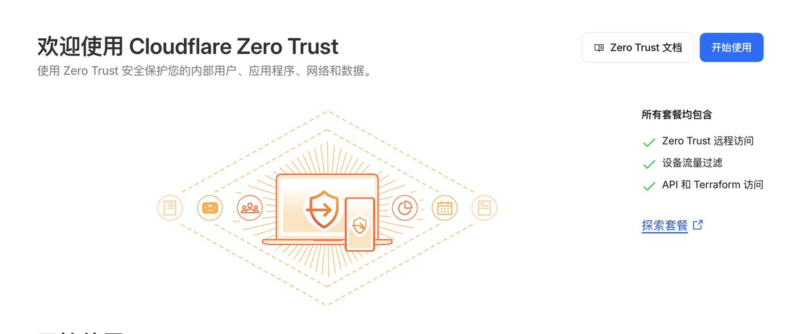

### 30 @sido2038 (四多2038) (Author)

*Mon May 25 08:54:55 +0000 2026*

@isitinthesky 开始使用\~

### 31 @sycbruce (AARON 阿龙🐉|前IT讲师的AI增长实验)

*Sun May 24 12:31:18 +0000 2026*

@sido2038 干货阿 太需要了，搞好了搞个claude

### 32 @sido2038 (四多2038) (Author)

*Sun May 24 15:26:56 +0000 2026*

@sycbruce 可以可以

### 33 @xiaoyezimama (小椰子妈妈)

*Sun May 24 13:01:53 +0000 2026*

@sido2038 好厉害啊👍

### 34 @sido2038 (四多2038) (Author)

*Sun May 24 15:26:20 +0000 2026*

@xiaoyezimama 需要的话可以尝试搭建，有问题随时问我哈

### 35 @qinlang642 (亚瑟王)

*Sun May 24 19:38:11 +0000 2026*

@sido2038 换了几次都是一片红，还不如我原来的机房ip绿😅z

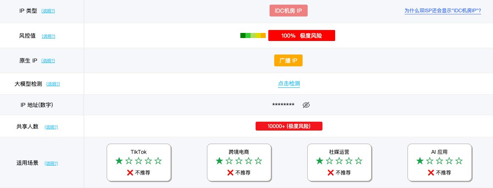

### 36 @sido2038 (四多2038) (Author)

*Mon May 25 08:53:51 +0000 2026*

@qinlang642 我多少有点不信😂

可以告诉我选的哪个地区不

