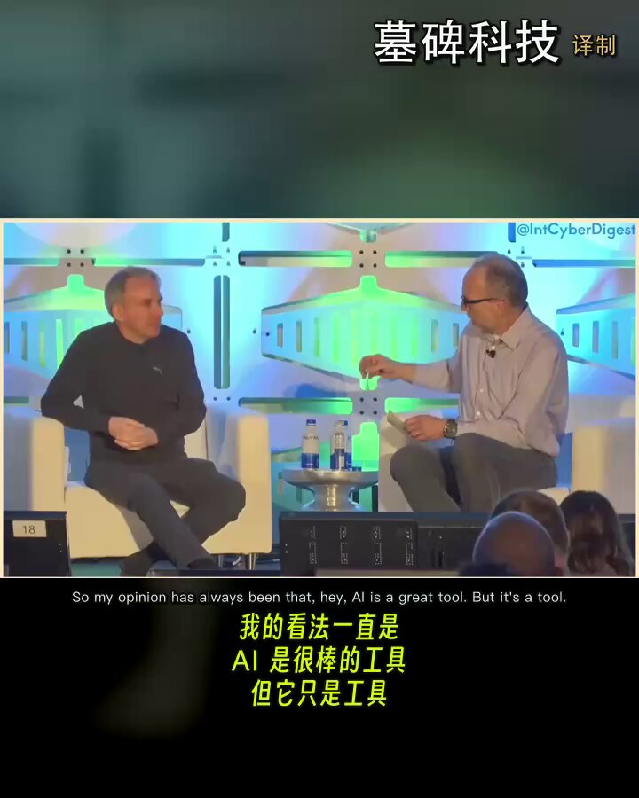

Linus Torvalds 发飙了。

他在开源峰会上公开吐槽，每次听到有人吹嘘“现在 99% 的代码都是 AI 写的”，他就忍不住生气。

为什么？
因为按这个逻辑，这些家伙 100% 的代码其实都是“编译器”生成的。
但他们怎么从来不这么说？

其实是一个道理。

老爷子在台上开始唠家常：
“我是写机器码长大的。”
注意，不是汇编语言，是真正的数字。
他到现在都记得，在 6502 芯片上，LDA 指令对应的十六进制是 A9。
当年他花了好长时间才意识到，天天人肉算跳转偏移量，简直蠢透了。

后来，人类发明了汇编器；
再后来，有了编译器；
现在，有了 AI。
这些工具都很好用，AI 正在改变编程，但它绝没有改变编程的根本。

至于 AI 带来的“效率神话”？
Linus 给出对比：
“AI 很棒，它能把你的生产力提升 10 倍。”
“但当年编译器的出现，把人类的生产力提升了 1000 倍！”

所以，这不过是又一次常规的工具演进。

事情的本质从未改变：
以前，优秀的开发者写出好代码，差劲的开发者写出 Bug。
现在，懂系统的人能用 Prompt 调教 AI 写出好代码；
而不懂系统复杂度的人，用 AI 攒出来的代码，最后一定会崩溃。

现在科技圈很流行“氛围编码”（Vibe Coding）。
就是用 AI 啪啪生成一个一次性项目，爽一把就扔。
Linus 说，这种玩具项目，AI 的确是神器。

但如果你想做点严肃的东西，做一个需要长线维护 35 年的系统（比如 Linux）。
你得懂你的 Prompt。
你必须看懂 AI 吐出来的每一行代码，甚至去盯它最底层的汇编结果。

祖师爷浇了盆冷水：
AI 可以替你省去体力劳动。
但如果你连它写了什么都看不懂，那你永远只是在制造一次性垃圾。

### 🖼️ Attached Media

## 💬 Replies

### 1 @ajs6888 (安叫兽|Bird🕊️ 🔶 BNB)

*Thu Jun 25 12:47:59 +0000 2026*

@mubeitech 编译器：合着我白干这么多年

### 2 @Timbuk4er (Timbuk4)

*Thu Jun 25 16:33:40 +0000 2026*

@mubeitech 问题是 现在vibe coding 没人做serious的东西 说话扎心的 有几个程序员 哪怕是老登 敢说自己做过真正经得起时间检验的 硬核产品

### 3 @liliangzhu (zhu)

*Thu Jun 25 15:06:57 +0000 2026*

@mubeitech 我觉得他没想清楚，用机器码编程的时代全世界可能就几千个程序员，哪怕提高了单人一千倍，对世界的影响还是有限。现在有几百万几千万的程序员，10倍的提升足以拉动GDP。

何况，还有几百万产品经理也开始写代码了

### 4 @allinspmo (Dan)

*Thu Jun 25 19:55:12 +0000 2026*

@mubeitech 他说的没有任何问题，x上之前很火的一句话：'You can't vibe code without knowing how to code', 现在有几个vibe coding出来的项目？代码都不懂在生产环境用户量上来了出了错误不是一个prompt可以解决的，适合懂代码的人创业了是真的

### 5 @GaoMaonan70419 (Jude)

*Thu Jun 25 23:34:52 +0000 2026*

@mubeitech 要求程序员懂ai写的代码以后会变得越来越不现实

### 6 @mekal_z (Mekal Z)

*Thu Jun 25 23:27:44 +0000 2026*

@mubeitech 这个‘如果’的条件框出来的除了他自己，全世界也没几个其他人了吧。

### 7 @fanfan2336 (Liszt)

*Fri Jun 26 12:33:34 +0000 2026*

@mubeitech 毕竟十几年前就开始使用”真人工智能”，让别人生成代码

### 8 @andy_chen1997 (Andy Chen)

*Fri Jun 26 04:13:03 +0000 2026*

@mubeitech 他是Linus，他說得對

### 9 @blanplan (BlanPlan)

*Fri Jun 26 16:31:37 +0000 2026*

@mubeitech 很好的观点，果然姜还是老的辣，看问题就是不一样。

### 10 @mbox_dev (上来透口气)

*Fri Jun 26 01:00:09 +0000 2026*

@mubeitech 很有启发 对底层cpu而言 Ai没有改变任何东西 ai只是改变了写代码的方式。如果一个系统需要维护几十年 除了当下正确性 还有长期可维护性

### 11 @psycipher (Cifer)

*Fri Jun 26 01:02:27 +0000 2026*

@mubeitech 实话啊

### 12 @ZHENXINYU (Rocky)

*Fri Jun 26 01:34:23 +0000 2026*

@mubeitech AI是屎山代码的加速生成器

### 13 @mryuanlab (Mr. Yuan)

*Fri Jun 26 21:55:04 +0000 2026*

@mubeitech 扎心了，现在的问题不是看不懂代码，而是开发时间被压缩，快速迭代，让你没时间一行一行看代码

### 14 @AwesomeGmg (Awesome GMG)

*Fri Jun 26 05:31:12 +0000 2026*

@mubeitech Linux这里就露怯了，还是隔行如隔山。机器代码和任何其他语言都是形式语言，不是自然语言。从来没有任何一个编译器能够编译自然语言。

### 15 @alto_legal (Lord Chancellor)

*Fri Jun 26 14:14:32 +0000 2026*

@mubeitech 这说的太对了，AI能编程，但人得能看懂

### 16 @dvd_token (Baysky)

*Thu Jun 25 18:07:52 +0000 2026*

@mubeitech 他和发明马车人的评价蒸汽机和电力一样
他不懂AI写出来的东西不等于其他人也不懂
而且AI的结果一样可以验证和改进
很多时候从无到有到有是最难的
爽一把就扔有什么不可以
以前爽一把要十年和经验
现在只要有主意天天可以爽有啥不好

### 17 @raygogooo (LW_7603)

*Fri Jun 26 12:54:32 +0000 2026*

@mubeitech 这波我听祖师爷的

### 18 @2HkdwX4z0hZoUBp (Fuzzy)

*Fri Jun 26 07:08:55 +0000 2026*

@mubeitech 醍醐灌顶，说的太好了

### 19 @kavguodawei (kavguodawei)

*Fri Jun 26 11:08:18 +0000 2026*

@mubeitech 会不会一次性垃圾让更多人慢慢深入编程世界呢？也是种进步吧，但是我们专业软件工程师应该有觉悟

### 20 @GJLMoTea (抹茶)

*Fri Jun 26 18:27:55 +0000 2026*

@mubeitech 不一定啦
我懂他的觀點
但是 這觀點 再過幾年不一定經得起考驗

"但如果你连它写了什么都看不懂，那你永远只是在制造一次性垃圾。"
=&gt; 人類現在有多少人看得懂編譯器編出來的每一行assm、底層的機器碼 呢

