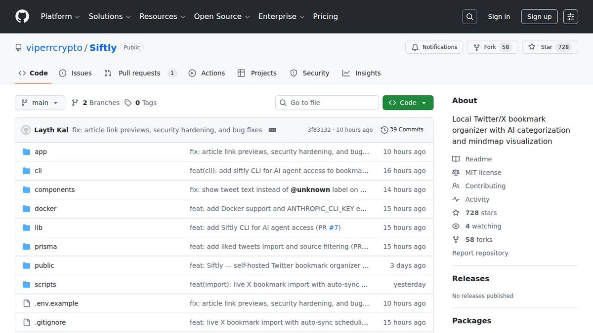

你在 X 存了多少个书签？
绝大多数人存完就再也没看过了。

有个叫 Siftly 的开源项目专治这事。
它直接把你的书签变成带 AI 搜索的知识库。

自动打标签，自动生成思维导图。
核心卖点就三个词：本地，无云，零订阅费。
数据死死锁在你的硬盘里。

刚开源，GitHub 上已经拿了 728 颗星。
只存不看，那不叫收藏，叫数字囤积症。
把死去的碎片盘活，它们才是你的弹药。

### 🖼️ Attached Media

## 💬 Replies

### 1 @xiaoerzhan (小耳👂Jane｜Xiaoer)

*Mon Mar 23 09:07:24 +0000 2026*

@mubeitech 收藏了，但是应该是从这里吃灰变到那里吃灰～～AI时代太忙了呀～～ 其实把手里的事干完就没时间了，内心还是想学的：但是学的话太多要学的了～～越多知识越觉得自己愧疚啊～～

### 2 @0xkakarot888 (0x卡卡撸特🍌🧪🤖😈)

*Tue Mar 24 03:14:14 +0000 2026*

@mubeitech 有没有把 x 书签导入到 obsidian 的工具啊

### 3 @ttx02A (x02A)

*Mon Mar 23 08:48:15 +0000 2026*

@mubeitech 这条推存了 ，大概率也不会再看一遍😂

### 4 @bebettergbl (L)

*Tue Mar 24 04:29:45 +0000 2026*

@mubeitech xie这条进入我的书签大海里了

### 5 @hoky (Hoky)

*Mon Mar 23 10:09:10 +0000 2026*

@mubeitech 这个好，做了我想做但是没做的。

### 6 @quanxituFA (全息图FA)

*Tue Mar 24 06:06:36 +0000 2026*

@mubeitech 表示书签里存的都是欲望😎 没有别的

### 7 @cielhai (cielhai)

*Tue Mar 24 01:18:20 +0000 2026*

@mubeitech 我都存到discord里边了，建了不同分类的服务器，不同类型的分组..

### 8 @Snape_Jiang (不定格)

*Mon Mar 23 13:44:48 +0000 2026*

@mubeitech 狗屎，我就是因为同样的想法，做了几乎一个性质的项目，做了七七八八了，原来已经有开源的东西了😑

### 9 @2ChainzCrypto (八娃(还网贷中目前欠款35w))

*Tue Mar 24 09:03:44 +0000 2026*

@mubeitech 默默加入了书签

### 10 @Victorn3el (Victor)

*Mon Mar 23 21:31:26 +0000 2026*

@mubeitech 我用了 然后账号被封了 这是新注册的账号 日哦

### 11 @404mindSYS (404mind)

*Mon Mar 23 11:29:16 +0000 2026*

@mubeitech ai能否让囤积的数字资料活起来？

### 12 @zyzmjun (玩个球)

*Mon Mar 23 15:41:31 +0000 2026*

@mubeitech 有视频教程吗？

### 13 @tsunami20270306 (哈机迷2026)

*Tue Mar 24 13:49:19 +0000 2026*

@mubeitech 估计这也是我的今天的第一戳灰，呵呵。

### 14 @PetrichorKeith (𝑷𝒆𝒕𝒓𝒊𝒄𝒉𝒐𝒓)

*Mon Mar 23 15:22:21 +0000 2026*

@mubeitech 这篇也进我的收藏夹吃灰去吧

### 15 @KCChen71 (KZChen)

*Mon Mar 23 11:14:11 +0000 2026*

@mubeitech 存！

### 16 @justic_hot (tang | AI Product Maker)

*Mon Mar 23 12:21:01 +0000 2026*

@mubeitech 本地+零订阅这个方向确实对。不过说实话大多数人的书签问题不是搜不到，是存的时候就没想清楚为什么要存 lol

### 17 @JonahFu (ferock)

*Mon Mar 23 09:13:09 +0000 2026*

@mubeitech 这。。。那一定是不堪入目啊！

### 18 @yiiiii888 (Yiiiii)

*Mon Mar 23 19:22:58 +0000 2026*

@mubeitech 已放入书签

### 19 @ErondeliJunior (Douglas Christy)

*Mon Mar 23 08:49:20 +0000 2026*

@mubeitech 👍 🎉 😍

### 20 @ZpvZIrs17DWEfGx (富婆可可)

*Tue Mar 24 06:49:55 +0000 2026*

@mubeitech 啊我很需要

### 21 @ethanyang57279 (ethanyang)

*Mon Mar 23 16:12:40 +0000 2026*

@mubeitech 要支持like收集就好了

### 22 @OctoberSama (十月)

*Mon Mar 23 13:27:01 +0000 2026*

@mubeitech 不赖 加书签了

### 23 @juliet_rhys (ZGSC4191069)

*Mon Mar 23 17:45:43 +0000 2026*

@mubeitech 这推也加进书签，吃灰了。

