# 📰 从领域驱动设计（DDD）到本体论（Ontology）：软件架构师视角下的一次回归


一个扎心的真实案例。

国内某大型集团企业上线了智能问数系统。业务**负责人以为大家都按照****DDD领域驱动设计方法，进行了业务建模，详细定义了实体、维度、指标和统计规则——数据库表结构、字段定义、甚至指标口径说明全投喂给了AI。** 业务负责人问："6月份新增有效客户有多少？"AI秒回：32.4万，环比增长6.7%。SQL完整，图表漂亮。

业务负责人看了一眼，说：不对，我们经营会上报的是28.6万。

技术人员调出AI生成的SQL，语法没错，表也没选错，查的是正式生产库，权限没问题。问题在哪？

继续往下查才暴露：

* AI按自然月统计，经营报表按账期统计

* AI把重新入网的客户算成新增，经营口径只认首次成为客户

* AI按账户编号去重，业务按统一客户编号去重

* AI还把内部测试号码、员工体验号码算了进去

**每一个字段都是真的，每一条数据都能在数据库里找到。** 但AI理解的"新增有效客户"，不是这家企业经营管理中使用的"新增有效客户"。

项目负责人说："看来我们缺一层语义层。"

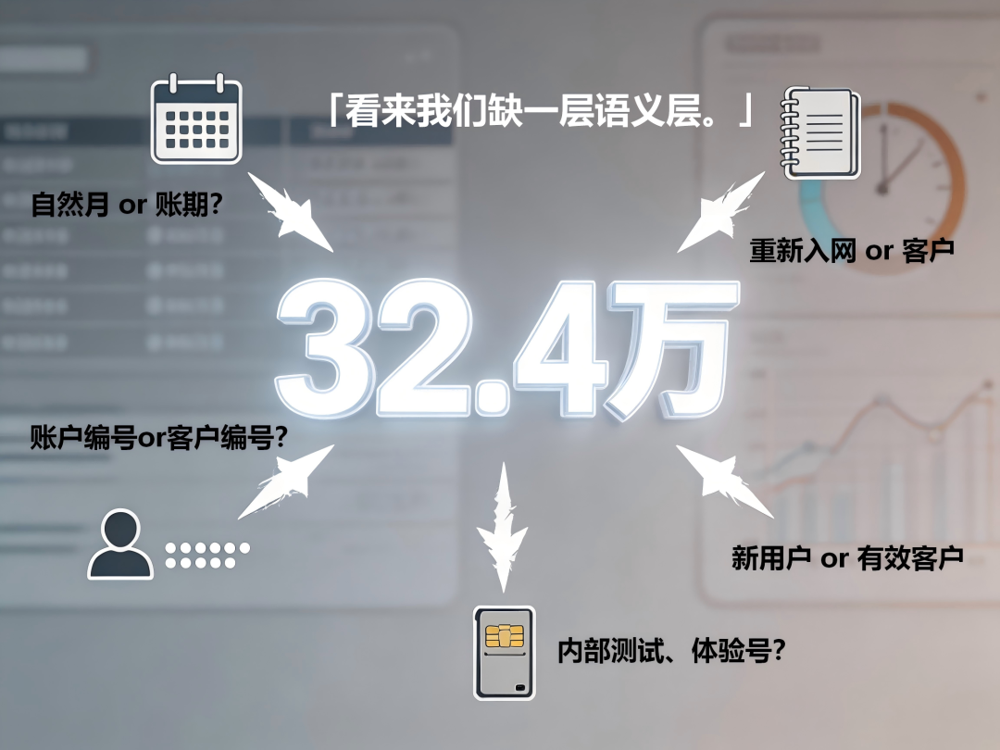

这句话没有解决问题，反而让会议更乱。BI团队说事实表维度表度量值都建好了，这就是语义层；指标团队说应该是统一指标口径；数据治理团队说业务术语元数据血缘责任人都算；AI团队说要补同义词、标准问题、样例SQL、歧义处理规则和拒答策略；做Agent的人又说还要补客户产品订单之间的关系以及可执行动作。

所有人说的都是"语义层"。但他们说的显然不是同一个东西。

这个案例揭示了一个DDD从未处理过的问题：**当执行主体从人变成机器，业务语义的"解释权"必须被正式化、结构化、机器可读，否则同一个词就是四个答案。**

很多人把DDD和本体论混为一谈。DDD的本体是Aggregate、Entity、Value Object——代码里的类和方法。本体论的本体是ObjectType、LinkType、ActionType——平台里的元数据声明。同一个词，两种完全不同的含义。

很多团队在做"DDD+AI"时，以为自己在建本体论，实际上只是把DDD模型喂给了LLM。结果呢？AI在限界上下文里跑得欢，一跨边界就犯浑——因为Bounded Context是给人画的墙，Agent不认墙，它只认prompt。

这叫用旧地图找新大陆。

---

DDD没有错。它解决了它该解决的问题：在人类主导的软件开发中，统一业务语言和代码表达。只是那个问题，和AI时代需要解决的问题，已经不是同一个。

---

## 第1章：DDD做了什么，没做什么

2003年，Eric Evans写下《Domain-Driven Design》，给出了一个承诺：如果开发者能和领域专家坐在一起，用同一套语言描述业务，软件就能忠实地映射现实。

二十年后，这个承诺兑现了一半。

DDD确实解决了它要解决的问题。统一语言（Ubiquitous Language）让业务知识从会议室走进了代码，限界上下文（Bounded Context）让复杂系统有了可管理的边界，聚合根（Aggregate Root）让事务一致性有了清晰的边界。在"人写代码、人理解业务、人维护系统"的范式下，DDD是过去二十年最有效的建模范式，没有之一。

但DDD有天花板。这个天花板不是产品质量问题，是设计对象的边界问题。

**DDD的载体是代码。** 它的实体是Java类或Go结构体，行为是类的方法，规则是if-else和断言。这些代码运行在JVM或容器里，由编译器保证语法正确性，由测试保证业务逻辑正确性，由团队内部的文档和口口相传保证语义一致性。

DDD解决的是**人和代码之间**的语义一致性问题。业务专家说"客户"，开发者写成`Customer`类，测试用例验证它的行为——只要团队内部对得上，系统就能正常运行。

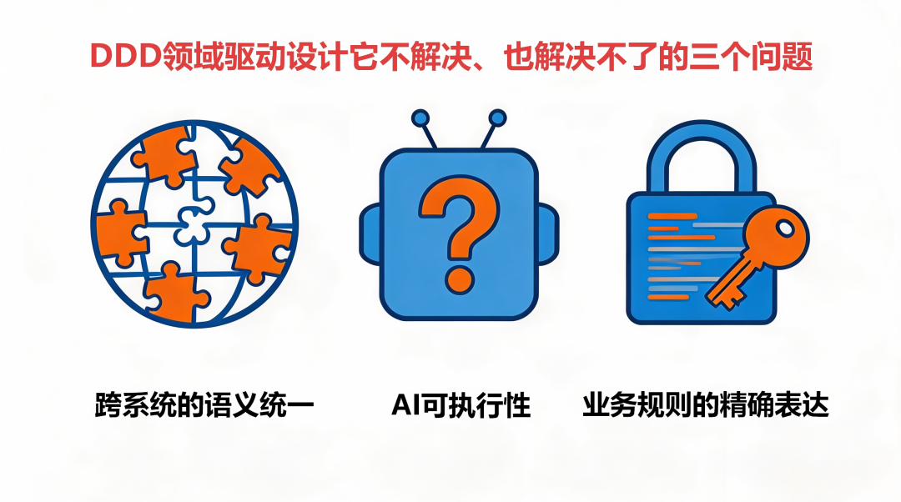

但DDD有三个它不解决、也解决不了的问题：

**第一，它不解决跨系统的语义统一。** DDD的限界上下文是边界保护机制，不是跨边界统一机制。在物流上下文里，"订单"是发货计划；在财务上下文里，"订单"是应收依据。DDD告诉你"这两个订单不一样"，但它不帮你建立"物流订单和财务订单之间的映射关系"。这个工作留给架构师用防腐层（Anti-Corruption Layer）手动完成。

**第二，它不解决AI可执行性问题。** DDD的领域模型是给人读的代码。一个AI Agent拿到你的`Customer`聚合根，它能看到的只是字段列表和方法签名——它不理解`Customer.status = 'VIP'`背后的业务含义，不知道什么时候调用`approveOrder()`，更不知道为什么`approve`之前必须先检查`creditLimit`。

**第三，它不解决业务规则的精确表达问题。** DDD的规则写在代码里，分散在聚合根的方法体、领域服务的if-else、规约（Specification）的断言中。这些规则对开发者是清晰的，但对业务人员是黑盒。当业务规则变更时，你需要找开发者改代码、跑测试、发部署。

这三个"不解决"不是DDD的缺陷，是它的设计边界。DDD是为"人建模→人编码"的范式设计的，在这个范式里，它做得很好。

但2025年之后，执行主体变了。

## 电力行业的DDD实践：三户模型

电力营销域有一个天然契合DDD的案例——"三户模型"。

"三户"指客户（Customer）、用电户（ServiceLocation/UsagePoint）、结算户（Account/Agreement）。源于电力行业国际标准IEC 61968/61970 CIM，是南方电网和国网营销系统的核心数据模型。

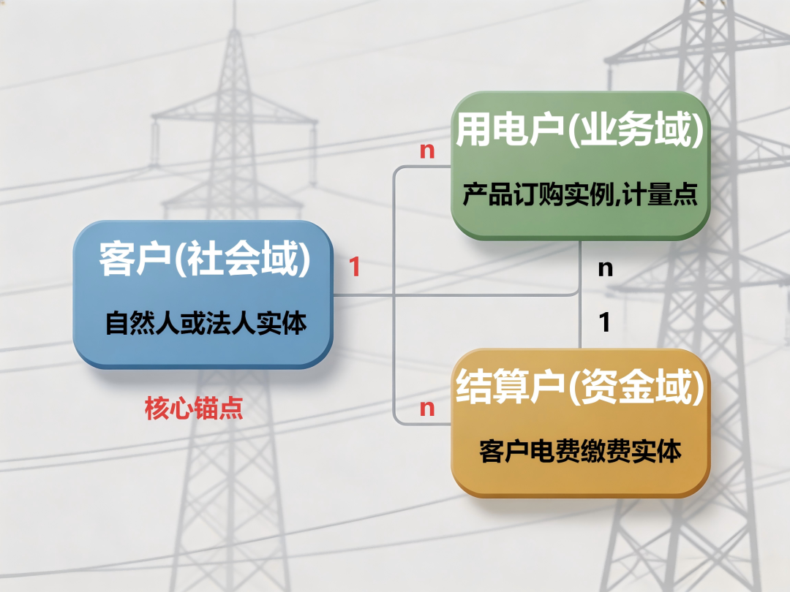

从DDD角度看，三户模型的设计几乎就是为聚合根而生的：

* **客户聚合根**：管理客户全生命周期，聚合证件信息、联系人、合同关系。客户变更不必然影响用电信息。

* **用电户聚合根**：管理物理计量点，聚合电表资产、采集关系、用电地址。电表更换不影响结算关系。

* **结算户聚合根**：管理计费单元，聚合银行账户、增值税信息、缴费记录。一个结算户可以对应多个用电户，合并计费。

三个聚合根通过ID引用松耦合，通过领域事件（`CustomerCreditChanged`、`MeterReplaced`、`ArrearsThresholdExceeded`）保持最终一致性。

某省级电网公司在2019-2021年间对营销系统进行微服务化改造，正是以三户模型为核心，通过Event Storming识别限界上下文，将单体系统拆分为客户服务、计量管理、计费引擎等独立微服务。改造后，客户信息变更的响应时间从小时级降到分钟级，计费规则调整的发布周期从两周降到两天。

三户模型是DDD在电力行业最成功的实践之一。但它解决的仍然是"人和代码之间"的问题——让营销系统的开发者、业务分析师、测试人员对"客户""用电户""结算户"有统一的理解，写出来的代码能正确反映业务规则。

**DDD让营销系统的代码理解了业务。但它没有让AI理解业务。**

这是DDD的天花板。

---

## 第2章：DDD在Agent时代的三个断裂

DDD的底层假设，在Agent成为执行主体的那一刻，开始出现结构性裂缝。

不是因为它做错了什么，而是因为它的设计对象变了。DDD是为"人类建模者"设计的——人类会阅读文档、理解上下文、遵守约定。Agent不会。

这不是渐进式优化能解决的问题，是结构性的失效。

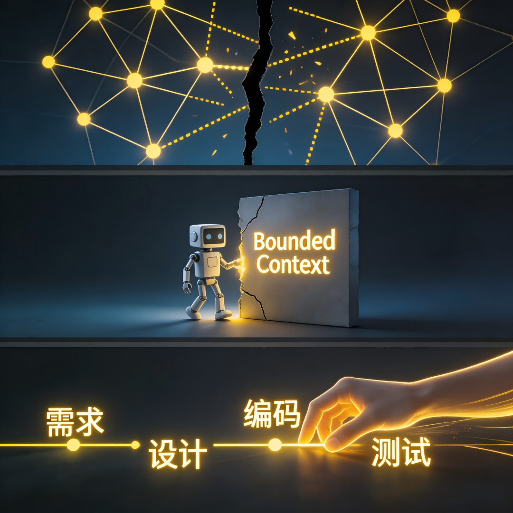

## 断裂一：统一语言失去了统一的对象

DDD的核心机制是Ubiquitous Language（统一语言）。领域专家和开发者通过协商，建立一套共享的术语体系，然后这套体系同时存在于文档、对话和代码中。

这个机制有一个隐含前提：**所有参与者都是人类，都能参与语言协商，都能理解术语背后的业务意图。**

Agent不参与语言协商。它接收prompt，输出代码，但它不理解"订单"在你的业务中代表什么——它只理解token序列的统计相关性。

更致命的是跨限界上下文。一个金融AI助手无法区分"booking"（预订）和"booking"（入账），因为两个限界上下文中的同一个词被Agent混为一谈，差点导致合规事故。这不是Agent的bug，是DDD的结构性缺陷——Ubiquitous Language假设所有消费者都是语言协商的参与者，但Agent是语言的消费者，不是协商者。

## 断裂二：限界上下文对Agent没有约束力

Bounded Context是DDD的边界机制。它告诉开发者：在这个边界内，"客户"就是这个含义，出了这个边界，"客户"可能是另一个含义。

这个机制在人类开发者身上有效，因为人类会阅读文档、理解上下文、遵守约定。

Agent不遵守约定。它不读你的领域文档，不理解你的上下文映射（Context Map），更不会在跨边界调用时主动使用防腐层（Anti-Corruption Layer）。

一个典型的涌现行为：一个优化物流成本的Agent和一个优化交付速度的Agent，各自在自己的限界上下文中运行良好，但它们的独立优化产生了冲突——一个要求低成本，一个要求高速度，最终把压力传导给了供应商。两个Agent都"正确"地执行了自己的任务，但系统层面的结果是灾难性的。

Bounded Context是给人画的墙。Agent不认墙，它只认prompt中的指令和训练数据中的模式。

## 断裂三：SDLC的阶段划分在Agent面前崩塌

DDD的实践深度绑定在传统软件开发生命周期上：需求分析→领域建模→架构设计→编码实现→测试验证。每个阶段都有明确的输入输出，每个阶段都假设人类是执行主体。

Agent打破了这种线性假设。一个AI编程Agent可以在一次对话中同时完成需求理解、架构决策和代码生成。它不需要先画UML再写代码，不需要先写测试再写实现。你给它的是一条模糊的需求描述，它返回的是一个可直接运行的微服务——包括聚合根、领域事件、Repository接口。整个过程不超过十分钟。

这导致一个更深层的问题：DDD的领域模型是"设计时"的产物，它假设模型在编码之前就已经确定。但Agent的工作方式是"运行时建模"——它在生成代码的过程中不断调整对领域的理解。设计时的静态模型无法约束运行时的动态生成，这就是执行偏差（Execution Drift）的根源。

## 一个结构性的原因

这三个断裂有一个共同的结构性原因：**DDD的建模主体是人类，而Agent时代的执行主体是机器。** 这不是一个可以通过优化DDD来解决的问题——因为优化的前提是执行主体不变。

抽象层级的差异决定了所有不同：

|      DDD 抽象栈       |      Ontology 抽象栈      |
|--------------------|------------------------|
|应用代码（Java/Go/Python）|语义层（Ontology DSL / 元数据） |
|    编程语言（OOP/FP）    |平台（Foundry / OSv2 / OMS）|
|   运行时（JVM/OS/容器）   |基础设施（数据湖 / OLTP / OLAP） |

DDD的载体是"程序"——业务模型靠源代码表达，靠编译器和测试保证一致性。Ontology的载体是"平台"——业务模型靠元数据声明，由平台保证一致性。

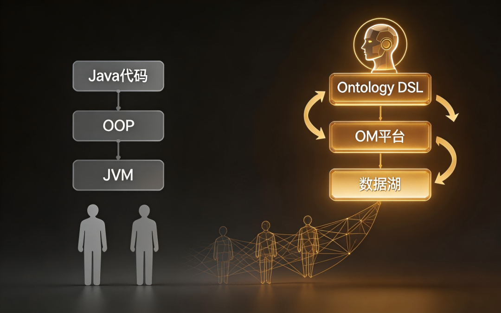

当执行主体从人变成Agent，代码不再是核心产出。Agent可以直接基于Ontology执行操作，代码只是Ontology的一种实现形式，甚至可能完全不需要。

DDD的领域模型是设计时的静态快照。Ontology是运行时的活领域模型——它随着Agent的执行不断演化，是"定义→执行→反馈→修正"的闭环。

## 所以呢

三个断裂指向同一个结论：**领域模型在Agent时代不再扮演"桥梁"的角色。**

过去，领域模型是连接业务和代码的翻译层——业务专家说"客户"，开发者写成`Customer`类，测试保证它是对的。整个链条依赖人类的理解和协作。

现在，Agent不需要这座桥。它不读你的领域文档，不理解你的限界上下文，更不会遵守你的防腐层约定。它走的是另一条路：直接从Ontology读取业务定义，然后执行操作。Ontology不再是设计时的参考文档，而是运行时的操作手册。

这不是渐进式优化能解决的问题。旧结构无法解释新现象。DDD假设"人建模→人编码"，而Agent时代的现实是"人定义Ontology→Agent执行"。整个软件交付的坐标系都在发生变化——从"设计时→运行时"的线性流程，变成了"定义→执行→反馈→修正"的持续闭环。

---

## 第3章：Palantir Foundry Ontology——七个构件的全景拆解

先放下DDD的对比视角，专心看看Palantir的本体论到底是怎么搭起来的。

## 七类构件：本体论的"积木"

Palantir的Ontology并非传统数据库或知识图谱，而是**企业业务数字孪生的语义层**。全部能力由七个不可拆分的基础构件构成，分为**静态语义层（4个）**和**动态执行层（3个）**，完整覆盖了"业务实体→属性约束→关系→计算→业务操作→外部回调"的全链路建模。

---

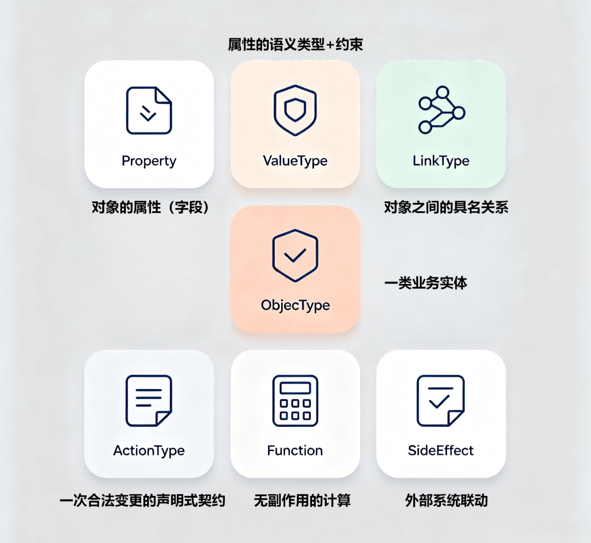

#### 静态语义层：定义世界"是什么" ####

## 1. ObjectType 对象类型（实体核心）

ObjectType是现实世界业务实体的顶层模板，对标DDD聚合根、数据库表、面向对象的Class。它定义了一类业务事物的统一范式，包含主键、名称、附属Property、关联LinkType、可执行ActionType，每条原始数据映射为一个Object实例。

核心特性：支持接口（Interface）多态建模，让多类实体复用同一套属性定义；数据可多源融合，来自ERP、营销系统、SCADA的数据统一映射到同一个ObjectType；自带对象视图（Object View），一键展示实体所有属性、关联对象、指标和流程。

以电力行业三户模型为例：`客户Customer`、`计量点UsagePoint`、`结算账户SettlementAccount`就是三个核心ObjectType。每一个ObjectType独立管理自己的数据生命周期，通过LinkType松耦合关联。

## 2. Property 属性（实体特征）

Property是ObjectType的字段/特征，对标DDD实体属性、数据表Column。它描述实体的静态状态，**必须绑定ValueType**实现语义约束，支持共享属性（多个ObjectType复用同一套属性定义，统一口径，不像传统开发里每个表的`customer_name`各有各的长度和格式）。

电力行业示例：客户对象的`客户姓名`、`开户日期`、`用电容量`、`联系邮箱`就是Property。分类上，有原生属性（来自底层数据源直写）、衍生属性（由Function计算生成，实时联动关联对象数据）、数组/结构体属性（存储地址、多联系方式等复合字段）。

## 3. ValueType 语义约束类型（数据标准化的核心）

这是Ontology和传统数据库最本质的区别之一。数据库里，一个字段的类型就是`string`、`number`、`date`——你能约束的只有长度和格式。但ValueType为Property、Function入参、Action参数附加了**业务语义+强校验规则**。

一句话区分：`string`只是字符串，`Email`是带格式校验的ValueType；`decimal`只是小数，`电费金额`是带币种、正负区间约束的ValueType。

ValueType内置了自定义约束能力：长度限制、取值区间、正则匹配、枚举值、单位标注、行业编码规范（如电网IEC设备编码）。一套ValueType全本体生效，一处修改所有关联字段自动统一校验——这解决了"同一个"电压等级"在12个系统里有12种写法"的问题。

我第一次看到ValueType这个设计的时候，脑子里只有一个念头：这不就是我们在数据治理会上天天打架的那个"字段口径"问题吗？Ontology用一个ValueType，三行声明搞定。你想想看，以前要做数据标准化，先开三次协调会、再拉一个治理委员会、最后搞一个臃肿的MDM项目。现在直接写在平台里，Agent跟你一样认这个标准。

电力场景典型示例：

* `IEC设备编号`：固定16位数字正则约束

* `电压等级`：枚举{10kV, 35kV, 110kV, 220kV}

* `电费金额`：decimal，最小值0，保留2位小数

## 4. LinkType 链接类型（实体关系图谱）

LinkType定义两个ObjectType之间的关联关系，对标ER模型外键、DDD实体关联、知识图谱谓词。它不是外键——外键只是数据库里的一个字段值，LinkType是一等公民：带语义、带基数（一对一/一对多/多对多）、可携带属性（对象化关联）、可参与查询和Action。

一个关键能力是**全域图谱遍历**：从客户→计量点→电表→线路→变电站，一键穿透查询，不需要写多层JOIN。

电力示例：

* `拥有计量点`：Customer → UsagePoint，一对多

* `归属变电站`：Transformer → Substation，多对一

* `合并计费`：UsagePoint → SettlementAccount，多对一

---

#### 动态执行层：定义世界"能做什么、怎么算、如何联动外部系统" ####

## 5. Function 纯计算函数（无副作用逻辑）

Function是只读、无状态、不修改任何数据的计算逻辑，对标DDD领域服务、BI度量指标。核心规则：仅读取本体对象/属性做运算，**不会修改任何Object、Property、Link**；输入输出全部绑定ValueType，自动校验参数合法性。

两大使用场景：一是衍生属性——自动计算`当月用电量 = 本期读数 − 上期读数`；二是指标口径统一——全局电价公式、线损率、户均用电量，全业务线复用同一计算逻辑，不会出现"财务算的线损率和调度算的线损率是两套公式"。

与Action的核心区别：Function只计算不写入数据，Action会修改实体数据。

## 6. ActionType 业务操作契约（可写事务）

ActionType是面向业务人员的标准化操作模板，是Ontology中唯一能**修改实体、属性、关联关系**的构件，对标DDD领域操作、聚合行为。

完整组成包括四部分：（1）参数定义（绑定ValueType自动校验）；（2）前置校验规则（权限、业务规则拦截——比如欠费状态下不允许变更计量方案）；（3）事务变更逻辑（新增/修改/删除对象、增删解绑Link）；（4）可绑定SideEffect外部回调。

电力场景示例：`变更用电容量`、`客户销户`、`新增计量点`。

一个容易被忽视的价值：所有业务操作可审计、可权限管控、一键同步下游系统。这意味着数据分析洞察到业务落地执行的闭环，在同一个平台内完成——不用"在BI里发现问题→截图发群里→找业务系统操作员手动处理"。

说实话，就这个闭环，我在企业架构圈喊了快十年。以前是"架构图上画闭环，落地靠微信群"。ActionType+SideEffect第一次让我看到，闭环可以在平台层强制生效，而不是靠流程制度。

## 7. SideEffect 副作用回调（外部系统联动）

SideEffect是Action事务执行成功后触发的异步外部动作，对标消息通知、Webhook、第三方系统写回、告警推送。它是本体打通内外异构系统的桥梁。

触发时机：Action事务提交、本体数据写入完成后异步执行。典型使用类型：消息通知（推送工单、短信告知客户业务变更）、API写回（同步操作至营销系统、电网生产系统、财务ERP）、事件流推送（发送Kafka事件供下游数据流水线消费）、全链路审计（记录完整操作流水，留存变更日志）。

一个关键设计优势：本体事务与外部调用解耦。外部接口调用失败不会回滚本体数据，支持重试和死信队列容错——这个特性在电力这种高可靠性场景下至关重要。

---

#### 七大构件整体协作：电力新增客户案例 ####

拿一个完整的电力新增客户场景，看七个构件怎么配合：

## 1. **ObjectType** = `Customer`（客户）、`UsagePoint`（计量点）定义实体模板

1. **Property** = `姓名`、`用电地址`、`用电容量`，绑定对应ValueType（手机号、电压等级枚举）

## 3. **LinkType** = `客户拥有计量点`，建立一对多关联关系

1. **Function** = `预估电费计算`——只读计算逻辑，基于用电容量和电价表算出月预估电费，不修改数据

2. **ActionType** = `新增用电客户`——执行前校验证件有效性、用电容量是否在合理区间、该地址是否已有在用的计量点；校验通过后批量创建Customer + UsagePoint对象

3. **SideEffect**：Action事务提交成功后异步触发——同步客户数据至营销系统、推送开户短信至客户手机、写入操作审计日志

这个协作链路的价值在于：**每一步都有明确的语义约束和边界。** 不是靠prompt提醒Agent"别忘了校验证件"，而是ActionType声明的前置校验规则硬性拦截。不是靠开发者记得"开户后要同步到营销系统"，而是SideEffect自动触发。

---

## 第4章：DDD与Ontology——不是替代，是融合

拆完了七构件，回到那个必须回答的问题：本体论和DDD到底是什么关系？

## Ontology 构件 × DDD 核心概念对照

先来一张对照表。你一看就知道：表面上概念对得上。

|Palantir Ontology 构件|        DDD 对等概念        |
|--------------------|------------------------|
|     ObjectType     |   聚合根 Aggregate Root   |
|      LinkType      |    实体关联 / 限界上下文内部关系    |
|      Function      |  领域服务 Domain Service   |
|     ActionType     |       领域操作、聚合行为        |
|     SideEffect     |   领域事件 Domain Event    |
|     Space（本体域）     | 限界上下文 Bounded Context  |
|   全套Ontology语义定义   |统一语言 Ubiquitous Language|

对得上归对得上，底下的机制完全不同：

* DDD的"统一语言"是靠团队约定生效的——有人离职、换项目组，约定就丢了。Ontology的"统一语言"是靠平台声明强制的——写在系统里，Agent来读、Agent来执行，不存在"忘记约定"这回事。

* DDD的"领域事件"是应用层发布的消息，靠Event Bus投递，需要自己处理重试和幂等。Ontology的"SideEffect"是平台内置的标准化副作用，自动触发、自动重试、失败不滚回本体数据。

## 逻辑深度 vs 语义广度：双维建模

如果把软件建模比作建房子：

**DDD范式**——怎么把一间房装修得宜居。关注空间布局、水电管线、采光通风。它的强项是"逻辑的深度"：在限界上下文内构建精确的业务规则，确保代码忠实反映业务意图。

**Ontology范式**——怎么让这座城市的所有房子说同一种语言。关注路网规划、建筑标准、地址编码。它的强项是"语义的广度"：通过ObjectType、LinkType、ActionType构建跨系统的全局知识图谱，确保不同系统对"客户""资产"拥有统一的定义、权限与审计链路。

误用二者的典型代价：用DDD做全企业模型→架构僵化；用Ontology做纯应用框架→过于沉重。

## 七构件方案对比传统建模的五项工程价值

| 维度 |   传统ER/DDD    |      Ontology七构件       |
|----|---------------|------------------------|
|语义统一|   各系统独立字段口径   | ValueType全局复用，一处修改全生效  |
|建模模式|数据库模型+代码+BI三套体系|    实体/关系/计算/操作一体化声明    |
|AI兼容|给AI看表结构，AI猜业务含义| AI直读Ontology，知道约束和关联路径 |
|执行闭环|  洞察归洞察，执行归执行  |Action+SideEffect打通数据→行动|
|可治理性|    日志事后追溯     |版本管理+细粒度权限+全链路审计（结构级设计） |

DDD把模型写成代码；Ontology把模型写成平台声明，必要时再补充代码（Function）。当执行主体从人变成Agent，声明式的优势会越来越明显——因为Agent不读代码注释，不参加Sprint Planning，不理解团队约定。它只认平台层强制的语义约束。

## IEC CIM：电力行业的事实标准

在电力行业，本体论不是新概念。

IEC 61968/61970 CIM（Common Information Model）说到底就是电力营销域的领域本体。它定义了类、属性、关联、继承层次——和Palantir Ontology的七构件如出一辙。

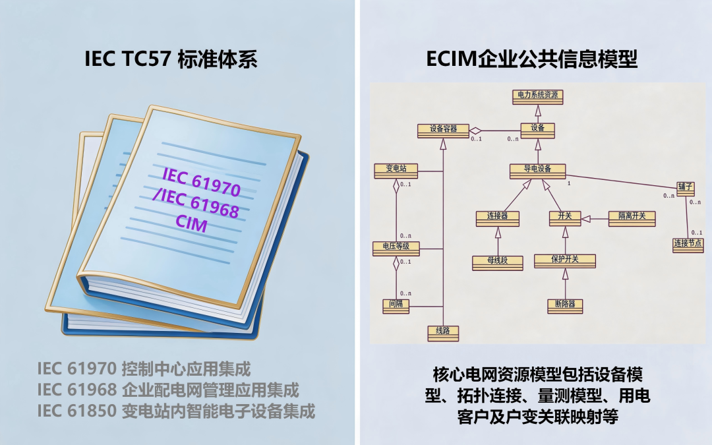

南方电网以CIM为核心构建统一数据模型（UDM），覆盖营销、财务、生产、物资全业务域。国网营销2.0的营销业务模型（MBM）实质上是营销域领域本体——将三户模型、电价策略、计费规则结构化、标准化。

这些实践说明：**电力行业一直在做本体论，只是以前不叫这个名字。** 以前叫"统一数据模型""业务对象模型""企业信息模型"。现在叫Ontology，是因为AI Agent需要机器可读、可执行、可推理的语义定义——CIM和MBM正是这种定义的事实标准。

## 从数据建模到本体论的演进

* **UML时代**：形式化语言符号，完整描述静态和动态逻辑——业务建模和技术实现打包

* **MDA时代**：PIM/PSM分离——仍在技术框架内

* **DDD时代**：只关注核心领域对象及其行为——最终仍需代码表达

* **本体论时代**：完全剥离技术实现，只关注业务建模——AI大模型让技术实现不再重要

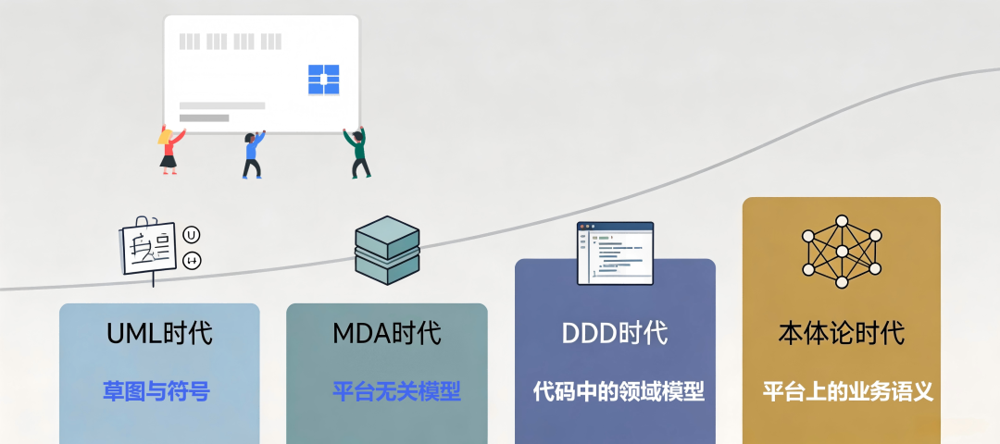

20年前尝试过规则引擎，失败了。规则从哪提取、怎么维护、怎么执行——最终还是要转成代码。

现在不同了。AI大模型让"模型即程序"成为可能。我们终于可以只关注"业务是什么"，让AI处理"怎么做"。前提是：业务模型必须达到机器可读、可执行、可推理的精度——这正是本体论提供的。

## 本体论和DDD不是对立，是互补

* DDD的限界上下文 → 对本体进行模块化划分，每个模块内部用DDD充血模型保证逻辑一致性

* 本体的概念层次 → 为DDD统一语言提供精确术语定义，解决Ubiquitous Language只在团队内有效的问题

* 本体的推理能力 → 支撑DDD聚合内不变性约束验证，把if-else变成可推理规则

* DDD的领域事件 → 通过本体事件本体化进行语义标注，让事件不仅被系统消费，还能被AI理解

**在电力行业的实践中，这种互补关系尤其明显：**

DDD解决"如何划分服务边界和组织业务逻辑"——三户模型、电费结算域的限界上下文、应收聚合与实收聚合拆分，这些都是DDD的强项。

本体论解决"如何定义和推演业务概念"——IEC CIM的结构化语义、电价策略自动推理、账单解读知识图谱，这些都是本体论的强项。

两者结合，才是电力行业"数字电网"战略的技术底座。

---

## 第5章：ChatBI七层元模型——一个完整的缩影

说一个真事。

去年有个客户找我，说他们上了ChatBI，AI答非所问。我问怎么喂的数据，他说把数据库表结构、字段定义全投进去了。我又问：你们有没有告诉AI"转化率"到底是如何定义的？他愣了。

这就是传统ChatBI的软肋——只给AI一本字典，没教它造句。

## 七层元模型

人月聊IT提出过一个七层元模型，正好用来解释DDD和本体论在AI应用里的分工。

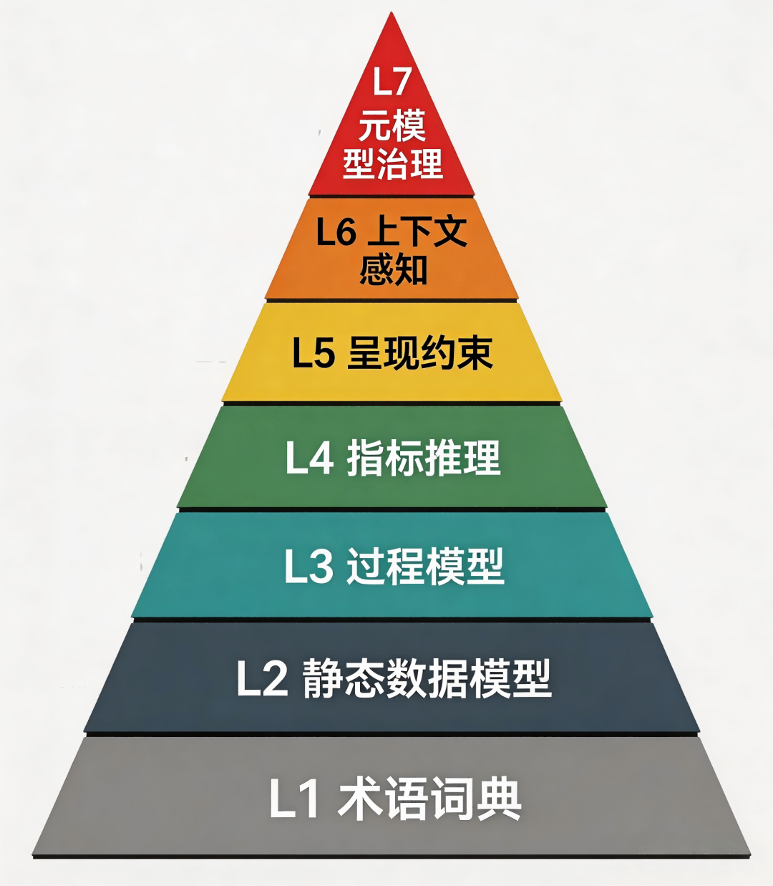

| 层 |  名称  | DDD管什么  |     本体论补什么      |
|---|------|---------|-----------------|
|L1 |领域术语词典|统一语言（团队内）|  企业级结构化语义（跨团队）  |
|L2 |静态数据模型| 聚合根+实体  | ObjectType全局声明式 |
|L3 | 过程模型 |  领域事件   | ActionType声明式契约 |
|L4 | 指标推理 |  领域服务   |  Function多端共用   |
|L5 | 呈现约束 |    —    |  SideEffect结构化  |
|L6 |上下文感知 |限界上下文（对人）|Space+权限组（对Agent）|
|L7 |元模型治理 |    —    |    本体自主迭代进化     |

这七层对应的其实是企业愿意让机器承担的责任深度，和开头案例中总结的"四种语义承诺"高度一致：

|         七层元模型         |    对应的语义承诺     |                              机器准备替谁做什么                              |
|-----------------------|----------------|---------------------------------------------------------------------|
|L1 术语词典 L2 数据模型 L3 过程模型|**第一种：模型内分析一致** |           在同一套分析模型里，事实、维度、关系和度量采用统一定义。不让不同报表开发人员各自理解底层数据。           |
|        L4 指标推理        |**第二种：跨工具计算一致** |      同一个"新增有效客户"，无论由报表、数据应用还是AI调用，都采用相同的对象、公式、时间口径、过滤条件和归属规则。       |
|   L5 呈现约束 L6 上下文感知    |**第三种：自然语言理解一致**|业务人员使用"拉新""新客""新增客户表现"等不同说法时，AI能够映射到正式定义；存在多种解释时，系统能够追问或声明口径，而不是自行猜测。|
|    L7 元模型治理 + 动作层     | **第四种：业务行动受控** |          Agent不仅能够理解指标和对象，还要按照明确的关系、状态、权限、审批、回滚和审计规则采取动作。           |

这个对照的价值在于：**七层元模型不是技术分层，是语义承诺的逐级加重。** L1到L3解决的是"数据关系怎么说清楚"，L4到L5解决的是"业务规则怎么说清楚"，L6到L7解决的是"Agent怎么在业务里安全地做事"。

每加深一层，语义错误的后果就从"数字不准"升级为"动作错误"。这也是第5章要讨论的核心：语义层的边界，不由平台叫什么决定，而由机器要替谁做什么、做错以后会造成什么后果决定。

**L1 术语词典**是Ontology的基础设施。DDD的Ubiquitous Language在团队内部有效，出了这个会议室就没人认了。本体论的术语词典是机器可读的结构化定义——"履约准时率"不是自然语言解释，是带同义词、易混淆概念、判定标准、使用场景的"业务身份证"。

**L2 数据模型**是DDD的主场，但需要补课。DDD的聚合根定义了数据结构和业务规则，这些规则写在代码里，对开发者是清晰的，对Agent是黑盒。本体论的ObjectType把这些规则声明化——谁可以改、改完触发什么、审计谁来处理，全在一张定义里。

**L3 过程模型**是最大的分水岭。DDD用领域事件记录"发生了什么"，事件是代码抛出的消息，需要业务人员反推流程。本体论的ActionType把流程定义成声明式契约——每个活动的触发条件、执行者、输入输出、业务规则全在模型里。Agent拿到这个模型，不是"猜"流程，是按图索骥。

传统的ChatBI给了AI什么？一张表结构。结果就是：AI知道有个字段叫`promised_date`，但不知道这是供应商承诺的、不是采购方承诺的，更不知道承诺之后还可以改、改完要审批。

七层元模型给AI什么？业务的完整前世今生——数据从哪来、到哪去、为什么、怎么算、给谁看、什么情况下说人话。

效果？采购订单履约准时率场景，准确率从60%跳到92%。

## 电力行业的版本：国网陕西

这个逻辑在电力行业已经被验证了。

国网陕西2026年搞了个"基于本体智能的电力市场服务数字专员"，拿了个数字中国创新大赛AI赛道全国一等奖。核心架构就是"智能体+大模型+本体"三引擎。

他们的本体做了什么？把散落的政策文件、核算规则、账单案例构建成机器可理解的结构化语义网络。给大模型的自由发挥加上"业务硬约束"。

成效：电费账单解读准确率99%+，业务处理效率提升90%+，电费异常处理从小时级缩到分钟级。

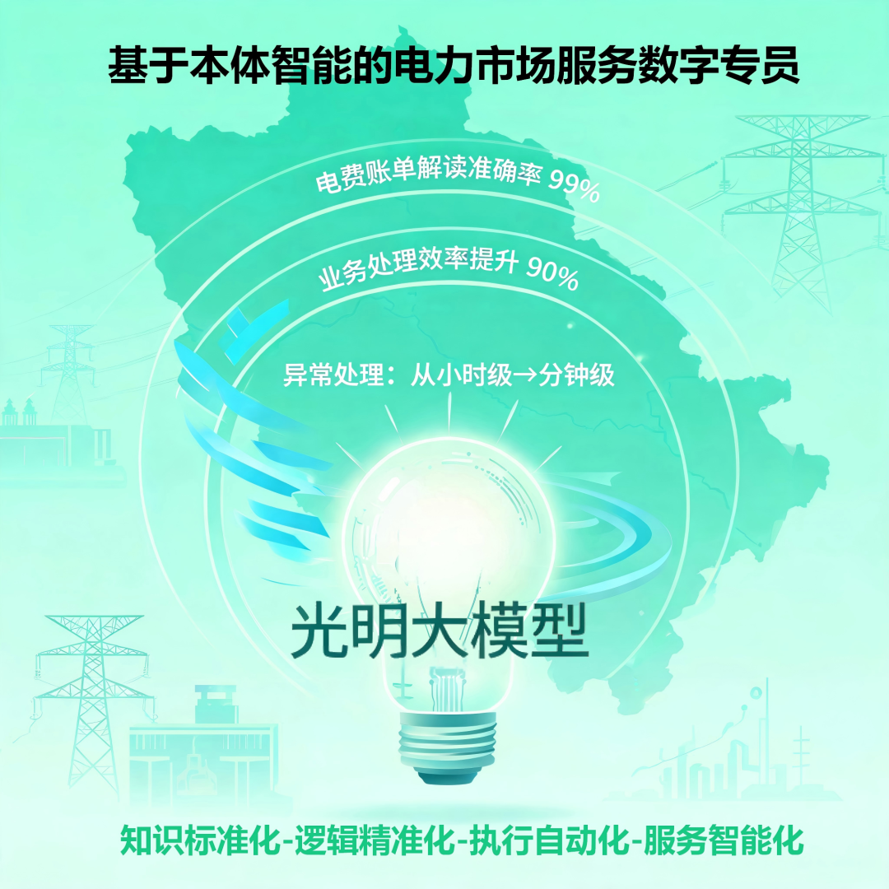

更关键的是，他们的光明大模型实现了80%以上本体自动建模——以前需要领域专家坐几个月才能建出来的本体，现在大模型先搭骨架，人精修剩余部分。这个效率变化意味着本体论从"理论正确但工程太重"变成了"工程可行"。

在国网陕西的案例中，七层元模型的落地逻辑是这样的：

**L1术语词典**：把电力营销领域的"电费""电量""电价""计费周期"等核心术语，建立结构化定义，消除多部门同词异义问题。

**L2数据模型**：以IEC CIM为基础，将客户、用电户、计量点、结算户等实体映射为ObjectType，声明字段的ValueType约束。

**L3过程模型**：把"抄表→计费→核算→账单→收费"的流程定义为ActionType序列，每个环节的触发条件、输入输出、业务规则全在模型里。Agent不是猜流程，是按图执行。

**L4指标推理**：将电价计算公式、容量电费换算等封装为Function，供Agent直接调用，确保计算口径统一。

**L5呈现约束**：标准化的账单格式、短信通知模板、报表样式——AI输出的内容直接符合企业规范。

**L6上下文感知**：区分工业用户和居民用户的查询意图，自动调整回答详略和术语使用。

**L7元模型治理**：通过光明大模型实现本体版本自动迭代，业务规则变更时本体可自助演化。

同一套逻辑，采购场景是60%→92%，电力电费场景是99%+准确率、90%+效率提升。数字不同，道理一样：给AI足够精确的业务语义，它的幻觉会大幅减少，因为约束是硬的，不是靠概率猜。

DDD解决的是"人怎么说、代码怎么写"的翻译问题。本体论解决的是"机器怎么理解、Agent怎么执行"的语义问题。ChatBI七层元模型把这两层叠在一起，正好展示了从DDD升级到本体论的完整路径。

---

## 第6章：从DDD到本体论——不是替代是升级

上一章从构件层说清楚了DDD和Ontology的关系，这一章回到实战——拿代码和配置来对比，看差异到底在哪。

DDD和本体论经常被放在对立面讨论，很多人问我"选哪个"。

这个问题本身就是错的。问"选DDD还是本体论"，就像问"选螺丝刀还是扳手"——工具不一样，拧的螺丝也不一样。

真正该问的是：你的问题到底是什么？

## 五个关键差异

把DDD和本体论的概念放在一起看，差异立刻清楚：

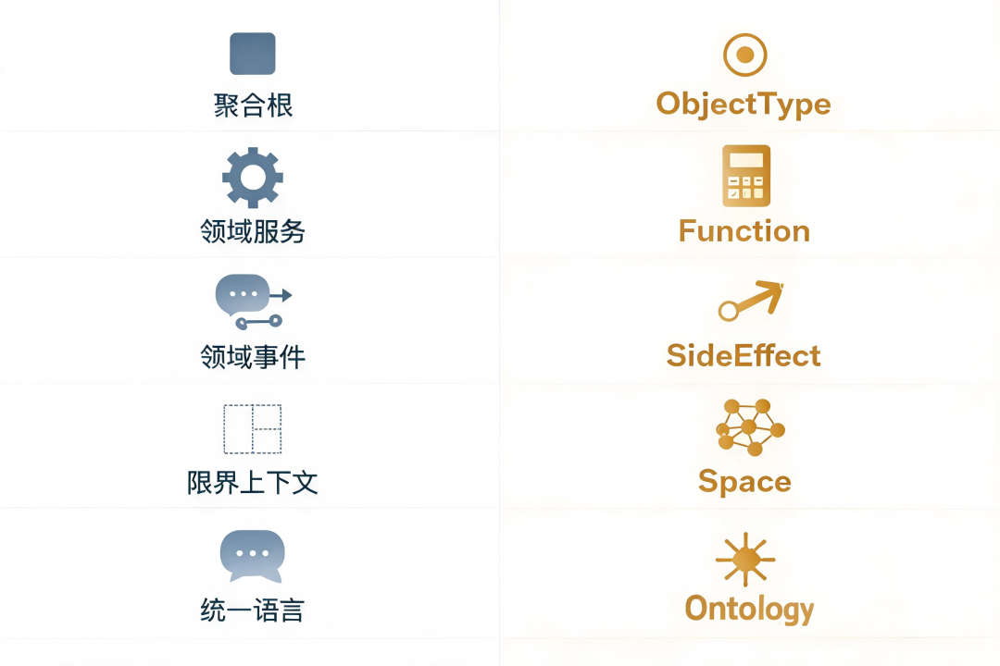

### 聚合根 ↔ ObjectType

DDD的聚合根是事务一致性边界——一个聚合根内部的所有数据修改必须原子性地成功或失败。这是为了保证"数据不会写到一半崩了"。

Ontology的ObjectType是平台一等公民，不假设强一致性边界。一致性由ActionType的原子执行来保证，不是由ObjectType自己保证。

一个管"怎么写"，一个管"是什么"。

### 领域服务 ↔ Function

DDD的领域服务是代码层面的逻辑处理单元——它运行在应用进程里，由开发者调用，依赖注入管理生命周期。

Ontology的Function是多端共用的计算微服务。它不绑定某个应用，UI可以直接调、Agent可以直接调、报表可以直接调、另一个Function也可以调。

一个只能在Java里new出来用，一个是平台级的能力节点。

### 领域事件 ↔ SideEffect

DDD的领域事件是应用层发布的消息——需要Event Bus、需要订阅者、需要自己处理重试和幂等。

Ontology的SideEffect是结构化副作用——Action执行成功之后自动触发，平台负责投递和重试，失败不影响已经落库的数据。

一个需要自己搭基础设施，一个是平台内置的标配。

### 限界上下文 ↔ Space

DDD的限界上下文对人有效——文档、代码、团队约定，靠人的理解来维持边界。

Ontology的Space对Agent有效——对象类型、权限组、安全标签在平台层强绑定，Agent跨Space操作需要显式授权，不是靠"自觉"。

一个靠文化，一个靠机制。

### 统一语言 ↔ Ontology本身

DDD的统一语言是团队术语表+代码命名——在限界上下文内有效，跨上下文就开始打架。

Ontology本身就是企业级统一语言——ObjectType的定义在全局唯一，"客户"就是那个客户，不会因为你在营销上下文还是财务上下文就变成另一个东西。

## 三户模型的两种表达

拿电力行业的三户模型举例，两种范式的差异一目了然。

### DDD的表达

```

// 客户聚合根——充血模型public class Customer {    private CustomerId id;    private String name;    private CreditLevel creditLevel;        public void changeCreditLevel(CreditLevel newLevel) {        if (this.creditLevel == CreditLevel.ARREARS                 && newLevel != CreditLevel.NORMAL) {            throw new DomainException("欠费状态下只能恢复 Normal");        }        this.creditLevel = newLevel;        addEvent(new CustomerCreditChanged(this.id, newLevel));    }}

```

这段代码对开发者是清晰的。但Agent拿到它，看到的是字段列表和方法签名——它不理解"欠费状态下不能随便改信用等级"这个规则的业务含义，只能靠prompt里的Instruction去猜。

### Ontology的表达

```

{  "ObjectType": "Customer","properties": {    "name": { "type": "string" },    "creditLevel": { "type": "Enum", "values": ["NORMAL","VIP","ARREARS"] }},"actions": {    "changeCreditLevel": {      "preconditions": [        "IF creditLevel == 'ARREARS' THEN newLevel MUST be 'NORMAL'"      ],      "permissions": ["role:CREDIT_MANAGER"],      "audit": "auto"    }}}

```

这段声明对Agent是直接可读的。它不需要理解代码，只需要知道：如果要改`creditLevel`，且当前是`ARREARS`，那只能改成`NORMAL`。平台会自动检查、自动审计、自动拒绝非法操作。

### 差异在哪？

DDD的表达是给开发者看的——精确、完整、可编译，但需要先理解才能操作。

Ontology的表达是给Agent看的——结构化、可解析、带权限和审计，Agent直接执行，不需要中间翻译。

## 电力行业的实际路径

国内电力行业都在走同一条路：DDD画服务边界，本体论建语义底座。

南方电网的"数字南网"以IEC 61968 CIM为基础构建统一数据模型（UDM），营销域的客户、用电户、计量点全部结构化定义。国网的营销2.0系统构建了营销业务模型（MBM），将三户模型、电价策略、计费规则标准化——骨子里就是DDD的服务边界划分，外面套了一层可被AI消费的语义层。

两条路最终交汇在同一点：**企业的业务知识必须被结构化地沉淀下来，才能被AI理解、被Agent执行。**

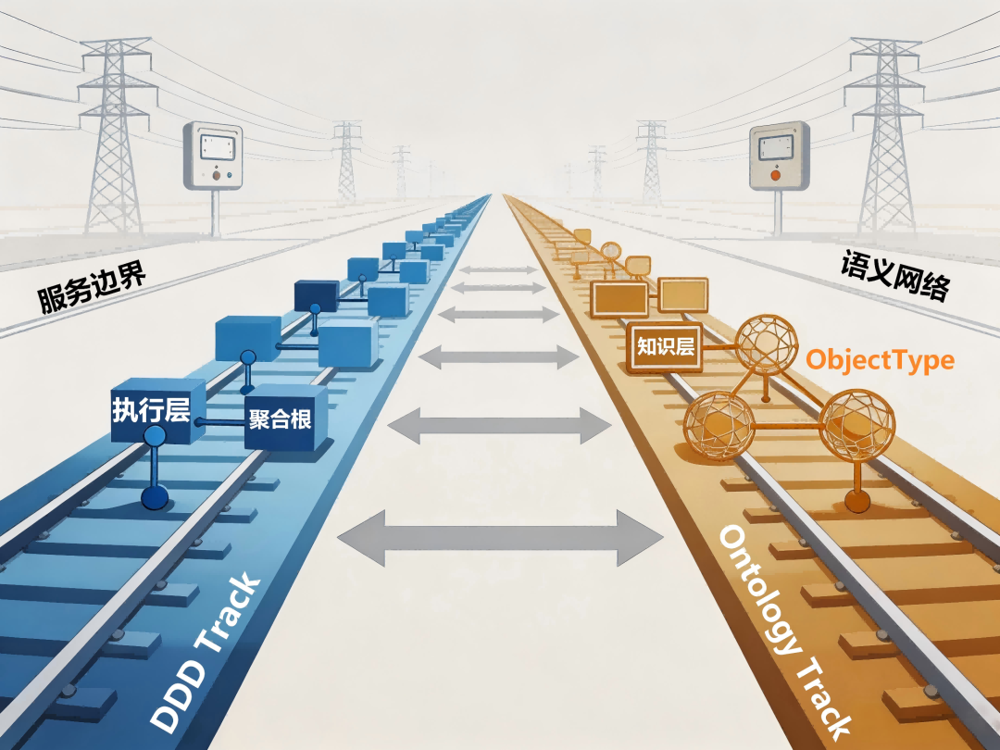

以前这个工作叫"建模"，建模完成后变成代码，代码部署后语义就开始衰减——开发者离职了、文档没更新、系统改版了，代码还在运行，但实际执行的规则和设计时已经不一样了。

本体论让模型变成"活的"——它在运行时持续被访问、被验证、被修正。Agent的每次操作都会反馈到本体，本体的每次修正都会影响Agent的行为。这是一个双向进化的闭环。

DDD解决的是"把业务翻译成代码"这个一次性任务。本体论解决的是"让业务知识持续被机器理解"这个永恒问题。

### 什么时候用哪个？

你不需要选。大部分企业级系统都是混合架构：

* 单个微服务内部的业务逻辑复杂、需要强一致性 → DDD充血模型

* 跨服务的企业级语义统一、权限治理、AI消费 → Ontology语义层

* 两者之间通过事件驱动的上下文映射衔接

**真正的误区是：** 用DDD做全企业模型。这会导致架构僵化——每个限界上下文都拼命往自己的聚合根里塞概念，跨边界的语义被拆成七零八落的防腐层，最终系统里有一百种"客户"的表达方式。

**另一个误区是：** 用Ontology做纯应用框架。这是杀鸡用牛刀——Ontology的平台代价很高，单个应用内部的业务逻辑不需要这么重的底座。

各司其职，才是正解。

---

## 第7章：架构师的新角色

当DDD的建模主体从人变成Agent，架构师的角色也在变。

不是被取代，是位移。从流水线的上游——建模，移到了整个流程的旁边——协作与审查。

## 能力迁移：从技术实现到业务建模

过去的架构师，核心能力是技术选择：选什么框架、定什么分层、怎么拆分微服务、缓存怎么配、消息队列用什么。

这些能力在新范式里没有消失，但不再是第一位的。

第一位的是**业务建模能力**——能否把一个复杂业务领域的概念、关系、规则、流程，抽象成机器可读的结构化定义。不是写代码实现这些规则，是定义规则本身。

* 过去架构师看的是：类图、时序图、部署图、接口契约

* 现在架构师看的是：ObjectType图、LinkType关系网、ActionType声明、Function依赖图

本质变化：从"怎么实现"转向"是什么+怎么做"。

## Dual-Track架构：两条线并行

未来的企业级系统，大概率是两条轨道并行：

### DDD Track（执行层）

负责"怎么做"的精确性。聚合根保证事务一致性、领域事件驱动跨服务协作、应用服务编排业务流程。这条轨道面向开发者，面向编译器和测试，面向系统的稳定性。

### Ontology Track（知识层）

负责"是什么"的统一性。ObjectType定义企业级概念、LinkType建立跨系统语义关系、ActionType声明标准化操作、Function封装可复用推理。这条轨道面向Agent、面向BI、面向未来所有需要理解业务的AI系统。

两条轨道之间通过**领域事件**和**语义映射**衔接。DDD Track里发生的业务事件，同步更新到Ontology Track的对应实例；Ontology Track里的规则变更，通过事件通知DDD Track的应用服务。

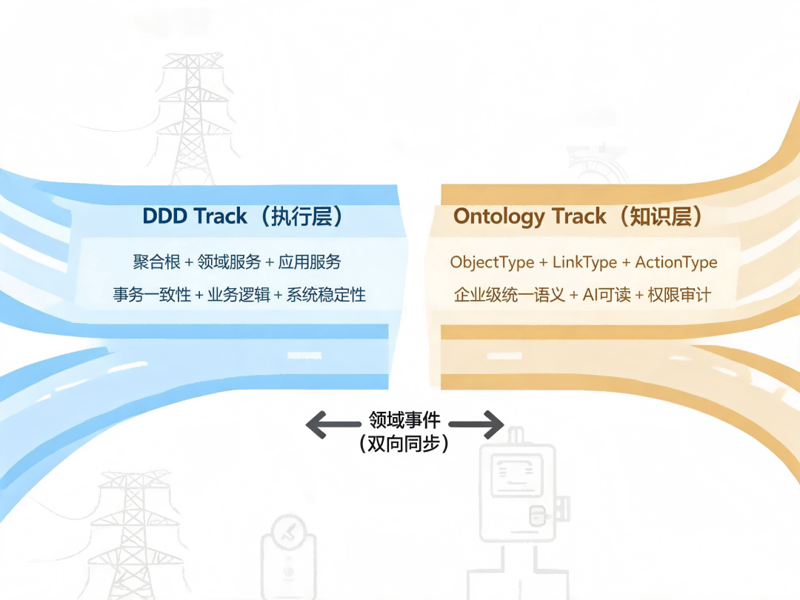

这条架构的关键认知是：**Ontology Track不是DDD Track的上层包装，是平行的知识底座。** 它不替代DDD的充血模型，而是在旁边建一套机器可读的业务语义副本。

## 国网陕西的启示

国网陕西今年做的"本体智能电力市场服务数字专员"，给架构师提供了一个可参考的落地模板。

他们的"1基+2库+N场景"：

* **1基**：昇腾AI算力底座——解决算力问题

* **2库**：电力营销全域本体知识库+业务规则库——解决语义问题

* **N场景**：电费账单解读、智能核算、政策解读、用能优化——解决落地问题

对架构师最有价值的是他们的本体构建方法：**光明大模型完成80%以上本体自动建模，人工精修剩余20%。**

以前建本体是领域专家坐几个月，现在是AI先搭骨架，人修细节。这个效率变化意味着本体论从"理论正确但工程太重"变成了"工程可行"。

还有一个信号：国网陕西计划把电费领域知识本体库**开源**。一旦行业级本体开始开源，企业就不需要从零开始建了——拿来改改就能用，成本大幅下降。

## 未来的架构师

未来的架构师不写代码，但他决定了Agent能不能理解业务。

具体来说，他要做三件事：

**第一，定义业务本体。** 把领域专家脑子里的业务知识，结构化地沉淀成ObjectType、LinkType、ActionType。这个工作要求他既懂业务又懂语义建模，是纯粹的桥梁角色。

**第二，设计语义治理机制。** 本体不是建完就完事了，它需要持续进化。谁可以改、改了怎么通知下游、Agent的操作怎么回溯、规则冲突怎么解决——这些治理机制本身就是架构设计的一部分。

**第三，搭建Agent协作框架。** Agent不是单个程序，是一群协同工作的智能体。谁负责理解用户意图、谁负责查本体、谁负责调用工具、谁负责生成答案——这些角色分工和协作流程，是新一代架构师的核心产出。

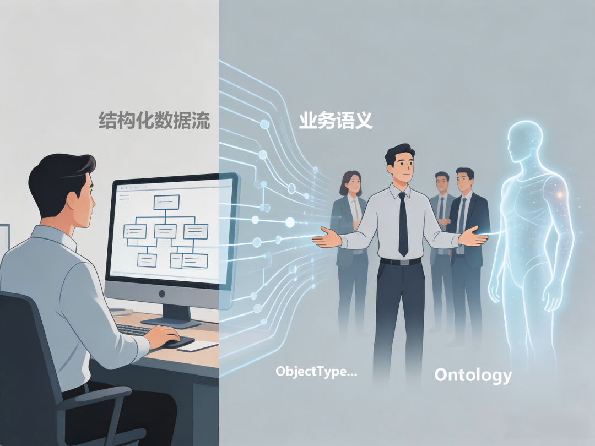

DDD时代，架构师的产出是代码和文档。本体论时代，架构师的产出是**业务语义的完整定义**和**Agent协作的运行机制**。

这不是取代，是升级。架构师从"技术决策者"升级为"业务翻译官"——把人类对业务的理解，翻译成机器可以执行的结构化语义。

---

## 第8章：展望

2003年，Eric Evans写《Domain-Driven Design》的时候，他想解决的问题是：怎么让软件忠实地映射现实。

这个目标没有变。变的是映射的方式。

DDD解决的是**人和代码之间**的语义一致性问题。本体论解决的是**人和机器之间**的语义一致性问题。

前者让开发者写的代码能反映业务专家的意图。后者让AI Agent在执行任务时能理解业务的真实含义。

两者接力的地方，就是AI时代软件工程的完整图景。

## 几个值得关注的信号

**国网陕西本体库计划开源。** 这是第一个行业级本体开源案例。如果落地，意味着电力营销域的客户、用电户、结算户、电价、账单这些核心概念，将以结构化定义的形式被整个行业复用。不需要每家电网公司从零开始建本体，拿来改改就能用。

**华为路线图："本体+大模型+Skills+Agent+超节点"。** 这不是实验室概念，是已经投入电力行业的工程方案。关键论断是"企业本体+Agentic AI，是AI2B领域智能决策升级的必由之路"。

**IEC CIM的演化。** 电力行业标准正在从设备模型（怎么写电表、怎么写变压器）向业务模型（怎么写客户、怎么写结算）扩展。这意味着电力行业的知识底座正在从"设备视角"转向"业务视角"——而业务视角，正是Ontology的主场。

## AI原生应用形态

我在这篇文章里没有展开这个话题，但值得提一句。

现在的大多数AI应用，说到底是传统软件外面套了一层对话界面。底层还是菜单、表单、流程——只是换成了自然语言交互。这不是AI原生，是AI外衣。

真正的AI原生，是系统本身以本体为核心构建。当ObjectType、ActionType、Function充分成熟，用户不需要通过菜单找功能，不需要填表单录数据，直接说"帮我把这个客户改成VIP，然后通知财务调整电价策略"，Agent就能理解意图、验证规则、执行操作、记录审计。

菜单系统不是被更好的菜单取代的，是被自然语言直接操作取代的。

这个时候，Ontology就不是加分项了，是基础设施。就像今天的数据库一样——你不会说"我们这个系统用了数据库所以是数据库驱动的"，你会觉得它本来就该有数据库。

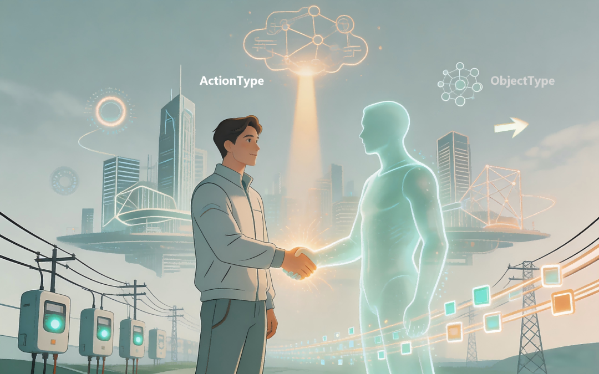

Ontology最终也会走到这一步。

## 最后说两句

如果你是一个架构师，正在考虑怎么在公司推进DDD+AI，我的建议是：

先建DDD的服务边界，把单体拆成限界上下文、把充血模型跑通、把领域事件串起来。这些基础工作现在不做，以后更没机会做。

然后在服务边界之上，建一层Ontology语义层——把核心的领域概念、关系、规则、指标结构化定义出来，给Agent提供机器可读的业务地图。

两条线并行，各管一块，通过事件驱动衔接。

不要等"本体论成熟了再用"。也不需要"DDD完全到位再建本体"。两者从上到下、从下到上，同时推进才是正途。

**毕竟，未来的软件不是由代码定义的，是由业务语义定义的。**

而本体论，就是定义业务语义的语言。

---

以上，既然看到这里了，如果觉得不错，随手点个赞、在看、转发三连吧，如果想第一时间收到推送，给我个星标⭐～（订阅号列表顶部点星标，不然后面就沉下去啦）

谢谢你看我的文章，我们，下次再见。

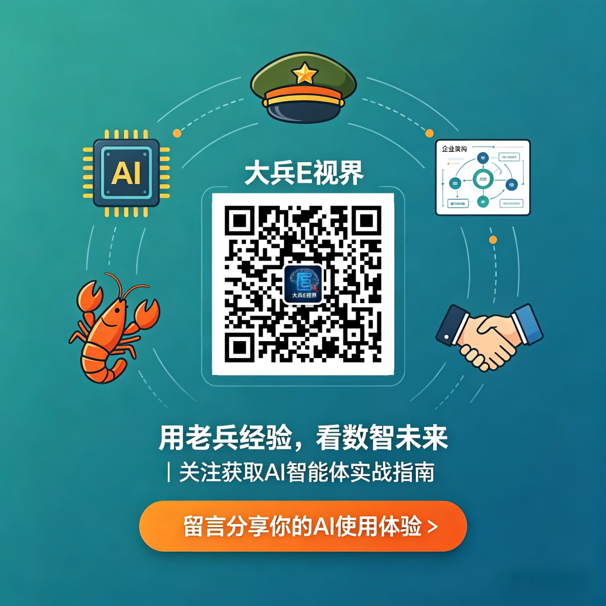
