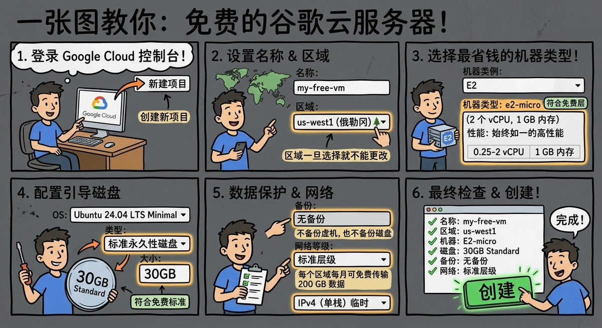

朋友们的 Google Pro 都不要浪费了
一张图教会你创建免费的谷歌服务器 

## 💬 Replies

### 1 @NirvaDeva (魁罡)

*Sun Apr 05 19:04:46 +0000 2026*

@discountifu 没啥用，流量不能从其他cdn走，不然会收费，一不小心就反薅了

### 2 @swang20201 (Shawn)

*Sun Apr 05 16:39:09 +0000 2026*

@discountifu 其实不用 Google Pro 也可以

### 3 @lipengcc (lipeng)

*Sun Apr 05 16:40:01 +0000 2026*

@discountifu 请问一下 这个学生号能用吗，上次登录了后台送的赠金都不可以用都被限制了直接扔那里不用了......

### 4 @HuMing1980 (akechi hu)

*Sun Apr 05 17:33:56 +0000 2026*

@discountifu 到天朝的流量不在这送的里面，就是残废

### 5 @caapap (zy)

*Mon Apr 06 00:29:08 +0000 2026*

@discountifu bro 你这个图好好看 怎么生成的呀

### 6 @ElvieEvon67457 (Evon Elvie)

*Sun Apr 05 14:40:37 +0000 2026*

@discountifu 这个有什么用，在哪登录谷歌服务台

### 7 @FreeNetizen (Anonymous)

*Mon Apr 06 07:40:14 +0000 2026*

@discountifu 200G 流量限制

### 8 @DearHua2025 (DearHua)

*Tue Apr 07 16:15:42 +0000 2026*

@discountifu 用了快一年了吧，被反虏了两次，

不过不是因为VPS是因为APi，因为绑定了信用卡，

在用API的时候，直接调用了视频生成以及长文本，长文本非常贵，被反虏了150$

VPS这一块倒是没扣什么钱，就api直接通过SSH操控VPS的时候，跑了40多G，扣了1.8美元。

但整体还是很爽的，不用考虑节点机场跑路问题。

### 9 @slzhou1990 (Zhou Tony)

*Sun Apr 05 23:14:53 +0000 2026*

@discountifu 一个月只有 10 美元的赠送金额够吗

### 10 @QingchenLee02 (李清宸 | Ian)

*Mon Apr 06 00:07:08 +0000 2026*

@discountifu 待会儿试试

### 11 @defyong (defyong)

*Sun Apr 05 18:56:43 +0000 2026*

@discountifu 厉害👍，有学到了，谢谢分享

### 12 @Ryan40704427852 (黑色闪电)

*Sun Apr 05 16:25:20 +0000 2026*

@discountifu 大陆访问延迟高吗？

### 13 @kotlings (kotlings)

*Mon Apr 06 05:10:26 +0000 2026*

@discountifu 这种图片的prompt怎么✍🏻

### 14 @freecoder443 (FreeCoder)

*Mon Apr 06 03:39:14 +0000 2026*

@discountifu 标准层级线路一般，可以配合hysteria2协议使用

### 15 @Tome8691 (Tome)

*Sun Apr 05 16:27:17 +0000 2026*

@discountifu 请问，有什么用？

